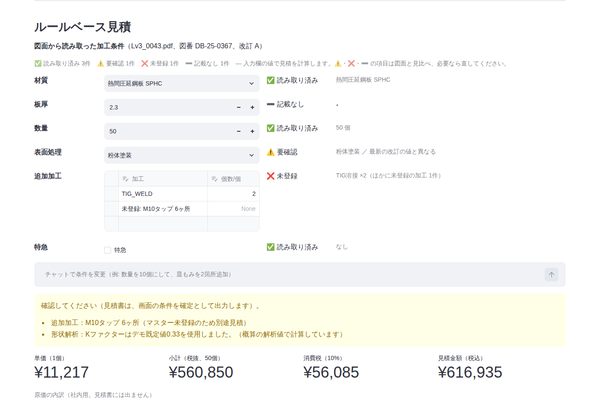
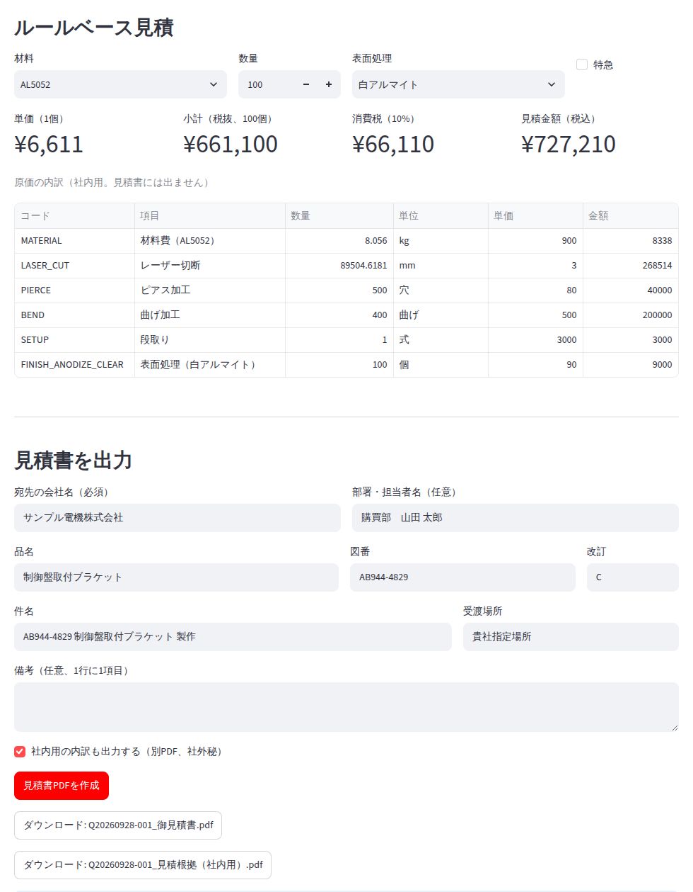
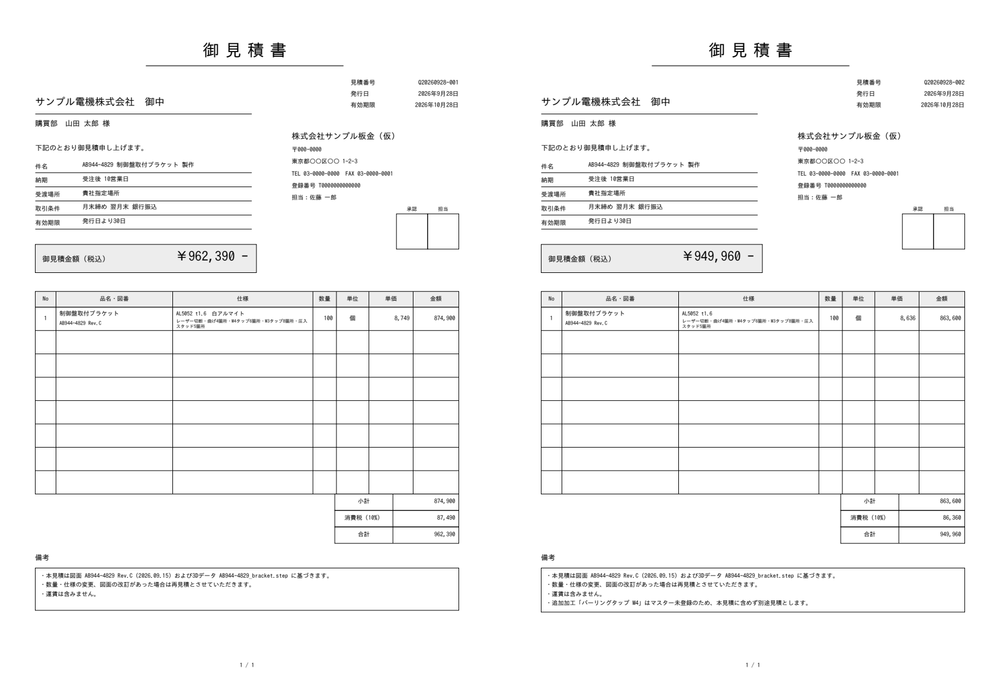
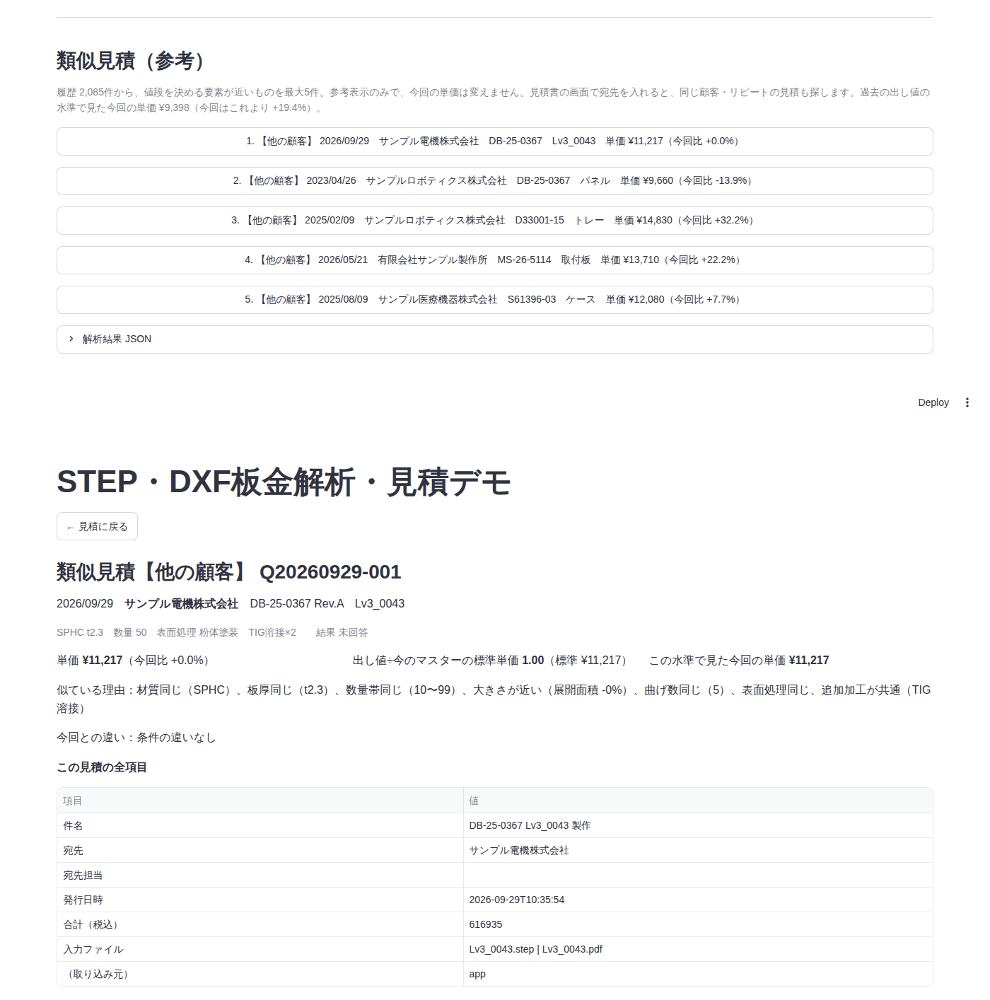

# STEP板金解析・見積デモ

STEP/STP形式の一定板厚板金をローカル解析し、形状根拠、3D形状、展開後2D輪郭、ルールベース見積を同じ画面に表示するデモです。対象外形状に推定値を強制せず、項目別の方式・信頼度・警告・理由コードを返します。

## 起動

```powershell
python -m venv .venv
.venv\Scripts\python.exe -m pip install -r requirements.txt
.venv\Scripts\python.exe -m streamlit run app.py                         # デモ画面 http://localhost:8501
.venv\Scripts\python.exe -m uvicorn api.main:app --port 8000             # API http://localhost:8000/docs
```

ブラウザでSTEPを選び、必要ならKファクターを変更して「解析を実行」を押します。既定値0.33のまま曲げ形状を解析した場合、加工条件未確認の概算として表示されます。

### Docker で起動する（API とデモ画面）

Docker（Windows なら Docker Desktop）があれば、社内サーバーでもクラウドの仮想マシンでも同じ手順で起動できます。

```powershell
docker compose up --build        # API http://localhost:8000/docs 、デモ画面 http://localhost:8501
docker compose down              # 停止
```

- `output/`（アップロード・受付・見積書）と `data/past_quotes/`（見積履歴）はホストのフォルダをそのまま使うので、止めても消えません。見積履歴は今までどおりコミットします
- APIに合言葉をかけるときは `API_TOKEN=... docker compose up`（PowerShell なら `$env:API_TOKEN="..."` のあと `docker compose up`）。図面PDFの読み取りを使うときは `ANALYSIS_ANTHROPIC_API_KEY` も同じように渡します
- Docker Hub に届かない社内ネットワークでは、`BASE_IMAGE` に社内レジストリの Python 3.11 イメージを指定します（例 `$env:BASE_IMAGE="registry.example.local/python:3.11-slim"`）

## 解析方式

CadQuery/OpenCASCADEを使用し、FreeCADへの実行時依存はありません。LLMは使いません（比較結果は [analysis/llm_comparison.md](analysis/llm_comparison.md)）。

1. STEPを読み込み、単一の閉じたSolid、有効体積、B-Rep妥当性を確認
2. モデル対角寸法から線形公差を設定し、共有EdgeからFace隣接グラフを構築
3. 対向平面と同軸円筒の候補を面積支持でクラスタリングして板厚を決定し、表裏ペアを対応付け（平面間の距離は解析的に計算。間に材料がない対向面＝ヘムのすき間は除外）
4. 平面―円筒―平面の隣接関係から曲げ軸、角度、内外Rを取得
5. **汎用展開**（`src/sheetmetal_unfold.py`）：最大の平面から、表裏の片側の面（平面と曲げ円筒）だけを隣接グラフでたどる。曲げを通過するたびに、子側を曲げ軸まわりに円筒の角度範囲だけ戻し、曲げ代 `BA = θ(内R + K·t)` だけ平行移動する（折り曲げの厳密な逆変換）。曲げ面上の点は角度に応じて展開する。平板・平行曲げ・トレー・多段フランジ・ヘムを同じ処理で扱う
6. 片側の表面の境界エッジを、共有するB-Rep頂点でつないで展開図の閉ループを作る（多角形の合成をしないため細いすき間が生じない）。面積＝外周ループ−内側ループ、切断長＝境界エッジ長の合計（平面上のエッジは剛体移動なので厳密長、曲げ端は展開後の長さ）、穴数＝内側ループ数
7. **自己検算で status と信頼度を決める**。次のすべてを満たしたときだけ `success`（信頼度 high）
   - 展開面積 ＝ 体積÷板厚 ＋ Σθ·t·(K−0.5)·曲げ長さ（許容差1%）
   - 切断長 ＝ 切断面の総面積÷板厚 ＋ Σ曲げ端ごとの θ·t·(K−0.5)（許容差1%）
   - 全表裏ペアのちょうど片側が展開に含まれる、展開後の平面度、閉路がある場合の経路間の位置ずれ
   - 展開図が単一の単純な外形で、穴は外形の内側にあり互いに重ならない
   - 切断面の連結成分数 ＝ 展開図のループ数、全曲げが展開に含まれる
8. 検算が通らない場合は値を返したうえで `partial`（見積は「概算」）、reason code `FLAT_PATTERN_UNVERIFIED`。曲げ部にかかる穴・切欠きは `INTERNAL_BOUNDARY_ESTIMATED`（`partial`）。展開図自体を作れない場合だけ、体積と切断面積から概算した値を `FLAT_PATTERN_ESTIMATED`（`partial`）で返す

Kファクター未指定（既定0.33）で曲げがある場合は、従来どおり `assumptions` に記録して信頼度 medium（概算）とします。曲げ角度（`bend_evidence.angle_deg`）は円筒面の角度範囲から取り、170°以上をヘムとして報告します。

結果は既存の `thickness_mm`、`blank_area_mm2`、`cut_length_mm`、`hole_count`、`bend_count` に加え、`metric_quality`（検算差を evidence に記載）、`assumptions`、`warnings`、`reason_codes`、2D輪郭座標と曲げ線を含みます。`status` は `success`、`partial`、`unsupported`、`error` です。

評価結果（誤差±10%、`--gate` 合格）：

| データ | Lv0 | Lv1 | Lv2 | Lv3 | Lv4 | 危険誤答 | 平均処理時間 |
|---|---:|---:|---:|---:|---:|---:|---:|
| 開発 golden_v1（508件）[レポート](analysis/golden_eval_latest.md) | 100% | 100% | 100% | 100% | 100% | 0件 | 0.1〜0.4s |
| ホールドアウト holdout_v1（200件）[レポート](analysis/golden_eval_holdout.md) | 100% | 100% | 100% | 100% | 100% | 0件 | 0.1〜0.4s |
| 追加検証 seed=3（1,000件、golden_v2基準）[レポート](analysis/golden_eval_seed3.md) | 100% | 100% | 100% | 100% | 100% | 0件 | 0.1〜0.8s |
| 追加検証 seed=4（1,000件、golden_v2基準）[レポート](analysis/golden_eval_seed4.md) | 100% | 100% | 100% | 100% | 100% | 0件 | 0.1〜0.7s |

（解析成功率。全件が「確定で正解」。面積の最大誤差は0.004%、切断長・板厚の誤差は0）

生成手順そのものを変えたストレステスト（任意姿勢、多角形底面、角度混在、閉じた筒、短い平坦部、直交フランジ、大きいフランジ、多段の12区分・480件）では、危険誤答は0件でした。解析不可は3件、閉じた筒は40件すべてが「概算」になりました。閉じた筒では展開図の検算が合わず、以前は面積がほぼ0や負の値のまま返っていましたが、検算に失敗した展開値が体積÷板厚（面積）・切断面積÷板厚（切断長）から20%以上外れるときは、その概算値を使うようにしました（面積は0や負にならない）。詳細と改善候補は [analysis/stress_data_design.md](analysis/stress_data_design.md)（レポートは [analysis/stress_eval.md](analysis/stress_eval.md)）。

### 展開図DXF（`src/dxf_analyzer.py`）

展開図DXFと、ユーザーが入力した板厚から、展開面積・切断長・穴数・曲げ数を求めます。ezdxf と shapely によるルールベースで、LLMは使いません（ルールベースで受入条件を大きく上回ったため）。

1. **図形の正規化**：ブロック参照（INSERT）を分解し（ブロック内のレイヤ0・BYBLOCKの属性は参照側から継承）、LWPOLYLINE の円弧（bulge）・ARC・CIRCLE を曲線にする。`$INSUNITS` でmmに換算する（単位なしはmmとみなし、概算。mm以外の単位も概算：mmで描いた図面の単位がインチに設定されていると値が25.4倍になり、ファイルの中にはそれを見分ける手がかりがないため）。DIMENSION・TEXT は形状として扱わず、寸法に表示された数値（上書き文字か寸法ブロックの文字）と板厚表記は検算に使う
2. **線の役割**：レイヤ名に意味があれば使う（CUT／外形、BEND／曲げ線、DIM／寸法、FRAME／図枠、CENTER／中心線、MARK／ケガキ など英日の表記ゆれ）。なければ線種で判断し、実線は切断線の候補、実線以外の直線は曲げ線・中心線の候補とする
3. **端点をまとめる**：端点どうしの距離が0.02 mm以内なら1点にまとめる（格子への丸めは使わない）。重複線は重ねて1本にし、重複した曲線どうしの間にできる幅0.05 mm未満の細い面は無視する
4. **部品の特定**：連結した線のまとまりごとに閉じた領域を作る。複数の面に分かれ、ほかの図形を囲み、図を囲む面のほかの面（表題欄の枠）が隅にまとまっているものを図枠・表題欄として除く（実線の曲げ線で帯に分かれた部品は、帯が部品の幅いっぱいに渡るので図枠にしない）。残った閉じた輪郭のうち最も外側を部品の外形、その内側を穴とする。外形と別の色の閉じた線は穴に数えず、別のレイヤの閉じた線は穴に数えたうえで、どちらも概算にする
5. **問題の検出（確定しない）**：外形が閉じない（0.1 mmを超えるすき間）→ `OPEN_CONTOUR`、外形になり得る輪郭が2つ以上 → `MULTIPLE_PARTS`、切断線がない → `NO_CUT_CONTOUR`（いずれも unsupported）
6. **曲げ線**：途中で分割された線をつないだうえで、両端が外形上にあるものを曲げ線とする。穴の中心で交差する線は中心線として除く
7. **自己検算**：次の場合は値を返しつつ `partial`（概算）にする
   - 0.02〜0.1 mm のすき間を閉じた
   - 部品の内側に外形と同じ色の閉じない線がある（別の色ならケガキ線として除外）
   - 役割の分からない破線がある
   - 寸法に表示された数値が外形の大きさと合わない（表示の桁の丸めは許す）
   - 表題欄の板厚表記と入力した板厚が違う
   - 単位がmm以外（`UNIT_NOT_MM`）
   - 部品の内側に外形と別の色・別のレイヤの閉じた線がある
   - 曲げ線が1本もない（`NO_BEND_LINES`。平板と、曲げ線の描き漏れを区別できないため。画面の「曲げなし（平板）」、API の `flat_confirmed` で平板と指定すると確定できる）

評価結果（誤差±10%、`--gate` 合格。X は「確定しない」ことが正解）：

| データ | D0 きれい | D1 注記あり | D2 乱雑 | X 確定しない | 危険誤答 | 平均処理時間 |
|---|---:|---:|---:|---:|---:|---:|
| 開発 dxf_v1（800ファイル）[レポート](analysis/dxf_eval_latest.md) | 100% | 100% | 100% | 100% | 0件 | 0.02〜0.03s |
| ホールドアウト dxf_holdout_v1（400ファイル）[レポート](analysis/dxf_eval_holdout.md) | 100% | 100% | 100% | 100% | 0件 | 0.02〜0.03s |
| 追加検証 seed=23（800ファイル）[レポート](analysis/dxf_eval_seed23.md) | 100% | 100% | 100% | 100% | 0件 | 0.02〜0.03s |

D0〜D2 は全件が「確定で正解」でした。面積・切断長の最大誤差は0.005%です。X は全件が解析不可で、理由コードは実際の問題（開いた外形／2部品）と全件一致しました。画面では `.dxf` をアップロードし、板厚を入力すると、展開図と見積が表示されます（[画面例](analysis/dxf_ui.png)）。

### 図面PDFの加工条件（`src/pdf_reader.py`）

図面PDFから、見積に効く加工条件（材質・板厚・数量・表面処理・追加加工・特急）、補助として図番・改訂、特記事項（厳しい公差・外観・検査の要求）を読み取ります。画面で図面PDFをSTEP／DXFと一緒にアップロードすると、読み取った値が見積条件の入力欄に入ります。

**Claude（画像を読める LLM）は「図面に書いてある文字の書き写し」だけに使い、コード・数値・確定かどうかはルールで決めます。**

1. **ページの準備**（pypdfium2）：ページ全体を長辺1568pxで画像化し、スキャン・FAX・手書きの図面とA3は左右半分を2倍で追加する。CAD出力の図面は文字データ（テキスト層）を位置つきで取り出して一緒に渡す
2. **書き写し**：決まった形式（ツール呼び出しのJSONスキーマ）で、各項目の原文（`text`）と書かれている場所、改訂履歴、部品表の行、手書き・押印の注記を返させる。空欄は null、マスターにない表記は「未登録」とし、似たコードに寄せない
3. **ルールで判定**（`src/pdf_terms.py`）：マスターの別名（`aliases`）と表記ゆれの規則で、材質・表面処理・追加加工のコードを決める（例：`2XM4タップ`→`TAP_M4`×2、ただの穴は加工に数えない）。板厚・数量は原文から数値を取り出す。改訂がある場合は最新の改訂の値を使い、部品表の数量は見出し（台分・合計など）で1個あたりに換算する。手書きの「至急」は印字の「通常」より優先する
4. **確定か要確認か**
   - CAD図面：原文がテキスト層に実在しない値は要確認。テキスト層にある加工指示・数量表記が結果にないときは、その行をヒントにもう一度読み、それでも欠ければ要確認
   - スキャン・FAX・手書き：拡大した区画の画像で独立にもう一度読み（2回の呼び出しは並列）、2回の結果が一致した項目だけ確定
   - ルールとLLMの判断が食い違う、改訂の最新値と本文が異なる、原文を解釈できない場合も要確認
5. **見積への反映**（`src/pdf_quote.py`、`src/quote_engine.py`）：項目ごとに「確定／要確認／未登録／記載なし」を付け、確定した項目だけを金額に入れる。表面処理は `surface_treatments.csv`、追加加工は `process_rates.csv`、特急割増と粗利率は `pricing_policy.csv` で計算する。1つでも確定でない項目があれば見積は「概算」になり、理由を表示する。画面で値を直し「この値で確定」にチェックすると確定になる。マスターにない追加加工は、加工の表に「未登録: 図面の原文」の行として残り、行を消さないかぎり見積は概算（別途見積）のまま。図面の材質がマスターにない・書かれていないときは、材質を選ぶまで金額を出さない（一覧の先頭の材質で計算しない）。API で数量・表面処理・特急を指定すると図面の値に代わって確定になり、チャットでの変更も図面の条件に入る。図面とチャット・手入力の同じ加工は、手入力の個数で置き換える（二重に数えない）。特急は「特急不要」「特急：なし」「NO URGENT」などの否定を特急なしと読み、手書き・押印が印刷と食い違うときは要確認にする

金額はLLMに計算させません。応答はキャッシュ（`.claude_cache/`）に保存して再利用し、テストはAPIを呼びません。



評価結果（`--gate`）：

| データ | 価格項目がすべて正しい | 自動確定 | 危険誤答を含む図面 | 特記事項 | 判定 |
|---|---:|---:|---:|---:|---|
| 開発 pdf_v1（300枚）[レポート](analysis/pdf_eval_latest.md) | 99.3% | 92.7% | 0.0% | 98.3% | 合格 |
| ホールドアウト pdf_holdout_v1（200枚）[レポート](analysis/pdf_eval_holdout.md) | 73.0% | 67.0% | 0.0% | 73.0% | **未完了**（下記） |

ホールドアウトは、実行中にClaude APIのクレジット残高が尽き、200枚中52枚が読み取れていません（上の値はこの52枚を不正解として数えたもの）。読み取れた148枚では価格項目の正解率95.3〜100%、自動確定90.5%、危険誤答0件、開発用にない様式（28枚）でも92.9〜100%でした。ただしFAX図面の表面処理が76.7%（値はすべて正しく、要確認になったもの）で、種類別の条件（90%以上）を下回っています。クレジット追加後に同じコマンドを再実行すると、残り52枚だけAPIを呼んで判定を完了できます。方式ごとの精度・危険誤答・時間・トークンの比較は [analysis/pdf_llm_comparison.md](analysis/pdf_llm_comparison.md)。1枚あたりの時間は約6〜7秒、トークンは入力約19,000／出力約900です。

## 対象形状

- 曲げのない一定板厚の平板
- 丸穴、角穴、長穴、任意形状の閉じた穴
- 外周切欠き、スリット
- L・U・Z形状
- 90度以外、異なる内側Rを含む複数の直線曲げ
- 1枚材で、コーナーに明確な切れ目またはリリーフがある開放箱・トレー、フランジ上のフランジ（多段）
- ヘム（オープンヘム、180°曲げ）。展開したうえで170°以上の曲げとして報告

以下は理由付き `unsupported`、または安全に取得できる項目だけを返す対象です。

- ロール、円錐
- 曲げ部にかかる穴・切欠き（値は返すが `partial`）
- 複数Solid、アセンブリ、溶接構造
- 密閉箱、展開時に重なるフランジ（自己検算で検出し `partial`）
- 深絞り、ルーバー、ビード、エンボス、バーリング、自由曲面主体の成形品
- 板厚変化、曲げRを確認できない鋭角形状、不正B-Rep

## 見積

金額はLLMではなく、マスター（`data/materials.csv`、`data/process_rates.csv`、`data/surface_treatments.csv`、`data/pricing_policy.csv`）の単価と率だけで計算します。粗利率は `pricing_policy.csv` の `margin_rate` です。各マスター行の `aliases` は図面の表記ゆれ（例：SPCC-SD、ボンデ鋼板、ユニクロ、PEMナット）で、`MasterLoader.resolve_alias` で照合します。マスターにない材質・処理・加工は似たものに寄せず「未登録」として扱います。

- 材料：展開面積 × 板厚 × 密度 × 材料単価 × 歩留まり係数
- 切断：切断長 × レーザー切断単価
- 穴：穴数 × ピアス単価
- 曲げ：曲げ数 × 曲げ単価
- 段取り・追加工程：登録単価

各マスター行の `charge_scope` が `per_part` なら部品数量倍、`per_order` なら案件につき1回です。必須解析値が欠けた場合は金額を出しません。概算解析値を含む場合は見積も概算と表示します。

## 見積書の出力

画面で解析と条件の確認を終えたら、見積の下の「見積書を出力」で宛先などを入力し、「見積書PDFを作成」を押すと、見積書PDFをその場でダウンロードできます。LLM API は使いません（APIキーがなくても、STEP／DXFと手入力の条件だけで出力できます）。コードは `src/quote_document.py`（中身と金額）、`src/quote_pdf.py`（PDFの描画）、`src/quote_log.py`（見積番号と記録）です。



**書式**：A4縦1ページ。見本は [analysis/quote_document_sample.pdf](analysis/quote_document_sample.pdf)（確定）と [analysis/quote_document_sample_estimate.pdf](analysis/quote_document_sample_estimate.pdf)（概算）。この機能で出力した例は [確定](analysis/quote_document_example.pdf)・[概算](analysis/quote_document_example_estimate.pdf)・[社内用の見積根拠](analysis/quote_document_example_internal.pdf) です（仮の宛先。`python scripts/make_quote_examples.py` で作り直せます）。



**記載項目**

| 区分 | 項目 | 値の出どころ |
|---|---|---|
| 見出し | タイトル | 確定なら「御見積書」、未確定の条件が残るなら「概算御見積書」 |
| | 見積番号・発行日・有効期限 | 番号は `Q`＋発行日＋`-`＋その日の連番3桁（`Q20260928-001`）。有効期限は発行日＋`quote_validity_days` |
| 宛先 | 会社名（御中）、部署・担当者名（様） | 画面で入力（会社名は必須） |
| 自社 | 会社名・住所・TEL/FAX・登録番号・担当者、押印欄 | `data/company.csv`（押印欄は枠だけ） |
| 取引条件 | 件名・納期・受渡場所・取引条件・有効期限 | 件名は既定「{図番} {品名} 製作」、納期は「受注後 N営業日」（通常 `lead_time_days_normal`、特急 `lead_time_days_rush`）、受渡場所は既定「貴社指定場所」、取引条件は `company.csv` の支払条件 |
| 明細 | No・品名/図番（改訂）・仕様・数量・単位・単価・金額 | 仕様の1行目は「材質 板厚 表面処理」、2行目は「レーザー切断・曲げn箇所・追加加工と個数」。データは複数行に対応（画面は1部品） |
| 合計 | 小計・消費税（税率）・合計、御見積金額（税込） | 下の「金額の決め方」 |
| 備考 | 見積の根拠・定型文・特急・特記事項・自由記述 | 図面の図番と改訂・形状ファイル名、`company.csv` の定型文、特急のときは「特急対応」、図面に検査成績書などの要求があれば「別途」、画面で入力した備考 |
| 概算 | 未確定の条件 | 備考の先頭に、未確定の項目（要確認・未登録・記載なし、概算の解析値）と、その扱い（金額に含めていない、別途見積、仮の値で計算など）をすべて赤字で記載 |

社外用の見積書には、原価の内訳（材料費・切断費など）と粗利率を出しません。「社内用の内訳も出力する」にチェックすると、別のPDF「見積根拠（社内用）」（社外秘）も出力します。中身は原価の各行、小計、特急割増、粗利率、最終価格、解析値と解析の状態、図面から読み取った条件とそれぞれの状態です。

**金額の決め方**（画面の表示も同じ値です）

- 単価 ＝ 見積計算（`QuoteEngine`）の最終価格 ÷ 数量。1円未満は切り上げ
- 金額 ＝ 単価 × 数量、小計 ＝ 金額の合計
- 消費税 ＝ 小計 × `tax_rate`（1円未満は切り捨て）、合計 ＝ 小計 ＋ 消費税

以前の画面は、最終価格を10円単位で切り上げた値を税の区別なく表示していました。今は見積書と同じ「単価・小計（税抜）・消費税・合計（税込）」を表示します。`QuoteEngine` の計算結果は変えていません。

**自社情報の設定**：`data/company.csv` は仮の値です（リポジトリは公開のため、実在の会社名・住所・登録番号は入れません）。実際の自社情報は、同じ形式の `data/company.local.csv`（Git管理外）に書くと、そちらが優先されます。`remark_1`、`remark_2`… が備考の定型文、`delivery_place` が受渡場所の既定値です。税率・有効期限・納期は `data/pricing_policy.csv`（`tax_rate`、`quote_validity_days`、`lead_time_days_normal`、`lead_time_days_rush`）で設定します。

**記録**：出力するたびに `output/quote_log.csv`（Git管理外）に、見積番号、発行日時、宛先、件名、図番、数量、合計、概算かどうか、入力ファイル名を1行残します。見積番号の連番はこの記録から決めます（同じ日に何度出力しても重複しません）。

**日本語フォント**：IPAゴシック（`fonts/ipag.ttf`、IPAフォントライセンスv1.0、[ライセンス文](fonts/IPA_Font_License_Agreement_v1.0.txt)）をPDFに埋め込むため、Windows でも文字化けしません。長い会社名・品名・仕様は縮小し、それでも入らなければ折り返して枠内に収めます。同じ入力・同じ発行日時なら同じPDFになります。

## 類似見積

見積の画面で、過去の見積から参考になるものを最大5件表示します（見積の下の「顧客と部品」に宛先と図番を入れると、リピートも探します）。「なぜ似ているか」「何が違うか」「値段はどうだったか」を並べ、今回の単価は自動では書き換えません。LLM API は使いません。コードは `src/past_quotes.py`（履歴・取り込み）と `src/similar_quotes.py`（検索・説明・値段の比較）です。



**検索の考え方**（値段を決める要素が近いものを優先）

1. **リピート**：同じ顧客・同じ図番（改訂違いを含む）。あれば必ず先頭に、新しい順に出します。顧客名は「株式会社」などを除き、図番は全角・空白をそろえて比べます。別の顧客の同じ図番は別の部品として扱います
2. **同じ顧客の近い部品**、3. **他の顧客の近い部品**：材質の系統（鉄・ステンレス・アルミ・銅）が同じで、板厚が同じか隣（0.8・1.0・1.2・1.6・2.0・2.3・3.2・4.5…の系列で1段まで）のものだけが候補です。そのうえで、材質が同じ、数量帯（1〜9、10〜99、100〜999、1000〜）、展開面積（±30%）、曲げ数・穴数、表面処理、追加加工の共通度、新しさで順位を付けます。形状の数値がない過去見積も、材質・板厚・数量・図番で候補になります（大きさは比べないだけで、除外しません）

各件には、見積日・顧客・図番と改訂・品名・材質と板厚・数量・表面処理・追加加工・特急・単価・結果（受注／失注／未回答）、**似ている理由**（例「同じ顧客・同じ図番、材質同じ（SPCC）、板厚同じ（t2）」）、**今回との違い**（例「数量 1000→100、圧入ナット -4」）を出し、元の行の全項目を開けます。2年以上前の見積と特急の見積には注意を出します。

**値段の比較**：今回の単価との差（%）を出します。過去の見積に形状の数値があり、条件がすべて今のマスターにあるときは、その条件を **今のマスターで計算し直した標準単価** と実際の単価の比（出し値÷標準）を求め、今回の標準単価に掛けた「過去の出し値の水準で見た今回の単価」を示します。数量や時期、加工が違っても比べやすくするためです。リピートでこの水準との差が±20%を超えると注意を出します。画面上部の「参考」は、最新のリピート、なければ同じ顧客の近い部品（中央値）、それもなければ他の顧客の近い部品の水準です。

**参考価格の効果**（[analysis/similar_quotes_eval.md](analysis/similar_quotes_eval.md)）：種データのうち標準単価を計算できる1,045件で、それより前の見積だけを過去として検索し、実際の単価との誤差を比べました。

| 対象 | 自動見積（標準単価）だけ | 類似見積を使う |
|---|---:|---:|
| 全体（1,045件） | 平均誤差 10.8% | 7.9% |
| リピート（270件） | 9.9% | 4.9% |

検索（履歴全体を対象、説明と標準単価の再計算を含む）は、種データ（2,084件）で平均 1.9 ms・最大 15 ms、1万件に増やした履歴で平均 8.3 ms・最大 35 ms でした（いずれも1秒以内）。

**データの持ち方**：履歴は `data/past_quotes/history.csv`（UTF-8、1行1見積、Gitで差分が読める）に置き、コミットします。材質・表面処理・追加加工は、書かれた文字（`*_text`）と、マスターの別名で対応づけたコード（`*_code`）の両方を持ちます。対応できないものは、系統だけ分かる材質（「SUS」「AL」など）は `material_code` が空で `material_family` だけ、マスターにない材質・処理・加工は `UNREGISTERED`、表面処理の空欄は「記録なし」（空）です。取り込んだ元の行は `original` 列（JSON）に残します。

**過去見積の取り込み**：Excel などから書き出したCSV（UTF-8 か Shift_JIS）を取り込みます。列は名前で対応づけ（「顧客名／得意先」「見積日／日付」など）、違う列名は `--map` で指定します。欠けた列は空欄になります。同じ見積（見積番号・見積日・顧客が同じ）は二重に入りません。

```powershell
.venv\Scripts\python.exe scripts\import_past_quotes.py data\past_quotes\past_quotes_seed.csv
.venv\Scripts\python.exe scripts\import_past_quotes.py 旧見積.csv --map customer=得意先コード名 --map unit_price=見積単価
.venv\Scripts\python.exe scripts\evaluate_similar_quotes.py --report analysis\similar_quotes_eval.md
```

種データ（`data/past_quotes/past_quotes_seed.csv`、架空）は取り込み済みです。`出典` 列は試験用のため、取り込み時に捨てています（検索・表示には使いません）。

**履歴への追加と結果の記録**：見積書PDFを出力すると、その見積（顧客、図番・改訂、品名、条件、解析値、単価、見積日）が自動で履歴に入り、次の検索から出ます。見積番号は出力記録（`output/quote_log.csv`）と履歴の両方を見て重複しないように決めます。受注・失注は画面の「受注・失注の記録」で後から記録できます。テストは履歴の一時的な複製を使い、コミットされた履歴を書き換えません。

## API（サーバー）

画面から独立した API（FastAPI）で、今の機能をすべて使えます。Streamlit のデモも同じ処理の層（`src/services/`）を呼ぶので、画面・API・見積書で金額は同じです。設計と呼び出しの流れ、段階2・3で差し替える部分は [analysis/api_design.md](analysis/api_design.md)、仕様書は起動後の `/docs` にあります。

| 機能 | 呼び出し |
|---|---|
| マスター | `GET /api/masters` |
| 形状の解析（受付番号方式） | `POST /api/files` → `POST /api/analyses` → `GET /api/jobs/{job_id}` |
| 図面PDFの読み取り（受付番号方式。APIキーがなければ 503） | `POST /api/files` → `POST /api/drawings/readings` → `GET /api/jobs/{job_id}` |
| 見積の計算 | `POST /api/quotes` |
| 見積書 | `POST /api/documents` → `GET /api/documents/{quote_no}/quote.pdf`（社内用は `internal.pdf`） |
| 類似見積 | `POST /api/similar-quotes` |
| 過去見積の履歴 | `POST /api/history/import`、`GET /api/history`、`GET /api/history/{quote_no}`、`PUT /api/history/{quote_no}/outcome` |
| 3D表示用の形状（glTF） | `GET /api/files/{file_id}/model.glb` |

解析と図面の読み取りは、受け付けるとすぐ受付番号を返し、裏で処理します。受付の状態と結果はファイルに残るので、APIを再起動しても取れます（処理中だったものは再起動後に続きを処理します）。

データの置き場所と制限は環境変数で変えられます（既定はリポジトリ内の今の場所）。

| 変数 | 既定 | 内容 |
|---|---|---|
| `ESTIMATE_DATA_DIR` | `data` | マスター |
| `ESTIMATE_STORAGE_DIR` | `output` | アップロード・受付・見積書・3D表示のファイル |
| `PAST_QUOTES_PATH` | `data/past_quotes/history.csv` | 見積履歴 |
| `QUOTE_LOG_PATH` | `output/quote_log.csv` | 見積書の出力記録 |
| `API_TOKEN` | なし | 設定すると `Authorization: Bearer <token>`（または `X-API-Token`）が必要 |
| `MAX_UPLOAD_MB` | 50 | アップロードの上限（種類は .step .stp .dxf .pdf、中身の先頭も確認） |
| `JOB_WORKERS` | 2 | 裏で処理する数 |

## チャットと情報保護

チャットは材料、数量、登録済み追加工程を構造化するだけで、変更後の金額はルールエンジンが再計算します。

- `LLM_MODE=mock`：決定論的Mock
- `LLM_MODE=openai`：OpenAI API。キーがなければ設定エラー
- `LLM_MODE=auto`：有効なキーがあればOpenAI、なければ起動時からMock

OpenAI API呼び出しが失敗してもMockへ切り替えず、現在の条件と見積を保持してエラーを表示します。

OpenAIへ送信するのは、チャット文章、現在の材料・数量・追加工程条件、利用可能な材料コード・工程コードだけです。STEP、3D/2D画像、形状座標、寸法、面積、単価、見積金額は送信しません。3Dメッシュと2D輪郭はローカルで生成します。

ただし、解析ロジックへのLLM活用を検証する Claude API（後述）では、形状由来の解析情報（面・寸法・座標の要約など）を送信することがあります（2026-09-27 承認済み）。チャット機能の送信範囲は上記のまま変わりません。図面PDFをアップロードした場合は、加工条件の読み取りのため、図面の画像と文字データを Claude API へ送信します。

`.env`、`.env.local`、`secrets.toml`、秘密鍵形式はGit除外されています。プッシュ前に次を実行します。

```powershell
.venv\Scripts\python.exe scripts\check_secrets.py --history
```

## Claude API（解析へのLLM活用の検証）

`.env` に `ANTHROPIC_API_KEY` を書くだけで使えます（雛形は `.env.example`）。疎通確認とLLM版解析器の評価：

```powershell
.venv\Scripts\python.exe scripts\check_claude_api.py
.venv\Scripts\python.exe scripts\evaluate_golden.py --data golden_data --tolerance 0.10 --analyzer src.llm_only_analyzer:LLMOnlyAnalyzer --limit 20 --workers 4
```

`LLMOnlyAnalyzer`（`src/llm_only_analyzer.py`）は、ルールベースとの比較用の「LLM単独」解析器です。STEPから読んだソリッドの体積・表面積・外寸とB-Rep面の一覧（種類、面積、法線・軸、半径、角度範囲、隣接面）だけをClaudeに渡し、板厚・展開面積・切断長・穴数・曲げ（角度・内R）をすべてClaudeに求めさせます。ルールベースの解析器は呼びません。

幾何計算で検算していない値なので、結果は常に `partial`（見積は「概算」、reason code `LLM_ONLY_UNVERIFIED`、信頼度 low）です。金額は従来どおりマスターとルールで計算します。既定の解析器には採用していません。比較の数値は [analysis/llm_comparison.md](analysis/llm_comparison.md)。

同じ問い合わせの応答は `.claude_cache/` に保存して再利用します（`CLAUDE_CACHE_MODE`）。テストはAPIを呼びません。

## テスト

```powershell
.venv\Scripts\python.exe -m pytest -q
```

テストには、不正入力、B-Rep、適応公差、面隣接、板厚、平板と複数穴、L/U/Z相当の複数曲げ、45/60/120度曲げ、異なるR、2D包含、Kファクター、対象外形状、課金単位、LLM送信項目、API失敗時の状態保持、Streamlit表示が含まれます。

## ゴールデンデータによる評価

実部品のGolden Dataが入手できるまでの代替として、正解値付きの板金部品を生成して解析ロジックを定量評価します。複雑度をLv0（平板）〜Lv3（多段フランジ）、Lv4（ヘム）に分けて、レベル別の正解率と危険誤答率を出します。

```powershell
.venv\Scripts\python.exe scripts\generate_golden.py --per-level 100 --seed 1 --out golden_data
.venv\Scripts\python.exe scripts\evaluate_golden.py --data golden_data --verify-frozen --tolerance 0.10 --gate --report analysis\golden_eval_latest.md
```

解析ロジック改善の作業指示と受入条件は [analysis/handoff_analysis_logic.md](analysis/handoff_analysis_logic.md) にあります。設計・レベル定義・限界は [analysis/golden_data_design.md](analysis/golden_data_design.md)、最新の結果は [analysis/golden_eval_latest.md](analysis/golden_eval_latest.md)（開発）と [analysis/golden_eval_holdout.md](analysis/golden_eval_holdout.md)（ホールドアウト）、改善前は [analysis/golden_eval_baseline_10pct.md](analysis/golden_eval_baseline_10pct.md) を参照してください。

穴数の正解値の不具合（曲げリリーフの切欠きが穴と数えられることがある）を直した `golden_v2` を追加しました（`--truth-version v2`、[golden/truth_v2.py](golden/truth_v2.py)）。`golden_v1` は変更していません。seed=1 では v1 と v2 の値は同一です。

## 展開図DXFのゴールデンデータ

展開図DXF（平らに広げた輪郭の図面）の解析を評価するデータセットです。同じ部品を、きれいな図面（D0）、注記入りの図面（D1）、レイヤが整理されていない乱雑な図面（D2）、確定してはいけない問題のある図面（X：外周が開いている・2部品）の4通りに描き分けています。板厚はDXFに含まれないため、入力として渡します。

```powershell
.venv\Scripts\python.exe scripts\generate_dxf_golden.py --per-level 40 --seed 21 --out dxf_data
.venv\Scripts\python.exe scripts\evaluate_dxf.py --data dxf_data --analyzer src.dxf_analyzer:DxfAnalyzer --verify-frozen --gate --report analysis\dxf_eval_latest.md
```

設計と生成器の検証は [analysis/dxf_golden_design.md](analysis/dxf_golden_design.md)、解析ロジック開発の受入条件は [analysis/handoff_dxf.md](analysis/handoff_dxf.md)、素朴なベースラインの結果は [analysis/dxf_eval_baseline.md](analysis/dxf_eval_baseline.md)、解析器の方式と結果は上の「解析方式」を参照してください。

## 図面PDFのゴールデンデータ

開発用の図面PDF 300枚と、同じ部品のSTEP 300個は `pdf_data/` にあります（正解は `pdf_data/index.json`）。図面PDFから見積に効く加工条件（材質・板厚・数量・表面処理・追加加工・特急、補助として図番・改訂、特記事項として公差・外観・検査）を読み取るロジックを評価するデータセットです。CAD出力（文字データあり）50%、スキャン20%、FAX20%、手書き・押印入り10%で、書く項目・書く場所・表記ゆれ・改訂・手書きの訂正を変えています。正解は改訂後の最新値、書かれていない項目は「記載なし」、マスターにないものは「未登録」です。

```powershell
.venv\Scripts\python.exe scripts\generate_pdf_golden.py --per-level 60 --seed 31 --out pdf_data
.venv\Scripts\python.exe scripts\evaluate_pdf.py --data pdf_data --reader golden.pdf_naive_baseline:NaiveTextReader --verify-frozen --report analysis\pdf_eval_baseline.md
.venv\Scripts\python.exe scripts\evaluate_pdf.py --data pdf_data --reader src.pdf_reader:PdfConditionReader --verify-frozen --gate --report analysis\pdf_eval_latest.md
```

設計は [analysis/pdf_golden_design.md](analysis/pdf_golden_design.md)（[例](analysis/pdf_samples.png)）、読み取りロジック開発の受入条件は [analysis/handoff_pdf.md](analysis/handoff_pdf.md)、素朴なベースラインの結果は [analysis/pdf_eval_baseline.md](analysis/pdf_eval_baseline.md)、読み取りロジックの方式と結果は上の「図面PDFの加工条件」を参照してください。

## 現時点の評価制約

テスト形状はCadQueryでパラメトリック生成し、理論値と比較しています。実部品のGolden Dataはまだありません。そのため、カバレッジ90%、10%以内正解率95%、危険誤答率1%未満は開発目標であり、現時点の達成値としては主張しません。実データ入手後に形状分類ごとの母数、正解値、誤差分布を記録して評価します。
