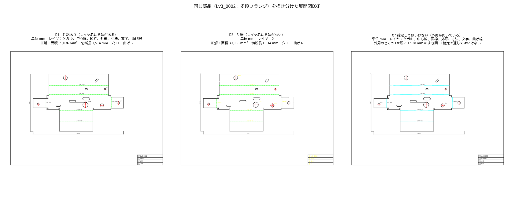

# 展開図DXFのゴールデンデータ

板金の展開図DXF（レーザー加工などに使う、平らに広げた輪郭の図面）を解析するロジックを定量評価するための、正解値付きデータセット。三面図のDXF・DWGは対象外（三面図は図面PDFと同様に扱う予定、DWGはDXFへの変換で対応予定）。

## 作り方

STEP用ゴールデンデータと同じ部品生成器（`golden/sampler.py`）で部品を作り、その **展開ソリッド**（STEPの正解値の根拠と同じもの）の上面から輪郭を取り出してDXFに描く（`golden/dxf_golden.py`）。

- 輪郭は直線と円弧・円だけで構成される（展開ソリッドの辺をそのままDXFの LINE / ARC / CIRCLE に変換）
- 曲げ線は各フランジの曲げ部の中心線として描く（曲げ数＝曲げ線の本数）
- 正解値（展開面積・切断長・穴数）は展開ソリッドから求めた値（golden_v2 基準、`golden/truth_v2.py`）。解析器は使わない
- **板厚はDXFに入っていない**。評価では正解の板厚を入力として解析器に渡す（ユーザーが画面で入力する想定）

同じ部品を、次の4通り（変種）に描き分ける。

| 変種 | 内容 | 解析器に求めること |
|---|---|---|
| **D0 きれい** | 切断輪郭（レイヤ `CUT`）と曲げ線（レイヤ `BEND`）だけ | 正しい値を返す |
| **D1 注記あり** | 実際の図面に近い。図枠・表題欄（品名・材質・板厚・数量）、寸法（DIMENSION）、穴の中心線、曲げ注記（「山 90° R3.2」）、ケガキ線。レイヤ名は英語（CUT, BEND, DIM, …）か日本語（外形, 曲げ線, 寸法, …） | 切断輪郭と曲げ線だけを拾う |
| **D2 乱雑** | D1の内容を、意味のないレイヤ（すべて `0`、または数字だけ）に描く。種類は線種・色・位置でしか区別できない。さらに、輪郭の線を2〜4本に分割、線や円の重複、つなぎ目の微小なすき間（0.005mm以下）、LWPOLYLINE（円弧つき）、穴のブロック参照（INSERT）、半円2つで描いた穴、2本に分けて描いた曲げ線、**30%はインチ単位**（`$INSUNITS=1`） | 見た目どおりの部品として正しい値を返す |
| **X 確定してはいけない** | D1の形式で、実際に問題があるもの。**外周が0.3〜2mm開いている**、または **1ファイルに2部品** | 確定（success）で返さない。解析不可（unsupported）か概算（partial）にする |

線を寄せてよい許容幅の目安：**0.005mm以下のすき間は描画上の誤差（閉じる）**、**0.3mm以上は本当に開いている（閉じてはいけない）**。

## データセット

| 名前 | 用途 | 部品数 | ファイル数 | 正解値（凍結） | 生成コマンド |
|---|---|---:|---:|---|---|
| dxf_v1 | 開発 | 200（各レベル40） | 800 | `golden/datasets/dxf_v1.json` | `python scripts/generate_dxf_golden.py --per-level 40 --seed 21 --out dxf_data` |
| dxf_holdout_v1 | 最終判定（開発中は開かない） | 100（各レベル20） | 400 | `golden/datasets/dxf_holdout_v1.json` | `python scripts/generate_dxf_golden.py --per-level 20 --seed 22 --out dxf_holdout` |

形状レベル（Lv0 平板〜Lv4 ヘム）はSTEP用と同じ定義。STEP用データ（seed 1〜4）とは別のシードで、形状の重複はない。生成は800件で約2分。

## 生成器の検証

生成したDXFから、正しい切断線だけを取り出せば正解値が再現できることを確認した。

| 変種 | 確認方法 | 結果 |
|---|---|---|
| D0 | レイヤ `CUT` の線を閉じた領域にする | 40/40件で面積・切断長が誤差0.1%未満、穴数一致 |
| D1 | レイヤ `CUT`／`外形` の線 | 100/100件 一致 |
| D2 | 実線・色7の線（図枠を含む）から、正解と一致する領域があるか | 100/100件 一致（端点を0.02mm以内でまとめた場合） |
| X | 同上 | 外周が開いたものは1つの部品として閉じない（意図どおり） |

**実装上の注意（検証中に分かったこと）**：D2のつなぎ目の微小なすき間は、座標を格子に丸める方式（例：0.01mmや0.02mm単位に丸める）では、すき間が格子の境目をまたいだときに閉じない。**端点どうしの距離でまとめる方式** にする必要がある。

## 素朴なベースライン

最初に思いつく実装（レイヤ名が `CUT`／`外形` の線を切断線、`BEND`／`曲げ線` を曲げ線とみなし、最大の閉じた領域を部品とする。常に success で返す）の結果（`golden/dxf_naive_baseline.py`、[dxf_eval_baseline.md](dxf_eval_baseline.md)）:

| 変種 | 解析成功 | 危険誤答 |
|---|---:|---:|
| D0 | 100% | 0% |
| D1 | 100% | 0% |
| D2 | 0%（切断線が見つからず全件解析不可） | 0% |
| X | — | **97%**（問題のある図面を確定で返す） |

レイヤ名が整っていれば簡単だが、実務で多い「レイヤが整理されていないDXF」と「問題のあるDXFを見抜くこと」が課題になる。

## 限界

- 合成データであり、実際のCAD（AutoCAD、Jw_cad、各社のCAM）が出力するDXFの癖は再現していない。スプライン、楕円、文字の分解（線化された文字）、3Dポリライン、Z座標の混入、ハッチングなどは含まない
- 図枠・表題欄の形は1種類
- 曲げ線は常に描かれている（曲げ線のない展開図DXFは含まない）
- 1ファイル複数部品は「確定してはいけない」扱いにしている。将来、部品ごとに分けて見積る機能を作る場合は、別の正解データが必要
