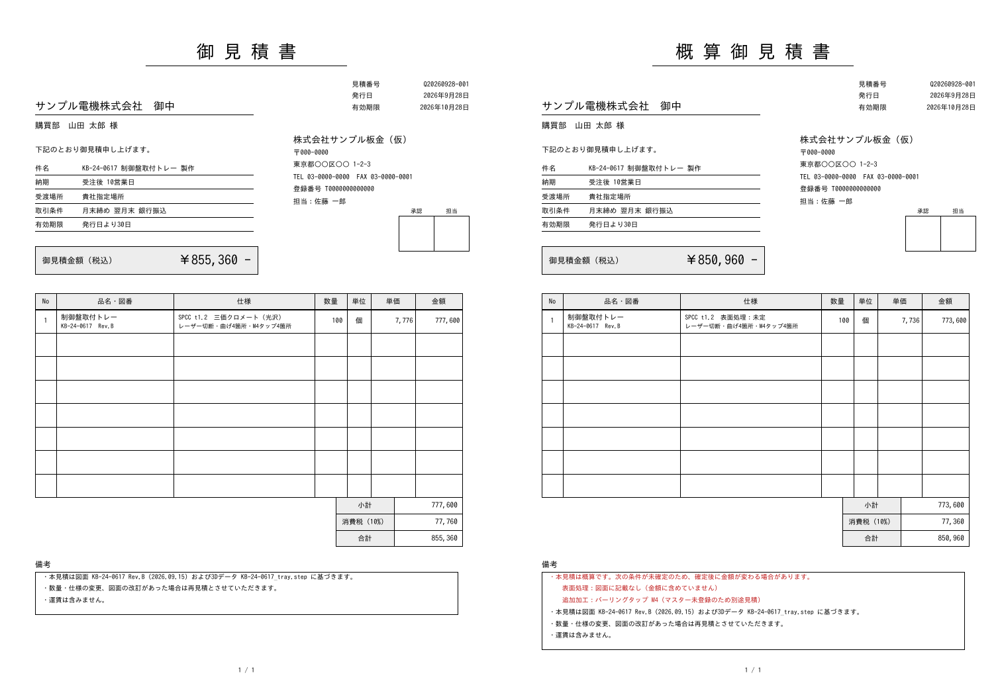

# 引き継ぎ：見積書PDFの出力

## 最終ゴール

最終的なアウトプットを「画面の金額表示」から **見積書** に変える。画面で解析と条件の確認を終えたら、ユーザーがボタンを押すだけで、**決まった書式の見積書PDF** が出力される。金額は画面の見積と1円も違わず、マスターとルールだけで決まる。**このPhaseではLLM APIを一切使わない。**

達成方法（コード構成、PDFの作り方、作業順序）は任せる。途中の確認は不要。

## 書式（見本）

[quote_document_sample.pdf](quote_document_sample.pdf)（確定の見積）と [quote_document_sample_estimate.pdf](quote_document_sample_estimate.pdf)（概算の見積）。A4縦、1ページ。見た目の細部は整えてよいが、**項目と並び順はこの見本に合わせる**。

## 記載項目と値の出どころ

| 区分 | 項目 | 値の出どころ |
|---|---|---|
| 見出し | タイトル | 確定なら「御見積書」、未確定の条件が残るなら「概算御見積書」 |
| | 見積番号 | 自動採番。`Q` ＋ 発行日（YYYYMMDD）＋ `-` ＋ その日の連番3桁（例 `Q20260928-001`）。重複しないこと |
| | 発行日・有効期限 | 発行日＝出力した日。有効期限＝発行日＋`quote_validity_days`（価格方針） |
| 宛先 | 会社名（御中） | 画面で入力（**必須**） |
| | 部署・担当者名（様） | 画面で入力（任意） |
| 自社 | 会社名・郵便番号・住所・TEL・FAX・登録番号・担当者 | 新設の `data/company.csv`（下記）。押印欄（承認・担当）は枠だけ |
| 取引条件 | 件名 | 既定は「{図番} {品名} 製作」（図番・品名がなければ形状ファイル名）。画面で直せる |
| | 納期 | 「受注後 N営業日」。N は通常 `lead_time_days_normal`、特急なら `lead_time_days_rush`（価格方針） |
| | 受渡場所 | 既定「貴社指定場所」。画面で直せる |
| | 取引条件 | `data/company.csv` の支払条件 |
| 金額 | 御見積金額（税込） | 下の「金額の決め方」の合計 |
| 明細 | No／品名・図番（改訂）／仕様／数量／単位／単価／金額 | 仕様は2行：1行目「材質 板厚 表面処理」、2行目「加工内容（レーザー切断・曲げn箇所・追加加工と個数）」。今回は1部品＝1行だが、**複数行を持てるデータ構造**にする |
| 合計 | 小計・消費税（税率）・合計 | 下の「金額の決め方」 |
| 備考 | 見積の根拠 | 図面の図番・改訂、形状ファイル名（STEP／DXF） |
| | 定型文 | 「数量・仕様の変更、図面の改訂があった場合は再見積」「運賃は含まない」など（`data/company.csv` か設定で持つ） |
| | 特急 | 特急のときは「特急対応（割増を含む）」 |
| | 特記事項 | 図面に検査成績書などの要求があるときは「○○は別途」 |
| | 自由記述 | 画面で入力（任意） |
| 概算 | 未確定の条件 | 概算のときは備考の先頭に、未確定の項目（要確認・未登録・記載なし）と、その扱い（「金額に含めていない」「別途見積」「数量1で仮計算」など）をすべて書く |

**社外用の見積書には、原価の内訳（材料費・切断費など）と粗利率を出さない。**

社内用の「見積根拠（社内用）」を、チェックを入れたときだけ別のPDF（または2ページ目、「社外秘」表示）として出す。中身は次のとおり。
- 原価の各行（`QuoteLine`）、小計、特急割増、粗利率、最終価格
- 解析値（板厚・展開面積・切断長・穴数・曲げ数）と、解析の状態（確定／概算）
- 図面から読み取った条件と、それぞれの状態

## 金額の決め方

- 1個あたりの **単価** ＝ `QuoteEngine` の最終価格 ÷ 数量。1円未満は切り上げ
- **金額** ＝ 単価 × 数量。**小計** ＝ 金額の合計
- **消費税** ＝ 小計 × 税率（`tax_rate`）。1円未満は切り捨て。**合計** ＝ 小計 ＋ 消費税
- **画面の見積表示も同じ値にそろえる**（今の画面は最終価格を10円単位で切り上げている。見積書と画面が食い違わないようにする）

## マスターの追加

- `data/pricing_policy.csv` に追加：`tax_rate`（0.10）、`quote_validity_days`（30）、`lead_time_days_normal`（10）、`lead_time_days_rush`（5）
- `data/company.csv` を新設し、**仮の値** を入れる（例：「株式会社サンプル板金（仮）」、郵便番号 000-0000、登録番号 T0000000000000）
  - 実際の自社情報は Git 管理外の `data/company.local.csv` に置き、あればそちらを優先する（`.gitignore` に追加）
  - リポジトリは公開なので、**実在の会社名・住所・登録番号は入れない**

## 画面

- 見積の下に「見積書を出力」の区画を置く
  - 入力欄：宛先の会社名、部署・担当者名、件名、受渡場所、備考
  - 「社内用の内訳も出力する」のチェック
  - 「見積書PDFを作成」ボタンで、その場でダウンロードできる
- 概算のときは、出力前に「未確定の条件があるため概算見積書として出力されます」と表示し、未確定の項目を示す
- 出力するたびに、Git 管理外の記録ファイル（例：`output/quote_log.csv`）に1行残す。中身は見積番号、発行日時、宛先、件名、図番、数量、合計、概算かどうか、入力ファイル名。見積番号の連番もここから決める

## 受入条件

| 項目 | 条件 |
|---|---|
| 金額の一致 | 見積書の単価・金額・小計・消費税・合計が、画面の表示と一致する。計算規則（切り上げ・切り捨て・税率）をテストで確かめる |
| 記載項目 | 上の表の項目がすべて入る。PDFから文字を取り出して確かめるテストを置く |
| 概算 | 未確定の条件があると、タイトルが「概算御見積書」になり、備考に未確定の項目がすべて並ぶ。確定のときは「概算」の文字が出ない |
| 社外秘 | 社外用の見積書に、原価の内訳と粗利率が出ない（テストで確かめる） |
| 見積番号 | 同じ日に複数出力しても重複しない |
| 日本語 | 日本語フォントを埋め込み、Windows でも文字化けしない。長い会社名・品名・仕様は枠からはみ出さない（縮小か折り返し） |
| 再現性 | 同じ入力・同じ発行日時なら、同じ内容のPDFになる（テストでは発行日時を固定する） |
| LLMなし | この機能とテストは LLM API を呼ばない。APIキーがない状態（チャットは Mock モード）でも、STEP または DXF と手入力の条件から見積書を出せる |
| 画面 | 画面から出力できる。画面例の画像と、出力した見積書の例（仮の宛先）を `analysis/` に残す |
| 回帰 | `python -m pytest -q` がすべてパスし、STEP の評価（`scripts/evaluate_golden.py --gate`）と DXF の評価（`scripts/evaluate_dxf.py --gate`）も合格のまま。図面PDFの評価は API が要るので今回は回さない |

## 制約

- **LLM API を使わない**（Claude も OpenAI も）。金額はマスターとルールだけで決める
- 見積の計算結果（`QuoteEngine` の最終価格）は変えない。端数処理を画面と見積書でそろえるための変更はよいが、何が変わったかをテストで示す
- 正解データ・ホールドアウトに関する `CLAUDE.md` の決まりはそのまま
- 図面PDFの読み取り（`src/pdf_reader.py` など）は今回変えない（別の作業で改修予定）

## 完了時に残すもの

- 実装とテスト
- `analysis/` に画面例の画像と、出力した見積書の例（確定と概算）
- README に「見積書の出力」の節（書式、項目、金額の決め方、自社情報の設定方法）

## 対象外（今回はやらない）

- Excel・Word での出力、メール送信
- 複数部品をまとめた見積の画面（データ構造だけ複数行に対応）
- 印影画像の合成（押印欄の枠だけ）
- 請求書・納品書（適格請求書の要件を含む）
