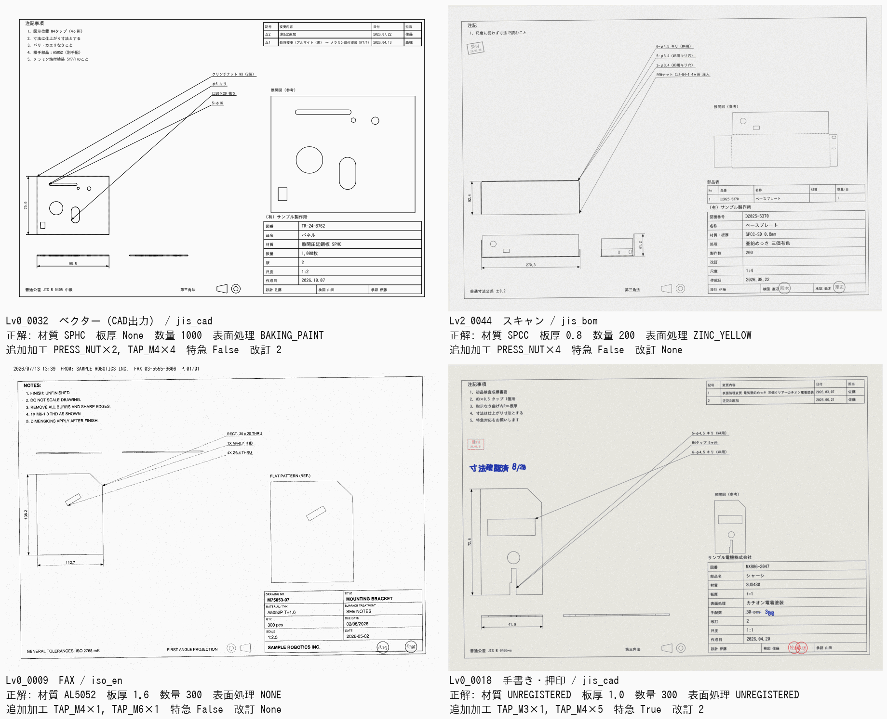

# 図面PDFのゴールデンデータ

板金部品の図面PDFから、**見積の金額に影響する加工条件**を読み取るロジックを定量評価するための、正解値付きデータセット。形状（寸法）の読み取りと、STEPとの突き合わせは対象外。

## 読み取る項目と正解の決め方

| 区分 | 項目（評価のキー） | 正解の値 |
|---|---|---|
| 価格項目 | 材質 `material` | マスターのコード（`data/materials.csv`）。マスターにない材質は `UNREGISTERED`。書かれていなければ `null` |
| | 板厚 `thickness_mm` | mm の数値。書かれていなければ `null`（図の寸法から推測しない） |
| | 数量 `quantity` | 今回の製作数量。書かれていなければ `null` |
| | 表面処理 `surface_treatment` | マスターのコード（`data/surface_treatments.csv`）。「なし」「生地」と明記されていれば `NONE`、マスターにない処理は `UNREGISTERED`、書かれていなければ `null` |
| | 追加加工 `processes` | タップ（M3〜M8）・皿もみ・圧入ナット／スタッド・スポット溶接・TIG溶接の **1個あたりの数**（`data/process_rates.csv` のコード）。マスターにない加工は `UNREGISTERED` |
| | 特急 `rush` | 特急・至急・急ぎ・URGENT などの指示があれば true |
| 補助 | 図番 `drawing_no`、改訂 `revision` | 図面に書かれた図番。改訂は最新の改訂記号（改訂がなければ `null`） |
| 特記事項 | `flags` | 厳しい公差（`tolerance`）、外観面の指定（`appearance`）、検査・証明書の要求（`inspection`）があるか。見積には反映せず、フラグとして出す |

正解の規則:

- **改訂後の最新の値**が正解。改訂表の変更（「数量変更 50→100」など）、手書きの訂正（二重線で消して書き直し）、手書きの追記（「M4タップ 2ヶ所追加」は既存の数に足す）を反映する
- **書かれていない項目は `null`**。表題欄の欄が空欄のときも記載なし。表面処理は、空欄の欄だと「処理なし」と読めてしまうため、記載なしのときは欄そのものを設けていない
- **マスターにないものは `UNREGISTERED`**。似たコードに寄せてはいけない（例：SUS430 を SUS304 にしない、バーリングタップ M4 を M4タップにしない、圧入スペーサを圧入スタッドにしない）
- 追加加工は **1個あたり**。同じ加工が2か所に分けて指示されていれば合計する。部品表の数量が「○台分」「合計」なら部品数量で割る
- 単なる穴（`2-φ10`、`φ4.5 キリ（M4用）`、`□40×20 抜き`）は追加加工ではない
- 特記事項に **含めない** もの：普通公差（JIS B 0405-m、ISO 2768-mK など）、「バリ・カエリなきこと」などの定型注記、塗装の色・艶の指定

## 何を変えているか

正解は描く前に決め（`golden/pdf_golden.py` の `Plan`）、描き方だけを変える。数字は開発用データ300枚の実数。

| 観点 | 内容 |
|---|---|
| **書く項目** | 価格項目（材質・板厚・数量・表面処理）を **すべて書いた図面が99枚**、残り201枚は1〜4項目を書いていない。書かれている枚数：材質261、板厚218、数量207、表面処理199 |
| **書く場所** | 表題欄、注記、部品表、表題欄のない図面のメモ（自由記述）、改訂表、図中の引出線、押印、手書き。例：材質は表題欄162・注記53・メモ25・部品表21、追加加工は引出線160・注記79・部品表13・メモ12 |
| **表記ゆれ** | 全角（ＳＰＣＣ）、規格名つき（SPCC（JIS G3141））、和名（ボンデ鋼板、冷延鋼板）、英語（COLD ROLLED STEEL (SPCC)）、誤字（紛体塗装）、タップの書き方（`4-M4`、`M4タップ 4ヶ所`、`4X M4x0.7 TAP THRU`）など。マスターの別名にない表記も入れている |
| **マスターにないもの** | 材質18枚（SUS430、SGCC、C1100P…）、表面処理18枚（クロムめっき、パーカー処理、カチオン電着…）、追加加工40枚（バーリングタップ、M10タップ、圧入スペーサ、ブラインドリベット） |
| **改訂** | 改訂表あり106枚、うち価格項目を変える改訂83枚。改訂表の並び順（古い順・新しい順）、記号（A/B/C、1/2/3、△1）。19枚は表題欄の値が古いまま（改訂表だけが更新されている）で、改訂表の最新値が正解 |
| **手書き** | 手書き・押印のPDFで、数量の訂正7、表面処理の訂正2、加工の追記9、特急の追記5。結果に影響しないメモ（「寸法確認済」など）24 |
| **紛らわしいもの** | タップの下穴（`φ4.5 キリ（M4用）`）、部品表の金具の行の材質（SUS、SS）、「月産 500個予定（参考）」、「相手部品：A5052」、「急ぎません」「納期：別途打合せ」、日付だけの納期欄、旧図番、FAXの送信ヘッダー（日時・FAX番号） |
| **様式** | JIS和文（jis_cad 119）、英文ISO風・第一角法（iso_en 57）、和英併記（bilingual 45）、部品表つき（jis_bom 37）、表題欄のない簡易図・A4縦（memo 42）。A3が75枚、2ページ（注記・改訂表が2枚目）が30枚 |

## PDFの種類

| 種類 | 割合 | 内容 |
|---|---:|---|
| ベクター（CAD出力） | 50% | 文字がテキストとして取り出せる |
| スキャン | 20% | グレーのJPEG画像。傾き、ノイズ、ぼけ、押印 |
| FAX | 20% | 白黒2値、縦方向の解像度が半分、点状のノイズ、送信ヘッダー（日時・FAX番号） |
| 手書き・押印 | 10% | カラーのスキャンに、手書きの訂正・追記と、文字に重なる押印 |

割合はレベルごと・10枚ごとに正確に 5:2:2:1。図面の部品は STEP／DXF 用と同じ部品生成器（`golden/sampler.py`）で作り、OpenCascade の隠線処理で三面図を描いている。図面に書く板厚は部品の板厚と同じ。各図面の部品の STEP も `step/` に出力する（今回の評価には使わない）。

## データセット

| 名前 | 用途 | 図面数 | シード | 正解値（凍結） | 生成コマンド |
|---|---|---:|---:|---|---|
| pdf_v1 | 開発 | 300（各レベル60） | 31 | `golden/datasets/pdf_v1.json` | `python scripts/generate_pdf_golden.py --per-level 60 --seed 31 --out pdf_data` |
| pdf_holdout_v1 | 最終判定（開発中は開かない） | 200（各レベル40） | 32 | `golden/datasets/pdf_holdout_v1.json` | `python scripts/generate_pdf_golden.py --per-level 40 --seed 32 --unseen-ratio 0.2 --out pdf_holdout` |

- **開発用は実データとしてリポジトリに入れている**：`pdf_data/pdf/`（図面PDF 300枚）、`pdf_data/step/`（同じ部品のSTEP 300個）、`pdf_data/index.json`（正解）。生成コマンドで作り直しても同じファイルになる（STEPの見出しの日時も固定）。ホールドアウトは実物を置かず、最終判定のときに生成する
- ホールドアウトは、約2割を **開発用にない様式と欄の名前**（`golden/pdf_unseen.py`）で描く。項目の意味と正解の規則は同じ。汎化の確認用なので、開発中はこのファイルも開かない
- 生成は300枚で約100秒（2並列）。出力は決定的で、同じコマンドなら正解値もPDFも同じになる（`--verify-frozen` で確認できる）
- 日本語は同梱の IPAゴシック（`golden/fonts/`、IPAフォントライセンス）で描くので、Windows でも同じ図面になる

## 語彙をずらしたデータ

`pdf_v1` とホールドアウトは同じ語彙（言い回しの表）で作っているため、知らない書き方への強さは測れない。そのため、同じ部品・同じ正解規則で **言い回しだけを別の語彙に置き換えた** データを用意している（`--vocab`）。

| データ | 語彙 | 図面数 | シード | 正解値（凍結） |
|---|---|---:|---:|---|
| pdf_shift_dev | `golden/vocab/shift_dev.json`（開発用、見てよい） | 100 | 41 | `golden/datasets/pdf_shift_dev_v1.json` |
| pdf_shift_blind | リポジトリ外（判定用） | 100 | 42 | リポジトリ外 |

判定は安全性だけを見る（`--gate-profile safety`：価格項目ごとの危険誤答1%以下、危険誤答を含む図面2%以下）。知らない語が「要確認」「未登録」に倒れるのはよく、黙って誤るのがいけない。

また、`pdf_holdout_v1` の結果がレポートに正解値つきで出たため、2つ目のホールドアウト `pdf_holdout_s33_v1`（seed=33、200枚、作り方は `pdf_holdout_v1` と同じ）を凍結している。

## 評価ハーネス

`scripts/evaluate_pdf.py`。読み取り器の出力形式と判定の詳細はスクリプト冒頭に書いてある。項目ごとに次のどれかに分類する。

| 判定 | 意味 |
|---|---|
| CORRECT | 正しい値で、要確認にしていない |
| CORRECT_FLAGGED | 正しい値だが、要確認にした |
| WRONG_FLAGGED | 誤った値だが、要確認にした（人が気づける） |
| DANGEROUS | **誤った値を、要確認にせず返した**（見積が黙って間違う） |
| REJECTED | 読み取り器が落ちた |

値が `null`（記載なし）の項目は、要確認にしても CORRECT として扱う（記載なしは、どのみちユーザーに入力を求めるため）。「自動確定」は価格項目がすべて CORRECT の図面。結果は `pdf_data/results.csv` に、項目ごとの読み取り値・正解・書かれていた場所つきで出る。

## 参考：素朴な読み取りと、簡単なClaude読み取りの結果（開発用300枚）

| 読み取り方 | 材質 | 板厚 | 数量 | 表面処理 | 追加加工 | 特急 | 価格項目すべて正しい | 自動確定 | 危険誤答を含む図面 |
|---|---:|---:|---:|---:|---:|---:|---:|---:|---:|
| テキスト層＋キーワード（`golden/pdf_naive_baseline.py`、[レポート](pdf_eval_baseline.md)） | 50.0% | 44.0% | 57.3% | 57.3% | 34.0% | 83.3% | 5.3% | 5.3% | 94.7% |
| Claude 1回呼び出しの試作（下記） | 99.3% | 98.7% | 98.7% | 98.7% | 92.3% | 99.3% | 89.3% | 47.0% | 4.7% |

試作は、ページ画像（長辺1568px）とテキスト層とマスター一覧と上の規則をまとめて `claude-sonnet-5` に1回渡し、構造化出力で受け取るだけのもの（リポジトリには含めていない。受入条件の水準を決めるための確認）。PDFの種類別の自動確定はベクター56.0%・スキャン46.7%・FAX33.3%・手書き30.0%、危険誤答を含む図面はそれぞれ4.7%・1.7%・5.0%・10.0%。300枚で入力1,675,102トークン・出力235,578トークン、キャッシュなしで実行したときの処理時間は1枚あたり平均8.3秒（6並列）だった。

- 主な誤り：バーリングタップ・圧入スペーサをマスターの似た加工に寄せる、タップの下穴（キリ穴）をタップと数える、手書きの「追加」を足さない、2か所に分けた指示を合計しない、色・艶の指定を外観の特記事項にする、出力形式の崩れ（全項目が空になる）
- 読み取りそのものはおおむねできているが、追加加工と、**自信のない項目だけを要確認にする**（要確認の付けすぎで自動確定が47%）ことが課題

## 限界

- 合成データであり、実際のCADの図面（線の太さ・フォント・図枠の種類、JIS記号、溶接記号、表面性状記号、幾何公差の枠）は再現していない。溶接は記号ではなく文字で指示している
- 手書きは活字を揺らしたもので、本物の手書き文字より読みやすい
- スキャンに OCR のテキスト層がついたPDF、文字が線に分解されたベクターPDF、複数部品が1枚に描かれた図面、組立図は含まない
- 数量は図面に書かれたものだけを扱う。実務では数量は注文書やメール側にあることが多い
- 金具の種類（ナットのサイズなど）で単価を変えていない（マスターが1行のため）
