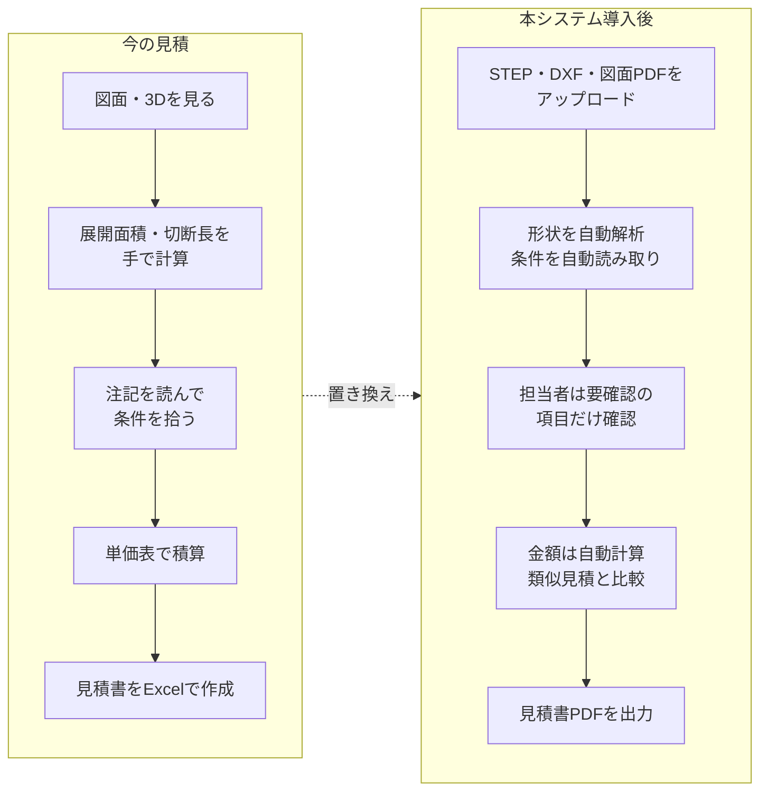
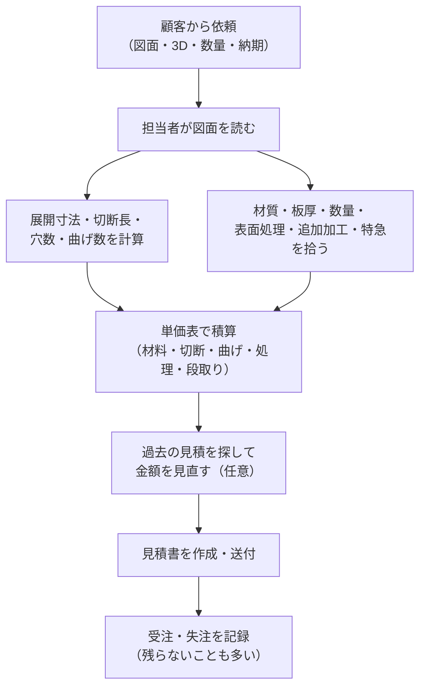
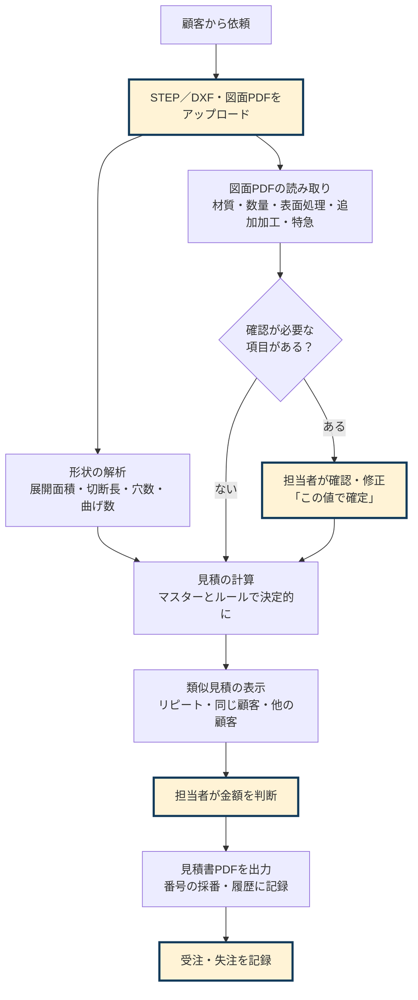
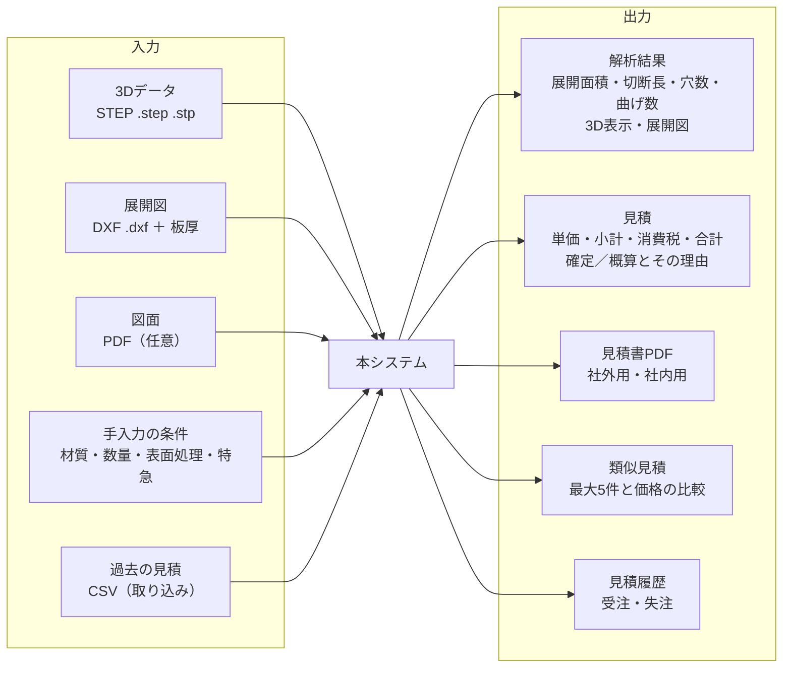
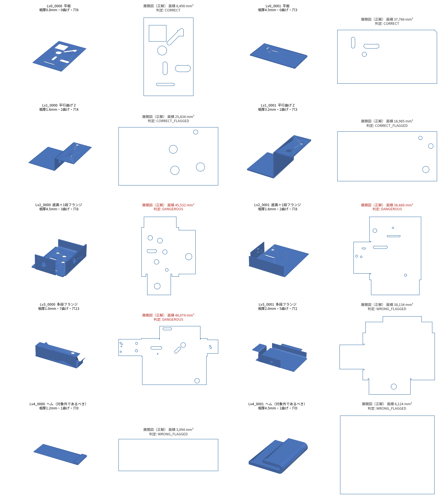

# 要件定義書
<!-- meta {"version": "1.0", "date": "2026-09-28", "audience": "経営者・顧客・開発者", "id": "DOC-01"} -->

## この資料について

板金部品の見積を、3Dデータ（STEP）・展開図（DXF）・図面（PDF）から作るシステム（以下「本システム」）について、**何のためのシステムで、何ができるべきか** をまとめる。どう作っているかは「設計書」、画面は「画面設計書」、使い方は「操作マニュアル」、精度の確かめ方と結果は「評価報告書」に書く。

本資料の数字（精度・処理時間）は、リポジトリの `analysis/` にある評価レポートから取っている。評価は、実際の顧客データではなく、正解が分かっている **合成データ**（ゴールデンデータ）で行ったものである（詳しくは評価報告書）。

## 背景と目的

### 板金の見積業務の課題

板金加工の見積は、図面や3Dデータを見ながら、担当者が次のような値を読み取って積み上げる作業である。

- 材料の大きさ（展開したときの面積）と材質・板厚
- レーザーで切る長さ（切断長）、穴の数、曲げの回数
- 表面処理（めっき・塗装など）、タップや溶接などの追加加工、数量、納期（特急かどうか）

この作業には次の課題がある。

| 課題 | 内容 |
|---|---|
| 時間がかかる | 展開面積や切断長を手で計算する。曲げの多い部品では1件に数十分かかることもある |
| 人によってばらつく | 読み取り方・単価の当て方が担当者の経験に依存し、同じ部品でも金額がそろわない |
| 見落とし | 図面の隅の注記（表面処理、特急、改訂による変更）を見落とすと、赤字や手戻りになる |
| 過去の実績が活かしにくい | 前回いくらで出したか（リピート）を探すのに手間がかかる |

### 本システムで変えること

- 3Dデータ・展開図から、**展開面積・切断長・穴数・曲げ数を自動で計算** する
- 図面PDFから、**材質・数量・表面処理・追加加工・特急などの条件を読み取り**、確認が必要なものを分かるように示す
- 金額は **マスター（単価表）とルールで決定的に計算** し、担当者ごとのばらつきをなくす
- 自信のない値は「確定」にせず **「概算」として担当者に確認を促す**（誤った金額を黙って出さない）
- 見積書PDFをその場で作り、**過去の類似見積と比べられる** ようにする

## 対象ユーザーと利用場面

| ユーザー | 立場 | 主な利用場面 |
|---|---|---|
| 見積担当者 | 板金加工会社の営業・見積部門。プログラミングの知識はない | 顧客から届いた図面・データから見積を作り、見積書を送る。受注・失注を記録する |
| 管理者（導入担当） | 社内のIT担当、または導入を支援する人 | マスター（単価・材質・表面処理）と自社情報を設定する。サーバーに置く |
| 経営者 | 見積の方針（粗利率・特急割増）を決める | 見積の水準、類似見積との比較、受注状況を見る |
| 開発者 | 本システムを作り、直す人 | API を使って別の画面（段階2の React の画面）を作る |

利用場面の例：

1. 顧客から **3Dデータ（STEP）と図面（PDF）** がメールで届く → 両方をアップロード → 読み取った条件を確認 → 見積書を送る
2. 顧客から **展開図（DXF）と板厚** だけが届く → DXFと板厚を入れる → 条件は手で選ぶ → 見積書を送る
3. **前回と同じ図番** の再見積 → 類似見積に前回の見積が出る → 前回の金額との差を確かめてから出す

## 業務の流れ

### 今の見積業務

### システム導入後の流れ

## 範囲

### 入力と出力

### 扱う部品（形状のレベル）

一定の板厚の板を切って曲げた部品（板金部品）を対象とする。評価では形状を5つのレベルに分けている。

| レベル | 形状 | 例 |
|---|---|---|
| Lv0 | 平板（曲げなし） | 丸穴・長穴・角穴・外周の切欠き・角落とし |
| Lv1 | 平行な曲げだけ | L字・U字・Z字・ハット・多段 |
| Lv2 | 底面＋1段のフランジ | トレー、部分的なフランジ、曲げの逃げ（リリーフ） |
| Lv3 | フランジの上のフランジ | 返し・段付き、深さ3段まで |
| Lv4 | ヘム（180°曲げ） | 板の端を折り返したもの |

{.medium}

### 扱わないもの

次の形状は、値を確定させずに **解析不可**（理由つき）または **概算** として担当者に知らせる。

- ロール曲げ・円錐、深絞り・ルーバー・ビード・エンボス・バーリングなどの成形品、自由曲面が主の部品
- 複数の部品（アセンブリ）、溶接構造、板厚が変わる部品
- 曲げ部にかかる穴・切欠き（値は返すが概算）、閉じた箱・展開すると重なる部品（自己検算で見つけて概算）

また、次は今回の範囲外である：図面からの寸法の読み取り、Excel・Word での出力、メール送信、請求書・納品書、複数部品をまとめた見積の画面、ログインと利用者ごとのデータの分離（今後の段階で行う）。

## 機能要件

| 番号 | 機能 | 入力 | 得られるもの |
|---|---|---|---|
| FR-01 | STEPの解析 | STEPファイル、Kファクター（任意） | 板厚・展開面積・切断長・穴数・曲げ数（角度・内R）、展開図、3D表示、結果の状態（確定・概算・解析不可）と理由 |
| FR-02 | 展開図DXFの解析 | DXFファイル、板厚 | 展開面積・切断長・穴数・曲げ数、展開図、結果の状態と理由 |
| FR-03 | 図面PDFの読み取り | 図面PDF | 材質・板厚・数量・表面処理・追加加工・特急、図番・改訂、特記事項（厳しい公差・外観・検査）。項目ごとの状態（確定・要確認・未登録・記載なし） |
| FR-04 | 条件の確認と修正 | 読み取った条件、担当者の修正 | 金額に入れる条件（確定した項目だけが金額に入る） |
| FR-05 | 見積の計算 | 解析結果と条件 | 原価の内訳、単価・小計・消費税・合計、概算かどうかとその理由 |
| FR-06 | 見積書の出力 | 宛先・件名・受渡場所・備考 | 見積書PDF（確定なら「御見積書」、未確定が残れば「概算御見積書」）、社内用の見積根拠PDF（任意）、見積番号 |
| FR-07 | 類似見積の参照 | 今回の条件、顧客、図番 | 過去の見積 最大5件（リピート・同じ顧客・他の顧客）、似ている理由、今回との違い、価格の比較 |
| FR-08 | 見積履歴 | 出力した見積、過去見積のCSV | 履歴への自動記録、CSVの取り込み（列の対応づけ）、受注・失注の記録 |
| FR-09 | マスターの管理 | CSVファイル | 材料・工程・表面処理・価格方針・自社情報の変更が見積に反映される |
| FR-10 | API | HTTP | FR-01〜09 を画面から独立して使える（段階2の画面のため）。重い処理は受付番号を返して裏で進める |
| FR-11 | 条件のチャット入力（補助） | 文章（例「数量を10個にして、皿もみを2箇所追加」） | 登録済みの工程・材質・数量の変更。APIキーがなければ簡易的な解釈（Mock） |

## 非機能要件

### 精度

「危険誤答」＝ **値が誤っているのに確定として表示されるもの**（誤った金額がそのまま出る）を最も重く見る。

| 対象 | 目標（受入条件） | 評価で確かめた実績 |
|---|---|---|
| STEPの解析 | 形状レベルごとに解析成功90%以上、危険誤答2%以下（誤差±10%以内） | 開発用508件・ホールドアウト200件・追加検証2,000件のすべてで「確定で正解」100%、危険誤答0件 |
| 展開図DXFの解析 | 変種・レベルごとに解析成功90%以上、危険誤答2%以下 | 開発用800ファイル・ホールドアウト400・追加検証800で解析成功100%、危険誤答0件 |
| 図面PDFの読み取り | 価格項目ごとに95%以上（PDFの種類ごと90%以上）、危険誤答 項目ごと1%以下・図面の2%以下、自動確定75%以上 | 開発用300枚で価格項目がすべて正しい図面99.3%、自動確定92.7%、危険誤答0.0%。**ホールドアウトの判定は途中（200枚中52枚が未読）** |
| 類似見積 | 参考価格が自動見積だけより実際の単価に近い（全体とリピートそれぞれ） | 平均誤差 全体 10.8%→7.9%、リピート 9.9%→4.9% |

### 処理時間

| 処理 | 目標 | 実績 |
|---|---|---|
| STEPの解析 | 1部品平均5秒以内 | レベル別の平均 0.1〜0.4秒（開発用） |
| 展開図DXFの解析 | 1ファイル平均2秒以内 | 0.02〜0.03秒 |
| 図面PDFの読み取り | 1枚平均30秒以内 | 約6〜7秒（推定、LLMの応答待ちを含む） |
| 類似見積の検索 | 1秒以内（1万件まで） | 1万件で最大35ミリ秒 |
| API の受付 | すぐ返す（目安0.5秒以内） | 処理に3秒かかる場合でも0.5秒以内（テストで確認） |

### LLM（大規模言語モデル）の使い方の方針

- **金額はLLMに計算させない。** 金額はマスターCSVとルールだけで決まる
- **LLMの出力をそのまま数値に使わない。** 図面PDFの読み取りでは、LLMには「書いてある文字の書き写し」だけをさせ、コードと数値はルールで決める
- 形状の解析（STEP・DXF）にはLLMを使わない（比較の結果、精度が上がらず時間がかかったため。評価報告書）
- APIキーがなくても、形状の解析・見積・見積書・類似見積はすべて使える（図面PDFの読み取りだけが使えない）

### データの扱い

- マスター・自社情報・見積履歴はCSVファイルで持ち、Gitで変更の履歴が読める
- 実際の自社情報は Git 管理外のファイル（`data/company.local.csv`）に置ける
- 図面PDFの読み取りでは、図面の画像と文字をLLMのサービス（Anthropic の Claude API）に送る。形状データを Claude API へ送ることは承認済み

### セキュリティ

- APIのアップロードは種類（.step .stp .dxf .pdf、取り込みは .csv）と中身の先頭、大きさ（既定50MB）を確かめる
- エラーの応答に内部のパスや秘密情報を出さない
- API の利用に合言葉（トークン）を必須にできる。本格的なログインは段階3
- 秘密情報（APIキー）は `.env` に置き、Gitに入れない。プッシュ前に秘密情報の検査を行う

### 置き方

- 社内サーバーにもクラウドにも置けるよう、Docker で API とデモ画面を起動できる。Docker なしでも Python の環境で動く

## 前提と制約

- **評価は合成データで行った。** 実際の顧客の STEP・DXF・図面はまだ入手できていない。部品生成器で正解の分かる部品と図面を作り、それで精度を確かめている
- 見積の単価（マスター）は仮の値である。実際の工場の単価に置き換えて使う
- 図面PDFの読み取りは、外部のLLMサービスの応答に依存する（ネットワーク・費用・APIの提供状況）
- 画面は Streamlit のデモである。本番の画面は段階2で作り直す
- 顧客名・図番・金額はすべて架空である

## 今後の課題

| 課題 | 内容 |
|---|---|
| 実データでの評価 | 実際の顧客の STEP・DXF・図面で精度を確かめる。形状の分類ごとの件数・誤差を記録する |
| 図面PDF読み取りの懸念点 | ホールドアウトの判定を終える（52枚が未読）。FAX図面の表面処理が種類別の条件（90%）を下回っている。**知らない言い回しに対して安全側に倒れるか**（黙って誤らないか）がまだ確かめられていない。プロンプトとルールが合成データの語彙に寄っている（別の引き継ぎ資料で対応予定） |
| 画面の作り直し | React（Next.js）で本番の画面を作る（段階2）。今のデモでは、未登録の追加加工を画面で編集すると、概算の理由の一覧からその加工が抜けることがある（既知の不具合） |
| クラウドへの移行 | ログイン・利用者ごとのデータの分離・データベース（PostgreSQL）・処理待ちの列（段階3） |
| マスターの整備 | 実際の単価・材質・表面処理・追加加工の登録、表記ゆれ（別名）の追加 |

## 用語集

| 用語 | 意味 |
|---|---|
| STEP | 3D CAD のデータ形式（.step / .stp）。部品の立体の形を持つ |
| DXF | 2D CAD のデータ形式（.dxf）。ここでは板を平らに広げた形（展開図）を描いたもの |
| 図番（ずばん） | 図面の番号。顧客ごとに付け方が違う |
| 改訂 | 図面の変更。A・B・C や 1・2・3 などの記号で表し、最新の改訂の値が正しい |
| 展開 | 曲げた部品を平らな板に戻すこと。展開した形の面積が材料の量、外周と穴の長さが切断長になる |
| 展開面積 | 展開した板の面積（mm²）。材料費の元になる |
| 切断長 | レーザーで切る線の長さの合計（外周＋穴の周り、mm） |
| 曲げ線 | 展開図で、曲げる位置を示す線（破線などで描く） |
| Kファクター | 曲げたときに伸び縮みしない面（中立軸）が板厚のどこにあるかを表す係数（0〜1）。展開の長さが変わる。加工条件として指定されていなければ既定値0.33で計算し、概算とする |
| ヘム | 板の端を180°折り返した曲げ |
| 表面処理 | めっき・塗装・アルマイトなど、部品の表面に施す処理 |
| 追加加工 | タップ（ねじ穴）、皿もみ、圧入ナット・スタッド、溶接など |
| 特急 | 通常より短い納期での依頼。特急割増（既定30%）が入る |
| マスター | 材料・工程・表面処理の単価や、粗利率などを定めた表（CSV） |
| 確定 | 値に自信があり、そのまま金額に入れてよい状態 |
| 概算 | 値の一部に確認が必要なものがある見積。見積書は「概算御見積書」になり、理由を書く |
| 要確認 | 図面から読み取ったが、担当者の確認が必要な項目（金額に入れない） |
| 未登録 | 図面に書かれているが、マスターにない材質・処理・加工（金額に入れず別途見積） |
| 記載なし | 図面に書かれていない項目 |
| 危険誤答 | 値が誤っているのに確定として表示されるもの。最も避けたい誤り |
| 自動確定 | 図面PDFの価格項目がすべて正しく、確認なしで金額にできた割合 |
| ゴールデンデータ | 正解の分かっている評価用のデータ。ここでは部品生成器で作った合成データ |
| ホールドアウト | 開発中は見ない評価用データ。最後に一度だけ使い、作り込みすぎていないかを確かめる |
| リピート | 同じ顧客の同じ図番の見積（改訂違いを含む） |
| LLM | 大規模言語モデル（ここでは Anthropic の Claude）。図面の文字の書き写しにだけ使う |
| API | 画面から独立して機能を呼び出すための窓口（HTTP） |
