# 設計書
<!-- meta {"version": "1.0", "date": "2026-09-28", "audience": "開発者", "id": "DOC-02"} -->

## この資料について

本システムを **どう作っているか** を、実装のロジック（処理の順番、判定の条件、計算式、しきい値）を中心に書く。コードを読まなくても、どの値がどう決まるかが分かることを目指す。何ができるべきかは「要件定義書」、画面は「画面設計書」、評価の結果は「評価報告書」を見る。

数字の出典は `analysis/` の評価レポート、しきい値の出典はソースコード（ファイル名を併記）である。

## システム構成

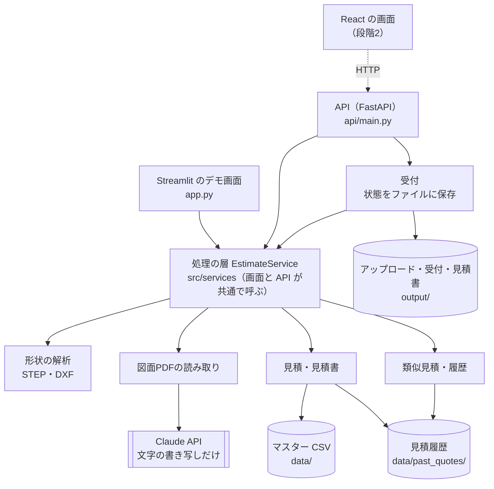

- 画面（Streamlit）と API は、同じ処理の層 `EstimateService` を呼ぶ。処理を2か所に書かない
- LLM を呼ぶのは図面PDFの読み取りだけ。金額は `QuoteEngine` と端数処理の規則だけで決まる
- データはすべてファイル（CSV・JSON・PDF）で持つ。段階3でデータベースやファイル置き場のサービスに差し替える（「API」の章）

## 主な処理の流れ

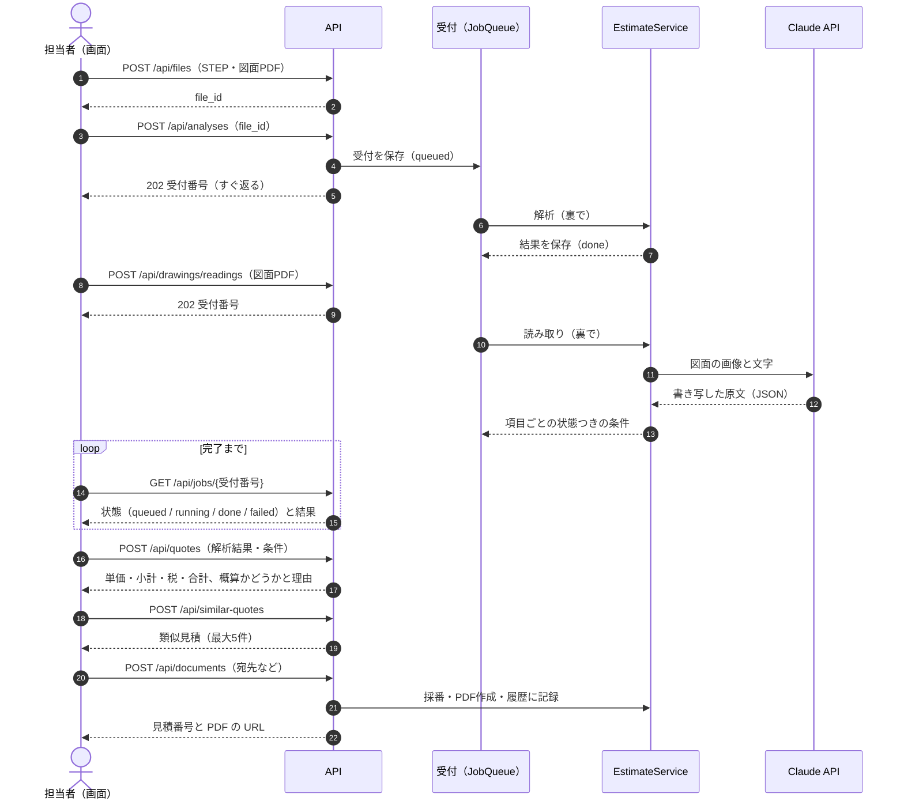

デモ画面（Streamlit）では同じ処理を同じプロセスの中で順に呼ぶ（受付番号は使わない）。

## STEPの解析

`src/sheetmetal_analyzer.py`（司令塔）、`sheetmetal_recognition.py`（板厚・表裏・曲げ）、`sheetmetal_unfold.py`（展開）、`sheetmetal_geometry.py`（公差・面隣接グラフ）。3D の処理には CadQuery（OpenCASCADE）を使う。**LLM は使わない。**

### 処理の段階

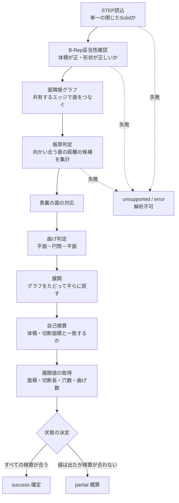

### 公差

部品の大きさに合わせて公差を決める（`sheetmetal_geometry.py`）。対角の長さ D（mm）に対し、長さの公差 = min(0.01, max(1e-6, D × 1e-7)) mm、角度の公差 1e-4。

### 板厚の認識

1. 向かい合う平面（法線が逆向き、内積が −1 + 1e-4 以下）の組と、同じ軸の円筒の組について、面の間の距離を板厚の候補とする。平面の距離は解析的に計算し、間に材料がない組（ヘムのすき間）は除く
2. 候補を、面積（支持）の重みで集計し、相対差 2% 以内をまとめる（`THICKNESS_CLUSTER_REL_TOLERANCE = 0.02`）。最も支持の大きい値を板厚とする
3. 次の検査に通らなければ解析不可：
   - 板として薄いか：板厚 ÷ √(体積 ÷ 板厚) が 0.20 を超えたら板金でない（`MAX_SHEET_SLENDERNESS`、`NOT_SHEET_METAL`）
   - 表裏の対応で得られる面積と、体積 ÷ 板厚 の差が 8% を超えたら、板厚が一定でない（`AREA_CONSISTENCY_TOLERANCE`、`NON_CONSTANT_THICKNESS`）

### 表裏の面と曲げの認識

- **表裏の面の対応**：距離が板厚に一致（相対 2.5% 以内、`THICKNESS_MATCH_REL_TOLERANCE`）する向かい合った平面の組、同じ軸で半径の差が板厚の円筒の組を「表裏のペア」とする
- **曲げ**：平面－円筒－平面 の隣接関係から曲げを見つける。円筒の軸が曲げ軸、内側の半径が内R、外側が外R。曲げ角度 θ = 内側の円筒の面積 ÷（内R × 軸方向の長さ）。170°以上をヘムとして報告する
- 曲げを決められないときは `BEND_UNDETERMINED`（概算）

### 展開（グラフによる展開）

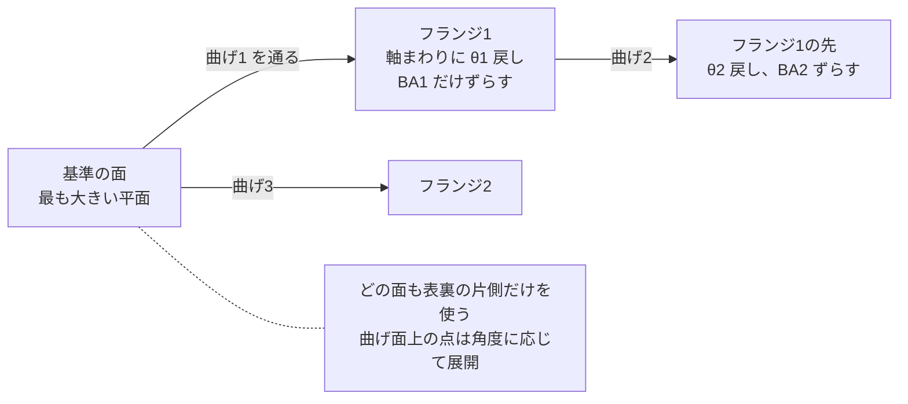

- 最も大きい平面を基準にし、表裏のうち片側の面（平面と曲げ円筒）だけを、隣接グラフで幅優先にたどる
- 曲げを通るたびに、その先の面を曲げ軸まわりに円筒の角度だけ戻し、曲げ代 **BA = θ ×（内R ＋ K × t）** だけ平行移動する（θ はラジアン、t は板厚、K はKファクター）。これは折り曲げの厳密な逆変換で、平板・平行曲げ・トレー・多段フランジ・ヘムを同じ処理で扱う
- 片側の表面の境界エッジを、共有する頂点でつないで展開図の閉じた輪郭（ループ）を作る
  - **展開面積** ＝ 外側のループの面積 − 内側のループ（穴）の面積
  - **切断長** ＝ 境界エッジの長さの合計（平面上のエッジは長さが変わらない。曲げの端は展開後の長さ）
  - **穴数** ＝ 内側のループの数

Kファクターは、加工条件として指定されていない場合は既定値 0.33 で計算し、前提（`assumptions`）に記録して信頼度を medium（見積は概算）にする。

### 自己検算と状態の決め方

展開の結果を、展開とは別の方法で求めた値と比べる（`sheetmetal_analyzer.py`、`sheetmetal_unfold.py`）。

| 検算 | 式 | 許容差 |
|---|---|---|
| 面積 | 展開面積 ＝ 体積 ÷ 板厚 ＋ Σ θ × t × (K − 0.5) × 曲げの長さ | 1%（`AREA_CHECK_TOLERANCE`） |
| 切断長 | 切断長 ＝ 切断面（板厚方向の面）の面積 ÷ 板厚 ＋ Σ 曲げの端ごとの θ × t × (K − 0.5) | 1%（`CUT_CHECK_TOLERANCE`） |
| 展開の整合 | すべての表裏ペアのちょうど片側が展開に入っている。展開後に平らである。閉じた経路で位置がずれない | － |
| 輪郭 | 展開図が1つの単純な外形で、穴は外形の内側にあり、互いに重ならない | － |
| 数 | 切断面のまとまりの数 ＝ 展開図のループの数。すべての曲げが展開に入っている | － |

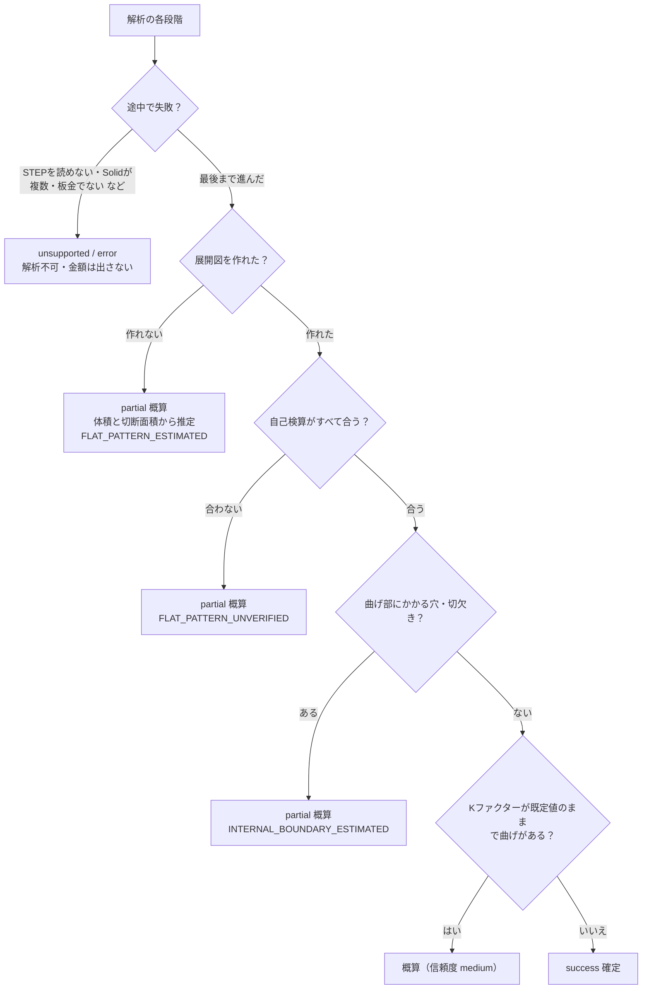

### 理由コード

| 理由コード | 意味 | 状態 |
|---|---|---|
| `INVALID_FILE_TYPE`・`STEP_READ_ERROR` | STEP でない・読めない | 解析不可 |
| `NO_SOLID`・`MULTIPLE_SOLIDS` | Solid がない・複数ある（アセンブリ） | 解析不可 |
| `BREP_INVALID` | 形状データが正しくない | 解析不可 |
| `NOT_SHEET_METAL`・`NON_CONSTANT_THICKNESS` | 板金でない・板厚が一定でない | 解析不可 |
| `ANALYZER_UNAVAILABLE` | CadQuery が入っていない | 解析不可 |
| `BEND_UNDETERMINED` | 曲げを決められない | 概算 |
| `FLAT_PATTERN_UNVERIFIED` | 展開図を作ったが自己検算が合わない | 概算 |
| `INTERNAL_BOUNDARY_ESTIMATED` | 曲げ部にかかる穴・切欠きがある | 概算 |
| `FLAT_PATTERN_ESTIMATED` | 展開図を作れず、体積と切断面積から推定 | 概算 |

## 展開図DXFの解析

`src/dxf_analyzer.py`（`DxfAnalyzer`）。ezdxf と shapely によるルールベース。**板厚は入力**（DXF には板厚がない）。**LLM は使わない。**

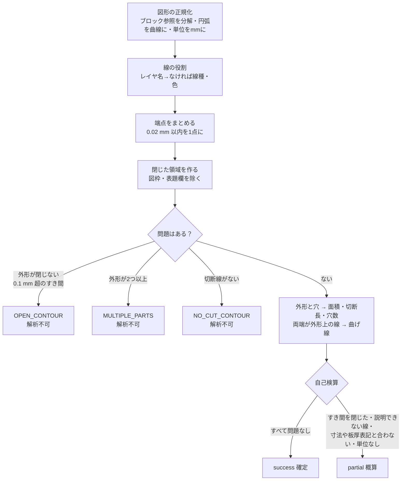

| 段階 | ロジック |
|---|---|
| 図形の正規化 | ブロック参照（INSERT）を分解する（ブロック内のレイヤ0・BYBLOCK の属性は参照側から継承）。LWPOLYLINE の円弧（bulge）・ARC・CIRCLE を曲線にする。`$INSUNITS` で mm に換算する（単位なしは mm とみなし概算）。DIMENSION・TEXT は形状として扱わず、寸法値と板厚表記は検算に使う |
| 線の役割 | レイヤ名に意味があれば使う（CUT／外形、BEND／曲げ線、DIM／寸法、FRAME／図枠、CENTER／中心線、MARK／ケガキ など英日の表記ゆれ）。なければ線種で判断し、実線は切断線の候補、実線以外の直線は曲げ線・中心線の候補 |
| 端点をまとめる | 端点どうしの距離が 0.02 mm 以内なら1点にまとめる（`SNAP_MM`。格子への丸めは使わない：すき間が格子の境目をまたぐと閉じないため）。重複線は1本にし、重複した曲線の間にできる幅 0.05 mm 未満の細い面は無視する |
| 部品の特定 | 連結した線のまとまりごとに閉じた領域を作る。複数の面に分かれ、ほかの図形を囲むまとまりを図枠・表題欄として除く。残った閉じた輪郭のうち最も外側を外形、その内側を穴とする |
| 問題の検出 | 外形が閉じない（0.1 mm を超えるすき間、`NEAR_GAP_MM`）→ `OPEN_CONTOUR`、外形になり得る輪郭が2つ以上 → `MULTIPLE_PARTS`、切断線がない → `NO_CUT_CONTOUR`（いずれも解析不可） |
| 曲げ線 | 途中で分割された線をつないだうえで、両端が外形上にあるものを曲げ線とする。穴の中心で交差する線は中心線として除く |
| 自己検算（概算にする条件） | 0.02〜0.1 mm のすき間を閉じた（`SMALL_GAP_CLOSED`）、部品の内側に外形と同じ色の閉じない線がある（`UNEXPLAINED_GEOMETRY`。別の色ならケガキ線として除外）、役割の分からない破線がある（`UNEXPLAINED_LINE`）、寸法の実測値が外形の大きさと合わない（差が max(0.1 mm, 0.5%) を超える、`DIMENSION_MISMATCH`）、表題欄の板厚表記と入力した板厚が違う（`THICKNESS_MISMATCH`） |

## 図面PDFの読み取り

`src/pdf_reader.py`（`PdfConditionReader`）、`src/pdf_terms.py`（語の解釈ルール）、`src/pdf_quote.py`（見積への反映）。**LLM（Claude）は「図面に書いてある文字の書き写し」だけに使い、コード・数値・確定かどうかはルールで決める。**

### 流れ

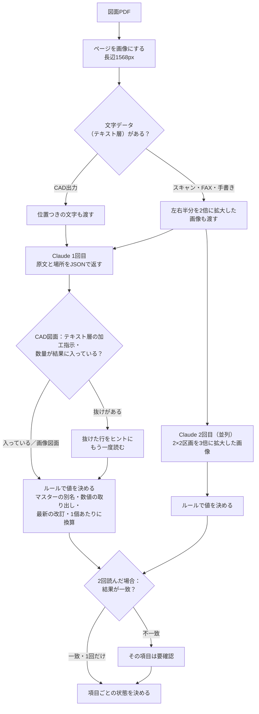

### ページの準備

- ページ全体を長辺 1568 px の画像にする（`LONG_EDGE`）
- スキャン・FAX・手書きの図面と A3 は、左右半分を2倍に拡大した画像を加える
- CAD出力の図面は、文字データ（テキスト層）を、左上からの位置（mm）つきで取り出して一緒に渡す
- スキャン・FAX・手書きの2回目の読み取りには、ページを 2×2 の区画に分けて3倍に拡大した画像を使う

### LLM に渡すもの・返させるもの

- **システムプロンプトの要点**：値の原文だけを書き写す／改訂表・手書きの訂正・追記を反映した最新の値を書く／空欄や書かれていない項目は null／ただの穴は追加加工ではない／分けて書かれた指示は別々に、拡大画像で重複して見えるものは1回だけ／部品表の行は数量と見出し（台分・合計など）も／特急と特記事項の規則／手書き・押印はすべて注記として書く（手書きの「至急」は印字の「通常」より優先）／マスターにない表記は「未登録」、似たコードに寄せない
- **出力の形**（ツール呼び出しの JSON スキーマで固定）：図番・改訂・改訂履歴（改訂・項目・変更前・変更後）・材質／板厚／数量／表面処理（それぞれ原文・書かれている場所・LLM の解釈）・追加加工の一覧（原文・場所・部品表の数・手書きの追記か・コード・数）・部品表の数量の見出し・特急（値と原文）・特記事項（区分と原文）・手書きと押印の注記・自信のない項目
- モデルは `claude-sonnet-5`（環境変数 `ANTHROPIC_MODEL` で変更可）。形式が正しくない応答は最大2回まで聞き直す。応答は `.claude_cache/` に保存し、同じ問い合わせは再利用する

### ルールでの値の決め方

| 項目 | ルール |
|---|---|
| 材質・表面処理 | 原文からラベル（「材質：」など）を除き、マスターの別名（`aliases`）と表記ゆれの規則でコードにする。完全一致で決め、似たものに寄せない。マスターにないものは `UNREGISTERED`（未登録）。表面処理の欄に材質名が書かれていれば表面処理は記載なし |
| 板厚・数量 | 原文から数値を取り出す（「t1.6」「2.3mm」「50個」など）。改訂の変更（「数量 50→100」）があれば最新の値 |
| 追加加工 | タップ（`4-M4`、`M4タップ 4ヶ所`、`4X M4x0.7 TAP` など）・皿もみ・圧入ナット／スタッド・スポット溶接・TIG溶接をコードと個数にする。ただの穴（`φ4.5 キリ` など）は数えない。同じ加工は合計し、部品表の合計（「○台分」「合計」）は数量で割って1個あたりにする。ルールと LLM のコードが食い違えば要確認 |
| 特急 | 「特急」「至急」「URGENT」などで特急、「急ぎません」「特急不要」などの否定は特急でない。手書き・押印の注記を優先する |
| 特記事項 | 厳しい公差・外観の指定・検査や証明書の要求。普通公差・定型注記・色の指定は含めない。CAD図面ではテキスト層からもルールで拾い、2回読みでは両方の結果を合わせる |

### 要確認の決め方

次のどれかに当たる項目は「要確認」にし、金額に入れない（担当者が確認して「この値で確定」にすると入る）。

- CAD図面：値の原文がテキスト層に見つからない。テキスト層にある加工指示が結果にない（ヒントつきで読み直しても欠ける）
- スキャン・FAX・手書き：2回の読み取りの結果が一致しない
- ルールと LLM の判断が食い違う、改訂の最新値と本文の値が違う、原文をルールで解釈できない、部品表の合計が数量で割り切れない

LLM が自分で「自信がない」と返した項目（uncertain）は判定に使わない（評価で、正しい値にも多く付き、自動確定を下げるだけだったため）。

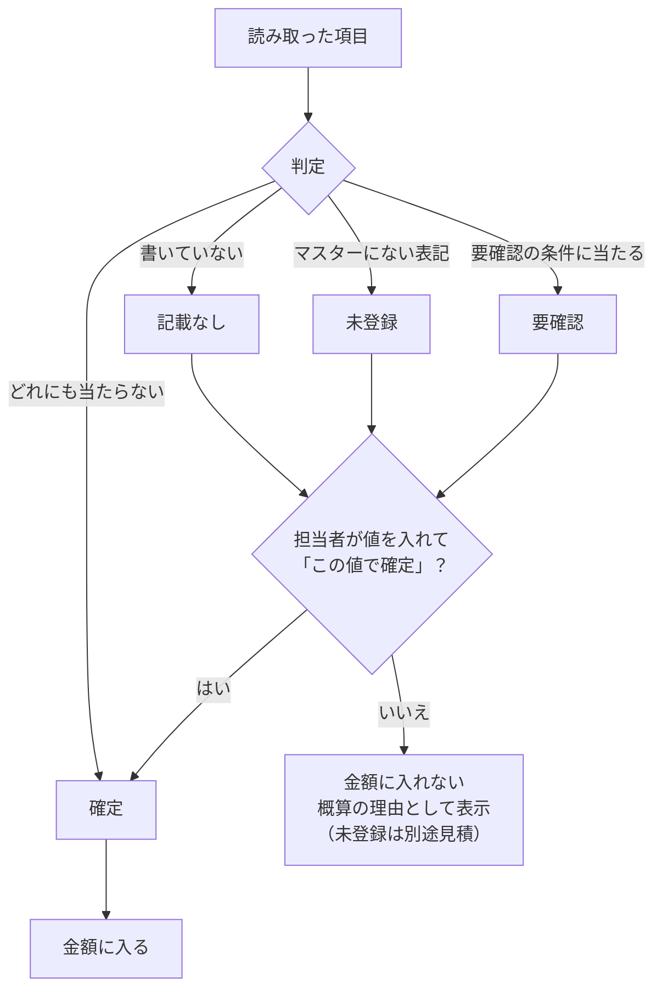

## 見積の計算

`src/quote_engine.py`（`QuoteEngine`）。マスターの単価と率だけで計算する。

### 明細の計算式

数量を N、展開面積を A（mm²）、板厚を t（mm）とする。

| 明細 | 式 |
|---|---|
| 材料費 | 1個の重さ（kg）＝ A × t ÷ 10⁹ × 密度（kg/m³）。金額 ＝ 重さ × 材料単価（円/kg）× 歩留まり係数（`waste_factor`）× N |
| レーザー切断 | 切断長（mm）× 単価（円/mm）× N |
| ピアス（穴あけ） | 穴数 × 単価 × N |
| 曲げ | 曲げ数 × 単価 × N |
| 段取り | 単価（1案件に1回） |
| 追加加工 | 1個あたりの個数 × 単価 ×（N または 1） |
| 表面処理 | 単価 ×（N または 1） |

`charge_scope` が `per_part` の行は数量倍、`per_order` の行は1案件に1回だけ数える（どちらかはマスターの各行で決める）。

### 小計・特急割増・粗利・最終価格

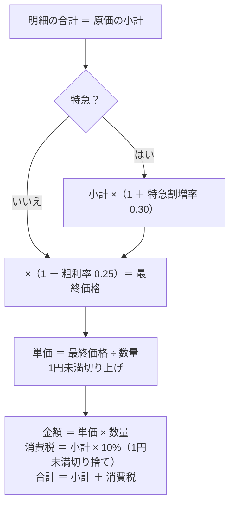

- 特急割増率 `rush_surcharge_rate`（0.30）、粗利率 `margin_rate`（0.25）、税率 `tax_rate`（0.10）は `data/pricing_policy.csv`
- 表面処理・追加加工・特急は、**確定した項目だけ** を金額に入れる（図面PDFの読み取りで要確認・未登録・記載なしのものは入れない）
- 単価・金額・消費税・合計の端数処理は、画面・API・見積書で共通の関数（`src/quote_document.py` の `price_summary`）で行う。画面・API・見積書で金額が1円も違わないことをテストで確かめている

### 概算になる条件

次のどれかに当たると見積は「概算」になり、理由を一覧で示す。

- 解析結果が partial、前提（Kファクターの既定値など）がある、信頼度が medium／low の値がある
- 図面から読み取った条件に、確定でない項目（要確認・未登録・記載なし）が残っている
- 図面の板厚と形状の板厚が違う

## 見積書

`src/quote_document.py`（中身と金額）、`src/quote_pdf.py`（reportlab での描画）、`src/quote_log.py`（見積番号）。**LLM は使わない。**

- **記載項目**（見本 `analysis/quote_document_sample.pdf` と同じ並び）：タイトル・見積番号・発行日・有効期限／宛先（御中・様）／自社（会社名・住所・TEL/FAX・登録番号・担当者・押印欄）／件名・納期・受渡場所・取引条件・有効期限／御見積金額（税込）／明細（No・品名と図番・仕様2行・数量・単位・単価・金額）／小計・消費税・合計／備考
- **仕様の2行**：1行目「材質 板厚 表面処理」（表面処理が未確定なら「表面処理：未定」）、2行目「レーザー切断・曲げn箇所・追加加工と個数」
- **納期**：「受注後 N営業日」。通常は `lead_time_days_normal`（10）、特急は `lead_time_days_rush`（5）。有効期限は発行日＋`quote_validity_days`（30）
- **備考**：概算なら先頭に「本見積は概算です。」と未確定の項目とその扱い（「金額に含めていません」「マスター未登録のため別途見積」「数量1で仮計算」など）を赤字で並べる。続いて見積の根拠（図面の図番・改訂、形状ファイル名）、自社の定型文、特急、特記事項（検査成績書などは別途）、自由記述
- **見積番号**：`Q` ＋ 発行日（YYYYMMDD）＋ `-` ＋ その日の連番3桁（例 `Q20260928-001`）。出力記録 `output/quote_log.csv` と見積履歴の両方にある番号を見て、ロックファイルの下で次の番号を決めて記録する。同じ日に何度出力しても重複しない
- **社外用と社内用**：社外用には原価の内訳と粗利率を出さない。社内用（見積根拠、別PDF、社外秘）には原価の各行・小計・特急割増・粗利率・最終価格・端数処理、解析値と状態、図面から読み取った条件と状態を載せる
- **日本語**：IPAゴシック（`fonts/ipag.ttf`）を埋め込む。長い文字は縮小し、それでも入らなければ折り返す。同じ入力・同じ発行日時なら同じPDFになる
- 出力した見積は見積履歴（`data/past_quotes/history.csv`）に自動で入り、次の類似見積の検索対象になる

## 類似見積

`src/similar_quotes.py`（検索・説明・価格の比較）、`src/past_quotes.py`（履歴・取り込み）。**LLM は使わない。**

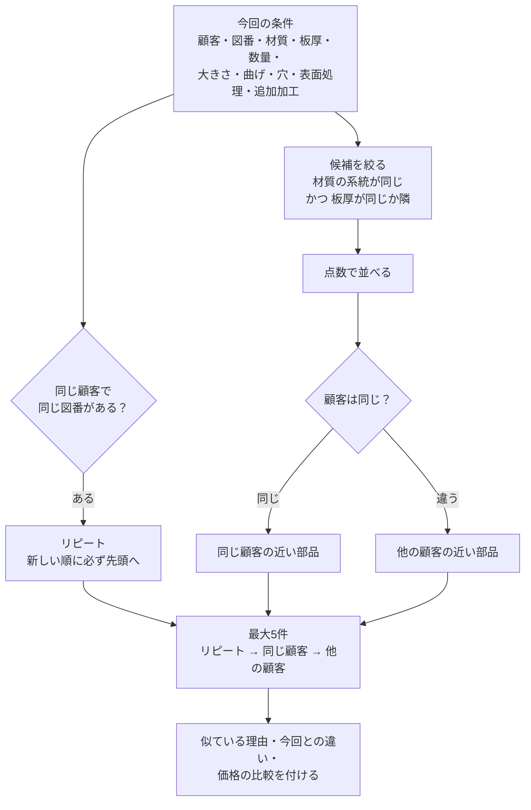

- **区分**：リピート（同じ顧客・同じ図番、改訂違いを含む）→ 同じ顧客の近い部品 → 他の顧客の近い部品。顧客名は「株式会社」などを除き、図番は全角・空白をそろえて比べる。別の顧客の同じ図番は別の部品
- **条件**：材質の系統（鉄・ステンレス・アルミ・銅）が同じで、板厚が同じか隣（系列 0.3・0.4・0.5・0.6・0.8・1.0・1.2・1.6・2.0・2.3・3.2・4.5・6.0・9.0・12.0・16.0 で1段まで）
- **点数**：材質が同じ +3（系統だけ同じ +1）、板厚が同じ +2（隣 +0.5）、数量帯（1〜9、10〜99、100〜999、1000〜）が同じ +2（隣 +0.5）、展開面積が ±30% 以内なら最大 +2（外れたら −0.5）、曲げ数が同じ +1（差2以内 +0.4）、穴数が近い +0.5、表面処理が同じ +1、追加加工の共通度 最大 +1、新しさ 最大 +0.5（3年で0）。形状の数値がない過去見積は大きさを比べない（除外しない）
- **枠の分け方**：リピートを入れた残りの枠を、同じ顧客と他の顧客で分ける（片方が足りなければもう片方で埋める）
- **価格の比較**：今回の単価との差（%）。過去の見積に形状の数値があり、条件がすべて今のマスターにあるときは、その条件を **今のマスターで計算し直した標準単価** を求め、比（出し値 ÷ 標準単価）を今回の標準単価に掛けた「過去の出し値の水準で見た今回の単価」を示す
- **注意の表示**：リピートで今回の単価がこの水準より ±20% を超えて違う、2年以上前の見積、過去の見積が特急
- **参考単価**：最新のリピートの水準。なければ同じ顧客の近い部品（最大3件の中央値）、それもなければ他の顧客の近い部品の水準。表示するだけで、今回の単価は変えない

## API

`api/main.py`（FastAPI、`create_app`）。仕様書は起動後の `/docs`、詳しい設計は `analysis/api_design.md`。

| 機能 | エンドポイント |
|---|---|
| 状態 | `GET /api/health`（トークン不要） |
| マスター | `GET /api/masters` |
| アップロード | `POST /api/files` |
| 形状の解析 | `POST /api/analyses` → `GET /api/jobs/{job_id}` |
| 図面PDFの読み取り | `POST /api/drawings/readings` → `GET /api/jobs/{job_id}`（APIキーがなければ 503） |
| 見積 | `POST /api/quotes` |
| 見積書 | `POST /api/documents` → `GET /api/documents/{quote_no}/quote.pdf`（社内用 `internal.pdf`） |
| 類似見積 | `POST /api/similar-quotes` |
| 履歴 | `POST /api/history/import`、`GET /api/history`、`GET /api/history/{quote_no}`、`PUT /api/history/{quote_no}/outcome` |
| 3D表示 | `GET /api/files/{file_id}/model.glb`（glTF バイナリ、単位 mm） |

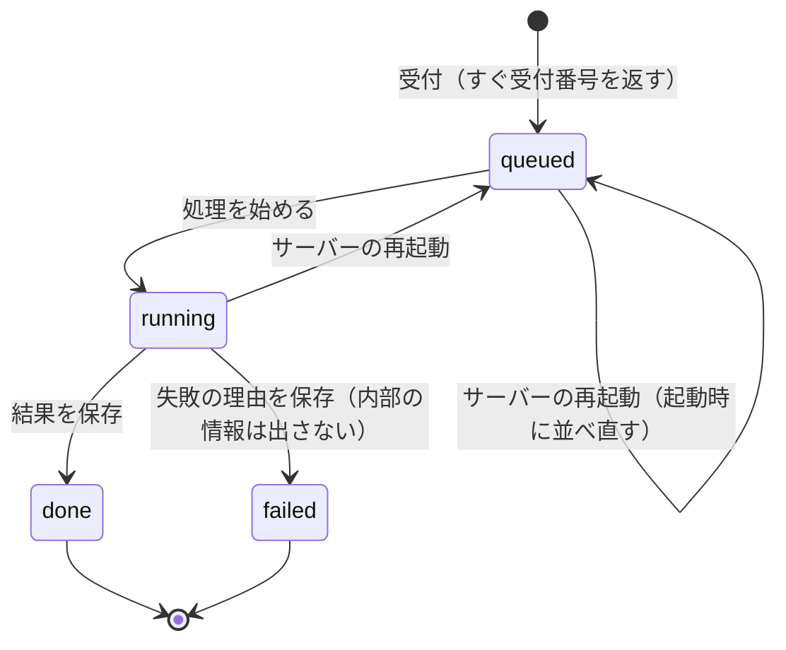

- 受付ごとに `<保存先>/jobs/<受付番号>.json` に状態・入力・結果を書く。再起動しても消えない
- 処理は同じプロセスのスレッドで行う（`JOB_WORKERS`、既定2）。段階3で処理待ちの列（RQ・Celery）に差し替える
- 守り：アップロードの種類（拡張子と中身の先頭）と大きさ（`MAX_UPLOAD_MB`、既定50）、エラーに内部のパスを出さない、合言葉（`API_TOKEN`）を必須にできる

## データ設計

### マスター（`data/`）

| ファイル | 列 | 意味 |
|---|---|---|
| `materials.csv` | material, display_name, density_kg_m3, price_per_kg, waste_factor, charge_scope, aliases | 材質コード、表示名、密度、材料単価（円/kg）、歩留まり係数、数え方、表記ゆれ（`|`区切り） |
| `process_rates.csv` | process_code, display_name, calculation_type, unit_price, unit, charge_scope, aliases | 工程コード（LASER_CUT・PIERCE・BEND・SETUP と追加加工）、単価、単位（mm・hole・bend など） |
| `surface_treatments.csv` | treatment_code, display_name, unit_price, charge_scope, aliases | 表面処理コード（NONE＝処理なし）、単価 |
| `pricing_policy.csv` | key, value, description | margin_rate 0.25、rush_surcharge_rate 0.30、tax_rate 0.10、quote_validity_days 30、lead_time_days_normal 10、lead_time_days_rush 5 |
| `company.csv` | key, value, description | 自社情報（仮の値）。`company.local.csv`（Git管理外）があればそちらを使う。`remark_1`… が備考の定型文 |

表記ゆれの照合は `MasterLoader.resolve_alias`（全角→半角、大文字、空白や記号を除いて完全一致）。似たものへの寄せはしない。

### 見積履歴（`data/past_quotes/history.csv`）

1行1見積の UTF-8 CSV。コミットして、Git で変更が読める。

| 列 | 意味 |
|---|---|
| quote_no, date, customer, drawing_no, revision, part_name | 見積番号・見積日・顧客・図番・改訂・品名 |
| material_text / material_code / material_family | 書かれた文字、マスターのコード（系統だけ分かるときは空、マスターにないときは UNREGISTERED）、系統（steel・stainless・aluminum・copper） |
| thickness, quantity | 板厚・数量 |
| finish_text / finish_code | 表面処理の文字とコード（空欄は「記録なし」） |
| processes_text / processes | 追加加工の文字と、JSON の一覧（コード・個数・原文） |
| rush, unit_price, amount, outcome | 特急、単価、金額、結果（受注・失注・未回答） |
| area, cut, holes, bends, flat_size, shape_class | 形状の数値（ない見積は空） |
| source, original | 取り込み元（`import:ファイル名` か `app`）、取り込んだ元の行（JSON） |

過去見積の CSV（Excel の書き出し、UTF-8 か Shift_JIS）は、列名の別名（「顧客名／得意先」など）か明示した対応づけで取り込む。同じ見積（番号・日付・顧客が同じ）は二重に入らない。

### 保存するファイル（`output/`、Git管理外）

| 場所 | 中身 |
|---|---|
| `output/uploads/<file_id>/` | アップロードしたファイルと meta.json |
| `output/jobs/<job_id>.json` | 受付の状態・入力・結果 |
| `output/documents/<見積番号>/` | 見積書（quote.pdf）と社内用（internal.pdf） |
| `output/viewer/<file_id>.glb` | 3D表示用の形状 |
| `output/quote_log.csv` | 見積書の出力記録 |

置き場所は環境変数で変えられる（`ESTIMATE_DATA_DIR`、`ESTIMATE_STORAGE_DIR`、`PAST_QUOTES_PATH`、`QUOTE_LOG_PATH`）。

## 評価の仕組み

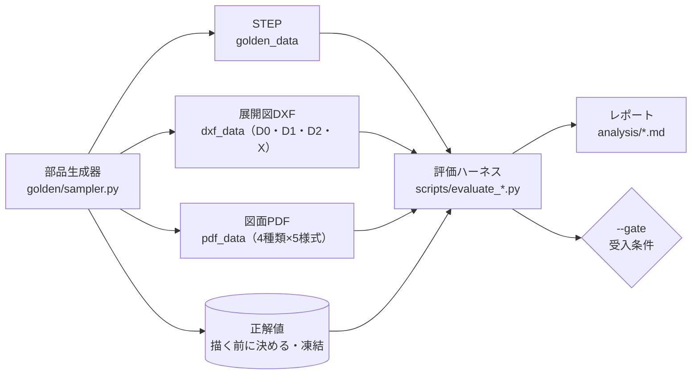

- **ゴールデンデータ**：正解の分かる部品を部品生成器で作り、STEP・DXF・図面PDFに描き分ける。正解値は描く前に決め、凍結したファイル（`golden/datasets/*.json`）と照合する（`--verify-frozen`）
- **評価ハーネス**：`scripts/evaluate_golden.py`（STEP）、`scripts/evaluate_dxf.py`（DXF）、`scripts/evaluate_pdf.py`（図面PDF）。部品ごとの結果は `*/results.csv`、集計は `analysis/*.md`
- **判定の区分**：確定で正解／正解だが概算／誤り（概算表示あり）／危険誤答（誤っているのに確定表示）／解析不可。図面PDFは項目ごとに 正解／正解だが要確認／誤り（要確認）／危険誤答
- **ホールドアウト**：開発中は見ない評価用データを別の乱数（seed）で作り、最後に一度だけ評価する。作り込みすぎ（開発用データへの過剰な適合）を見つけるため

評価の結果（`analysis/` のレポートから）：

| 対象 | データ | 結果 |
|---|---|---|
| STEP | 開発用508件・ホールドアウト200件・追加検証2,000件 | すべて「確定で正解」100%、危険誤答0件 |
| DXF | 開発用800・ホールドアウト400・追加検証800ファイル | 解析成功100%（X は全件「確定しない」）、危険誤答0件 |
| 図面PDF | 開発用300枚 | 価格項目がすべて正しい99.3%、自動確定92.7%、危険誤答0.0%（ホールドアウトは判定途中） |
| 類似見積 | 種データ1,045件 | 平均誤差 全体10.8%→7.9%、リピート9.9%→4.9% |

## LLMを使う箇所

| 箇所 | 入力 | 出力 | 金額・数値への使い方 |
|---|---|---|---|
| 図面PDFの読み取り（Claude） | 図面の画像、CAD図面の文字データ、システムプロンプト | 項目ごとの原文と書かれている場所（JSON） | 原文をルールでコード・数値にする。LLMの解釈はルールとの照合（食い違えば要確認）にだけ使う |
| 条件のチャット入力（OpenAI、任意） | 担当者の文章、登録済みの工程の一覧 | 変更の操作（数量・材質・工程の追加など） | 登録済みのコードと数量だけを反映。APIキーがなければ簡易的な解釈（Mock） |
| LLM単独の解析器（比較用、既定では使わない） | STEP の面の一覧 | 板厚・面積など | 結果は常に概算。評価の比較にだけ使う |

**使わない箇所**：STEP・DXFの形状の解析、見積の計算、見積書、類似見積、API の処理。これらは LLM のキーがなくてもすべて動く。

## 主なモジュール

段階3でクラウドに移す予定のため、主なものだけを示す。

| モジュール | 役割 |
|---|---|
| `app.py` | Streamlit のデモ画面 |
| `api/main.py` | API（FastAPI） |
| `src/services/` | 処理の層（`estimate.py`・受付 `jobs.py`・型 `schemas.py`・設定 `settings.py`・3D `gltf.py`） |
| `src/sheetmetal_*.py` | STEPの解析 |
| `src/dxf_analyzer.py` | 展開図DXFの解析 |
| `src/pdf_reader.py`・`pdf_terms.py`・`pdf_quote.py` | 図面PDFの読み取りと見積への反映 |
| `src/quote_engine.py` | 見積の計算 |
| `src/quote_document.py`・`quote_pdf.py`・`quote_log.py` | 見積書 |
| `src/past_quotes.py`・`similar_quotes.py` | 見積履歴と類似見積 |
| `data/` | マスター・自社情報・見積履歴 |
| `golden/`・`scripts/evaluate_*.py` | ゴールデンデータの生成と評価 |
