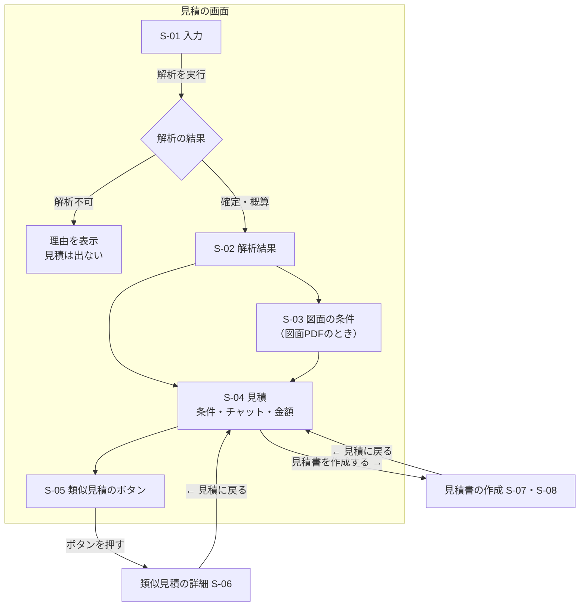
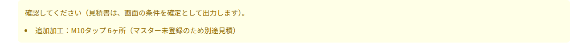

# 画面設計書
<!-- meta {"version": "1.1", "date": "2026-09-29", "audience": "全員（担当者・経営者・開発者）", "id": "DOC-03"} -->

## この資料について

デモ画面（ブラウザで開く見積の画面）について、画面ごとに **何が表示され、何を入力し、操作すると何が起きるか** をまとめる。画面の写真は、実際にデモを起動して撮影したものである（データは開発用の部品と架空の宛先。図面PDFの読み取りの画面は、記録済みの読み取り結果を使って撮影した）。

画面の文字は、同梱の日本語フォント Noto Sans JP で表示する（どのパソコンでも漢字が日本語の字形になる）。

作り方（プログラム）は書かない。処理の中身は「設計書」、操作の手順は「操作マニュアル」を見る。

## 画面の一覧と移り変わり

デモは **3つの画面** からなる。最初の「見積」の画面では見積だけを行い、見積書の作成と類似見積の詳細は、それぞれ別の画面に移って行う。どの画面からも「← 見積に戻る」で見積の画面に戻れ、入力した値はそのまま残る。

| 画面 | 区画 | 役割 |
|---|---|---|
| 見積 | S-01 入力 | STEP／DXF・図面PDFを選び、解析を始める |
| | S-02 解析結果 | 板厚・展開面積・切断長・穴数・曲げ回数、3D表示と展開図、解析の根拠 |
| | S-03 図面から読み取った加工条件 | 図面PDFを指定したときだけ。読み取った値が入力欄に入り、項目ごとに状態が付く |
| | S-04 ルールベース見積 | 条件の入力（図面PDFがないとき）、チャット、確認事項、金額、原価の内訳 |
| | S-05 類似見積（参考） | 過去の見積 最大5件。1件ずつボタンで表示 |
| 類似見積の詳細 | S-06 | ボタンで選んだ過去の見積の詳しい内容 |
| 見積書の作成 | S-07 宛先と部品・取引条件 | 宛先・品名・図番・件名・受渡場所・備考、見積書PDFの作成とダウンロード |
| | S-08 受注・失注の記録 | 出力した見積の結果を記録する |
| （開発者向け） | S-09 API の仕様書 | `/docs` |

## 見積の画面

### S-01 入力

| 項目 | 必須 | 説明 | 入力の例 |
|---|---|---|---|
| STEP／展開図DXFファイル | 必須 | 解析する形状。.step .stp（3D）か .dxf（展開図）。上限200MB（画面の既定） | `bracket.step` |
| 図面PDF | 任意 | 材質・数量・表面処理・追加加工・特急を読み取る。APIキーの設定が必要 | `DB-25-0367.pdf` |
| Kファクター（STEPのとき） | 任意 | 曲げの伸びの係数。0〜1、既定 0.33 | 0.5 |
| 指定済み加工条件として扱う（STEPのとき） | 任意 | Kファクターが顧客や工場で決まった値ならチェック。チェックしないと、曲げのある部品は解析値が「概算」になる | ☑ |
| 板厚（mm）（DXFのとき） | 必須 | 展開図には板厚がないため入力する。図面PDFを指定したときは図面の板厚を使える | 1.6 |
| 曲げなし（平板）（DXFのとき） | 任意 | 曲げのない平板であることを確かめたらチェック。曲げ線のない展開図は、曲げ線の描き漏れと区別できないため、チェックしないと解析値が「概算」になる | □ |
| 解析を実行（ボタン） | － | ファイルを選ぶまで押せない。DXFで板厚がなく図面PDFもないときも押せない | － |

**表示**：何も解析していないときは「.step／.stp、または展開図の .dxf（板厚を入力）を指定し、『解析を実行』を押してください。」、DXFで板厚がないときは「展開図DXFの解析には板厚（mm）の入力が必要です」と出る。

### S-02 解析結果

| 表示項目 | 説明 |
|---|---|
| ファイル | 解析したファイル名 |
| 状態のメッセージ | 緑「解析成功」＝値を確定できた。黄「部分成功：一部の値は概算です」＝一部の解析値が概算。赤「解析不可」「解析エラー」＝金額は出ない（理由コードを表示） |
| 板厚・展開面積・切断長・穴数・曲げ回数 | 解析した値。展開面積は mm²、切断長は mm |
| 注意（黄色） | 解析の注意点。例「見積用の展開です。加工順序・金型情報は生成しません。」 |
| 元の3D形状 | STEP のときだけ。マウスで回せる |
| 解析後の展開形状 | 外周（青）、穴・内周（赤）、曲げ線（橙の破線）。単位 mm |

**解析根拠と処理段階**（開くと表示）

| 表示項目 | 説明 |
|---|---|
| 理由コード | 概算・解析不可のときの理由（例 `FLAT_PATTERN_UNVERIFIED`、DXF の `NO_BEND_LINES`・`UNIT_NOT_MM`） |
| 処理段階 | STEP読込 → B-Rep妥当性確認 → 面隣接グラフ → 板厚判定 → 曲げ判定 → 展開形状作成 → 自己検算 → 展開値取得。それぞれ成功・失敗と説明 |
| 項目別の算出方法と信頼度 | 板厚・展開面積・切断長・穴数・曲げ数を、どの方法で求め、どれだけ信頼できるか（high／medium／low）。根拠（検算の差など） |
| 前提条件 | 例「Kファクター未指定のため既定値0.33で展開」 |

### S-03 図面から読み取った加工条件

図面PDFを指定したときだけ表示される。**読み取った値が入力欄に自動で入り**、項目ごとに状態が付く。金額は **入力欄の値** で計算する。状態は、図面と見比べるべき項目を示す目安である（担当者が「確定」の操作をする必要はない）。

| 列 | 説明 |
|---|---|
| 項目 | 材質・板厚・数量・表面処理・追加加工・特急 |
| 入力欄 | 読み取った値。直すことができる（材質・表面処理は一覧から選ぶ、数量は数、追加加工は表で行を足す・消す、特急はチェック） |
| 状態 | ✅ 読み取り済み／⚠️ 要確認／❌ 未登録／➖ 記載なし／📐 形状から（下の表） |
| 読み取り値と理由 | 図面の値と、要確認の理由（例「最新の改訂の値と異なる」「2回の読み取りが一致しない」） |

| 状態 | 表示 | 意味 | 入力欄と金額 |
|---|---|---|---|
| 読み取り済み | ✅ 読み取り済み | 読み取りに問題がない | 読み取った値が入り、金額に入る |
| 要確認 | ⚠️ 要確認 | 読み取ったが、図面と見比べてほしい | 読み取った値が入り、金額に入る。違っていれば直す |
| 未登録 | ❌ 未登録 | 図面に書いてあるが、マスターにない（例 M10タップ） | 追加加工は表に「未登録: 図面の原文」の行として残り、金額に入らない（見積書の備考に別途見積と書く）。行を消せば書かない。材質が未登録なら、材質を選ぶまで金額を出さない |
| 記載なし | ➖ 記載なし | 図面に書いていない | 既定値（数量1、表面処理なし、特急なし）が入る。必要なら入れる。材質が書いていなければ、材質を選ぶまで金額を出さない |
| 形状から | 📐 形状から | 板厚は、形状の値（STEPから測った板厚、DXFは解析に使った板厚）を表示して計算に使う | 図面の板厚は照合だけに使う。違えば「⚠️ 図面は○mm」と出て、確認事項にも載る |

上部に、図面ファイル名・図番・改訂と、状態ごとの件数が出る。図面に厳しい公差・外観の指定・検査の要求があれば「特記事項：…（見積には含めません）」と黄色で出る。

### S-04 ルールベース見積

**条件**（図面PDFがないとき。図面PDFがあるときは S-03 の入力欄を使う）

| 項目 | 必須 | 説明 | 入力の例 |
|---|---|---|---|
| 材料 | 必須 | マスターの材質コード | SPCC |
| 数量 | 必須 | 1以上 | 100 |
| 表面処理 | 任意 | マスターの表面処理。「なし（生地）」は処理なし | 三価クロメート（有色） |
| 特急 | 任意 | チェックすると特急割増（30%）が入り、納期が短くなる | □ |

**チャット**：条件のすぐ下の入力欄に、文章で条件の変更を書く（例「数量を10個にして、皿もみを2箇所追加」）。登録済みの工程・材質・数量の変更として解釈し、条件の入力欄（図面PDFがあるときは S-03 の入力欄）に反映する。直前のやりとりが入力欄の上に1行で出る。解釈できない内容は見積を変えない。

**表示**

| 表示項目 | 説明 |
|---|---|
| 確認してください（黄色） | 画面の条件や解析値に、確かめてほしい点があるときに出る。例「追加加工：M10タップ 6ヶ所（マスター未登録のため別途見積）」「形状解析：Kファクター未指定…（概算の解析値で計算しています）」。見積書は画面の条件を確定として出力する |
| 単価（1個） | 最終価格 ÷ 数量（1円未満切り上げ） |
| 小計（税抜、N個） | 単価 × 数量 |
| 消費税（10%） | 小計 × 税率（1円未満切り捨て） |
| 見積金額（税込） | 小計 ＋ 消費税。見積書の「御見積金額」と同じ |
| 原価の内訳（社内用） | コード・項目・数量・単位・単価・金額。材料費・レーザー切断・ピアス・曲げ・段取り・表面処理・追加加工・特急割増。見積書には出ない |
| 見積書を作成する →（ボタン） | 見積書の作成の画面に移る。金額が出ていないとき（材質が選ばれていないなど）は出ない |

### S-05 類似見積（参考）

| 表示項目 | 説明 |
|---|---|
| 説明文 | 履歴の件数と、探し方（値段を決める要素が近いものを最大5件）。過去の出し値の水準で見た今回の単価と、今回の単価がそれより何%高い・安いか。**今回の単価は変えない**。宛先を入れる前は「見積書の画面で宛先を入れると、同じ顧客・リピートの見積も探します。」と出る |
| ボタン（最大5件） | 番号・区分（【リピート】【同じ顧客】【他の顧客】）・見積日・顧客・図番・品名・単価（今回比）。押すと、その見積の詳細の画面（S-06）に移る |

リピート（同じ顧客・同じ図番）は、見積書の作成の画面で宛先と図番を入れると探す（図面PDFから読み取った図番は最初から使う）。リピートは必ず先頭に並ぶ。

## 類似見積の詳細（S-06）

| 表示項目 | 説明 |
|---|---|
| ← 見積に戻る | 見積の画面に戻る（入力はそのまま） |
| 見出し | 区分と見積番号、見積日・顧客・図番と改訂・品名 |
| 条件 | 材質と板厚・数量・表面処理・追加加工・特急・結果（受注／失注／未回答） |
| 単価（今回比） | 過去の単価と、今回の単価との差（%） |
| 出し値÷標準単価 | 過去の条件を今のマスターで計算し直した標準単価に対する、実際の単価の比 |
| この水準で見た今回の単価 | 今回の標準単価 × 上の比。形状の数値がない過去の見積では「標準単価を計算できません」 |
| 似ている理由 | 例「同じ顧客・同じ図番、材質同じ（SPCC）、板厚同じ（t2）、大きさが近い（展開面積 -1%）」 |
| 今回との違い | 例「数量 1000→100、圧入ナット -4、M3タップ -8」 |
| 注意（黄色） | 2年以上前の見積、リピートで今回の単価が前回の水準より±20%を超えて違う、過去が特急 |
| この見積の全項目 | 取り込んだ元の行の全項目 |

## 見積書の作成の画面

見積の画面の「見積書を作成する →」で移る。宛先・品名など、見積書のための入力はすべてこの画面で行う。見積書は **作成した時点で画面の条件を確定として扱い、つねに「御見積書」として出す**（概算の見積書はない）。

### S-07 宛先と部品・取引条件

| 項目 | 必須 | 説明 | 入力の例 |
|---|---|---|---|
| 金額 | － | 見積の画面と同じ単価・小計・消費税・見積金額 | － |
| 宛先の会社名 | 必須 | 見積書の「御中」。類似見積の「同じ顧客」「リピート」の判定にも使う | サンプル電機株式会社 |
| 部署・担当者名 | 任意 | 見積書の「様」 | 購買部　山田 太郎 |
| 品名 | 任意 | 既定はファイル名 | 取付板 |
| 図番 | 任意 | 図面PDFから読み取った図番が入る。リピートの判定に使う | CS649-3372 |
| 改訂 | 任意 | 図面PDFから読み取った改訂が入る | A |
| 件名 | 任意 | 空なら「{図番} {品名} 製作」 | CS649-3372 取付板 製作 |
| 受渡場所 | 任意 | 既定「貴社指定場所」（自社情報で変えられる） | 貴社指定場所 |
| 備考 | 任意 | 1行に1項目。見積書の備考の最後に載る | 図面の注記どおり脱脂のこと |
| 社内用の内訳も出力する | 任意 | チェックすると、見積根拠（社内用、社外秘）のPDFも作る | ☑ |
| 見積書PDFを作成（ボタン） | － | 宛先の会社名が空のときは押せない | － |

| 表示 | 説明 |
|---|---|
| 確認のお知らせ（青） | 確認事項があるとき「見積書は、画面の条件を確定として出力します。次の点を確認してください。」と、その点を並べる |
| ダウンロード | 作成した PDF（`見積番号_御見積書.pdf`、`見積番号_見積根拠（社内用）.pdf`）。ファイル名の先頭が見積番号 |
| 入力が変わったとき | 作成後に条件や入力を変えると「条件か入力が変わったため、作成済みの見積書は表示していません。」と出て、古いPDFは出さない |
| 履歴への記録 | 「この見積は見積履歴（data/past_quotes/history.csv）に入り、次からの類似見積の検索対象になります。」 |

### S-08 受注・失注の記録

| 項目 | 説明 |
|---|---|
| この画面で出力した見積だけ | チェックを外すと、取り込んだ過去の見積も選べる（新しい順に200件まで） |
| 見積 | 見積番号・見積日・顧客・図番・今の結果 |
| 結果 | 受注／失注／未回答 |
| 結果を記録（ボタン） | 見積履歴に記録する。「○○ を『受注』にしました。」と出る |

## S-09 API の仕様書（開発者向け）

API を起動し、ブラウザで `http://localhost:8000/docs` を開くと、機能の一覧と入出力の形が見られる。画面から試しに呼ぶこともできる。

{.medium}

## 見積書の見本

見積書は1種類（「御見積書」）である。作成した時点で条件を確定として扱うため、「概算御見積書」は出ない。

### 御見積書

{.medium}

### マスター未登録の追加加工があるとき

未登録の加工は金額に入れず、備考に「追加加工「（図面の原文）」はマスター未登録のため、本見積に含めず別途見積とします。」と書く。

{.medium}

### 社内用の見積根拠（社外秘）

{.medium}

### 記載項目

| 区分 | 項目 | 説明 |
|---|---|---|
| 見出し | タイトル | 「御見積書」 |
| | 見積番号・発行日・有効期限 | `Q＋発行日＋-＋連番3桁`。有効期限は発行日＋30日 |
| 宛先 | 会社名（御中）、部署・担当者名（様） | S-07 で入力 |
| 自社 | 会社名・郵便番号・住所・TEL・FAX・登録番号・担当者、押印欄（承認・担当） | 自社情報のファイルから。押印欄は枠だけ |
| 取引条件 | 件名・納期・受渡場所・取引条件・有効期限 | 納期は「受注後 10営業日」（特急は5営業日） |
| 金額 | 御見積金額（税込） | 合計と同じ |
| 明細 | No・品名と図番（改訂）・仕様（2行）・数量・単位・単価・金額 | 仕様の1行目「材質 板厚 表面処理」、2行目「加工内容」 |
| 合計 | 小計・消費税（10%）・合計 | 画面の金額と同じ |
| 備考 | 見積の根拠（図番・改訂・ファイル名）、定型文、未登録の加工の別途見積、特急、特記事項、自由記述 | |

社外用の見積書には、原価の内訳と粗利率を出さない。
