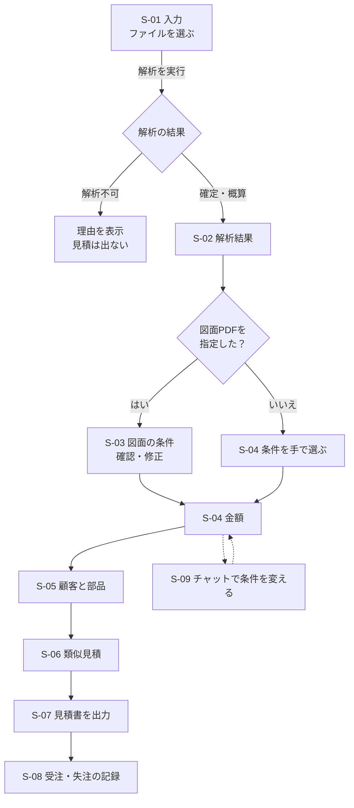
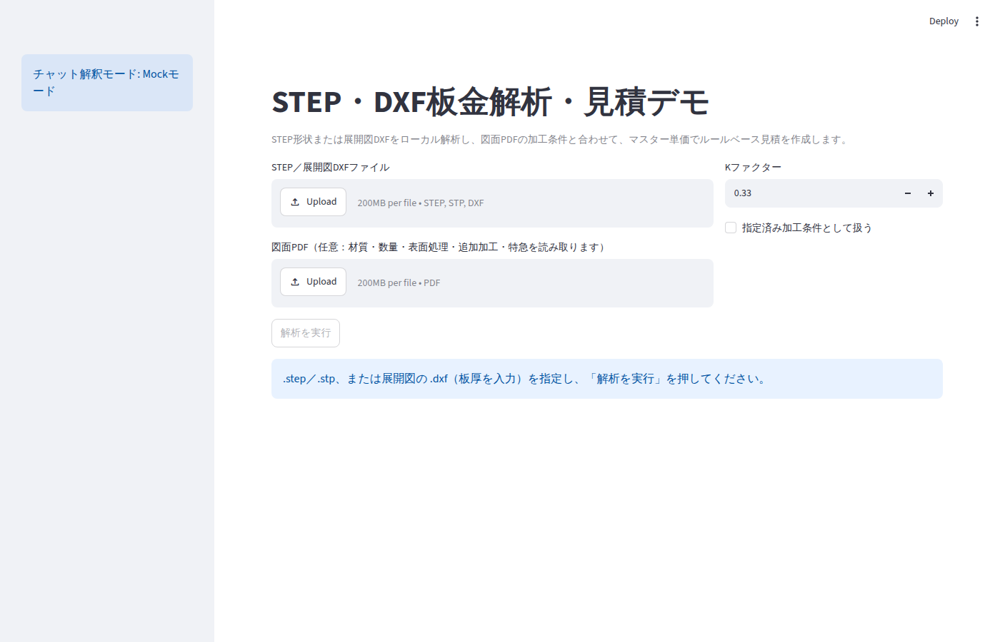
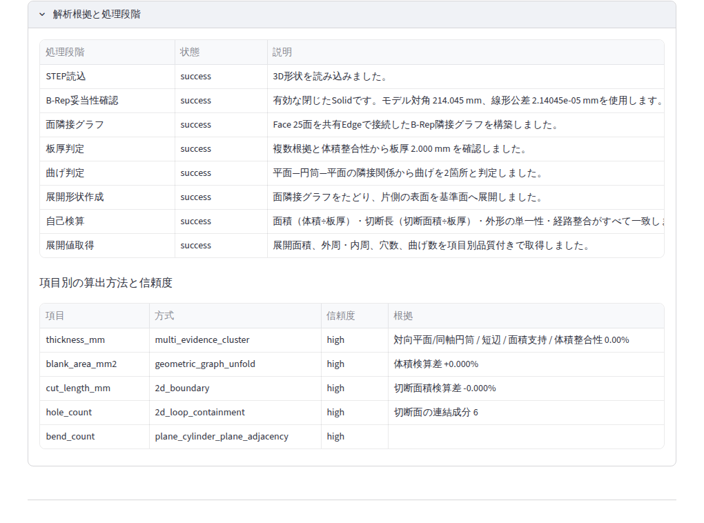
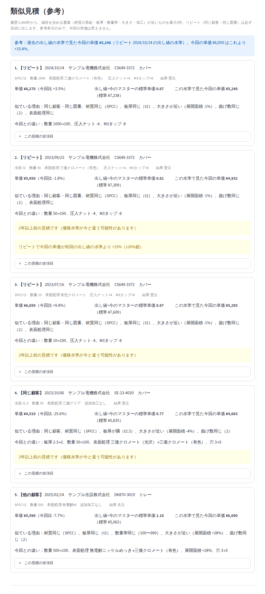
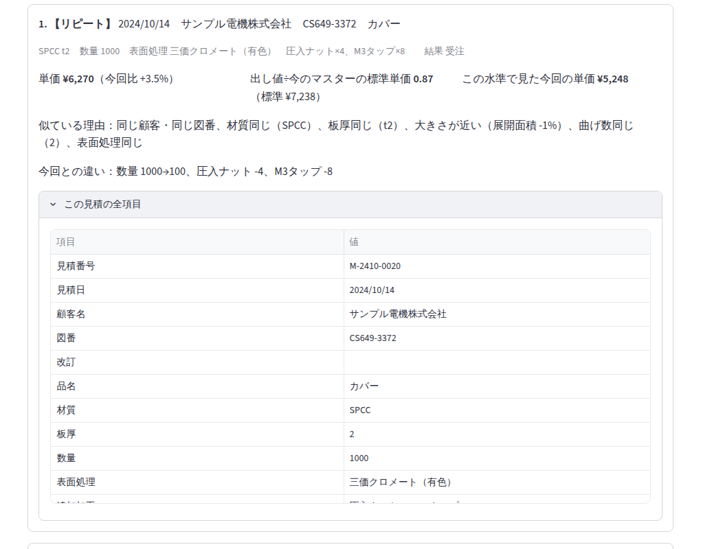
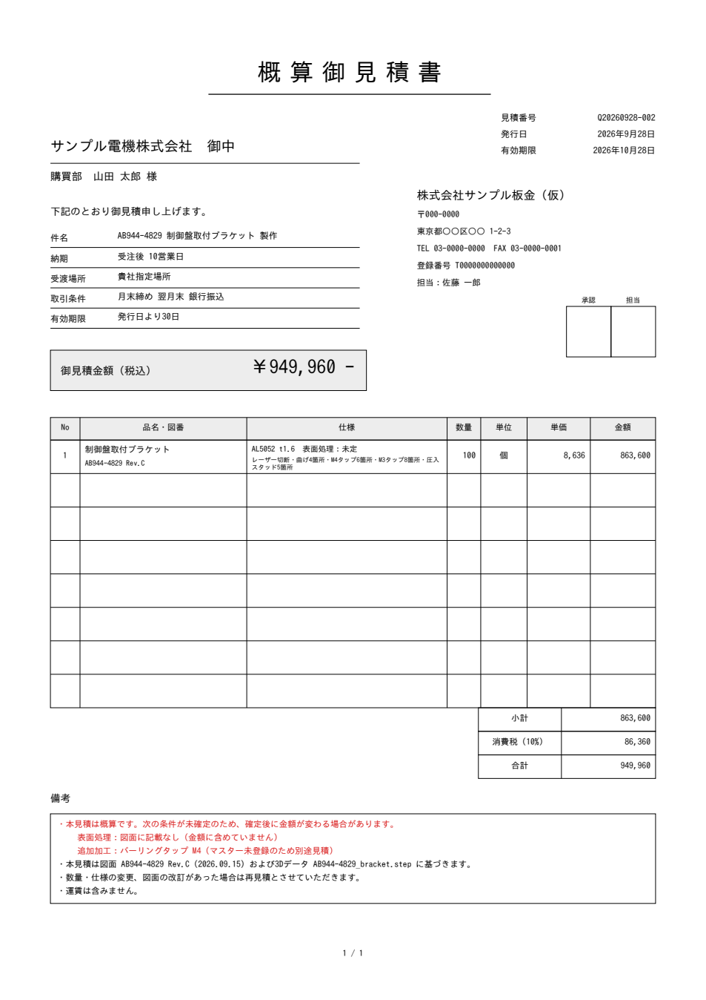

# 画面設計書
<!-- meta {"version": "1.0", "date": "2026-09-28", "audience": "全員（担当者・経営者・開発者）", "id": "DOC-03"} -->

## この資料について

デモ画面（ブラウザで開く見積の画面）について、画面ごとに **何が表示され、何を入力し、操作すると何が起きるか** をまとめる。画面の写真は、実際にデモを起動して撮影したものである（データは開発用の部品と架空の宛先。図面PDFの読み取りの画面は、記録済みの読み取り結果を使って撮影した）。

作り方（プログラム）は書かない。処理の中身は「設計書」、操作の手順は「操作マニュアル」を見る。

## 画面の一覧と移り変わり

デモは1枚の画面を上から下へ進む作りになっている。解析が終わると、下に区画が順に現れる。

| 番号 | 区画 | 役割 |
|---|---|---|
| S-01 | 入力 | STEP／DXF・図面PDFを選び、解析を始める |
| S-02 | 解析結果 | 板厚・展開面積・切断長・穴数・曲げ回数、3D表示と展開図、解析の根拠 |
| S-03 | 図面から読み取った加工条件 | 図面PDFを指定したときだけ。項目ごとの状態と、確認・修正 |
| S-04 | ルールベース見積 | 条件の入力（図面PDFがないとき）、金額、原価の内訳 |
| S-05 | 顧客と部品 | 宛先・品名・図番（類似見積と見積書に使う） |
| S-06 | 類似見積（参考） | 過去の見積 最大5件と価格の比較 |
| S-07 | 見積書を出力 | 件名・受渡場所・備考、見積書PDFの作成とダウンロード |
| S-08 | 受注・失注の記録 | 出力した見積の結果を記録する |
| S-09 | チャット（補助） | 文章で条件を変える（例「数量を10個にして」） |
| S-10 | API の仕様書 | 開発者向け（`/docs`） |

## S-01 入力

| 項目 | 必須 | 説明 | 入力の例 |
|---|---|---|---|
| STEP／展開図DXFファイル | 必須 | 解析する形状。.step .stp（3D）か .dxf（展開図）。上限200MB（画面の既定） | `bracket.step` |
| 図面PDF | 任意 | 材質・数量・表面処理・追加加工・特急を読み取る。APIキーの設定が必要 | `DB-25-0367.pdf` |
| Kファクター（STEPのとき） | 任意 | 曲げの伸びの係数。0〜1、既定 0.33 | 0.5 |
| 指定済み加工条件として扱う（STEPのとき） | 任意 | Kファクターが顧客や工場で決まった値ならチェック。チェックしないと、曲げのある部品は概算になる | ☑ |
| 板厚（mm）（DXFのとき） | 必須 | 展開図には板厚がないため入力する。図面PDFを指定したときは図面の板厚を使える | 1.6 |
| 解析を実行（ボタン） | － | ファイルを選ぶまで押せない。DXFで板厚がなく図面PDFもないときも押せない | － |

**表示**：何も解析していないときは「.step／.stp、または展開図の .dxf（板厚を入力）を指定し、『解析を実行』を押してください。」、DXFで板厚がないときは「展開図DXFの解析には板厚（mm）の入力が必要です」と出る。左の帯（サイドバー）に、チャットの解釈の方式（「Mockモード」＝APIキーなしの簡易な解釈）が出る。

## S-02 解析結果

| 表示項目 | 説明 |
|---|---|
| ファイル | 解析したファイル名 |
| 状態のメッセージ | 緑「解析成功」＝確定。黄「部分成功：一部の値は概算です」＝概算。赤「解析不可」「解析エラー」＝金額は出ない（理由コードを表示） |
| 板厚・展開面積・切断長・穴数・曲げ回数 | 解析した値。展開面積は mm²、切断長は mm |
| 注意（黄色） | 解析の注意点。例「見積用の展開です。加工順序・金型情報は生成しません。」 |
| 元の3D形状 | STEP のときだけ。マウスで回せる |
| 解析後の展開形状 | 外周（青）、穴・内周（赤）、曲げ線（橙の破線）。単位 mm |

### 解析根拠と処理段階（開くと表示）

| 表示項目 | 説明 |
|---|---|
| 理由コード | 概算・解析不可のときの理由（例 `FLAT_PATTERN_UNVERIFIED`） |
| 処理段階 | STEP読込 → B-Rep妥当性確認 → 面隣接グラフ → 板厚判定 → 曲げ判定 → 展開形状作成 → 自己検算 → 展開値取得。それぞれ成功・失敗と説明 |
| 項目別の算出方法と信頼度 | 板厚・展開面積・切断長・穴数・曲げ数を、どの方法で求め、どれだけ信頼できるか（high／medium／low）。根拠（検算の差など） |
| 前提条件 | 例「Kファクター未指定のため既定値0.33で展開」 |

## S-03 図面から読み取った加工条件

図面PDFを指定したときだけ表示される。読み取った値が入力欄に入り、項目ごとに状態が付く。

| 列 | 説明 |
|---|---|
| 項目 | 材質・板厚・数量・表面処理・追加加工・特急 |
| 入力欄 | 読み取った値。直すことができる（材質・表面処理は一覧から選ぶ、板厚・数量は数、追加加工は表で行を足す・消す、特急はチェック） |
| 状態 | ✅ 確定／⚠️ 要確認／❌ 未登録／➖ 記載なし（下の表） |
| 読み取り値と理由 | 図面の値と、要確認の理由（例「最新の改訂の値と異なる」「2回の読み取りが一致しない」） |
| この値で確定 | 確定でない項目だけに出る。チェックすると確定になり、金額に入る。値を直すと自動でチェックが入る |

| 状態 | 表示 | 意味 | 金額 |
|---|---|---|---|
| 確定 | ✅ 確定 | 読み取りに問題がない | 入る |
| 要確認 | ⚠️ 要確認 | 読み取ったが、担当者の確認が必要 | 入らない（確定にすると入る） |
| 未登録 | ❌ 未登録 | 図面に書いてあるが、マスターにない（例 M10タップ） | 入らない（別途見積） |
| 記載なし | ➖ 記載なし | 図面に書いていない | 入らない（入力して確定にすると入る） |

上部に、図面ファイル名・図番・改訂と、状態ごとの件数が出る。図面に厳しい公差・外観の指定・検査の要求があれば「特記事項：…（見積には含めません）」と黄色で出る。

## S-04 ルールベース見積

| 項目 | 必須 | 説明 | 入力の例 |
|---|---|---|---|
| 材料 | 必須 | マスターの材質コード | SPCC |
| 数量 | 必須 | 1以上 | 100 |
| 表面処理 | 任意 | マスターの表面処理。「なし（生地）」は処理なし | 三価クロメート（有色） |
| 特急 | 任意 | チェックすると特急割増（30%）が入り、納期が短くなる | □ |

図面PDFを指定したときは、この欄の代わりに S-03 の条件が使われる。

| 表示項目 | 説明 |
|---|---|
| 単価（1個） | 最終価格 ÷ 数量（1円未満切り上げ） |
| 小計（税抜、N個） | 単価 × 数量 |
| 消費税（10%） | 小計 × 税率（1円未満切り捨て） |
| 見積金額（税込） | 小計 ＋ 消費税。見積書の「御見積金額」と同じ |
| 概算見積（黄色） | 確定でない条件や概算の解析値があるとき「概算見積：加工条件または解析値に概算を含みます。」 |
| 原価の内訳（社内用） | コード・項目・数量・単位・単価・金額。材料費・レーザー切断・ピアス・曲げ・段取り・表面処理・追加加工・特急割増。見積書には出ない |

## S-05 顧客と部品

| 項目 | 必須 | 説明 | 入力の例 |
|---|---|---|---|
| 宛先の会社名 | 必須（見積書） | 見積書の「御中」。類似見積の「同じ顧客」の判定にも使う | サンプル電機株式会社 |
| 部署・担当者名 | 任意 | 見積書の「様」 | 購買部　山田 太郎 |
| 品名 | 任意 | 既定はファイル名 | 取付板 |
| 図番 | 任意 | 図面PDFから読み取った図番が入る。リピートの判定に使う | CS649-3372 |
| 改訂 | 任意 | 図面PDFから読み取った改訂が入る | A |

## S-06 類似見積（参考）

| 表示項目 | 説明 |
|---|---|
| 説明文 | 履歴の件数と、探し方（値段を決める要素が近いものを最大5件、リピートは先頭） |
| 参考（青） | 過去の出し値の水準で見た今回の単価と、その根拠。今回の単価がそれより何%高い・安いか。**今回の単価は変えない** |
| 見出し | 番号・区分（【リピート】【同じ顧客】【他の顧客】）・見積日・顧客・図番と改訂・品名 |
| 条件 | 材質と板厚・数量・表面処理・追加加工・特急・結果（受注／失注／未回答） |
| 単価（今回比） | 過去の単価と、今回の単価との差（%） |
| 出し値÷標準単価 | 過去の条件を今のマスターで計算し直した標準単価に対する、実際の単価の比 |
| この水準で見た今回の単価 | 今回の標準単価 × 上の比。形状の数値がない過去の見積では「標準単価を計算できません」 |
| 似ている理由 | 例「同じ顧客・同じ図番、材質同じ（SPCC）、板厚同じ（t2）、大きさが近い（展開面積 -1%）」 |
| 今回との違い | 例「数量 1000→100、圧入ナット -4、M3タップ -8」 |
| 注意（黄色） | 2年以上前の見積、リピートで今回の単価が前回の水準より±20%を超えて違う、過去が特急 |
| この見積の全項目 | 開くと、取り込んだ元の行の全項目を表示 |

{.medium}

{.medium}

## S-07 見積書を出力

| 項目 | 必須 | 説明 | 入力の例 |
|---|---|---|---|
| 件名 | 任意 | 既定「{図番} {品名} 製作」 | CS649-3372 取付板 製作 |
| 受渡場所 | 任意 | 既定「貴社指定場所」（自社情報で変えられる） | 貴社指定場所 |
| 備考 | 任意 | 1行に1項目。見積書の備考の最後に載る | 図面の注記どおり脱脂のこと |
| 社内用の内訳も出力する | 任意 | チェックすると、見積根拠（社内用、社外秘）のPDFも作る | ☑ |
| 見積書PDFを作成（ボタン） | － | 宛先の会社名が空のときは押せない | － |

| 表示 | 説明 |
|---|---|
| 概算の予告（黄色） | 未確定の条件があるとき「未確定の条件があるため概算見積書として出力されます。」と、未確定の項目をすべて並べる |
| ダウンロード | 作成した PDF（`見積番号_御見積書.pdf`、`見積番号_見積根拠（社内用）.pdf`）。ファイル名の先頭が見積番号 |
| 入力が変わったとき | 作成後に条件や入力を変えると「条件か入力が変わったため、作成済みの見積書は表示していません。」と出て、古いPDFは出さない |
| 履歴への記録 | 「この見積は見積履歴（data/past_quotes/history.csv）に入り、次からの類似見積の検索対象になります。」 |

## S-08 受注・失注の記録

| 項目 | 説明 |
|---|---|
| この画面で出力した見積だけ | チェックを外すと、取り込んだ過去の見積も選べる（新しい順に200件まで） |
| 見積 | 見積番号・見積日・顧客・図番・今の結果 |
| 結果 | 受注／失注／未回答 |
| 結果を記録（ボタン） | 見積履歴に記録する。「○○ を『受注』にしました。」と出る |

## S-09 チャット（補助）

画面の下の入力欄に文章で条件の変更を書く（例「数量を10個にして、皿もみを2箇所追加」）。登録済みの工程・材質・数量の変更として解釈し、見積に反映する。OpenAI のAPIキーがないときは「Mockモード」（簡易な解釈）で動く。解釈できない内容は「該当する登録工程または変更条件が見つかりません。」と返し、見積は変えない。

## S-10 API の仕様書（開発者向け）

API を起動し、ブラウザで `http://localhost:8000/docs` を開くと、機能の一覧と入出力の形が見られる。画面から試しに呼ぶこともできる。

{.medium}

## 見積書の見本

### 確定の見積書（御見積書）

{.medium}

### 概算の見積書（概算御見積書）

未確定の条件があるとタイトルが「概算御見積書」になり、備考の先頭に、未確定の項目とその扱いが赤字で並ぶ。仕様の表面処理が未確定なら「表面処理：未定」と書く。

{.medium}

### 社内用の見積根拠（社外秘）

{.medium}

### 記載項目

| 区分 | 項目 | 説明 |
|---|---|---|
| 見出し | タイトル | 確定「御見積書」、概算「概算御見積書」 |
| | 見積番号・発行日・有効期限 | `Q＋発行日＋-＋連番3桁`。有効期限は発行日＋30日 |
| 宛先 | 会社名（御中）、部署・担当者名（様） | S-05 で入力 |
| 自社 | 会社名・郵便番号・住所・TEL・FAX・登録番号・担当者、押印欄（承認・担当） | 自社情報のファイルから。押印欄は枠だけ |
| 取引条件 | 件名・納期・受渡場所・取引条件・有効期限 | 納期は「受注後 10営業日」（特急は5営業日） |
| 金額 | 御見積金額（税込） | 合計と同じ |
| 明細 | No・品名と図番（改訂）・仕様（2行）・数量・単位・単価・金額 | 仕様の1行目「材質 板厚 表面処理」、2行目「加工内容」 |
| 合計 | 小計・消費税（10%）・合計 | 画面の金額と同じ |
| 備考 | 概算の理由（概算のとき）、見積の根拠（図番・改訂・ファイル名）、定型文、特急、特記事項、自由記述 | |

社外用の見積書には、原価の内訳と粗利率を出さない。
