# 画面設計書
<!-- meta {"version": "2.0", "date": "2026-10-05", "audience": "全員（担当者・経営者・開発者）", "id": "DOC-03"} -->

## この資料について

ブラウザで使う画面（React）について、画面ごとに **何が表示され、何を入力し、操作すると何が起きるか** をまとめる。見た目と並びは UIモック「図面管理プラットフォーム UIモック」（2026-10-01、`analysis/ui_mock.pdf`）に合わせ、中身は板金の見積（今のCADデータの解析と金額の計算）に合わせて直した。モックの21画面のうち17画面と、モックにない「担当者」「過去見積の取り込み」を作った。ログイン・組図と部品構成・改訂の差分比較・権限管理は作っていない。

画面の写真は、お試しデータ（`scripts/seed_demo.py`。架空の顧客、開発用の図面と形状、記録済みの図面の読み取り結果）で、実際に画面を動かして撮影したものである。

作り方（プログラム）は書かない。処理の中身は「設計書」、操作の手順は「操作マニュアル」を見る。

## 共通の作り

- **左のメニュー**：上に主要4項目（図面を登録／図面一覧／案件・進捗／見積）、区切り線の下に「図面」「見積作業」「書類」「取引先」「設定」（押すと中の画面が開く）、その下に「最近の見積」のカード（最近更新した3件）。モックにあった利用者の表示とログアウトは出さない
- **上の帯**：画面名、検索欄（図番・品名・書類。Enter で「書類・ナレッジ検索」を開く）、「用語・計算式」（用語の説明と、見積ロジックへのリンクを右から開く）
- **見た目**：地は薄いグレー、強調は落ち着いた青、見出しは太めの詰まった書体（Barlow Condensed と Noto Sans JP）、数字は大きく。状態は枠つきの小さなラベル（見積確認中・受注・失注など）。表は横罫だけ。注目させる枠の四隅に小さな「＋」の印。プレビューのない場所は斜線の地
- **金額と判定**：画面は API だけを呼ぶ。金額・未入力の項目・発行できるか・類似かどうかは、すべて API が決めた値を表示する（画面で計算し直さない）
- **同時に使ったとき**：見積・案件・図面・取引先・マスタの保存は、開いたときの版を一緒に送る。ほかの人が先に保存していたら上書きせず「ほかの人が先に変更しました。最新の内容を表示します。」と出す（見積結果では最新の内容を自動で読み直す）
- **表示の言葉**：使う人に関係のない仕組みの話（サーバー、自己検算、AIの使い方、設定の変数名など）は画面に出さない。解析器・読み取り器のメッセージは、そのまま出さず `src/services/platform/wording.py` で使う人の言葉に言い換える（解析結果そのものは変えない）。「形状」は「CADデータ」（STEP・DXF）、表記は「マスタ」にそろえる。画面ごとの説明文は最小限にし、用語は「用語・計算式」にまとめる
- **だれが操作したか**：ログインはまだない。「設定 ＞ 担当者」で選んだ「この端末で操作する担当者」が、修正履歴・進捗の変更・帳票の発行に記録される

## 画面の一覧と移り変わり

| No | 画面 | 役割 |
|---|---|---|
| 02 | 図面を登録 | 図面PDF・STEP・DXFをまとめて登録する（登録内容の確認表） |
| 03 | 新規見積作成 | 登録済みの図面を選び、案件情報を入れて見積を始める |
| 04 | 解析の進み具合 | CADデータの解析 → 図面の読み取り → マスタ照合 → 見積計算 → 類似実績の検索 |
| 05 | 見積結果 | 金額の内訳、図面の条件、CADデータ（寸法・3D・展開図）、未入力の項目、類似実績、修正履歴、チャット、顧客提示モード |
| 06 | 案件・進捗 | カンバン・一覧、警告、進捗の変更、失注の記録 |
| 07 | 図面一覧 | 条件検索・似た形・図面内の文字、分類、プレビュー／リスト |
| 08 | 図面詳細 | プレビュー（図面PDF・3D・展開図）、版、図面情報・改訂履歴・使用先・関連書類・メモ、書き込み、似た図面の過去実績 |
| 11 | 見積 | 見積の一覧 |
| 12 | 分類・属性項目 | 分類（フォルダ）、図面の属性・検索項目 |
| 13 | 書類・ナレッジ検索 | キーワード検索、書類の登録 |
| 14 | 振り返り分析 | 件数・受注率・回答日数・総額、顧客別・担当者別・失注の理由 |
| 15 | 取引先管理 | 協力会社・顧客の台帳 |
| 16 | 帳票発行 | 見積書・納品書・請求書のプレビュー・発行・履歴 |
| 17 | マスタ | 材料・工程・表面処理・価格方針・自社情報 |
| 18 | 見積ロジック | 計算式の表示（変えられない） |
| 19 | 見積書テンプレート | 表示する項目の切り替え、プレビュー |
| 20 | 案件ステータス | 名前・順番・色・表示グループ・表示 |
| — | 担当者 | 担当者の一覧、この端末で操作する担当者、APIの合言葉 |
| — | 過去見積の取り込み | CSV の列の対応づけと取り込み |

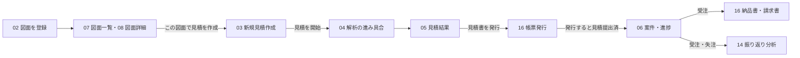
```mermaid 図 主な流れ
flowchart LR
  R[02 図面を登録] --> D[07 図面一覧・08 図面詳細]
  D -->|この図面で見積を作成| N[03 新規見積作成]
  N -->|見積を開始| P[04 解析の進み具合]
  P --> E[05 見積結果]
  E -->|見積書を発行| F[16 帳票発行]
  F -->|発行すると見積提出済| C[06 案件・進捗]
  C -->|受注| F2[16 納品書・請求書]
  C -->|受注・失注| V[14 振り返り分析]
```

## 02 図面を登録

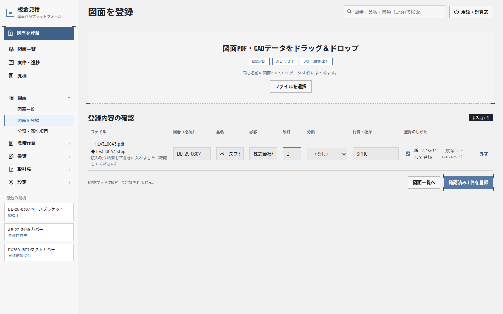

| 項目 | 説明 |
|---|---|
| ドラッグ＆ドロップ欄 | 図面PDF・STEP（.step/.stp）・DXF をまとめて置く（「ファイルを選択」でもよい）。それ以外の種類は除いて知らせる。DWG・IGES・写真・Excel は取り込まない |
| 登録内容の確認表 | 1行が1件の図面。名前（拡張子を除く）が同じ図面PDFとCADデータは1行にまとめる。片方だけでもよい |
| 図番（必須）・品名・顧客・改訂・分類 | 人が入力する。図面PDFがあれば、今の読み取り器で図番・改訂・材質を下書きとして入れる（「読み取り結果を下書きに入れました」）。読み取りが使えない環境では手で入れる |
| 材質・板厚 | 材質は図面の値が下書き。DXF には板厚がないので、DXF の行には板厚の欄が出る（入れないと見積のときに解析） |
| 登録のしかた | 同じ図番がすでにあれば「新しい版として登録」にチェックが付く（外すと別の図面として登録）。なければ「新規の図面」 |
| 確認済み n 件を登録 | 図番のある行を登録する。CADデータは登録と同時に解析し、板厚・展開面積・切断長・穴数・曲げ数・最大寸法を図面の属性として持つ |

モックの「AIの仕分け結果」（種類の判定、複数ページの分割、組図・関連書類のひも付け）は作らない。

## 03 新規見積作成

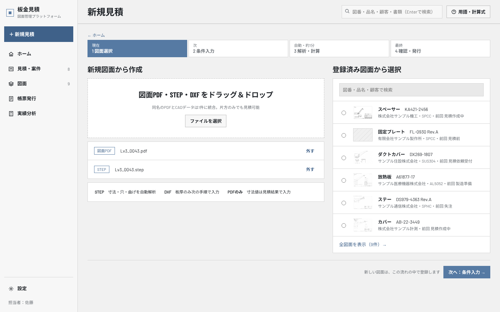

| 項目 | 説明 |
|---|---|
| 見積する図面 | 登録済みの図面から選ぶ（図面一覧・図面詳細の「この図面で見積を作成」で選ばれた状態で開く）。未登録なら「図面を登録」へ |
| 顧客（必須）・案件名 | 図面の顧客・品名が初期値 |
| 数量（必須）・希望納期 | 希望納期は記録・見積書への表示・進捗の警告に使う。金額には影響しない |
| 材質・表面処理 | 図面から読み取った値（図面情報の値）が初期値。「（図面のとおり）」は見積のときに図面の読み取り結果を使う。「マスタにない材質…」を選ぶと名前・kg単価・密度を入れる |
| 担当 | 「設定 ＞ 担当者」の一覧から |
| Kファクター・自社の加工条件で決まった値 | STEP のとき。チェックしないと、曲げのある部品の展開寸法は概算になる（発行は止めない） |
| 板厚（mm）・曲げなし（平板） | DXF のとき（展開図には板厚がないため入力する） |
| 見積を開始 | 顧客・数量・図面がそろうと押せる。案件と見積を作り、解析の進み具合へ |

モックの「マスタにない単価をWebから調べる」は出さない。

## 04 解析の進み具合

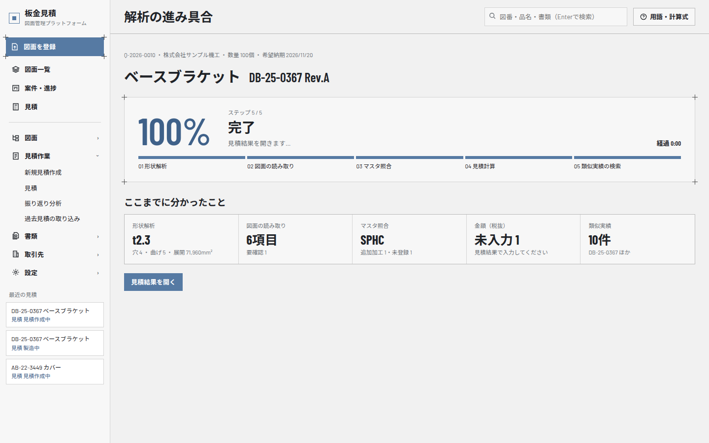

上に案件番号・顧客・数量・希望納期と、品名・図番。進み具合の％、今の段階の名前、経過時間、5つの段階の帯。下の「ここまでに分かったこと」に、段階ごとの値（CADデータ：板厚・穴・曲げ・展開面積、図面の読み取り：項目数と要確認の数、マスタ照合：材質と未登録の数、金額（税抜）か未入力の数、類似実績の件数）を出す。終わると見積結果に移る。処理は API の受付番号方式で、画面は進み具合を読むだけ。

## 05 見積結果

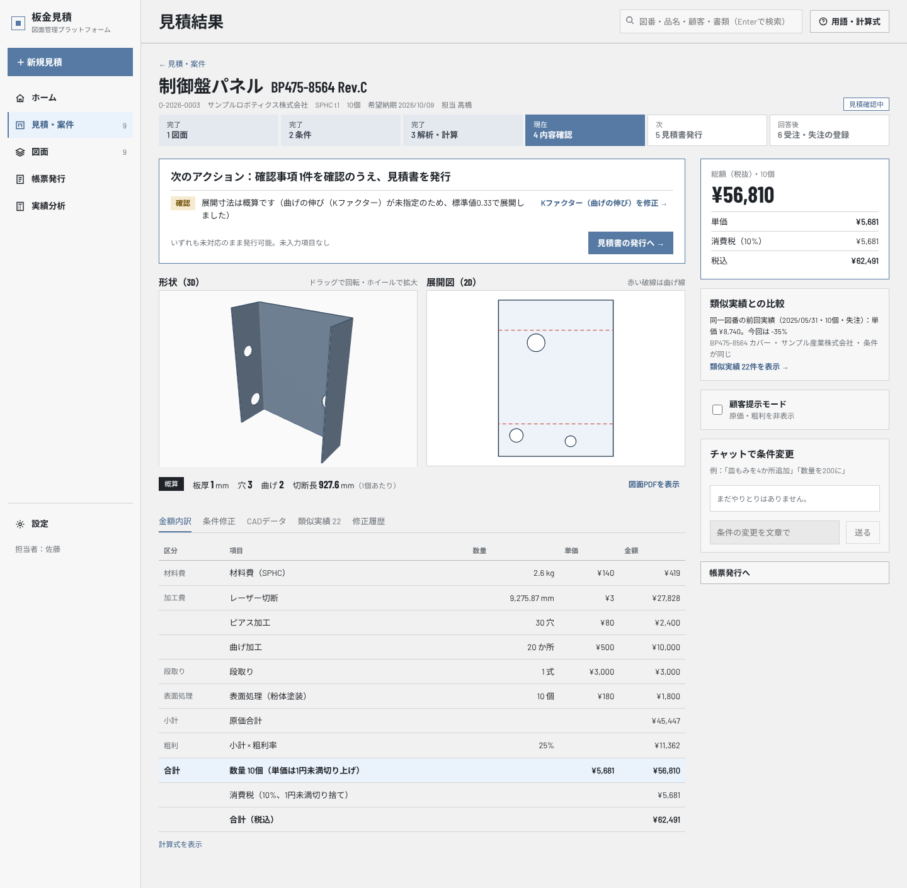

| 区画 | 内容 |
|---|---|
| 見出し | 案件番号・状態のラベル、品名・図番と改訂、顧客／材質／板厚／希望納期／担当 |
| ボタン | 顧客提示モード（原価の内訳を隠す）、条件を修正（条件の欄へ）、見積書を発行（未入力の項目がある間は押せない。帳票発行へ） |
| 金額の帯 | 材料費・加工費（レーザー切断・ピアス・曲げ）・段取り・追加加工・表面処理・粗利（率）、総額（税抜）と単価・消費税・税込。項目別の小計は API が出す |
| 未入力の項目 | 金額に必要で入っていない項目の一覧（下の表）。1件でもあれば発行できない（API も拒否する） |
| 原価内訳 | 区分・項目・数量・単価・金額、小計、粗利、合計（単価は1円未満切り上げ）、消費税（1円未満切り捨て）、合計（税込） |
| 図面から読み取った条件 | 材質・板厚・数量・表面処理・追加加工・特急ごとに、状態（読み取り済み・要確認・未登録・記載なし）、図面の値、見積に使う値。板厚は CADデータの値を使い、図面と違えば「CADデータの板厚（x mm）と違います」と出す。要確認の理由は「改訂欄の値と本文の値が違います」のように使う人の言葉で出す |
| 見積の条件 | 顧客・案件名・担当・数量・希望納期・特急・材質・表面処理、追加加工（マスタの加工と、マスタにない加工の名前・箇所数・単価。図面の「M10タップ 6ヶ所」は名前「M10タップ」と箇所数6に分ける）、寸法の値（CADデータから求められなかったものだけ）、Kファクター（STEP）・板厚と平板（DXF）。「保存して計算し直す」で API が計算し、修正履歴に残る |
| 確認のヒント | 図面の読み取りの要確認（「図面の表面処理は要確認です（改訂欄の値と本文の値が違います）」）、展開寸法が概算（「曲げの伸び（Kファクター）が未指定のため、標準値0.33で展開しました」など）、板厚の食い違い、図面の注記（検査成績書など）。発行は止めない |
| タブ | 類似実績（材料が同じ・曲げ数±1・穴数±2、差の小さい順。単価と今回比、結果）、CADデータ（確定／概算／解析不可と、概算・解析不可の理由、5つの値、3D表示、展開図）、修正履歴（いつ・だれが・何を・金額の前後）、チャット（「皿もみを4か所追加」などの文章で条件を変える。今の機能） |
| 発行した帳票 | この案件で発行した見積書・納品書・請求書 |

**未入力の項目**（これがあると見積書を発行できない）：

| 場合 | 表示の例 | 埋め方 |
|---|---|---|
| 材質が選ばれていない | 材質が未選択です | 材質を選ぶ |
| マスタにない材料・加工・表面処理に単価がない | マスタにない加工「M10タップ」の単価（1か所あたり）が未入力です | 材料は kg単価と密度、加工は1か所あたり、表面処理は1個あたりの単価を入れる（その見積だけに使い、マスタには登録しない） |
| CADデータから値が求められない（解析不可・CADデータなし） | 曲げ数が未入力です（CADデータから求められませんでした） | 板厚・展開面積・切断長・穴数・曲げ数のうち足りないものを入れる |
| 数量がない | 数量が未入力です | 数量を入れる |

図面の読み取りが要確認、展開寸法が概算、表面処理・特急が「なし」のときは、そのまま発行できる。入力した単価・寸法の値は内訳に「手入力」などと表示しない。

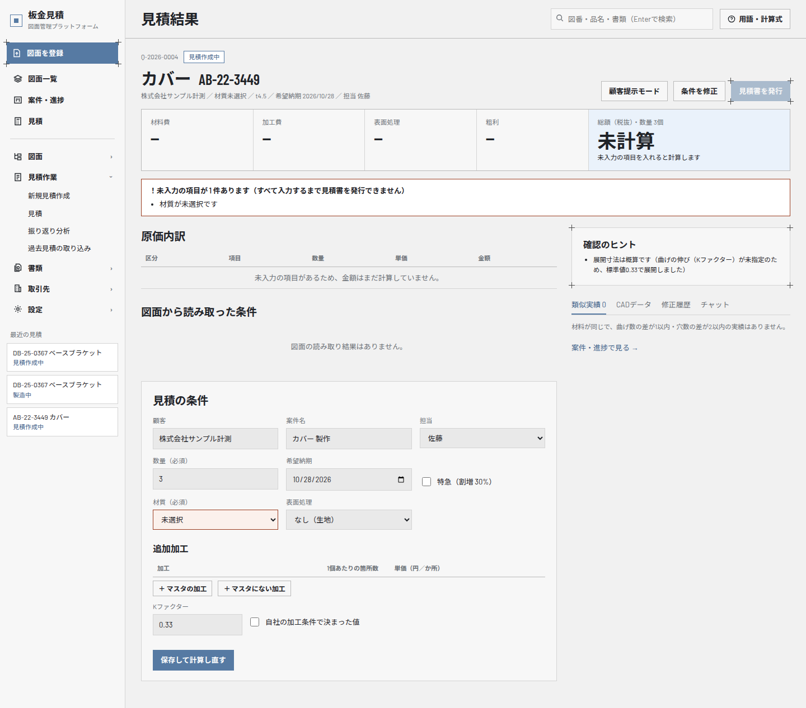{.medium}

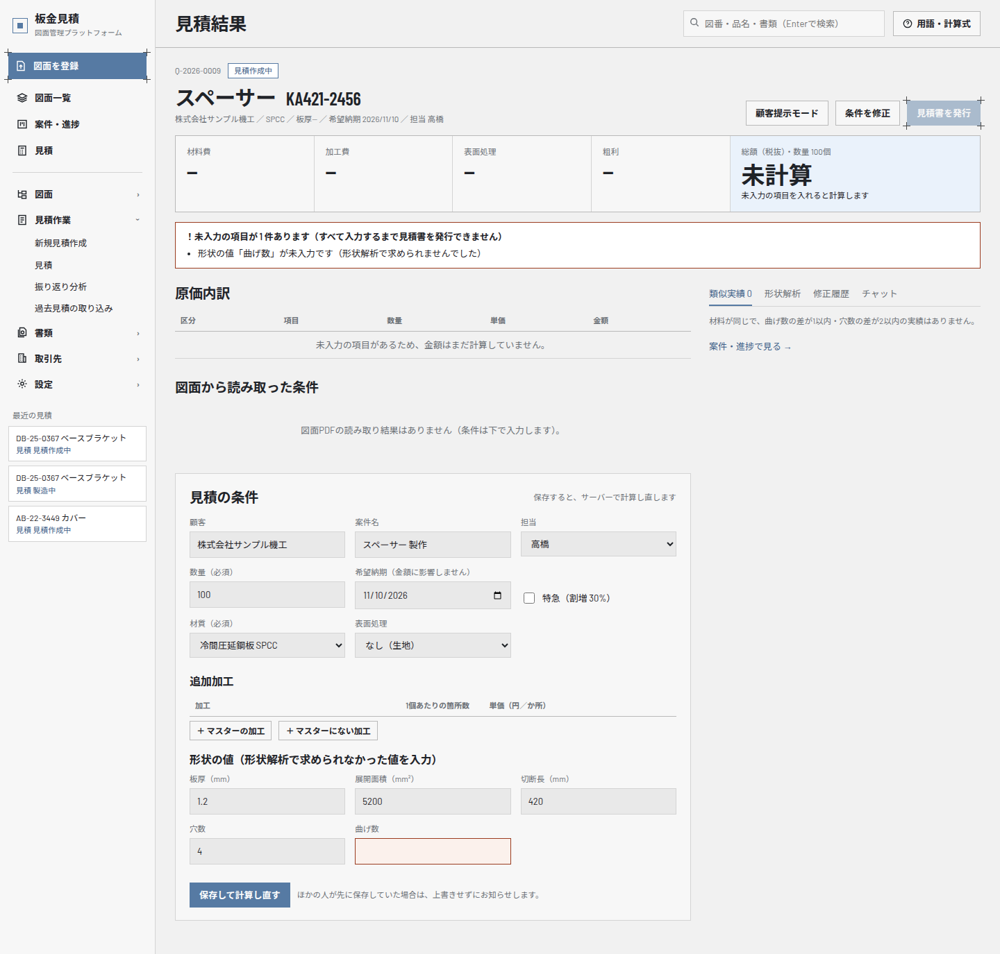{.medium}

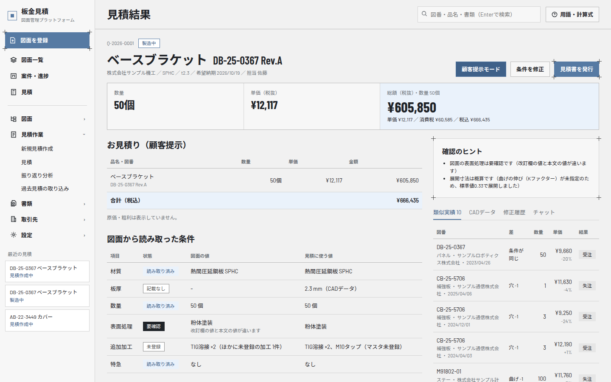{.medium}

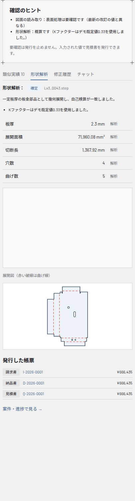{.small}

モックの管理費・利益・外注費・金型費の分離、出典の「AI推定」「Web取得」、マスタ登録の提案、発行前の確認のチェック欄は出さない。

## 06 案件・進捗

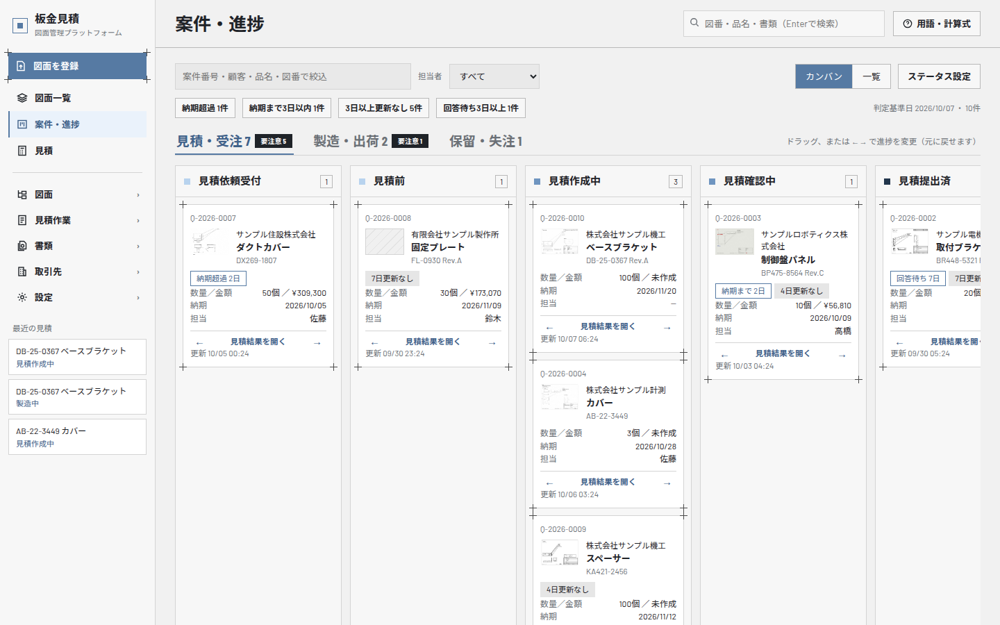

| 項目 | 説明 |
|---|---|
| 絞り込み | 案件番号・顧客・品名・図番の文字、担当者 |
| カンバン／一覧 | 切り替え。一覧ではステータスを選んで変えられる |
| 警告 | 納期超過、納期まで3日以内、3日以上更新なし、回答待ち3日以上（見積提出済のまま）。押すとその案件だけを出す。出荷済・完了・失注の案件には出さない。判定基準日は今日 |
| グループのタブ | 見積・受注／製造・出荷／保留・失注（案件ステータスの「表示グループ」）。件数と要注意の数 |
| カード | 案件番号、図面の縮小画、顧客・品名・図番、警告、数量／金額（未作成）、納期、担当、見積結果へのリンク、更新日時 |
| 進捗の変更 | カードをほかの列へドラッグするか、← → で前後のステータスへ。失注にするときは理由（価格・納期・仕様・加工不可・回答遅れ・その他）と他社価格を入れる |

見積書を発行すると「見積提出済」に進む。受注（と製造・出荷のグループ）にすると受注、失注にすると失注として、振り返り分析と類似実績に反映する。

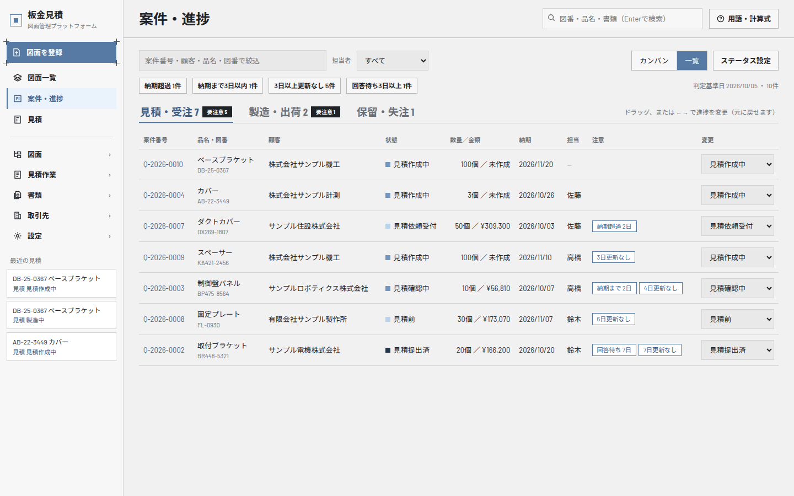{.medium}

## 07 図面一覧

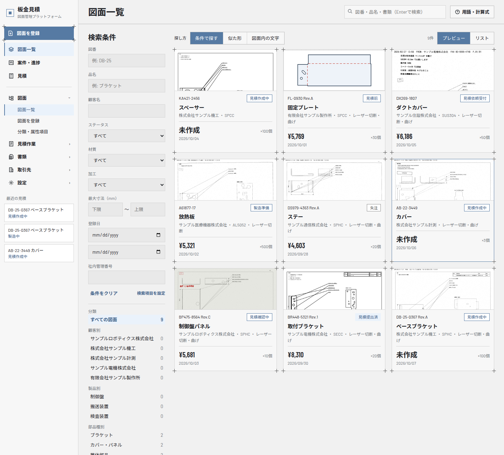

| 項目 | 説明 |
|---|---|
| 検索条件 | 図番・品名・顧客名・ステータス（最新の案件の状態。見積がなければ「未作成」）・材質・加工・最大寸法・登録日と、「分類・属性項目」で検索に使うとした自社の項目。並びは設定の順 |
| 分類 | すべての図面と、分類（顧客別・製品別・部品種別など）ごとの件数。押すと絞り込む |
| 探し方 | 条件で探す／似た形（基準の図面を選ぶと、材料が同じ・曲げ数の差1以内・穴数の差2以内の図面と過去見積を差の小さい順に出す。見積結果の類似実績と同じ結果）／図面内の文字（文字データのある図面PDFの全文） |
| プレビュー／リスト | カードは図面PDFの1ページ目（なければ展開図、それもなければ斜線）、図番と改訂、状態、品名、顧客・材質・加工、単価と数量、日付 |

## 08 図面詳細

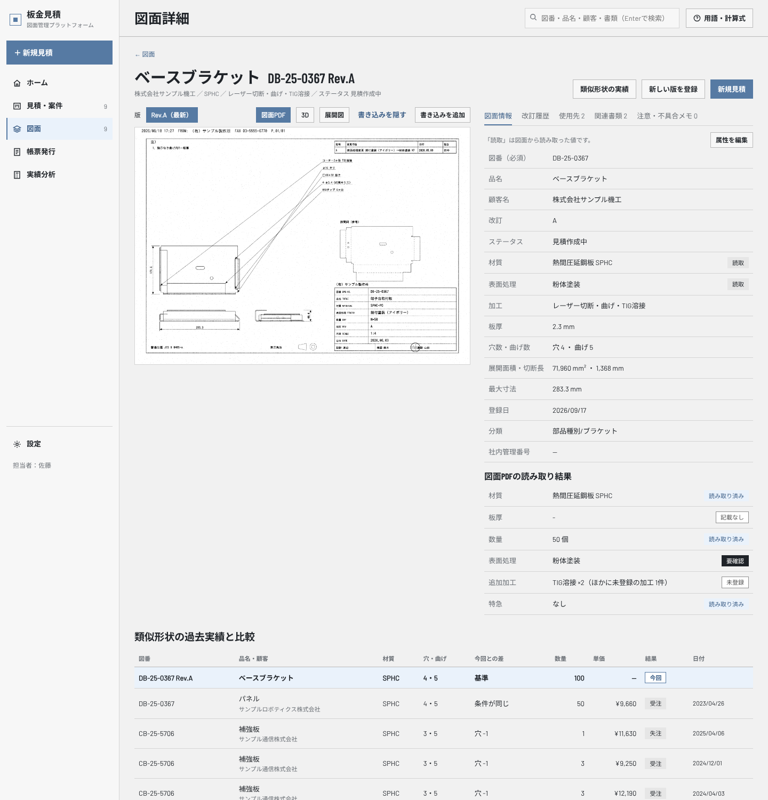

| 項目 | 説明 |
|---|---|
| ボタン | 似た図面を探す（下の表へ）、新しい版を登録（図面を登録へ）、この図面で見積を作成 |
| 版 | 版を切り替えて見る（最新の版に印） |
| プレビュー | 図面PDF・3D（STEP）・展開図を切り替える |
| 書き込み | 「書き込みを追加」を押して図面上をクリックし、文字を入れる（位置つきのメモ。版ごと）。「書き込みを隠す」で消して見る |
| 図面情報 | 図番・品名・顧客名・改訂・ステータス・材質・表面処理・加工・板厚・穴数と曲げ数・展開面積と切断長・最大寸法・登録日・分類、自社の属性項目。図面PDFから読み取った値に「読取」。「属性を編集」で直す。図面PDFの読み取り結果と状態も出す |
| 改訂履歴・使用先・関連書類・注意／不具合メモ | 版の一覧、この図面を使った見積、関連づけた書類、注意・不具合のメモ（追加できる） |
| 似た図面の過去実績と比べる | 今回の行（基準）と、類似の図面・過去見積（図番、品名・顧客、材質、穴・曲げ、今回との差、数量、単価、結果、日付） |

モックの「版の差分を比較」「共有」は出さない。

## 11 見積

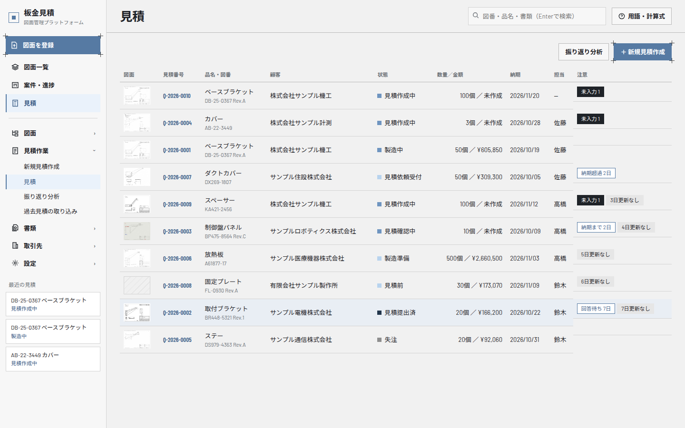

見積の一覧（図面の縮小画、見積番号、品名・図番、顧客、状態、数量／金額、納期、担当、注意＝未入力の数と警告）。行を押すと見積結果。「振り返り分析」「＋ 新規見積作成」。

## 12 分類・属性項目

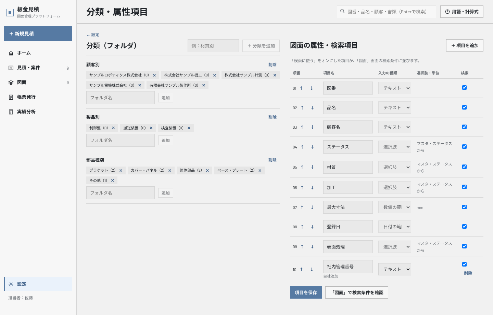

左は分類（フォルダ）：グループ（顧客別・製品別・部品種別など）の追加と、その中のフォルダの追加・削除。1つの図面を複数の分類に入れられる（図面詳細で）。右は図面の属性・検索項目：項目名、入力の種類（テキスト・選択肢・数値の範囲・日付の範囲）、選択肢・単位、検索に使うか、↑↓で並べ替え、自社の項目の追加・削除。標準の項目（図番・品名など）は消せない。モックの「登録時にAIが分類先を提案」は出さない。

## 13 書類・ナレッジ検索

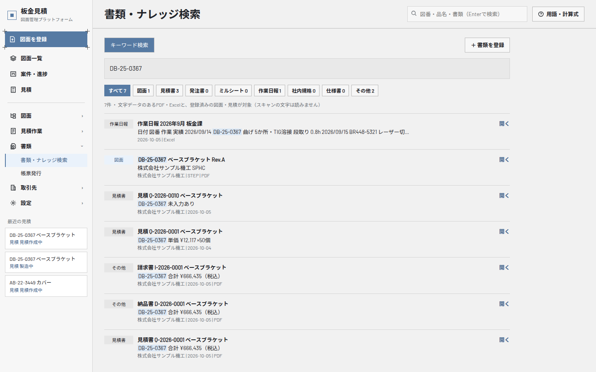

キーワード検索だけ（スペースで区切るとすべてを含むもの）。対象は、登録した書類（文字データのあるPDF・Excel）、登録済みの図面（図番・品名・顧客・図面内の文字）、見積と発行した帳票。種類（図面・見積書・発行書・ミルシート・作業日報・社内規格・仕様書・その他）で絞り込む。当たった文字に色を付け、「開く」で書類・図面・見積を開く。「＋ 書類を登録」で PDF・Excel（.xlsx）を、種類・顧客・関連する図面（複数）を指定して登録する。スキャンの文字は読まない。モックの「AIに質問」は出さない。

## 14 振り返り分析

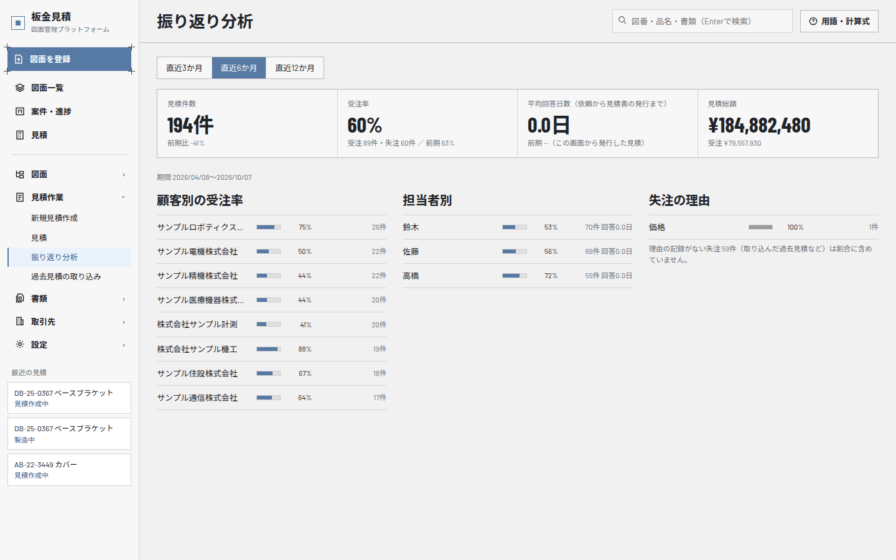

期間（直近3・6・12か月）を選ぶ。見積件数（前期比）、受注率（受注 ÷（受注＋失注）、前期。定義は「用語・計算式」に出す）、平均回答日数（案件の受付から見積書の発行まで。この画面から発行した見積だけ）、見積総額（うち受注）。顧客別の受注率、担当者別（受注率・件数・回答日数）、失注の理由（記録したものの割合。理由のない過去の失注の数は別に出す）。対象は過去見積の履歴と、この画面で発行した見積。

## 15 取引先管理

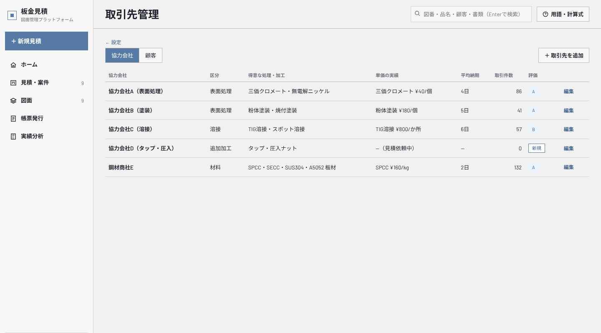{.medium}

協力会社と顧客の台帳（名前、区分、得意な処理・加工、単価の実績、平均納期、取引件数、評価、メモ）。追加と編集。記録と表示だけで、見積の計算には使わない。

## 16 帳票発行

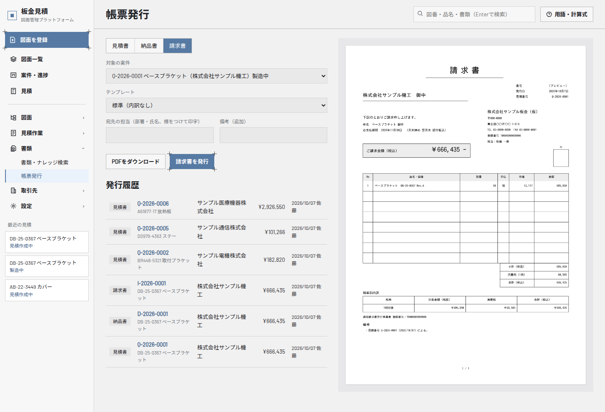

| 項目 | 説明 |
|---|---|
| 見積書／納品書／請求書 | 種類を選ぶ |
| 対象の案件・テンプレート | テンプレートは顧客に合うもの（なければ既定）が初期値 |
| 宛先の担当・備考 | 担当は「様」を付けて印字、備考は追加の1行 |
| プレビュー | 発行するPDFそのもの（番号は発行時に決まる）。原価・粗利は載らない |
| 発行・PDFをダウンロード | 発行すると番号を付けて保存し、発行履歴に出る。見積書の発行で案件は「見積提出済」になる |
| 発行できないとき | 見積書は未入力の項目があるとき、納品書・請求書は受注していないとき・見積書を発行していないとき。理由の一覧と「見積結果で入力する」へのリンクを出す。ボタンを押せないだけでなく、API も発行を拒否する |

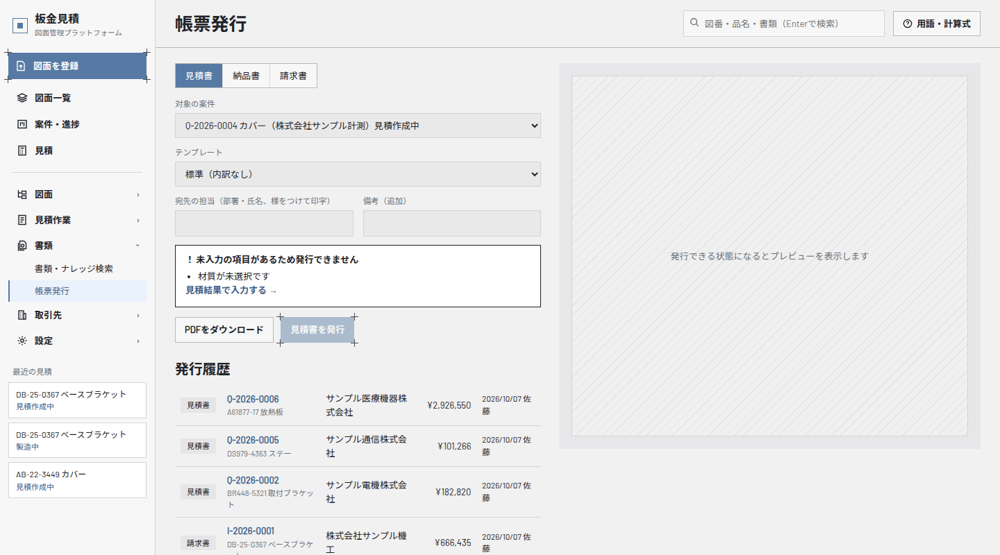{.medium}

## 17 マスタ

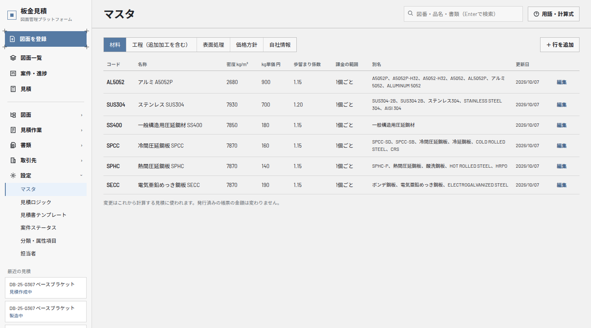

タブ：材料・工程（追加加工を含む）・表面処理・価格方針・自社情報。行の追加と編集、更新日。内部の値は言葉で表示・選択する（課金の範囲「1個ごと／1注文に1回」、計算のしかた「長さ（mm）あたり／穴あたり／曲げあたり／1式」など、単位「mm／穴／曲げ／か所／式／個」）。別名（表記ゆれ）は「、」区切りで表示・入力する。価格方針・自社情報はキー名を出さず項目名（粗利率・郵便番号など）で並べ、率は「25%」のように % で表示・入力する（保存は小数）。価格方針・自社情報には行を追加しない。数値と課金の範囲は保存時に確かめる。変更はこれから計算する見積に使われ、発行済みの帳票の金額は変わらない。初期値は `data/*.csv`（評価とテストは CSV を直接読むので、画面での変更は評価に影響しない）。モックの「加工チャージ」「金型費」「AI提案」は出さない。

## 18 見積ロジック

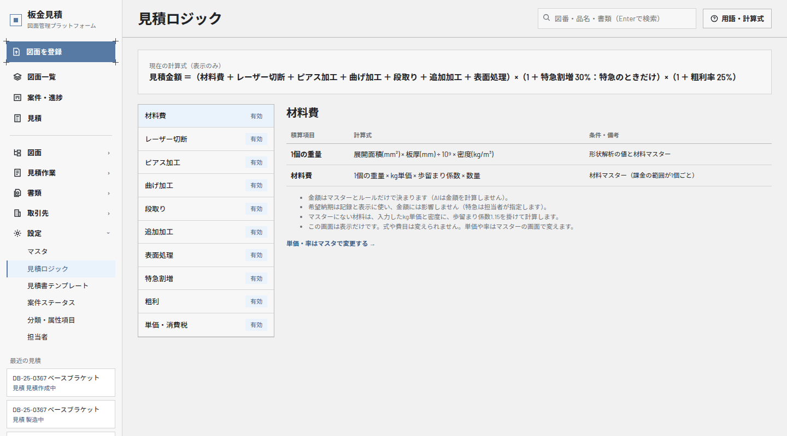

今の計算式を費目ごとに表示するだけ（材料費・レーザー切断・ピアス加工・曲げ加工・段取り・追加加工・表面処理・特急割増・粗利・単価と消費税）。率は今の価格方針の値。式や費目を画面で変える機能はない（マスターデータの解説の「計算の順番」と同じ）。

## 19 見積書テンプレート

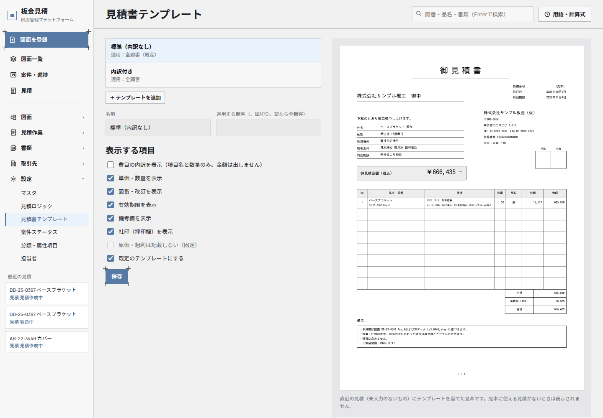

テンプレートの一覧（適用する顧客）、名前と適用する顧客、表示する項目（費目の内訳＝項目名と数量だけ／単価・数量／図番・改訂／有効期限／備考欄／社印）、既定にする。原価・粗利は記載しない（固定）。右は直近の見積（未入力のないもの）に当てたプレビュー。「Excel書式を取り込む」は出さない。

## 20 案件ステータス

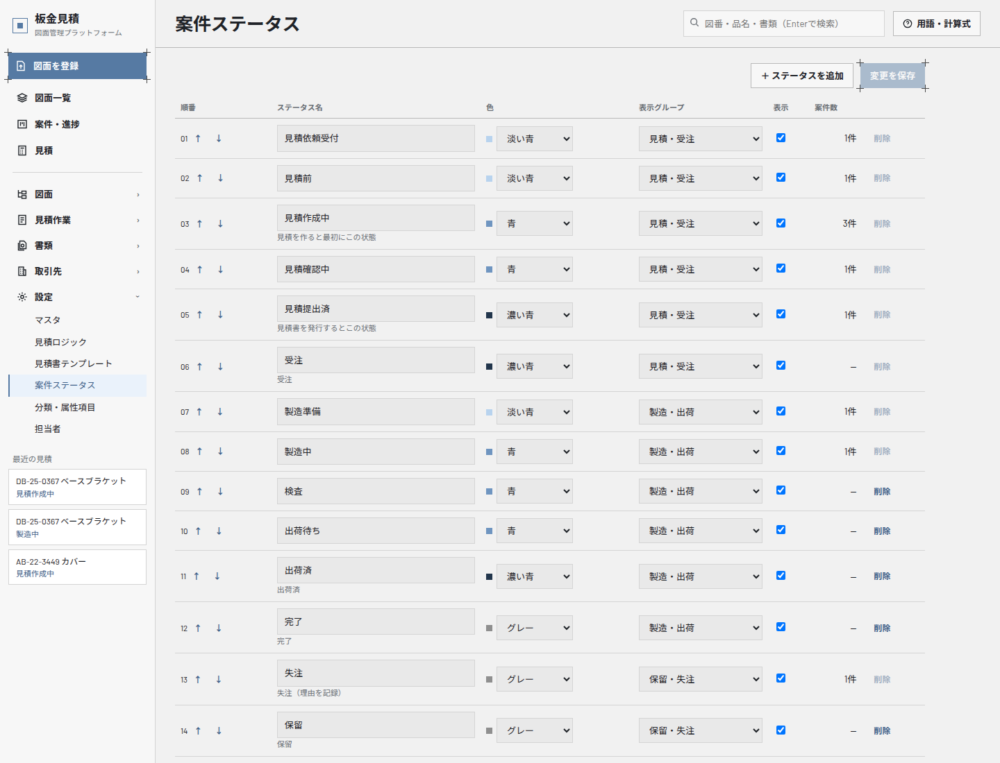

ステータスの名前・順番（↑↓）・色（淡い青・青・濃い青・グレー）・表示グループ・表示するか、案件数、追加と削除。初期値はモックの14個（見積依頼受付・見積前・見積作成中・見積確認中・見積提出済・受注／製造準備・製造中・検査・出荷待ち・出荷済・完了／失注・保留）。名前を変えても過去の履歴は当時の名前で残る。案件のあるステータスと、見積の作成・発行・受注・失注に使うステータスは削除できない。

## 担当者

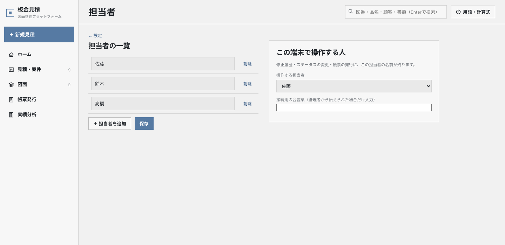{.medium}

担当者の一覧（追加・名前の変更・削除。消した担当者の過去の案件は名前のまま残る）。「この端末で操作する担当者」（ブラウザに保存）と、接続用の合言葉（API に合言葉を設定しているときだけ入力）。

## 過去見積の取り込み

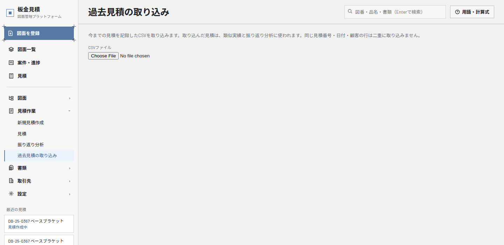{.medium}

Excel などから書き出した CSV（UTF-8 か Shift_JIS）を選ぶと、列名から項目（見積番号・見積日・顧客名・図番・品名・材質・板厚・数量・表面処理・追加加工・単価・結果・担当者・寸法の数値など）を自動で対応づけて表示する（1行目の値つき）。違うところを直して「取り込む」。読み込み・追加・既にありの件数と、取り込めなかった行の理由を出す。見積日と顧客名は必須。

## API の仕様書（開発者向け）

API を起動し、ブラウザで `http://localhost:8000/docs` を開くと、機能の一覧と入出力の形が見られる。

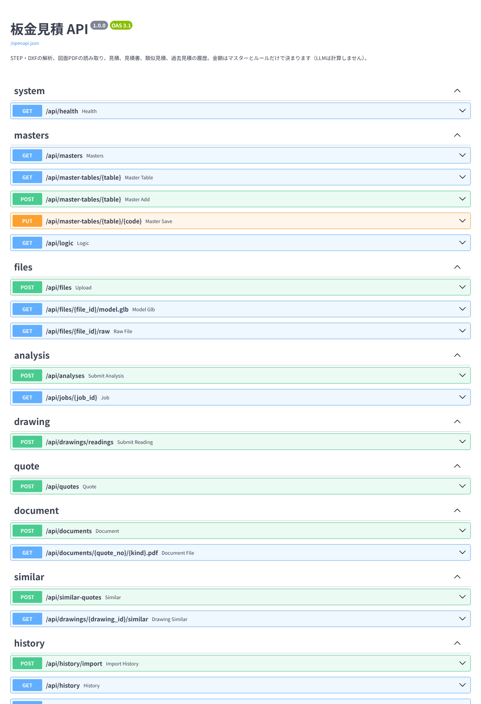{.medium}

## 帳票の見本

### 御見積書（帳票発行から発行したもの）

発行した時点で条件を確定として扱うため、「概算御見積書」は出ない。番号は案件番号（`Q-2026-0001`）。

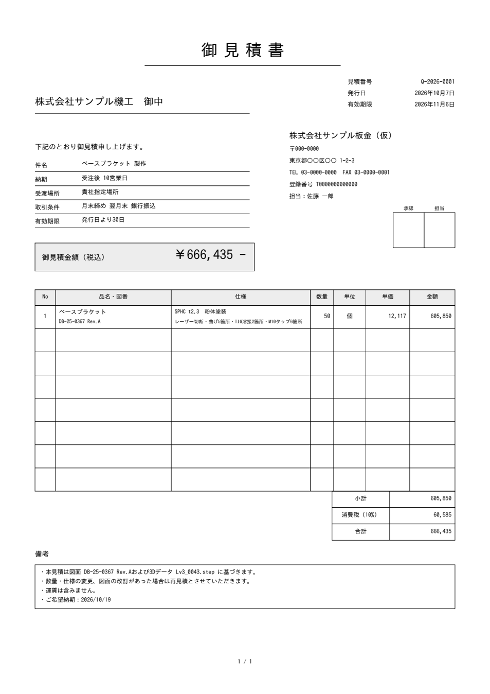{.medium}

### 納品書・請求書

受注した案件で、発行した見積書と同じ金額で作る。請求書は適格請求書として、自社の登録番号と税率別の合計（10%対象の金額・消費税・合計）を入れ、支払期限（翌月末）と支払条件を書く。

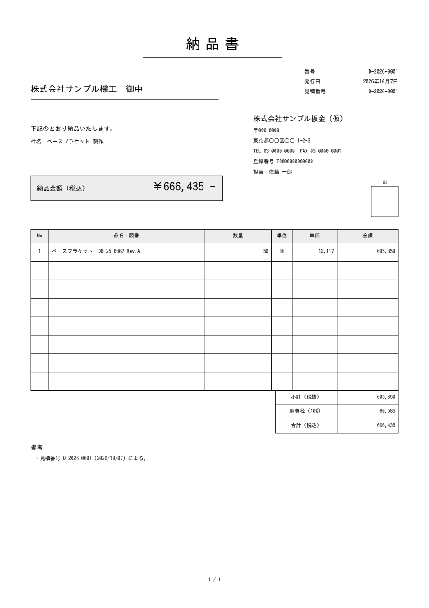{.medium}

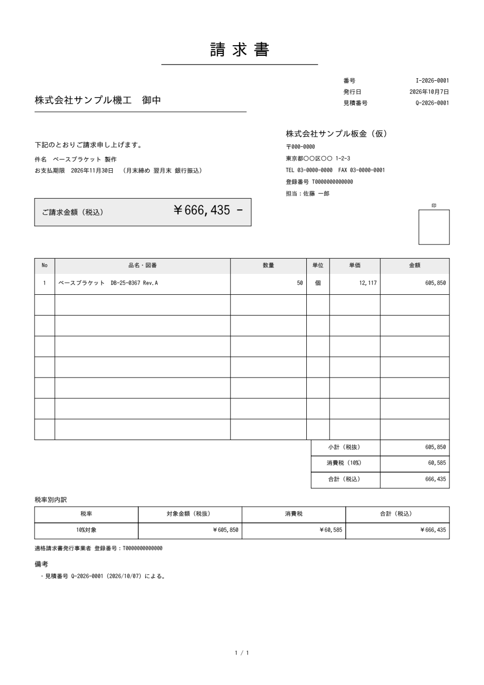{.medium}

### API だけで作る見積書

`POST /api/documents` で作る見積書（番号 `Q＋発行日＋-＋連番3桁`）。マスター未登録の追加加工は金額に入れず、備考に「別途見積」と書く。社内用の見積根拠（社外秘）も出せる。

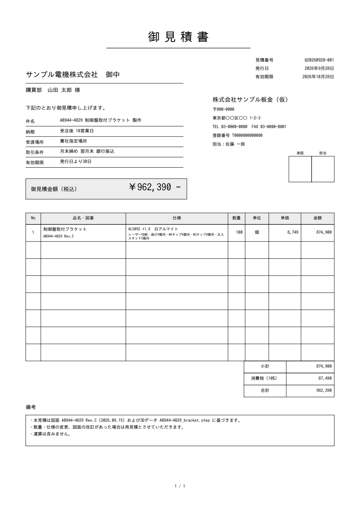{.medium}

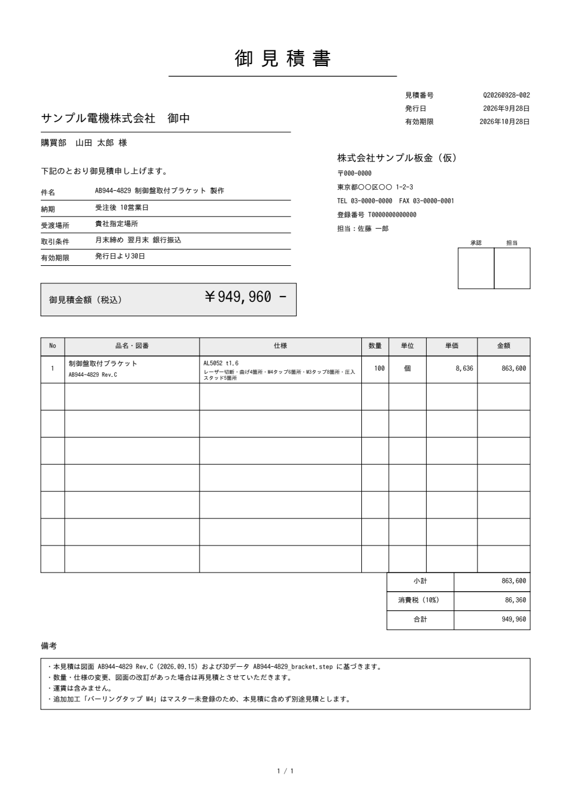{.medium}

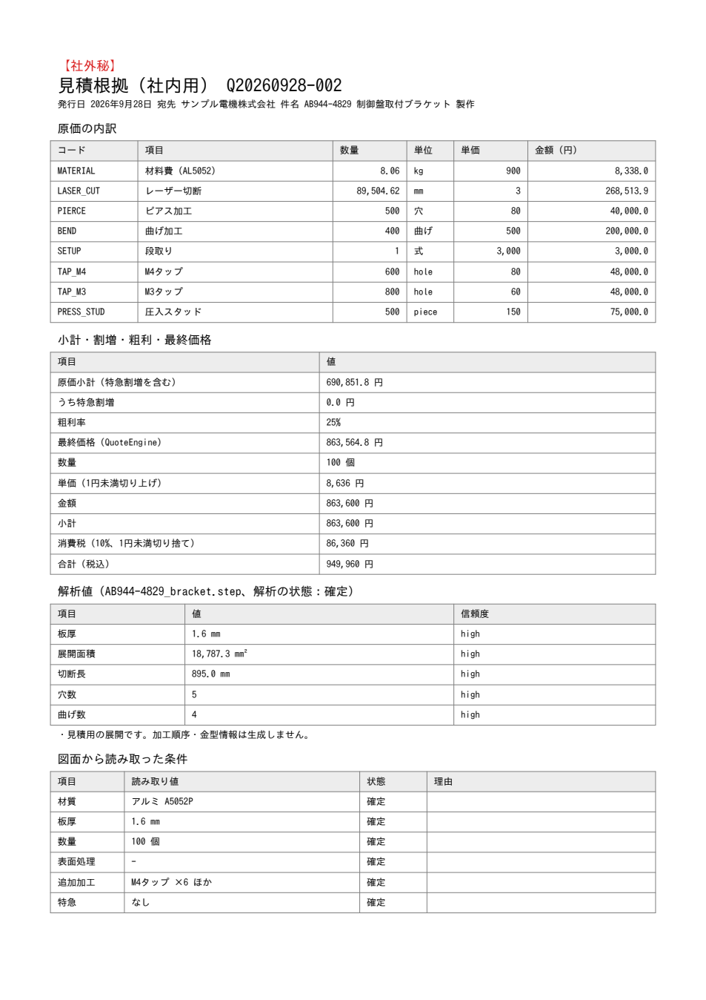{.medium}

### 記載項目（見積書）

| 区分 | 項目 | 説明 |
|---|---|---|
| 見出し | タイトル | 「御見積書」 |
| | 見積番号・発行日・有効期限 | 有効期限は発行日＋30日（テンプレートで出さないこともできる） |
| 宛先 | 会社名（御中）、部署・担当者名（様） | 案件の顧客、帳票発行で入れた担当 |
| 自社 | 会社名・郵便番号・住所・TEL・FAX・登録番号・担当者、押印欄（承認・担当） | マスタの自社情報から。押印欄はテンプレートの「社印」 |
| 取引条件 | 件名・納期・受渡場所・取引条件・有効期限 | 件名は案件名。納期は「受注後 10営業日」（特急は5営業日） |
| 明細 | No・品名と図番（改訂）・仕様（2行）・数量・単位・単価・金額 | テンプレートで、図番・単価と数量を出さない／費目の内訳（項目名と数量だけ）を足すことができる |
| 合計 | 小計・消費税（10%）・合計 | 画面・API の金額と同じ |
| 備考 | 見積の根拠（図番・改訂・ファイル名）、定型文、ご希望納期、特急、図面の注記（検査成績書など）、追加の備考 | テンプレートで備考欄を出さないこともできる |

社外用の帳票には、原価の内訳と粗利を出さない。
