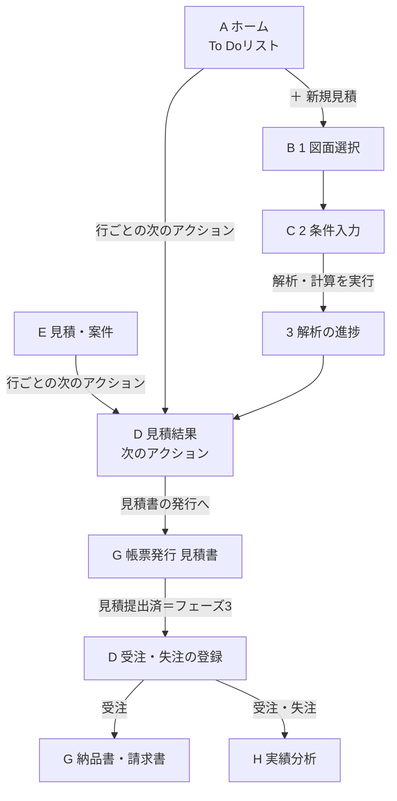
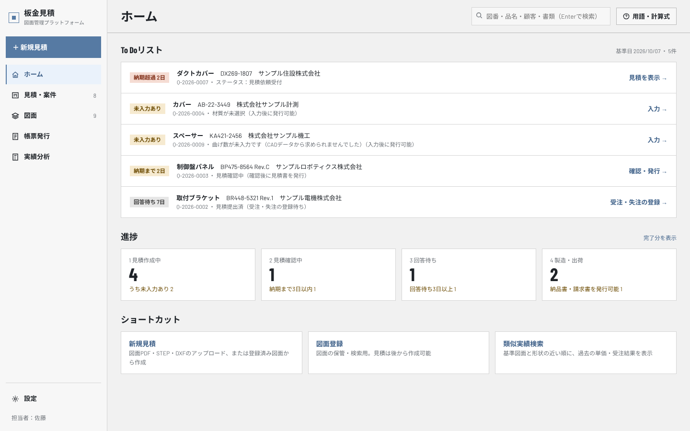
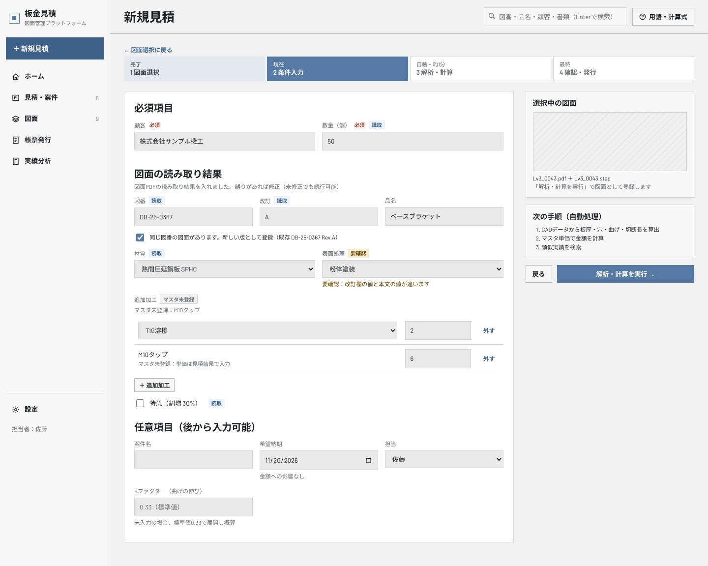
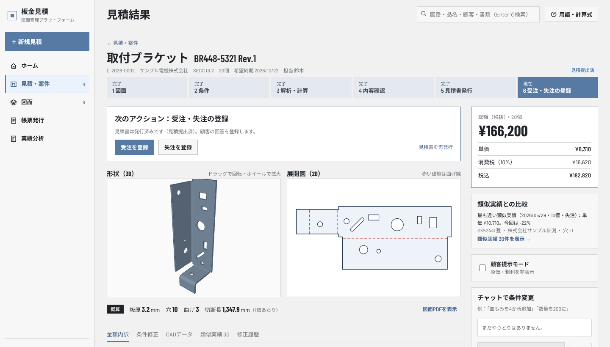
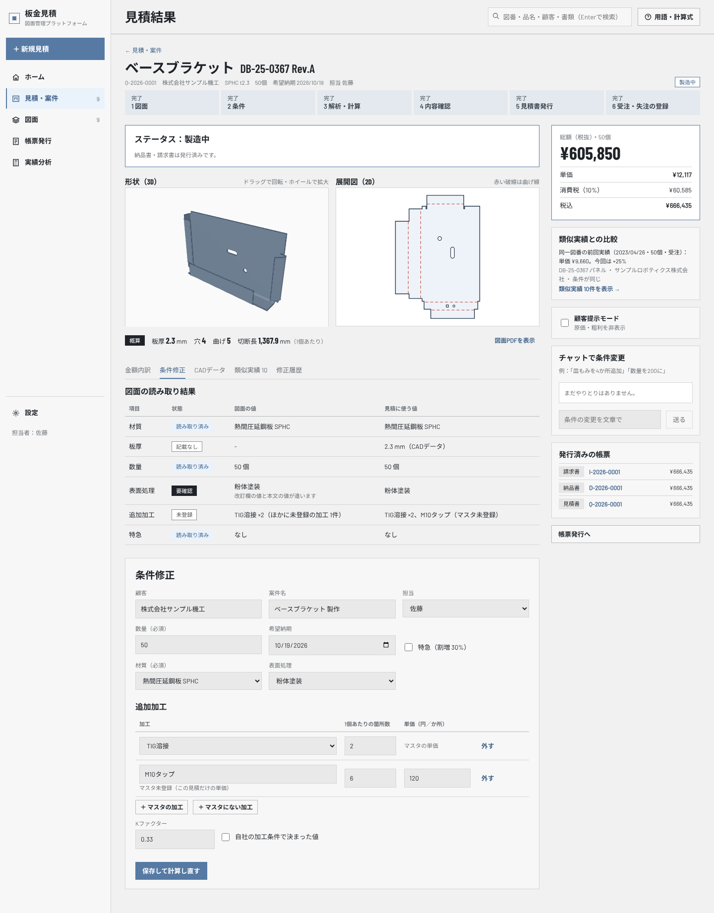
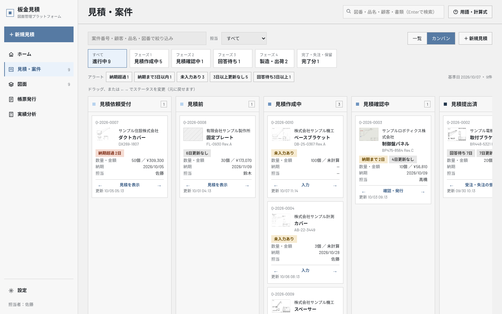
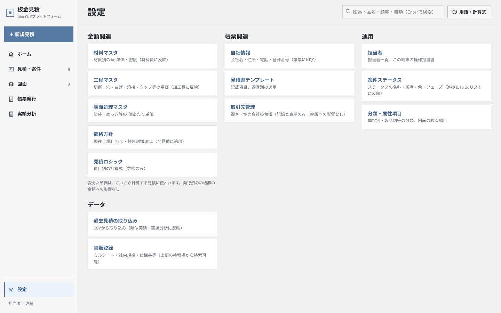

# 画面設計書
<!-- meta {"version": "2.1", "date": "2026-10-07", "audience": "全員（担当者・経営者・開発者）", "id": "DOC-03"} -->

## この資料について

ブラウザで使う画面（React）について、画面ごとに **何が表示され、何を入力し、操作すると何が起きるか** をまとめる。見た目（色・書体・表の形）は UIモック「図面管理プラットフォーム UIモック」（2026-10-01、`analysis/ui_mock.pdf`）に、画面の構成と並びは画面案「板金見積 UI改善案」（2026-10-07）に合わせ、中身は板金の見積（今のCADデータの解析と金額の計算）に合わせてある。

2026-10-07 の改修で、初めて使う見積担当者が「いま何をすればよいか」「この案件はどこまで進んでいるか」を、画面を開いてすぐ読み取れるように作り直した。

- メニューを「ホーム／見積・案件／図面／帳票発行／実績分析」と「設定」に整理し、どの項目も1回だけ出す。主ボタンは「＋ 新規見積」
- 最初に開く画面を **ホーム**（To Doリストと進捗）にした
- 「図面を登録」と「新規見積作成」を **新規見積**（4ステップ）に一本化した。図面だけの登録は「図面登録」に残す
- **見積結果** の先頭に「次のアクション」を置き、形状（3D・展開図）を常に表示し、詳細はタブに分け、総額を右に固定した
- 「見積」と「案件・進捗」を **見積・案件** に統合し、14のステータスを4つのフェーズ（と完了分）にまとめた
- 設定の各画面への入口を **設定** の1ページにまとめた

画面の写真は、お試しデータ（`scripts/seed_demo.py`。架空の顧客、開発用の図面と形状、記録済みの図面の読み取り結果）で、実際に画面を動かして撮影したものである。

作り方（プログラム）は書かない。処理の中身は「設計書」、操作の手順は「操作マニュアル」を見る。

## 共通の作り

- **左のメニュー**：「＋ 新規見積」（主ボタン）、ホーム、見積・案件（進行中の件数）、図面（登録図面の件数）、帳票発行、実績分析。下に「設定」と、この端末で操作する担当者（「担当者：佐藤」。押すと担当者の設定）。どの項目も1回だけ出す。モックにあった利用者の表示・ログアウト、改修前の「最近の見積」のカードは出さない（ホームの To Doリストが役割を引き継ぐ）
- **上の帯**：画面名、検索欄（図番・品名・顧客・書類。Enter で検索の画面を開く）、「用語・計算式」（用語の説明と、見積ロジックへのリンクを右から開く）
- **見た目**：地は薄いグレー、強調は落ち着いた青、見出しは太めの詰まった書体（Barlow Condensed と Noto Sans JP）、数字は大きく。ステータスは枠つきの小さなラベル。To Doの理由は色の付いたラベル（納期超過は赤み、未入力あり・納期が近いは黄み、回答待ちはグレー）。表は横罫だけ。プレビューのない場所は斜線の地。改修前の枠の四隅の「＋」の印は外した（強調したい場所が埋もれるため）
- **手順の帯**：新規見積は「1 図面選択 → 2 条件入力 → 3 解析・計算 → 4 確認・発行」、見積結果は「1 図面 → 2 条件 → 3 解析・計算 → 4 内容確認 → 5 見積書発行 → 6 受注・失注の登録」を上に常に出し、完了・現在・次を色で示す
- **金額と判定**：画面は API だけを呼ぶ。金額・未入力の項目・発行できるか・類似かどうか・To Doリストに載せるか・フェーズ・次のアクション・手順の現在地は、すべて API が決めた値を表示する（画面で計算し直さない）
- **同時に使ったとき**：見積・案件・図面・取引先・マスタの保存は、開いたときの版を一緒に送る。ほかの人が先に保存していたら上書きせず「ほかの人が先に変更しました。最新の内容を表示します。」と出す（見積結果では最新の内容を自動で読み直す）
- **表示の言葉**：業務で使う簡潔な言葉にそろえる（To Doリスト・進捗・新規見積・次のアクション・検索・絞り込み・条件入力・条件修正・類似実績・類似形状・ステータス・実績分析）。説明文は「発行可能」「金額への影響なし」のように短く言い切る。使う人に関係のない仕組みの話（サーバー、自己検算、AIの使い方、設定の変数名など）は画面に出さない。解析器・読み取り器のメッセージは `src/services/platform/wording.py` で使う人の言葉に言い換える（解析結果そのものは変えない）
- **だれが操作したか**：ログインはまだない。「設定 ＞ 担当者」で選んだ「この端末で操作する担当者」が、修正履歴・ステータスの変更・帳票の発行に記録される
- **古いURL**：まとめた画面の古いURLは新しい画面に移る（`/estimates` → 見積・案件、`/partners` → 設定の取引先管理）。`/drawings/register`（図面登録）と `/estimates/new?drawing=…`（その図面で新規見積）はそのまま使える

## 画面の一覧と移り変わり

| 画面案 | 画面 | 役割 |
|---|---|---|
| A | ホーム | To Doリスト（理由・次のアクションつき）、フェーズごとの進捗、ショートカット |
| B・C | 新規見積 | 1 図面選択（新しいファイルか登録済みの図面）→ 2 条件入力（図面の読み取り結果を自動入力） |
| — | 解析の進捗 | 3 解析・計算。CADデータの解析 → 図面の読み取り → マスタ照合 → 見積計算 → 類似実績の検索 |
| D | 見積結果 | 次のアクション、形状（3D・展開図）、タブ（金額内訳・条件修正・CADデータ・類似実績・修正履歴）、総額、類似実績との比較、顧客提示モード、チャット |
| E | 見積・案件 | 見積と案件の一覧（初期表示）とカンバン、フェーズ・アラートでの絞り込み、ステータスの変更、失注の記録 |
| F | 図面 | 条件検索・類似形状検索・図面内文字検索、サムネイル／リスト |
| — | 図面詳細 | プレビュー、版、図面情報・改訂履歴・使用先・関連書類・メモ、書き込み、類似形状の過去実績 |
| — | 図面登録 | 図面だけを登録する（複数をまとめて。見積は後から） |
| G | 帳票発行 | 1 対象案件 → 2 帳票の種類（発行の可否と理由）→ 3 宛先・テンプレート、発行プレビュー、発行履歴 |
| H | 実績分析 | 件数・受注率・回答日数・総額、顧客別・失注理由・担当者別、過去見積の取り込みへの入口 |
| I | 設定 | 設定の各画面への入口（金額関連／帳票関連／運用／データ） |
| — | 設定の各画面 | マスタ、見積ロジック、見積書テンプレート、取引先管理、担当者、案件ステータス、分類・属性項目、過去見積の取り込み、書類登録 |
| — | 検索 | 上の帯の検索欄から。図面・見積・帳票・書類のキーワード検索 |

### フェーズ

案件のステータスは、利用者が「設定 ＞ 案件ステータス」で名前を変えたり追加したりできる。そこで、どのフェーズに属するかを **ステータスの属性** として持つ（画面にステータス名を書き込まない）。改修前の「表示グループ」（見積・受注／製造・出荷／保留・失注）はフェーズに置き換えた（既存のデータベースは、ステータスの役割・名前・表示グループからフェーズを決めて移す）。

| フェーズ | 含めるステータス（初期値） | ホームの「注意」 |
|---|---|---|
| 1 見積作成中 | 見積依頼受付・見積前・見積作成中 | うち未入力あり |
| 2 見積確認中 | 見積確認中 | 納期まで3日以内（超過を含む） |
| 3 回答待ち | 見積提出済 | 回答待ち3日以上 |
| 4 製造・出荷 | 受注・製造準備・製造中・検査・出荷待ち | 納品書・請求書を発行可能 |
| 完了分 | 出荷済・完了・失注・保留 | — |

### To Doリストと次のアクション

To Doリストに載るのは、次の理由のどれかがある案件（急ぐ順：納期超過の日数が長い順 → 未入力あり → 納期が近い順 → 回答待ちが長い順）。判定は改修前の「案件・進捗」の警告と同じ基準（`src/services/platform/cases.py` の `warnings_of`）で、二重に作っていない。「3日以上更新なし」だけの案件は載せない（アラートの絞り込みには出る）。

| 理由のラベル | 条件 |
|---|---|
| 納期超過 ○日 | 希望納期を過ぎた（出荷済・完了・失注を除く） |
| 未入力あり | フェーズ1・2で、金額に必要な項目が入っていない |
| 納期まで ○日 | 希望納期まで3日以内 |
| 回答待ち ○日 | 見積提出済のまま3日以上 |

次のアクションは、案件ごとに API が決める。

| 案件の状態 | 次のアクション | 開く画面 |
|---|---|---|
| 解析・計算中 | 解析の進捗を表示 | 解析の進捗 |
| フェーズ1・2で未入力あり | 入力 | 見積結果の「条件修正」タブ |
| フェーズ2（見積確認中）で未入力なし | 確認・発行 | 見積結果 |
| フェーズ1で未入力なし（フェーズ2で見積書を発行済みのときも） | 見積を表示 | 見積結果 |
| フェーズ3（回答待ち） | 受注・失注の登録 | 見積結果の「次のアクション」 |
| フェーズ4で納品書・請求書が未発行 | 納品書の発行／請求書の発行 | 帳票発行 |
| 失注 | 再見積 | 新規見積（同じ図面） |
| それ以外 | 見積を表示 | 見積結果 |

## A ホーム

| 区画 | 内容 |
|---|---|
| To Doリスト | 対応が必要な案件を急ぐ順に並べる。行ごとに理由のラベル、品名・図番・顧客、案件番号と一言（「材質が未選択（入力後に発行可能）」「見積確認中（確認後に見積書を発行）」「見積提出済（受注・失注の登録待ち）」など）、次のアクションのリンク（見積を表示／入力／確認・発行／受注・失注の登録 など）。基準日は今日 |
| 進捗 | フェーズ1〜4ごとの件数と、そのうち注意が必要な件数（上の表）。押すと「見積・案件」をそのフェーズで絞り込んで開く。「完了分を表示」で完了分 |
| ショートカット | 新規見積、図面登録（見積は後から作成可能）、類似実績検索（図面の類似形状検索を開く） |

## B・C 新規見積

「図面を登録」と「新規見積作成」を一本化した。上に4ステップ「1 図面選択 → 2 条件入力 → 3 解析・計算 → 4 確認・発行」を常に出す。

### 1 図面選択

| 項目 | 説明 |
|---|---|
| 新規図面から作成 | 図面PDF・STEP（.step/.stp）・DXF をドラッグ＆ドロップ（「ファイルを選択」でもよい）。新規見積は1図面ずつ（図面PDF 1つ＋CADデータ 1つまで）で、片方だけでもよい。名前の違うPDFとCADデータを置くと確かめるよう出す。図面PDFを置くと、すぐに図面の読み取りを始める。この図面は「解析・計算を実行」のときに図面として登録する |
| 種類の説明 | STEP は寸法・穴・曲げを自動解析、DXF は板厚のみ次の手順で入力、PDFのみは寸法値を見積結果で入力 |
| 登録済み図面から選択 | 図番・品名・顧客で検索し、1件を選ぶ。行に図面の縮小画、品名・図番、顧客・材質、前回の見積のステータス（なければ「見積未作成」）。「全図面を表示」で図面の画面へ |
| 次へ：条件入力 | 図面を1件選ぶと押せる |

図面詳細・図面の画面の「新規見積」から開くと、その図面が選ばれた状態で 2 条件入力から始まる。

### 2 条件入力

入力欄を「必須項目／図面の読み取り結果／任意項目」に分ける。先に進むのに必須なのは **顧客と数量だけ**。ほかは空欄のまま解析に進め、足りないものは見積結果で入力する。

| 区画 | 項目 | 説明 |
|---|---|---|
| 必須項目 | 顧客・数量（個） | 顧客は人が入力する（登録済みの図面なら図面の顧客が初期値で「図面情報」の印）。数量は図面から読み取れれば自動入力（「読取」の印） |
| 図面の読み取り結果 | 図番・改訂・品名 | 新しい図面では、図番・改訂を読み取り結果から入れる（読み取れなければ図番はファイル名）。品名は人が入力する。同じ図番の図面がすでにあれば「新しい版として登録」が選ばれる。登録済みの図面では表示だけ |
| | 材質・表面処理 | マスタにある値は自動入力（「読取」）。要確認なら自動入力したうえで「要確認」と理由（「改訂欄の値と本文の値が違います」など）。マスタにない語は空欄にして「マスタ未登録：○○」、図面に書かれていなければ空欄にして「記載なし」と出す（推測では埋めない）。表面処理の記載なしは「なし」として計算する |
| | 追加加工 | マスタにある加工は加工名と1個あたりの箇所数を自動入力。マスタにない加工（「M10タップ」など）は名前と箇所数を入れ、「マスタ未登録：単価は見積結果で入力」。行の追加・削除ができる |
| | 特急 | 読み取った値（あり／なし）を入れる |
| 任意項目 | 案件名・希望納期・担当 | 希望納期は金額に影響しない。担当は「設定 ＞ 担当者」の一覧から |
| | Kファクター（曲げの伸び） | STEP のとき。入力すると自社の加工条件で決まった値として扱う。未入力なら標準値0.33で展開し、曲げのある部品は概算になる（発行は止めない） |
| | 板厚・曲げなし（平板） | DXF のときだけ（展開図には板厚がないため）。図面から読み取れた板厚があれば初期値 |
| 右側 | 選択中の図面・次の手順 | 図面の縮小画とファイル名、自動で行う処理（CADデータから板厚・穴・曲げ・切断長を算出、マスタ単価で金額を計算、類似実績を検索） |
| | 解析・計算を実行 | 新しいファイルなら図面として登録（CADデータの解析を含む）してから、案件と見積を作り、解析の進捗へ |

**印の意味**：読取（図面PDFから読み取った値）、要確認（読み取ったが図面と見比べた方がよい）、図面情報（登録済みの図面の値）、マスタ未登録（図面に書かれているがマスタにない語）、記載なし（図面に書かれていない）。どの印の項目も直してよい。

板厚はこの画面の入力欄にしない（見積には CADデータの値を使う。図面と違えば見積結果で注意を出す）。モックの「マスタにない単価をWebから調べる」は出さない。

## 解析の進捗（3 解析・計算）

上に4ステップの帯（3 解析・計算が現在）、案件番号・顧客・数量・希望納期と、品名・図番。進捗の％、今の段階の名前、経過時間、5つの段階の帯。下の「解析・計算の結果（途中経過）」に、段階ごとの値（CADデータ：板厚・穴・曲げ・展開面積、図面の読み取り：項目数と要確認の数、マスタ照合：材質と未登録の数、金額（税抜）か未入力の数、類似実績の件数）を出す。終わると見積結果に移る。処理は API の受付番号方式で、画面は進捗を読むだけ。

## D 見積結果

上から次の順に並ぶ。

| 区画 | 内容 |
|---|---|
| 見出し | 「← 見積・案件」、品名・図番と改訂、案件番号・顧客・材質と板厚・数量・希望納期・担当、ステータスのラベル |
| 6ステップの現在地 | 図面 → 条件 → 解析・計算 → 内容確認 → 見積書発行 → 受注・失注の登録。現在地は API が決める（解析中は3、フェーズ1・2は4、回答待ちは6、受注・失注のあとはすべて完了） |
| 次のアクション | API が決めた次のアクションに合わせて出す（下の表）。確認事項・未入力の項目ごとに、直す場所へのリンク（押すとそのタブを開き、入力欄に移る） |
| 形状（3D）・展開図（2D） | 左右に並べて常に表示する（タブには入れない）。3D は STEP のとき（ドラッグで回転・ホイールで拡大）、展開図は解析で展開できたとき（外形・穴と、赤い破線の曲げ線）。ないときは斜線の地に「CADデータなし」などと出す。下に、確定／概算（解析不可・CADデータなし）のラベル、板厚・穴・曲げ・切断長（1個あたり）、「図面PDFを表示」。顧客提示モードでも表示する |
| タブ | 金額内訳／条件修正／CADデータ／類似実績（件数）／修正履歴 |
| 右側（固定） | 総額（税抜）と数量、単価・消費税・税込（未入力があれば「未計算」）。類似実績との比較、顧客提示モード、チャットで条件変更、発行済みの帳票、「帳票発行へ」 |

**次のアクションの枠**：

| 場合 | 表示 |
|---|---|
| 未入力の項目がある | 「次のアクション：未入力の項目 n件を入力」。項目ごとに「入力 →」。「見積書の発行へ」は押せない |
| 未入力なし（フェーズ1・2） | 「次のアクション：確認事項 n件を確認のうえ、見積書を発行」。確認事項（図面の読み取りの要確認、展開寸法が概算、板厚の食い違い、図面の注記）ごとに「○○を修正 →」。「いずれも未対応のまま発行可能。未入力項目なし」と「見積書の発行へ →」（帳票発行を見積書で開く） |
| 見積提出済（回答待ち） | 「次のアクション：受注・失注の登録」。「受注を登録」「失注を登録」（失注は理由と他社価格を入れる）、「見積書を再発行」 |
| 受注後 | 「次のアクション：納品書の発行」（発行後は請求書）と、帳票発行へのボタン |
| 完了・失注など | ステータスと、失注なら「再見積 →」 |

{.medium}

{.medium}

**タブの中身**：

| タブ | 内容 |
|---|---|
| 金額内訳 | 区分・項目・数量・単価・金額（材料費・レーザー切断・ピアス・曲げ・段取り・追加加工・表面処理・特急割増）、小計（原価合計）、粗利、合計（単価は1円未満切り上げ）、消費税（1円未満切り捨て）、合計（税込）。「計算式を表示」で見積ロジック |
| 条件修正 | 図面の読み取り結果（材質・板厚・数量・表面処理・追加加工・特急ごとに、状態＝読み取り済み・要確認・未登録・記載なし、図面の値、見積に使う値。板厚は CADデータの値を使い、図面と違えば注意を出す）と、条件の入力欄（顧客・案件名・担当・数量・希望納期・特急・材質・表面処理、マスタにない材質・表面処理の単価、追加加工＝マスタの加工とマスタにない加工の名前・箇所数・単価、寸法の値＝CADデータから求められなかったものだけ、Kファクター（STEP）・板厚と平板（DXF））。「保存して計算し直す」で API が計算し、修正履歴に残る |
| CADデータ | 確定／概算／解析不可と、概算・解析不可の理由、5つの値（板厚・展開面積・切断長・穴数・曲げ数。入力した値には「入力値」） |
| 類似実績 | 材料が同じ・曲げ数±1・穴数±2の図面と過去見積を、差の小さい順に（図番・差・数量・単価・今回との差・結果）。今回との差は API が計算する |
| 修正履歴 | いつ・だれが・何を・金額の前後 |

**未入力の項目**（これがあると見積書を発行できない。API も拒否する）：

| 場合 | 表示の例 | 埋め方 |
|---|---|---|
| 材質が選ばれていない | 材質が未選択です | 材質を選ぶ |
| マスタにない材料・加工・表面処理に単価がない | マスタにない加工「M10タップ」の単価（1か所あたり）が未入力です | 材料は kg単価と密度、加工は1か所あたり、表面処理は1個あたりの単価を入れる（その見積だけに使い、マスタには登録しない） |
| CADデータから値が求められない（解析不可・CADデータなし） | 曲げ数が未入力です（CADデータから求められませんでした） | 板厚・展開面積・切断長・穴数・曲げ数のうち足りないものを入れる |
| 数量がない | 数量が未入力です | 数量を入れる |

図面の読み取りが要確認、展開寸法が概算、表面処理・特急が「なし」のときは、そのまま発行できる。入力した単価・寸法の値は内訳に「手入力」などと表示しない。

{.medium}

{.medium}

{.medium}

**類似実績との比較**：今回の単価を、類似実績のうち単価のあるもの（同じ図番の前回実績があればそれ、なければ最も近いもの）と比べ、「同一図番の前回実績（日付・数量・結果）：単価 ¥x。今回は +y%」と出す。比較は API が行う。

**顧客提示モード**：右のチェックを入れると、原価・粗利を隠し、品名・図番・数量・単価・金額・合計（税込）だけを出す。次のアクション・確認事項・タブ・チャットも隠す。形状（3D・展開図）は出す。

{.medium}

モックの管理費・利益・外注費・金型費の分離、出典の「AI推定」「Web取得」、マスタ登録の提案、発行前の確認のチェック欄は出さない。

## E 見積・案件

改修前の「見積」（見積の一覧）と「案件・進捗」（カンバン）を1つの画面にまとめた。

| 項目 | 説明 |
|---|---|
| 絞り込み | 案件番号・顧客・品名・図番の文字、担当 |
| 一覧／カンバン | 切り替え。初期表示は一覧 |
| フェーズ | すべて（進行中＝完了分を除く）、フェーズ1〜4、完了分。件数つき。ホームの進捗から開くと、そのフェーズで絞り込んだ状態になる |
| アラート | 納期超過、納期まで3日以内、未入力あり、3日以上更新なし、回答待ち3日以上。押すとその案件だけを出す。判定基準日は今日 |
| 一覧 | 品名・図番と案件番号、顧客、ステータス（回答待ち・更新なしの日数）、数量・金額（未入力なら「未入力：材質」など）、納期（超過・残りの日数）、担当、次のアクション、ステータス変更（選んで変える）。並びは優先度の高い順（To Doの理由がある案件が先） |
| カンバン | 選んだフェーズのステータスを列にする（進行中なら完了分以外のすべて）。カードは案件番号、図面の縮小画、顧客・品名・図番、理由のラベル、数量・金額、納期、担当、次のアクション、更新日時。ほかの列へドラッグするか ← → で前後のステータスへ |
| 失注 | 失注のステータスに変えるときは、理由（価格・納期・仕様・加工不可・回答遅れ・その他）と他社価格を入れる |

見積書を発行すると「見積提出済」（フェーズ3）に進む。受注（とフェーズ4のステータス）にすると受注、失注にすると失注として、実績分析と類似実績に反映する。

## F 図面

| 項目 | 説明 |
|---|---|
| 図面登録 | 図面だけを登録する画面へ（見積は後から） |
| 検索方法 | 3つの探し方に一言ずつ説明を付ける。**条件検索**（図番・品名・顧客・材質など）、**類似形状検索**（基準図面を選択し、材料が同じ・曲げ数の差1以内・穴数の差2以内の図面と過去見積を差の小さい順に表示。見積結果の類似実績と同じ結果）、**図面内文字検索**（注記・加工指示のキーワード。文字データのある図面PDFが対象） |
| 検索条件 | 主要なもの（図番・品名、顧客、材質、分類）を1行に出し、残り（ステータス・加工・最大寸法・登録日と、「分類・属性項目」で検索に使うとした自社の項目）は「条件を追加」で開く。「条件をクリア」 |
| サムネイル／リスト | カードは図面PDFの1ページ目（なければ展開図、それもなければ斜線）、図番と改訂、ステータス（見積がなければ「見積未作成」）、品名、顧客・材質・加工、単価と数量。カードごとに「見積を表示 →」（見積がなければ「新規見積 →」）と「図面を表示」 |

## 図面詳細

| 項目 | 説明 |
|---|---|
| ボタン | 類似形状の実績（下の表へ）、新しい版を登録（図面登録へ）、新規見積（この図面で新規見積の 2 条件入力へ） |
| 版 | 版を切り替えて見る（最新の版に印） |
| プレビュー | 図面PDF・3D（STEP）・展開図を切り替える |
| 書き込み | 「書き込みを追加」を押して図面上をクリックし、文字を入れる（位置つきのメモ。版ごと）。「書き込みを隠す」で消して見る |
| 図面情報 | 図番・品名・顧客名・改訂・ステータス・材質・表面処理・加工・板厚・穴数と曲げ数・展開面積と切断長・最大寸法・登録日・分類、自社の属性項目。図面PDFから読み取った値に「読取」。「属性を編集」で直す。図面PDFの読み取り結果と状態も出す |
| 改訂履歴・使用先・関連書類・注意／不具合メモ | 版の一覧、この図面を使った見積、関連づけた書類、注意・不具合のメモ（追加できる） |
| 類似形状の過去実績と比較 | 今回の行（基準）と、類似の図面・過去見積（図番、品名・顧客、材質、穴・曲げ、今回との差、数量、単価、結果、日付） |

モックの「版の差分を比較」「共有」は出さない。

## 図面登録

図面だけを登録する道（見積は作らない）。ホームのショートカットと図面の画面から開く。複数の図面をまとめて登録できる。

| 項目 | 説明 |
|---|---|
| ドラッグ＆ドロップ欄 | 図面PDF・STEP（.step/.stp）・DXF をまとめて置く（「ファイルを選択」でもよい）。それ以外の種類は除いて知らせる。DWG・IGES・写真・Excel は取り込まない |
| 登録内容の確認表 | 1行が1件の図面。名前（拡張子を除く）が同じ図面PDFとCADデータは1行にまとめる。片方だけでもよい |
| 図番（必須）・品名・顧客・改訂・分類 | 人が入力する。図面PDFがあれば、今の読み取り器で図番・改訂・材質を下書きとして入れる（「読み取り結果を下書きに入れました」）。読み取りが使えない環境では手で入れる |
| 材質・板厚 | 材質は図面の値が下書き。DXF の行には板厚の欄が出る（入れないと見積のときに解析） |
| 登録のしかた | 同じ図番がすでにあれば「新しい版として登録」にチェックが付く（外すと別の図面として登録）。なければ「新規の図面」 |
| 確認済み n 件を登録 | 図番のある行を登録する。CADデータは登録と同時に解析し、板厚・展開面積・切断長・穴数・曲げ数・最大寸法を図面の属性として持つ。登録後、行ごとに「新規見積 →」 |

モックの「AIの仕分け結果」（種類の判定、複数ページの分割、組図・関連書類のひも付け）は作らない。

## G 帳票発行

| 項目 | 説明 |
|---|---|
| 1 対象案件 | 案件（案件番号・品名・顧客・ステータス）を選ぶ。見積結果から開くと選ばれた状態 |
| 2 帳票の種類 | 見積書・納品書・請求書。種類ごとに「発行可能」か「発行不可：（理由）」と、発行済みの番号を出す（発行の可否は API が決める）。選んだ種類が発行できないときは理由の一覧と「見積結果を開く →」 |
| 3 宛先・テンプレート | 宛先担当者（「様」は自動付与）、テンプレート（顧客に合うもの、なければ既定が初期値）、備考（1行） |
| 発行プレビュー | 発行するPDFそのもの（番号は発行時に決まる）。原価・粗利は記載されない |
| 合計（税込）・発行 | 「○○を発行」で番号を採番し、PDFを保存して発行履歴に出す。見積書の発行で案件は「見積提出済」になる。「発行済みのPDFをダウンロード」 |
| 発行履歴 | 種類・番号・品名・顧客・合計・発行日と発行者、「PDFを開く」 |
| 発行できないとき | 見積書は未入力の項目があるとき、納品書・請求書は受注していないとき・見積書を発行していないとき。ボタンを押せないだけでなく、API も発行を拒否する |

{.medium}

## H 実績分析

改修前の「振り返り分析」の内容をそのまま保ち、名前を変えた。期間（直近3・6・12か月）を選ぶ。見積件数（前期比）、受注率（受注 ÷（受注＋失注）、前期）、平均回答日数（案件の受付から見積書の発行まで。この画面から発行した見積だけ）、見積総額（うち受注）。顧客別の受注率、失注理由（記録したものの割合。理由未登録の失注の数は別に出す）、担当者別（件数・受注率・回答日数）。対象は過去見積の履歴と、この画面で発行した見積。下に「過去見積の取り込み」への入口（CSVを取り込むと実績分析と類似実績に反映）。

## I 設定

設定の各画面への入口を1ページにまとめ、何に影響するかを一言添える。個々の設定画面の中身は改修前のまま（上に「← 設定」）。

| 分類 | 入口 | 影響 |
|---|---|---|
| 金額関連 | 材料マスタ・工程マスタ・表面処理マスタ・価格方針（今の粗利率・特急割増）・見積ロジック（参照のみ） | これから計算する見積の金額。発行済みの帳票の金額には影響しない |
| 帳票関連 | 自社情報・見積書テンプレート・取引先管理 | 帳票の印字。取引先は記録と表示だけ |
| 運用 | 担当者・案件ステータス（名称・順序・色・フェーズ）・分類・属性項目 | 進捗・To Doリスト、図面の検索 |
| データ | 過去見積の取り込み・書類登録（検索は上の帯の検索欄から） | 類似実績・実績分析、検索 |

### 分類・属性項目

左は分類（フォルダ）：グループ（顧客別・製品別・部品種別など）の追加と、その中のフォルダの追加・削除。1つの図面を複数の分類に入れられる（図面詳細で）。右は図面の属性・検索項目：項目名、入力の種類（テキスト・選択肢・数値の範囲・日付の範囲）、選択肢・単位、検索に使うか、↑↓で並べ替え、自社の項目の追加・削除。標準の項目（図番・品名など）は消せない。モックの「登録時にAIが分類先を提案」は出さない。

### 取引先管理

{.medium}

協力会社と顧客の台帳（名前、区分、得意な処理・加工、単価の実績、平均納期、取引件数、評価、メモ）。追加と編集。記録と表示だけで、見積の計算には使わない。

### マスタ

タブ：材料・工程（追加加工を含む）・表面処理・価格方針・自社情報（設定の入口から開くと、そのタブが選ばれる）。行の追加と編集、更新日。内部の値は言葉で表示・選択する（課金の範囲「1個ごと／1注文に1回」、計算のしかた「長さ（mm）あたり／穴あたり／曲げあたり／1式」など、単位「mm／穴／曲げ／か所／式／個」）。別名（表記ゆれ）は「、」区切りで表示・入力する。価格方針・自社情報はキー名を出さず項目名（粗利率・郵便番号など）で並べ、率は「25%」のように % で表示・入力する（保存は小数）。価格方針・自社情報には行を追加しない。数値と課金の範囲は保存時に確かめる。変更はこれから計算する見積に使われ、発行済みの帳票の金額は変わらない。初期値は `data/*.csv`（評価とテストは CSV を直接読むので、画面での変更は評価に影響しない）。モックの「加工チャージ」「金型費」「AI提案」は出さない。

### 見積ロジック

今の計算式を費目ごとに表示するだけ（材料費・レーザー切断・ピアス加工・曲げ加工・段取り・追加加工・表面処理・特急割増・粗利・単価と消費税）。率は今の価格方針の値。式や費目を画面で変える機能はない（マスターデータの解説の「計算の順番」と同じ）。

### 見積書テンプレート

テンプレートの一覧（適用する顧客）、名前と適用する顧客、表示する項目（費目の内訳＝項目名と数量だけ／単価・数量／図番・改訂／有効期限／備考欄／社印）、既定にする。原価・粗利は記載しない（固定）。右は直近の見積（未入力のないもの）に当てたプレビュー。「Excel書式を取り込む」は出さない。

### 案件ステータス

ステータスの名前・順番（↑↓）・色（淡い青・青・濃い青・グレー）・**フェーズ**（1 見積作成中／2 見積確認中／3 回答待ち／4 製造・出荷／完了分）・表示するか、案件数、追加と削除。初期値は14個（見積依頼受付・見積前・見積作成中・見積確認中・見積提出済・受注・製造準備・製造中・検査・出荷待ち・出荷済・完了・失注・保留）とそのフェーズ（上の「フェーズ」の表）。追加したステータスもフェーズを選ぶ。名前を変えても過去の履歴は当時の名前で残る。案件のあるステータスと、見積の作成・発行・受注・失注に使うステータスは削除できない。

### 担当者

{.medium}

担当者の一覧（追加・名前の変更・削除。消した担当者の過去の案件は名前のまま残る）。「この端末で操作する担当者」（ブラウザに保存。メニューの下に表示）と、接続用の合言葉（API に合言葉を設定しているときだけ入力）。

### 過去見積の取り込み

{.medium}

Excel などから書き出した CSV（UTF-8 か Shift_JIS）を選ぶと、列名から項目（見積番号・見積日・顧客名・図番・品名・材質・板厚・数量・表面処理・追加加工・単価・結果・担当者・寸法の数値など）を自動で対応づけて表示する（1行目の値つき）。違うところを直して「取り込む」。読み込み・追加・既にありの件数と、取り込めなかった行の理由を出す。見積日と顧客名は必須。実績分析の画面からも開ける。

### 書類登録

設定の「書類登録」から、検索の画面の「書類を登録」を開く。PDF・Excel（.xlsx）を、種類（図面・見積書・発注書・ミルシート・作業日報・社内規格・仕様書・その他）・顧客・関連する図面（複数）を指定して登録する。スキャンの文字は読まない。

## 検索

上の帯の検索欄に入れて Enter で開く。キーワード検索だけ（スペースで区切るとすべてを含むもの）。対象は、登録した書類（文字データのあるPDF・Excel）、登録済みの図面（図番・品名・顧客・図面内の文字）、見積と発行した帳票。種類で絞り込む。当たった文字に色を付け、「開く」で書類・図面・見積を開く。「＋ 書類を登録」。モックの「AIに質問」は出さない。

## API の仕様書（開発者向け）

API を起動し、ブラウザで `http://localhost:8000/docs` を開くと、機能の一覧と入出力の形が見られる。

{.medium}

## 帳票の見本

### 御見積書（帳票発行から発行したもの）

発行した時点で条件を確定として扱うため、「概算御見積書」は出ない。番号は案件番号（`Q-2026-0001`）。

{.medium}

### 納品書・請求書

受注した案件で、発行した見積書と同じ金額で作る。請求書は適格請求書として、自社の登録番号と税率別の合計（10%対象の金額・消費税・合計）を入れ、支払期限（翌月末）と支払条件を書く。

{.medium}

{.medium}

### API だけで作る見積書

`POST /api/documents` で作る見積書（番号 `Q＋発行日＋-＋連番3桁`）。マスター未登録の追加加工は金額に入れず、備考に「別途見積」と書く。社内用の見積根拠（社外秘）も出せる。

{.medium}

{.medium}

{.medium}

### 記載項目（見積書）

| 区分 | 項目 | 説明 |
|---|---|---|
| 見出し | タイトル | 「御見積書」 |
| | 見積番号・発行日・有効期限 | 有効期限は発行日＋30日（テンプレートで出さないこともできる） |
| 宛先 | 会社名（御中）、部署・担当者名（様） | 案件の顧客、帳票発行で入れた担当 |
| 自社 | 会社名・郵便番号・住所・TEL・FAX・登録番号・担当者、押印欄（承認・担当） | マスタの自社情報から。押印欄はテンプレートの「社印」 |
| 取引条件 | 件名・納期・受渡場所・取引条件・有効期限 | 件名は案件名。納期は「受注後 10営業日」（特急は5営業日） |
| 明細 | No・品名と図番（改訂）・仕様（2行）・数量・単位・単価・金額 | テンプレートで、図番・単価と数量を出さない／費目の内訳（項目名と数量だけ）を足すことができる |
| 合計 | 小計・消費税（10%）・合計 | 画面・API の金額と同じ |
| 備考 | 見積の根拠（図番・改訂・ファイル名）、定型文、ご希望納期、特急、図面の注記（検査成績書など）、追加の備考 | テンプレートで備考欄を出さないこともできる |

社外用の帳票には、原価の内訳と粗利を出さない。
