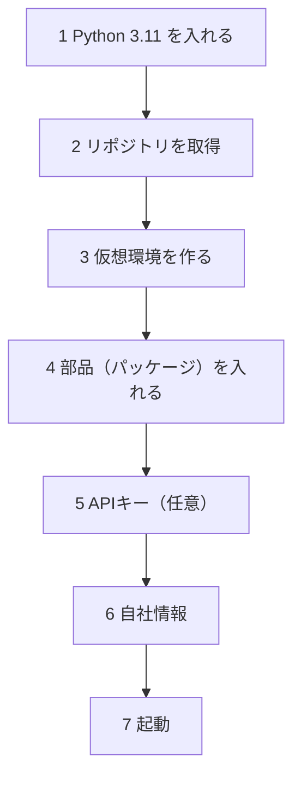
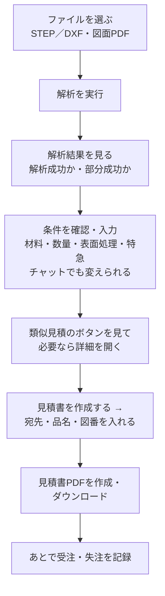

# 操作マニュアル
<!-- meta {"version": "1.1", "date": "2026-09-29", "audience": "見積担当者・導入担当者", "id": "DOC-04"} -->

## この資料について

見積担当者（プログラミングの知識がなくてよい）と、導入する人のための手引きである。前半でセットアップ（最初に1回だけ行う準備）、後半で日々の操作を、画面の写真つきで説明する。

- **見積担当者** は「日々の操作」の章から読めばよい
- **導入担当者** は「動作環境」と「セットアップ」を先に読む

画面の写真の顧客名・図番・金額はすべて架空である。

## 動作環境

| 項目 | 内容 |
|---|---|
| パソコン | Windows 10／11（64ビット）。メモリ 8GB 以上を推奨。Mac・Linux でも動く |
| Python | **3.11**（3.10〜3.12 のどれか。3.13 以降は3D処理の部品（CadQuery）が入らない） |
| ブラウザ | Chrome または Edge |
| ネットワーク | 最初のセットアップで部品（パッケージ）をダウンロードする。図面PDFの読み取りを使うときはインターネットが必要 |
| 任意 | Git（リポジトリの取得）、Docker Desktop（Docker で起動する場合） |

## セットアップ

以下の操作は、Windows の **PowerShell**（スタートメニューで「PowerShell」と入力して開く黒い画面）で行う。行の先頭の `PS>` は入力しない。



### 1. Python を入れる

1. https://www.python.org/downloads/ を開き、**Python 3.11** の Windows 用インストーラ（64-bit）をダウンロードする
2. インストーラを開き、最初の画面で **「Add python.exe to PATH」にチェックを入れて** から「Install Now」を押す
3. PowerShell で次を入力し、`Python 3.11.x` と出ることを確かめる

```
PS> py -3.11 --version
```

> 注意：Python 3.13 以降しか入っていないと、手順4で3D処理の部品（CadQuery）が入らない。3.11 を追加で入れれば、`py -3.11` で使い分けられる。

### 2. リポジトリ（本システムのファイル一式）を取得する

Git が入っていれば次のとおり。Git がなければ、GitHub のページの「Code」→「Download ZIP」でダウンロードして展開してもよい。

```
PS> git clone https://github.com/1975020t/step_analysis_for_automatic-estimate.git
PS> cd step_analysis_for_automatic-estimate
```

以降の操作は、すべてこのフォルダ（`step_analysis_for_automatic-estimate`）の中で行う。

### 3. 仮想環境を作る

仮想環境は、本システム専用の Python の部屋である。ほかのソフトと部品がぶつからない。

```
PS> py -3.11 -m venv .venv
```

フォルダの中に `.venv` ができる。以降、Python は `.venv\Scripts\python.exe` を使う。

### 4. 部品（パッケージ）を入れる

```
PS> .venv\Scripts\python.exe -m pip install --upgrade pip
PS> .venv\Scripts\python.exe -m pip install -r requirements.txt
```

3D処理の部品（CadQuery）が大きいので、数分〜十数分かかる。最後に `Successfully installed …` と出れば完了。

### 5. APIキーを設定する（任意）

**図面PDFの読み取り** には、Anthropic（Claude）の APIキーが要る。ほかの機能（STEP・DXFの解析、見積、見積書、類似見積）は、APIキーがなくてもすべて使える。

1. フォルダの中の `.env.example` をコピーして、名前を `.env` にする
2. `.env` をメモ帳で開き、`ANTHROPIC_API_KEY=` の後ろにキーを書いて保存する（`ANALYSIS_ANTHROPIC_API_KEY` という名前でも読まれる）
3. 設定できたかは `.venv\Scripts\python.exe scripts\check_claude_api.py` で確かめられる（Claude API を1回だけ呼ぶ）

| 設定 | 使う機能 | ないとき |
|---|---|---|
| `ANTHROPIC_API_KEY`（または `ANALYSIS_ANTHROPIC_API_KEY`） | 図面PDFの読み取り | 図面PDFを指定すると「APIキーの設定が必要です」と出る。条件は手で選ぶ |
| `OPENAI_API_KEY` | チャットでの条件の変更（任意） | 簡易な解釈で動く（画面の表示は同じ） |

> APIキーは秘密情報である。`.env` は Git に入らない設定になっている。キーを資料やメールに書かない。

### 6. 自社情報を設定する

見積書に載る自社の会社名・住所などは、`data/company.csv` に **仮の値** が入っている。実際の情報は、同じ形式で `data/company.local.csv` を作って書く（Git に入らない。あればこちらが使われる）。

1. `data/company.csv` をコピーして `data/company.local.csv` にする
2. Excel かメモ帳で開き、`value` の列を書き換える

| key | 内容 | 例 |
|---|---|---|
| name | 会社名 | 株式会社○○板金 |
| postal_code・address | 郵便番号・住所 | 000-0000、東京都○○区… |
| tel・fax | 電話・FAX | 03-0000-0000 |
| registration_no | 適格請求書の登録番号 | T0000000000000 |
| contact | 担当者 | 佐藤 一郎 |
| payment_terms | 取引条件 | 月末締め 翌月末 銀行振込 |
| delivery_place | 受渡場所の既定値 | 貴社指定場所 |
| remark_1、remark_2 … | 備考の定型文（番号順に載る） | 運賃は含みません。 |

> Excel で保存するときは「CSV UTF-8（コンマ区切り）」を選ぶ。文字化けを防ぐため。

### 7. 起動する

**デモ画面**（ふだん使う画面）：

```
PS> .venv\Scripts\python.exe -m streamlit run app.py
```

ブラウザで http://localhost:8501 が開く（開かなければアドレスを入力する）。止めるときは PowerShell で `Ctrl` ＋ `C`。

**API**（開発者向け。別の画面から使うとき）：

```
PS> .venv\Scripts\python.exe -m uvicorn api.main:app --port 8000
```

仕様書は http://localhost:8000/docs。

**Docker で起動する**（社内サーバーなどに置くとき。Docker Desktop が必要）：

```
PS> docker compose up --build
```

API（http://localhost:8000/docs）とデモ画面（http://localhost:8501）が両方起動する。止めるときは `docker compose down`。図面PDFの読み取りを使うときは、起動する前に `$env:ANALYSIS_ANTHROPIC_API_KEY="…"` を実行しておく（docker-compose.yml がこの名前で渡す）。

## 日々の操作

画面は3つある。**見積の画面** で解析・条件・金額を決め、**見積書の作成の画面** で宛先を入れて見積書を出す。類似見積は、見積の画面のボタンから **類似見積の詳細の画面** を開いて見る。どの画面からも「← 見積に戻る」で見積の画面に戻れ、入れた値は残る。



### STEPから見積を作る

1. 「STEP／展開図DXFファイル」の「Upload」（またはファイルをドラッグ）で STEP（.step／.stp）を選ぶ
2. 曲げの係数（Kファクター）が顧客や工場で決まっているなら、右の「Kファクター」に入れ、「指定済み加工条件として扱う」にチェックする。分からなければそのままでよい（曲げのある部品は解析値が概算になり、「確認してください」に理由が出る）
3. 「解析を実行」を押す


4. 数秒で結果が出る。緑の「解析成功」なら値は確定。黄の「部分成功」なら一部の値が概算、赤の「解析不可」なら見積は出ない（理由が表示される）


5. 下の「ルールベース見積」で、材料・数量・表面処理・特急を選ぶ。金額（単価・小計・消費税・見積金額）がすぐ変わる
6. 条件は、そのすぐ下の **チャット** の欄に文章で書いても変えられる（例「数量を10個にして、皿もみを2箇所追加」）


> 「原価の内訳」の表は社内用である。見積書には出ない。

### 展開図DXFから見積を作る

1. 「STEP／展開図DXFファイル」で DXF（.dxf）を選ぶ
2. 右に「板厚（mm）」の欄が出るので、板厚を入れる（展開図には板厚が入っていないため）
3. 曲げのない平板なら「曲げなし（平板）」にチェックする（曲げ線のない展開図は、曲げ線の描き漏れと区別できないため、チェックしないと解析値が概算になる）
4. 「解析を実行」を押す。あとは STEP と同じ


> 次の場合は、値を確定にせず「部分成功」（概算）か「解析不可」になる：図面の表題欄の板厚と入力した板厚が違う、外形が閉じていない、部品が2つ描かれている、単位がmm以外（インチなど。mmで描いた図面の単位が誤ってインチになっていると値が25.4倍になり、ファイルからは見分けられないため）、曲げ線が1本もない、外形と別の色・レイヤの閉じた線が部品の中にある。

### 図面PDFを合わせて使う

図面PDFを一緒に選ぶと、材質・数量・表面処理・追加加工・特急を読み取って、**入力欄に自動で入れる**（APIキーが必要）。

1. 「STEP／展開図DXFファイル」に形状のファイル、「図面PDF」に図面を選び、「解析を実行」を押す


2. 「図面から読み取った加工条件」の入力欄に読み取った値が入り、項目ごとに状態が出る。**金額は入力欄の値で計算する**


3. **✅ 以外の項目を図面と見比べる**。違っていれば入力欄の値を直す（直した値が金額に入る）
   - ⚠️ 要確認：読み取ったが確かめてほしい（例「最新の改訂の値と異なる」「2回の読み取りが一致しない」）
   - ❌ 未登録：マスターにないもの（例 M10タップ）。追加加工なら表に「未登録: 図面の原文」の行として残り、金額に入れず、見積書の備考に「別途見積」と書かれる。登録済みの加工で代えられるなら、その行を消して加工を選び直す。材質が未登録なら、材質を選ぶまで金額が出ない
   - ➖ 記載なし：図面に書いていない。既定値（数量1、表面処理なし）が入るので、必要なら入れる
   - 📐 形状から：板厚は形状の値（STEPから測った板厚、DXFは解析に使った板厚）で計算する。図面の板厚と違えば「⚠️ 図面は○mm」と出る
4. 確かめてほしい点は、金額の上の「確認してください」に並ぶ


> 図面に厳しい公差・外観の指定・検査の要求があれば「特記事項」として黄色で出る。金額には入らないので、必要なら備考に書くか別途見積とする。

### 類似見積を見る

見積の画面の下の「類似見積（参考）」に、過去の見積が最大5件、1件ずつボタンで出る（見積日・顧客・図番・品名・単価と今回比）。


- **【リピート】**：同じ顧客の同じ図番。前回いくらで出したか、何が変わったかを必ず確かめる。リピートは、見積書の作成の画面で宛先（と図番）を入れたあとに探す（図面PDFから読み取った図番は最初から使う）
- **【同じ顧客】**：その顧客に出してきた値段の水準が分かる
- **【他の顧客】**：自動の金額が妥当かを実績と比べる
- ボタンの上の説明に、過去の出し値の水準で見た今回の単価と、今回の金額との差（%）が出る。**画面の金額は自動では変わらない。** 金額を決めるのは担当者
- ボタンを押すと、その見積の詳細の画面に移る。似ている理由・今回との違い・値段の水準・注意（2年以上前、前回の水準より±20%を超えて違う、過去が特急）・元の記録の全項目が見られる。「← 見積に戻る」で戻る


### 見積書を出力する

1. 見積の画面の「見積書を作成する →」を押す。見積書の作成の画面に移る（金額は見積の画面と同じ）
2. 「宛先と部品」に、宛先の会社名（必須）・部署と担当者名・品名・図番・改訂を入れる（図面PDFから読み取った図番・改訂は入っている）


3. 「取引条件と備考」で、件名（空なら「{図番} {品名} 製作」）・受渡場所・備考を確かめる。社内用の内訳（原価・粗利率）も欲しければ「社内用の内訳も出力する」にチェックする
4. 「見積書PDFを作成」を押し、「ダウンロード」ボタンで PDF を保存する


5. 見積書は、**作成した時点で画面の条件を確定として扱い、つねに「御見積書」** になる（概算の見積書はない）。確認事項があるときは、作成する前に青い枠で「見積書は、画面の条件を確定として出力します。次の点を確認してください。」と出るので、見積の画面に戻って直すか、確かめたうえで作成する

| 見積書 | いつ | 見本 |
|---|---|---|
| 御見積書 | 作成したとき（つねに） | 画面設計書「見積書の見本」 |
| 見積根拠（社内用） | チェックを入れたとき。社外秘 | 同上 |

> 見積番号は自動で付く（例 `Q20260928-001`）。同じ日に何度出しても重複しない。出力した見積は自動で見積履歴に入り、次から類似見積に出る。

### 受注・失注を記録する

1. 見積書の作成の画面の下の「受注・失注の記録」を開く
2. 「見積」で見積番号を選び、「結果」で受注・失注・未回答を選ぶ
3. 「結果を記録」を押す


> 見積履歴は `data/past_quotes/history.csv` に書かれる。複数のパソコンで共有するときは、このファイルを Git にコミットする（導入担当者に依頼する）。

### 過去の見積を取り込む（導入担当者）

Excel などで管理している過去の見積を、CSV にして取り込むと、類似見積の対象になる。

1. Excel で「CSV UTF-8（コンマ区切り）」または「CSV（コンマ区切り）」で保存する
2. PowerShell で次を実行する

```
PS> .venv\Scripts\python.exe scripts\import_past_quotes.py 旧見積.csv
```

3. 列の名前は自動で対応づける（「見積番号」「見積日」「顧客名／得意先」「図番」「改訂」「品名」「材質」「板厚」「数量」「表面処理」「追加加工」「特急」「単価」「金額」「結果」「担当者」「備考」「展開面積_mm2」など）。名前が違う列は `--map` で指定する

```
PS> .venv\Scripts\python.exe scripts\import_past_quotes.py 旧見積.csv --map customer=得意先コード名 --map unit_price=見積単価
```

- 見積日と顧客名がない行は取り込まない（理由が表示される）。欠けた列は空欄になる
- 同じ見積（見積番号・見積日・顧客が同じ）は二重に入らないので、何度実行してもよい
- 材質・表面処理・追加加工の文字は、マスターの別名でコードに対応づけ、元の文字も残す。「SUS」のように系統しか分からないもの、マスターにないものも取り込む

### マスター（単価・材質・表面処理など）を変える（導入担当者）

マスターは `data/` の CSV ファイルである。Excel で開いて書き換え、「CSV UTF-8」で保存する。

| ファイル | 中身 | 主な列 |
|---|---|---|
| `materials.csv` | 材質 | material（コード）、display_name（表示名）、density_kg_m3（密度）、price_per_kg（材料単価 円/kg）、waste_factor（歩留まり係数）、charge_scope、aliases（表記ゆれ） |
| `process_rates.csv` | 工程・追加加工 | process_code、display_name、unit_price（単価）、unit（単位）、charge_scope、aliases |
| `surface_treatments.csv` | 表面処理 | treatment_code、display_name、unit_price、charge_scope、aliases |
| `pricing_policy.csv` | 価格方針 | margin_rate（粗利率 0.25）、rush_surcharge_rate（特急割増 0.30）、tax_rate（税率 0.10）、quote_validity_days（有効期限 30日）、lead_time_days_normal（納期 10営業日）、lead_time_days_rush（特急の納期 5営業日） |

- **charge_scope**：`per_part` は数量倍、`per_order` は1件に1回だけ（段取りなど）
- **aliases**：図面や過去の見積での書き方の違いを `|` で区切って並べる（例 `SPCC-SD|冷間圧延鋼板|CRS`）。完全に一致したときだけ対応づける
- デモ画面は、次に操作したときから新しいマスターを使う。API は再起動が必要

## 画面の表示の意味

| 表示 | 意味 | どうするか |
|---|---|---|
| 解析成功（緑） | 形状の値を確定できた | そのまま使ってよい |
| 部分成功（黄） | 一部の値が概算（自己検算が合わない、曲げ部に穴がある、Kファクターが既定値、DXFの曲げ線がない・単位がmm以外など） | 「解析根拠と処理段階」で理由を見て、必要なら図面と見比べる |
| 解析不可（赤） | 対象外の形状、ファイルの問題 | 理由コードを見る。形状を手で見積もる |
| ✅ 読み取り済み | 図面の値に問題がない | そのまま |
| ⚠️ 要確認 | 読み取ったが確認が必要 | 図面と見比べ、違えば入力欄を直す |
| ❌ 未登録 | マスターにない | 追加加工は別途見積になる。登録済みのもので代えられるなら選び直す。よく出るものはマスターへの登録を検討 |
| ➖ 記載なし | 図面に書いていない | 顧客に確認するか、値を入れる |
| 📐 形状から | 板厚は形状の値で計算する | 図面の板厚と違うと出るときは、形状と図面のどちらが正しいか確かめる |
| 確認してください（黄） | 条件や解析値に確かめてほしい点がある | 並んだ点を確かめる。見積書は画面の条件を確定として出力する |

**概算とは**：解析値の一部が、検算で確かめきれなかった値や仮の値（Kファクターの既定値など）にもとづくことである。画面には「部分成功」と「確認してください」で知らせる。見積書は、担当者が確かめて作成した時点で確定として扱う。

## よくある質問とトラブル対応

| 困ったこと | 原因と対処 |
|---|---|
| `pip install` で CadQuery（cadquery-ocp）が入らない | Python が 3.13 以降になっている。`py -3.11 -m venv .venv` で作り直す（`.venv` フォルダを消してから） |
| 画面に「CadQueryが未インストールのため解析できません」と出る | 仮想環境の Python で起動していない。`.venv\Scripts\python.exe -m streamlit run app.py` で起動する |
| `py` が見つからない | Python のインストールで「Add python.exe to PATH」にチェックしていない。入れ直すか、Python のフルパスで実行する |
| ブラウザが開かない・つながらない | http://localhost:8501 を手で開く。「ポートが使われている」と出たら `--server.port 8502` を付けて起動する |
| 図面PDFを指定すると「APIキーの設定が必要です」 | `.env` に `ANTHROPIC_API_KEY` を書く。なければ条件を手で選ぶ |
| 図面PDFの読み取りに時間がかかる | 1枚あたり数秒〜十数秒かかる（外部のサービスの応答待ち） |
| 解析が「部分成功」になる | 曲げのある部品で Kファクターが既定値のままだと概算になる。決まった値があれば入れてチェックする |
| DXFで「解析不可」 | 外形が閉じていない（0.1mm を超えるすき間）、部品が2つ描かれている、切断線がない。CADで直して保存し直す |
| 顧客から STEP・DXF 以外の 3D データしか届かない（SOLIDWORKS・Inventor・iCAD などの形式） | 顧客に **STEP で保存し直して** 送ってもらう（主な 3D CAD はどれも STEP で書き出せる）。Parasolid（.x_t）は変換ツールで STEP にできる |
| IGES（.igs）が届いた | 立体（ソリッド）として出ていれば変換ツールで STEP にできる。面の集まりとして出ていると確実に直せないので、STEP での再提出を依頼する |
| STL・OBJ が届いた | 正確な値が出せないので扱えない。STEP を依頼する |
| DWG（AutoCAD）・Jw_cad（.jww）の図面が届いた | それぞれの CAD（または変換ツール）で **DXF として保存** する。展開図なら DXF として解析できる。三面図は形状の自動解析の対象外（図面PDFにして条件の読み取りに使う） |
| 紙や FAX の図面しかない | PDF にスキャンして図面PDFとして使う（加工条件の読み取り）。形状の値は読めないので、STEP か DXF を依頼するか、担当者が値を確かめる |
| 「見積書PDFを作成」が押せない | 宛先の会社名が空。見積書の作成の画面の「宛先と部品」に入れる |
| 「見積書を作成する →」が出ない | 金額が出ていない。図面の材質がマスターにない・書いていないときは、材質を選ぶ |
| DXFが「部分成功」になる | 曲げ線がない平板なら「曲げなし（平板）」にチェックする。単位がインチなどになっているときは、図面の単位を確かめる |
| 見積書に自社の住所が「○○」と出る | `data/company.local.csv` を作っていない（自社情報の設定） |
| CSV を開くと文字化けする | Excel で開くときは「データ」→「テキストまたはCSVから」で UTF-8 を選ぶ。保存は「CSV UTF-8」 |
| 過去の見積が類似見積に出ない | 材質の系統（鉄・ステンレス・アルミ・銅）か板厚（同じか隣）が違うと、リピート以外は出ない。リピートは顧客名と図番が一致しているか確かめる |

## 付録：API の使い方（開発者向け）

API は、画面から独立して本システムの機能を呼ぶ窓口である。段階2の新しい画面（React）はこれを使う。

### 仕様書（/docs）の見方

{.medium}

- 機能（masters・files・analysis・drawing・quote・document・similar・history）ごとに並ぶ
- 1つ開いて「Try it out」を押すと、画面から試しに呼べる
- 下の「Schemas」に入出力の型（`SheetMetalAnalysis`、`QuoteResponse` など）がある

### 呼び出しの例（PowerShell）

```
# 1. STEP をアップロード
PS> $f = curl.exe -s -F "file=@part.step" http://localhost:8000/api/files | ConvertFrom-Json
# 2. 解析を受け付ける（すぐ受付番号が返る）
PS> $j = Invoke-RestMethod -Method Post -Uri http://localhost:8000/api/analyses -ContentType "application/json" `
      -Body (@{ file_id = $f.file_id; k_factor = 0.5; k_factor_confirmed = $true } | ConvertTo-Json)
# 3. 状態を確かめる（status が done になるまで）
PS> Invoke-RestMethod http://localhost:8000/api/jobs/$($j.job_id)
# 4. 見積
PS> $body = @{ analysis_job_id = $j.job_id; condition = @{ material = "SPCC"; quantity = 100 } } | ConvertTo-Json -Depth 5
PS> Invoke-RestMethod -Method Post -Uri http://localhost:8000/api/quotes -ContentType "application/json" -Body $body
```

- DXF の解析は `thickness_mm` が必要。曲げのない平板と確かめたときは `flat_confirmed = $true` を付ける
- 図面PDFの読み取り結果（`drawing`）と一緒に見積を呼ぶとき、`condition` に数量・表面処理・特急を書くと、図面の値に代わって使われる。同じ追加加工を図面と `condition` の両方に書いても二重に数えない（`condition` の個数を使う）
- 見積書（`POST /api/documents`）は、作成した時点で `drawing` の項目をすべて確定として扱い、つねに「御見積書」を作る。数量が図面にも `condition` にもないときは 400（`QUANTITY_REQUIRED`）

`API_TOKEN` を設定したサーバーでは、`-Headers @{ Authorization = "Bearer <合言葉>" }` を付ける。機能ごとの呼び出しの流れは `analysis/api_design.md` と「設計書」の API の章にある。
