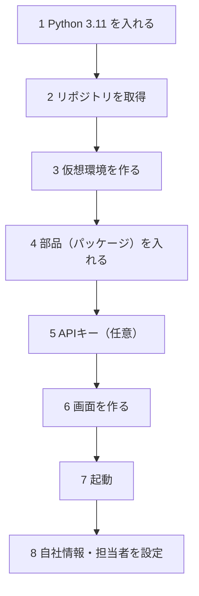
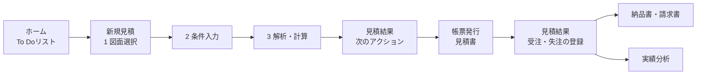

# 操作マニュアル
<!-- meta {"version": "2.1", "date": "2026-10-07", "audience": "見積担当者・導入担当者", "id": "DOC-04"} -->

## この資料について

見積担当者（プログラミングの知識がなくてよい）と、導入する人のための手引きである。前半でセットアップ（最初に1回だけ行う準備）、後半で日々の操作を、画面の写真つきで説明する。

- **見積担当者** は「日々の操作」の章から読めばよい
- **導入担当者** は「動作環境」と「セットアップ」を先に読む

画面の写真の顧客名・図番・金額はすべて架空である。

## 動作環境

| 項目 | 内容 |
|---|---|
| パソコン | Windows 10／11（64ビット）。メモリ 8GB 以上を推奨。Mac・Linux でも動く |
| Python | **3.11**（3.10〜3.12 のどれか。3.13 以降は3D処理の部品（CadQuery）が入らない） |
| ブラウザ | Chrome または Edge |
| ネットワーク | 最初のセットアップで部品（パッケージ）をダウンロードする。図面PDFの読み取りを使うときはインターネットが必要 |
| Node.js | **20 以上**（画面を作るときだけ。Docker で起動するなら不要） |
| データベース | 指定しなければ SQLite（ファイル1つ。お試し・1台で使う場合）。複数人で使うなら PostgreSQL（Docker で起動すると一緒に入る） |
| 任意 | Git（リポジトリの取得）、Docker Desktop（Docker で起動する場合。いちばん簡単） |

> **Docker Desktop がある場合** は、下の手順の 1・3・4 と「画面を作る」は要らない。2（取得）のあと、7 の「Docker で起動する」へ進む。

## セットアップ

以下の操作は、Windows の **PowerShell**（スタートメニューで「PowerShell」と入力して開く黒い画面）で行う。行の先頭の `PS>` は入力しない。



### 1. Python を入れる

1. https://www.python.org/downloads/ を開き、**Python 3.11** の Windows 用インストーラ（64-bit）をダウンロードする
2. インストーラを開き、最初の画面で **「Add python.exe to PATH」にチェックを入れて** から「Install Now」を押す
3. PowerShell で次を入力し、`Python 3.11.x` と出ることを確かめる

```
PS> py -3.11 --version
```

> 注意：Python 3.13 以降しか入っていないと、手順4で3D処理の部品（CadQuery）が入らない。3.11 を追加で入れれば、`py -3.11` で使い分けられる。

### 2. リポジトリ（本システムのファイル一式）を取得する

Git が入っていれば次のとおり。Git がなければ、GitHub のページの「Code」→「Download ZIP」でダウンロードして展開してもよい。

```
PS> git clone https://github.com/1975020t/step_analysis_for_automatic-estimate.git
PS> cd step_analysis_for_automatic-estimate
```

以降の操作は、すべてこのフォルダ（`step_analysis_for_automatic-estimate`）の中で行う。

### 3. 仮想環境を作る

仮想環境は、本システム専用の Python の部屋である。ほかのソフトと部品がぶつからない。

```
PS> py -3.11 -m venv .venv
```

フォルダの中に `.venv` ができる。以降、Python は `.venv\Scripts\python.exe` を使う。

### 4. 部品（パッケージ）を入れる

```
PS> .venv\Scripts\python.exe -m pip install --upgrade pip
PS> .venv\Scripts\python.exe -m pip install -r requirements.txt
```

3D処理の部品（CadQuery）が大きいので、数分〜十数分かかる。最後に `Successfully installed …` と出れば完了。

### 5. APIキーを設定する（任意）

**図面PDFの読み取り** には、Anthropic（Claude）の APIキーが要る。ほかの機能（STEP・DXFの解析、見積、見積書、類似見積）は、APIキーがなくてもすべて使える。

1. フォルダの中の `.env.example` をコピーして、名前を `.env` にする
2. `.env` をメモ帳で開き、`ANTHROPIC_API_KEY=` の後ろにキーを書いて保存する（`ANALYSIS_ANTHROPIC_API_KEY` という名前でも読まれる）
3. 設定できたかは `.venv\Scripts\python.exe scripts\check_claude_api.py` で確かめられる（Claude API を1回だけ呼ぶ）

| 設定 | 使う機能 | ないとき |
|---|---|---|
| `ANTHROPIC_API_KEY`（または `ANALYSIS_ANTHROPIC_API_KEY`） | 図面PDFの読み取り | 図面PDFを指定すると「APIキーの設定が必要です」と出る。条件は手で選ぶ |
| `OPENAI_API_KEY` | チャットでの条件の変更（任意） | 簡易な解釈で動く（画面の表示は同じ） |

> APIキーは秘密情報である。`.env` は Git に入らない設定になっている。キーを資料やメールに書かない。

### 6. 画面を作る

画面（React）は、使う前に一度「作る」（ブラウザで開けるファイルにする）。Node.js が必要。

```
PS> cd web
PS> npm ci
PS> npm run build
PS> cd ..
```

`web\dist` ができれば完了。画面のプログラムを更新したときだけ、もう一度行う。

### 7. 起動する

**Docker で起動する**（いちばん簡単。データベース・API・画面がそろって起動する。Docker Desktop が必要）：

```
PS> docker compose up --build -d
```

初回はイメージを作るので10分ほどかかる。画面は http://localhost:8080 、API の仕様書は http://localhost:8000/docs 。止めるときは `docker compose down`（データは残る）。図面PDFの読み取りを使うときは、起動する前に `$env:ANALYSIS_ANTHROPIC_API_KEY="…"` を、データベースのパスワードを変えるときは `$env:POSTGRES_PASSWORD="…"` を実行しておく。

**Docker なしで起動する**：

```
PS> .venv\Scripts\python.exe -m uvicorn api.main:app --port 8000
```

ブラウザで http://localhost:8000 を開く。止めるときは PowerShell で `Ctrl` ＋ `C`。データは `output` フォルダ（データベース `output\app.db` と、登録した図面・帳票のファイル）に残る。PostgreSQL を使うときは、起動の前に `$env:DATABASE_URL="postgresql+psycopg://ユーザー:パスワード@サーバー/データベース名"` を実行する。

最初の起動で、データベースに初期データ（`data` フォルダのマスター・自社情報、過去見積の履歴、案件ステータス14個、担当者など）が入る。2回目以降は、画面で変えた内容を上書きしない。

**お試し**：架空の顧客と図面（受注・失注・帳票まで）を入れて動きを見るときは、次のとおり起動する（図面PDFの読み取りは記録済みの結果を使い、APIキーは要らない）。

```
PS> .venv\Scripts\python.exe scripts\seed_demo.py --storage output\demo --fresh
PS> $env:ESTIMATE_STORAGE_DIR="output\demo"; $env:PAST_QUOTES_PATH="output\demo\history.csv"
PS> $env:DRAWING_READER="recorded:output\demo\readings.json"
PS> .venv\Scripts\python.exe -m uvicorn api.main:app --port 8000
```

### 8. 自社情報と担当者を設定する

左のメニューの「設定」を開き、「帳票関連 ＞ 自社情報」で、見積書・納品書・請求書に載る自社の会社名・住所・登録番号などを入れる（最初は仮の値）。「運用 ＞ 担当者」で担当者を登録し、「この端末で操作する担当者」を選ぶ（メニューの下に「担当者：○○」と出る）。

| key | 内容 | 例 |
|---|---|---|
| name | 会社名 | 株式会社○○板金 |
| postal_code・address | 郵便番号・住所 | 000-0000、東京都○○区… |
| tel・fax | 電話・FAX | 03-0000-0000 |
| registration_no | 適格請求書の登録番号（請求書に載る） | T0000000000000 |
| contact | 担当者 | 佐藤 一郎 |
| payment_terms | 取引条件（支払条件） | 月末締め 翌月末 銀行振込 |
| delivery_place | 受渡場所の既定値 | 貴社指定場所 |
| remark_1、remark_2 … | 備考の定型文（番号順に載る） | 運賃は含みません。 |

> 最初の起動の前に `data/company.local.csv`（`data/company.csv` と同じ形式、Git に入らない）を作っておくと、その内容が初期値になる。

## 日々の操作



画面の各部の説明は「画面設計書」にある。ここでは手順を説明する。

### 毎日の始め方（ホーム）

1. 画面を開くとホームが出る（左のメニューの「ホーム」でも開く）
2. **To Doリスト** に、対応が必要な案件が急ぐ順に並ぶ。左のラベルが理由（納期超過・未入力あり・納期まで○日・回答待ち○日）、右のリンクが次のアクション（見積を表示・入力・確認・発行・受注・失注の登録 など）。上から順にリンクを押して片付ける
3. **進捗** の4つの枠に、フェーズ（1 見積作成中／2 見積確認中／3 回答待ち／4 製造・出荷）ごとの件数と、注意が必要な件数が出る。枠を押すと、そのフェーズの案件の一覧が開く


### 見積を作る（新規見積）

1. 左のメニューの「＋ 新規見積」を押す。上に「1 図面選択 → 2 条件入力 → 3 解析・計算 → 4 確認・発行」が出る
2. **1 図面選択**：新しい図面なら、図面PDFとCADデータ（STEP／DXF）を点線の枠にドラッグ＆ドロップする（「ファイルを選択」でもよい。片方だけでもよい）。登録済みの図面なら、右の一覧から選ぶ（図番・品名・顧客で検索できる）。「次へ：条件入力 →」を押す
3. **2 条件入力**：図面PDFがあれば、読み取った図番・改訂・材質・表面処理・数量・追加加工・特急が入っている。印の意味は次のとおり。図面と見比べ、違っていれば直す（直さなくても進める）
   - **読取**：図面から読み取った値
   - **要確認**：読み取ったが、図面と見比べた方がよい（理由が下に出る）
   - **マスタ未登録：○○**：図面に書かれているがマスタにない語。空欄のまま進め、単価は見積結果で入れる（マスタにある材質・表面処理を選んでもよい）
   - **記載なし**：図面に書かれていない。空欄のまま進めてよい（材質は見積結果で選ぶ。表面処理は「なし」で計算）
4. **顧客** と **数量** を入れる（この2つだけが必須）。新しい図面なら品名も入れる。同じ図番の図面がすでにあると「新しい版として登録」にチェックが付く（別の図面にするなら外す）
5. 任意項目（案件名・希望納期・担当）を入れる。STEP なら、自社の加工条件で決まった Kファクターがあれば入れる（空欄なら標準値で計算し、曲げのある部品は概算になる）。DXF なら板厚を入れ、曲げのない平板なら「曲げなし（平板）」にチェック
6. 「解析・計算を実行 →」を押す。新しい図面はこのとき図面として登録される。**3 解析・計算** の画面で進捗が出て、終わると見積結果が開く

{.medium}

{.medium}

> 図面だけを登録しておき、見積は後で作るときは、ホームのショートカットか「図面」画面の「図面登録」を使う（下の「図面だけを登録する」）。登録済みの図面は、図面の画面のカードや図面詳細の「新規見積」からも見積を始められる。

### 見積結果を確かめる（次のアクション）

見積結果の画面では、いちばん上の **次のアクション** の枠に、次にすることが出る。

1. **未入力の項目がある**（赤い枠）：項目ごとの「入力 →」を押すと「条件修正」タブの入力欄に移る。入れたら「保存して計算し直す」を押す
   - **材質が未選択**：材質を選ぶ。マスタにない材質は「マスタにない材質（単価を入力）」を選び、名前・kg単価・密度を入れる
   - **マスタにない加工・表面処理の単価**：図面に書かれた名前（「M10タップ」など。個数は箇所数の欄に分けて入る）を確かめ、1か所（1個）あたりの単価を入れる。入れた単価はこの見積だけに使い、マスタには登録されない
   - **寸法の値**：CADデータから求められなかったとき（CADデータがない、解析不可）、板厚・展開面積・切断長・穴数・曲げ数のうち足りないものを入れる
   - **数量**：数量を入れる
2. **未入力がなくなる**（青い枠）：「確認事項」（図面の読み取りが要確認、展開寸法が概算など）が並ぶ。「○○を修正 →」で直す場所に移る。確認事項は未対応のままでも発行できる。「見積書の発行へ →」を押す
3. 枠の下には、形状（3D）と展開図が並んで出る。部品の形・穴・曲げ線を確かめる。3D はドラッグで回転、ホイールで拡大できる。下の行に板厚・穴・曲げ・切断長と、確定か概算か
4. 右には総額（税抜）・単価・消費税・税込が常に出る。その下の「類似実績との比較」で、前回実績・類似実績の単価と今回の差（%）を見る
5. 詳細はタブで見る：金額内訳（費目ごとの数量・単価・金額）、条件修正（図面の読み取り結果と条件の入力欄）、CADデータ（確定・概算の理由と5つの値）、類似実績、修正履歴
6. 条件は文章でも変えられる（右の「チャットで条件変更」。例：「皿もみを4か所追加」「数量を200に」）。金額は計算し直される
7. お客様に画面を見せるときは、右の「顧客提示モード」にチェックを入れる（原価・粗利が隠れる）


### 類似実績を見る

見積結果の「類似実績」タブ、図面詳細の「類似形状の過去実績と比較」、図面の画面の「類似形状検索」（ホームの「類似実績検索」からも開く）に、**材料が同じで、曲げ数の差が1以内、穴数の差が2以内** の図面と過去の見積が、差の小さい順に出る（どれも同じ結果）。単価と今回との差（%）、受注・失注の結果を見比べて、金額の判断の参考にする。今回の金額は自動では変わらない。CADデータのない図面は探せない。

### 見積書を発行する

1. 見積結果の次のアクションの「見積書の発行へ →」を押す（未入力の項目があると押せない）。帳票発行の画面が、対象案件と「見積書」を選んだ状態で開く
2. **2 帳票の種類** に「発行可能」と出ていることを確かめる。**3 宛先・テンプレート** で、必要なら宛先担当者（「様」は自動で付く）と備考を入れ、テンプレートを確かめる。右のプレビューは発行するPDFそのもの
3. 「見積書を発行」を押す。番号が付いて発行履歴に出て、案件は「見積提出済」（フェーズ3 回答待ち）になる。PDFは履歴の「PDFを開く」で開くか、「発行済みのPDFをダウンロード」で保存する


### 受注・失注を登録する

1. ホームの To Doリストの「受注・失注の登録 →」か、見積結果を開く。次のアクションが「受注・失注の登録」になっている
2. 受注なら「受注を登録」を押す。失注なら「失注を登録」を押し、理由（価格・納期など）と、分かれば他社価格を入れる。理由は実績分析で集計される

{.medium}

### 進捗を管理する（見積・案件）

1. 左のメニューの「見積・案件」を開く。初めは進行中の案件の一覧が、優先度の高い順に並ぶ。行の右の「次のアクション」から、その案件の次の作業に移れる
2. 上のフェーズのボタン（進行中・1 見積作成中・2 見積確認中・3 回答待ち・4 製造・出荷・完了分）で絞り込む。アラートのボタン（納期超過・納期まで3日以内・未入力あり・3日以上更新なし・回答待ち3日以上）を押すと、該当する案件だけになる
3. ステータスは、一覧の「ステータス変更」で選ぶか、「カンバン」に切り替えてカードをほかの列にドラッグする（カードの ← → でもよい）。間違えたら戻せばよい。失注にするときは理由を入れる


### 納品書・請求書を発行する

受注すると、見積結果の次のアクションが「納品書の発行」になる。押すと帳票発行が開くので、**2 帳票の種類** で「納品書」を選んで発行し、続けて「請求書」を選んで発行する。金額は発行した見積書と同じになる。請求書には自社の登録番号と、税率別の合計が載る。

### 実績を分析する

左のメニューの「実績分析」で、直近3・6・12か月の見積件数・受注率・平均回答日数・見積総額、顧客別の受注率、失注理由、担当者別の件数・受注率・回答日数を見る。

### 図面を探す・書類を探す

- 「図面」の画面の上で検索方法を選ぶ。**条件検索** は図番・品名・顧客・材質・分類で絞り込み、「条件を追加」でステータス・加工・最大寸法・登録日・自社の項目も使える。**類似形状検索** は基準図面を選ぶと形状の近い順に出る。**図面内文字検索** は、文字データのある図面PDFの中の文字（注記・加工指示）で探す
- カードの「見積を表示 →」（見積がなければ「新規見積 →」）と「図面を表示」で次の操作に移る
- 上の検索欄に図番や品名を入れて Enter を押すと、図面・見積・帳票・書類をまとめて探せる
- 図面詳細の「書き込みを追加」で、図面上の位置にメモを残せる。「注意・不具合メモ」タブには、その図面の注意点や不具合を残す

### 図面だけを登録する

1. ホームのショートカット「図面登録」か、図面の画面の「図面登録」を押す
2. 図面PDFとCADデータ（STEP／DXF）を、まとめて点線の枠にドラッグ＆ドロップする。同じ名前のPDFとCADデータは1行にまとまる
3. 図面PDFがあれば、図番・改訂・材質が下書きとして入る（「読み取り結果を下書きに入れました」）。図面と見比べて直す
4. 品名・顧客を入れ、分類を選ぶ。DXF の行には板厚を入れる（分かれば）。同じ図番の図面がすでにあると「新しい版として登録」にチェックが付く
5. 「確認済み n 件を登録」を押す。CADデータはこのとき解析される。登録した行の「新規見積 →」から、すぐに見積を始めることもできる


### 書類を登録する

「設定 ＞ データ ＞ 書類登録」（または検索の画面の「＋ 書類を登録」）で、仕様書・ミルシート・作業日報などの PDF・Excel を、種類・顧客・関連する図面と一緒に登録する。登録した書類は上の検索欄から探せる。

### 過去の見積を取り込む（導入担当者）

1. 今までの見積を Excel で開き、「名前を付けて保存」で「CSV UTF-8（コンマ区切り）」を選んで保存する（Shift_JIS の CSV でもよい）
2. 「設定 ＞ データ ＞ 過去見積の取り込み」（または実績分析の「CSVを取り込む」）で CSV を選ぶ。列が自動で対応づけられる（1行目の値で確かめる）
3. 違う列を選び直し、「取り込む」を押す。同じ見積（見積番号・見積日・顧客が同じ）は二重に入らない

### マスタ（単価・材質・表面処理など）を変える（導入担当者）

「設定 ＞ 金額関連」の材料マスタ・工程マスタ・表面処理マスタ・価格方針で、行を追加・編集する。別名（表記ゆれ）は「、」で区切る。価格方針の率（粗利率・特急の割増率・消費税率）は % で入れる。変更はこれから計算する見積に使われ、発行した帳票の金額は変わらない。計算式は「見積ロジック」で確かめられる（画面では変えられない）。

### 設定を変える（導入担当者）

左のメニューの「設定」に、すべての設定の入口が「金額関連／帳票関連／運用／データ」に分けて並ぶ（それぞれ何に影響するかの一言つき）。

- 案件ステータス：名前・順番・色・**フェーズ** を変える。追加したステータスにもフェーズを選ぶ（ホームの進捗・To Doリスト、「見積・案件」の絞り込みに使う）。名前を変えても、過去の履歴は当時の名前で残る
- 分類・属性項目：分類（フォルダ）と、図面の属性・検索項目（テキスト・選択肢・数値の範囲・日付の範囲）を足す
- 見積書テンプレート：表示する項目を切り替え、顧客ごとに使い分ける
- 取引先管理：顧客・協力会社の台帳（記録と表示だけ）
- 担当者：担当者を登録し、この端末で操作する担当者を選ぶ

{.medium}

## 画面の表示の意味

| 表示 | 意味 |
|---|---|
| 読取（新規見積） | 図面PDFから読み取って自動入力した値 |
| 図面情報（新規見積） | 登録済みの図面の値 |
| 読み取り済み（見積結果） | 図面PDFから確かに読み取れた |
| 要確認 | 読み取ったが、図面と見比べた方がよい（発行は止めない） |
| マスタ未登録・未登録 | 図面に書いてあるが、マスタにない（単価を入れるまで発行できない） |
| 記載なし | 図面に書いていない（材質は選ぶ。表面処理・特急は「なし」として扱う） |
| 確定 | CADデータから寸法を確かに求められた |
| 概算 | 寸法に仮定がある（Kファクターの標準値など。理由は「CADデータ」タブに出る）。発行はできる |
| 解析不可 | CADデータから寸法を求められない（理由は「CADデータ」タブに出る）。寸法の値を入力する |
| 未入力の項目・未入力あり | 金額に必要な値が足りない。すべて埋まるまで見積書を発行できない |
| 納期超過・納期まで○日 | 希望納期と今日の差（3日以内で表示） |
| ○日更新なし・回答待ち○日 | 案件が3日以上変わっていない／見積提出済のまま3日以上 |
| フェーズ | 1 見積作成中・2 見積確認中・3 回答待ち・4 製造・出荷・完了分。どのステータスがどのフェーズかは「設定 ＞ 案件ステータス」で決まる |

## よくある質問とトラブル対応

| 症状 | 対処 |
|---|---|
| 「見積書の発行へ」「見積書を発行」が押せない | 見積結果の次のアクションに出る「未入力の項目」を埋める。帳票発行の画面の「2 帳票の種類」にも理由が出る |
| 納品書・請求書が発行できない | 先に見積書を発行し、受注を登録する（見積結果の「受注を登録」か、見積・案件でステータスを「受注」に） |
| 案件が To Doリストに出ない | To Doリストに載るのは、納期超過・未入力あり・納期まで3日以内・回答待ち3日以上の案件だけ。すべての案件は「見積・案件」で見る |
| 追加したステータスの案件が、思ったフェーズに出ない | 「設定 ＞ 案件ステータス」で、そのステータスのフェーズを選び直す |
| 「ほかの人が先に変更しました」と出る | ほかの人が同じ見積・案件を先に保存した。見積結果では最新の内容が自動で表示されるので、変更をもう一度行う（ほかの画面では読み直してから行う） |
| 「図面の自動読み取りは使えません」と出る | 図面の読み取りの設定（APIキー `ANALYSIS_ANTHROPIC_API_KEY`）がされていない（導入担当者が設定する）。図番・材質などは手で入れる |
| 類似実績が出ない | CADデータがない図面、材質が未選択・マスタにない見積では探せない |
| 画面が開かない（Docker なし） | `web\dist` があるか確かめる（なければ「画面を作る」）。API を `.venv\Scripts\python.exe -m uvicorn api.main:app --port 8000` で起動したか確かめる |
| 画面に「APIトークンが必要です」と出る | サーバーに `API_TOKEN` が設定されている。「設定 ＞ 運用 ＞ 担当者」の「接続用の合言葉」に同じ合言葉を入れる |
| 3D表示が出ない | STEP の図面だけ。初回は表示用の形状を作るので数秒かかる |
| データを別のパソコンに移したい | Docker ならデータベースのボリュームと `output` フォルダ、Docker なしなら `output` フォルダごと移す |

## 付録：API の使い方（開発者向け）

API は、本システムの機能を呼ぶ窓口である。画面（React）もこれだけを使う。ほかのシステムから見積を作るときや、画面を使わずに試すときに使う。

### 仕様書（/docs）の見方

{.medium}

- 機能（screens・drawings・estimates・documents・cases・search・settings・masters・partners と、files・analysis・drawing・quote・document・similar・history）ごとに並ぶ
- 1つ開いて「Try it out」を押すと、画面から試しに呼べる
- 下の「Schemas」に入出力の型（`SheetMetalAnalysis`、`QuoteResponse` など）がある

### 呼び出しの例（PowerShell）

```
# 1. STEP をアップロード
PS> $f = curl.exe -s -F "file=@part.step" http://localhost:8000/api/files | ConvertFrom-Json
# 2. 解析を受け付ける（すぐ受付番号が返る）
PS> $j = Invoke-RestMethod -Method Post -Uri http://localhost:8000/api/analyses -ContentType "application/json" `
      -Body (@{ file_id = $f.file_id; k_factor = 0.5; k_factor_confirmed = $true } | ConvertTo-Json)
# 3. 状態を確かめる（status が done になるまで）
PS> Invoke-RestMethod http://localhost:8000/api/jobs/$($j.job_id)
# 4. 見積
PS> $body = @{ analysis_job_id = $j.job_id; condition = @{ material = "SPCC"; quantity = 100 } } | ConvertTo-Json -Depth 5
PS> Invoke-RestMethod -Method Post -Uri http://localhost:8000/api/quotes -ContentType "application/json" -Body $body
```

- DXF の解析は `thickness_mm` が必要。曲げのない平板と確かめたときは `flat_confirmed = $true` を付ける
- 図面PDFの読み取り結果（`drawing`）と一緒に見積を呼ぶとき、`condition` に数量・表面処理・特急を書くと、図面の値に代わって使われる。同じ追加加工を図面と `condition` の両方に書いても二重に数えない（`condition` の個数を使う）
- 見積書（`POST /api/documents`）は、作成した時点で `drawing` の項目をすべて確定として扱い、つねに「御見積書」を作る。数量が図面にも `condition` にもないときは 400（`QUANTITY_REQUIRED`）

画面と同じ見積を API で作るときは、図面を登録（`POST /api/drawings/register`）し、（条件入力の下書きが要るなら `GET /api/estimate-draft`）`POST /api/estimates` → `GET /api/jobs/{job_id}` → `GET /api/estimates/{id}`（金額・未入力の項目）→ `POST /api/estimates/{id}/documents` の順に呼ぶ。未入力の項目があると 409（`NOT_ISSUABLE`、`details` に一覧）、ほかの人が先に保存していると 409（`CONFLICT`）が返る。ホームの To Doリストとフェーズは `GET /api/home`、見積・案件の一覧は `GET /api/cases?phase=…` で取れる。

`API_TOKEN` を設定したサーバーでは、`-Headers @{ Authorization = "Bearer <合言葉>" }` を付ける。機能ごとの呼び出しの流れは `analysis/api_design.md` と「設計書」の API の章にある。
