# 評価報告書
<!-- meta {"version": "1.1", "date": "2026-09-29", "audience": "経営者・顧客・開発者", "id": "DOC-05"} -->

## この資料について

本システムの2つの中心機能 ── **形状の解析**（STEP・展開図DXF）と **図面PDFからの情報抽出** ── を、**どう確かめ、どんなスコアだったか** を報告する。類似見積（参考価格）の効果も短く載せる。

- 数字はすべて、リポジトリの `analysis/` にある評価レポート（評価ハーネスの出力）から取っている。グラフもレポートの表から作った
- 評価は **合成データ**（正解の分かる部品と図面を作ったもの）で行った。**実際の顧客のデータでの評価はまだない**（「まだ確かめられていないこと」の章）

### 結果の要約

| 機能 | 評価したデータ | 結果 | 判定 |
|---|---|---|---|
| STEPの解析 | 開発用508件、ホールドアウト200件、追加検証2,000件 | すべてのデータ・レベルで「確定で正解」100%、危険誤答0件 | 合格 |
| 展開図DXFの解析 | 開発用800、ホールドアウト400、追加検証800ファイル | 解析成功100%、確定してはいけない図面（X）は全件「確定しない」、危険誤答0件。規則の追加（2026-09-28）後の開発用では、平板とインチ単位の図面が「正解だが概算」になり、確定で正解は D0・D1 80%、D2 58% | 合格 |
| 図面PDFからの情報抽出 | 開発用300枚 | 価格項目がすべて正しい図面 99.3%、自動確定 92.7%、危険誤答 0.0% | 開発用は合格 |
| 〃 | ホールドアウト200枚 | **判定が途中**（52枚が未読）。読めた148枚では危険誤答0件だが、FAX図面の表面処理が76.7% | **未完了** |
| 類似見積（参考価格） | 過去見積の種データ1,045件 | 単価の平均誤差 全体 10.8%→7.9%、リピート 9.9%→4.9% | 条件を満たす |

## 評価の考え方

### なぜ合成のゴールデンデータを作ったか

精度を数字で示すには、**正解の分かっているデータ** が要る。実際の顧客の STEP・DXF・図面はまだ手に入っていないため、正解を持つ部品を **部品生成器**（`golden/sampler.py`・`golden/sheetgen.py`）で作り、同じ部品を STEP・展開図DXF・図面PDF に描き分けた。これを **ゴールデンデータ** と呼ぶ。

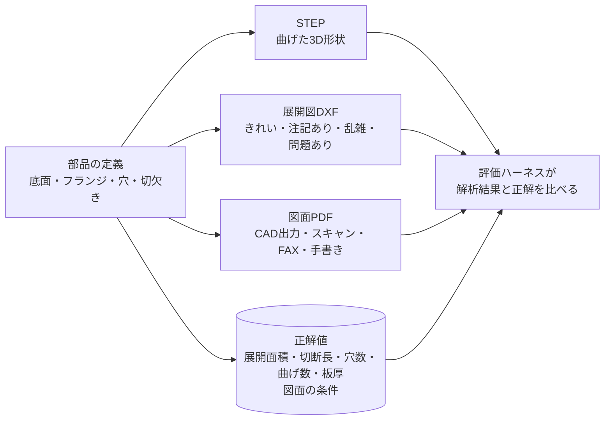

### 正解の決め方

- **形状**：正解は、解析する側（本システム）とは独立に、展開した立体から計算する（面積 ＝ 体積 ÷ 板厚、切断長 ＝ 側面の面積 ÷ 板厚、穴数 ＝ 展開図の内側の輪郭の数）。生成器は、曲げる前と後で体積が一致すること等を確かめ、合わない部品は捨てて作り直す
- **図面PDF**：図面に書く条件（材質・数量など）を先に決めてから描く。正解は **改訂後の最新の値**、書いていない項目は「記載なし」、マスターにないものは「未登録」
- 正解値は凍結したファイル（`golden/datasets/*.json`）に保存し、評価のたびに、データが作り直されても同じであることを確かめる（`--verify-frozen`）

### 開発用とホールドアウトを分ける理由

開発中に何度も見て直したデータでは、たまたまそのデータに合うように作り込んでしまう（過剰適合）ことがある。そこで、**別の乱数（seed）で作ったホールドアウト** を用意し、開発中は開かず、最後に一度だけ評価して、初めて見るデータでも同じ精度が出るかを確かめる。

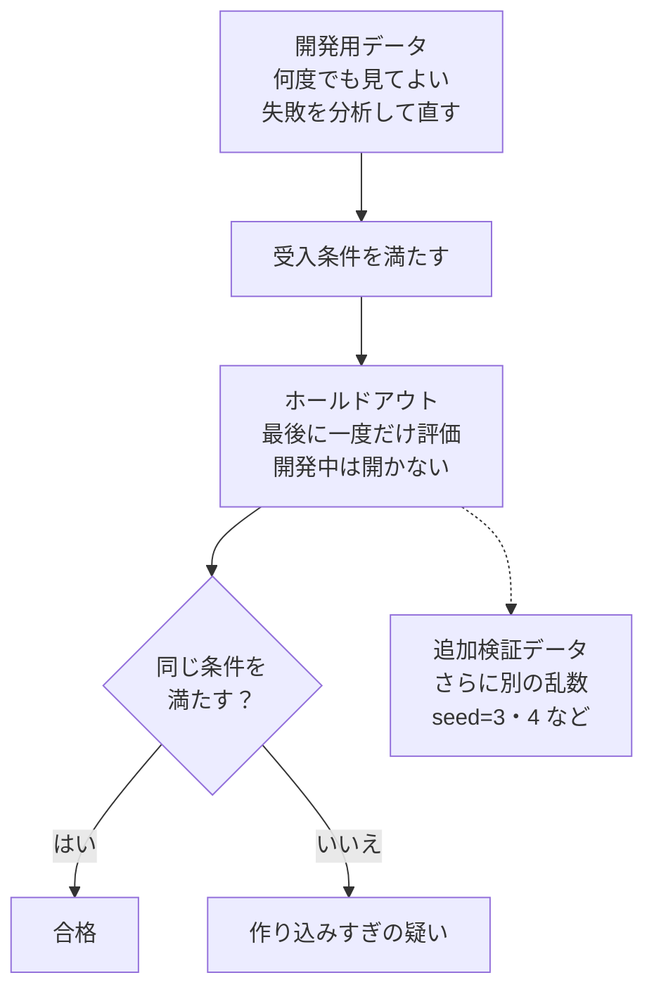

### 漏れを防ぐ決まり

- 正解データ（生成器と凍結ファイル）を変えて合格させない
- ホールドアウトの正解ファイルと、ホールドアウトだけで使う図面の様式（`golden/pdf_unseen.py`）は開かない。ホールドアウトのデータは最終判定のときだけ作る
- ホールドアウトの評価レポートには図面ごとの正解値を書かない（`--hide-examples`）
- 評価を終えたホールドアウト（STEP の holdout_v1、DXF の dxf_holdout_v1、図面PDFの pdf_holdout_v1）は過去見積の種データに使ったため、今後の最終判定には別のデータ（STEP の seed=3・4、DXF の seed=23、図面PDFの seed=33 など）を使う

## 判定の区分とスコアの定義

### 形状の解析（STEP・DXF）

1件ごとに、次のどれか1つに分類する。値が正しいとは、板厚・展開面積・切断長の誤差が **±10% 以内** で、曲げ数・穴数（STEP はヘムの数も）が正解と **一致** すること。

| 区分 | 意味 | よい・わるい |
|---|---|---|
| 確定で正解 | 値が正しく、見積も確定で出る | 目指す状態 |
| 正解だが概算 | 値は正しいが「概算」表示になる | 安全だが、担当者の確認が増える（慎重すぎる） |
| 誤り（概算表示あり） | 値が誤っているが「概算」表示で注意が促される | 担当者が気づける |
| **危険誤答** | **値が誤っているのに確定で出る** | **最も避けたい。誤った金額がそのまま出る** |
| 解析不可 | 値を返さない（理由つき） | 金額は出ないが、誤りもしない |

- **解析成功** ＝ 確定で正解 ＋ 正解だが概算（値が正しい割合）
- DXF の変種 X（問題のある図面）は、**確定で返さないこと** が正解。確定で返したら危険誤答
- 「概算」表示は、見積の計算（`QuoteEngine`）が概算と判定することを指す。今の画面では「部分成功」「確認してください」として出る（見積書には概算の区別はない）

### 図面PDFからの情報抽出

項目（材質・板厚・数量・表面処理・追加加工・特急・図番・改訂・特記事項）ごとに分類する。

| 区分 | 意味 |
|---|---|
| 正解 | 値が正しく、要確認にもしていない |
| 正解（要確認） | 値は正しいが、担当者の確認に回した |
| 誤り（要確認） | 値が誤っているが、要確認にしたので担当者が気づける |
| **危険誤答** | 値が誤っているのに、要確認にせず確定で返した（誤った条件で金額が出る） |

| スコア | 定義 | なぜ見るか |
|---|---|---|
| 正解率 | 正解 ＋ 正解（要確認）の割合 | 読み取りそのものの正しさ |
| 危険誤答率 | 危険誤答の割合（項目ごと、図面ごと） | 誤った金額を出さないか |
| 価格項目がすべて正しい | 6つの価格項目がすべて正解（要確認を含む）の図面の割合 | 図面1枚として使えるか |
| **自動確定** | 価格項目がすべて「正解」（要確認なし）の図面の割合 | 担当者の手間がどれだけ減るか。要確認を付けすぎると下がる |

**危険誤答を減らす** ことと **自動確定を上げる** ことは引っ張り合う（何でも要確認にすれば危険誤答は0になるが、担当者の手間が減らない）。受入条件は両方に目標を置いている。

## STEPの解析

### データ

形状を5つのレベルに分けた。開発用は各レベル100件＋手作り8件（508件）。

| レベル | 形状 | 主な範囲 |
|---|---|---|
| Lv0 | 平板：丸穴・長穴・角穴（傾きを含む）・外周切欠き・角落とし | 40〜300 × 30〜200 mm、穴1〜10個 |
| Lv1 | 平行曲げのみ：L・U・Z・ハット・多段（上下混在） | 曲げ1〜4、90°主体＋30/45/60/120/135° |
| Lv2 | 底面＋1段フランジ（2〜4辺）、部分幅フランジ、曲げリリーフ | フランジ長 6t〜60 mm |
| Lv3 | Lv2＋フランジ上のフランジ（返し・段付き）深さ3まで | 曲げ3〜10 |
| Lv4 | ヘム（180°曲げ、オープンヘム） | 内R 0.5t〜1t |

{.medium}

**受入条件**：レベルごとに解析成功 90% 以上、危険誤答 2% 以下（ホールドアウトでも）、1部品あたり平均5秒以内。

### 結果

| データ | 件数 | Lv0 | Lv1 | Lv2 | Lv3 | Lv4 | 危険誤答 | 平均処理時間 |
|---|---:|---:|---:|---:|---:|---:|---:|---:|
| 開発用（seed=1） | 508 | 100% | 100% | 100% | 100% | 100% | 0件 | 0.1〜0.4秒 |
| ホールドアウト（seed=2） | 200 | 100% | 100% | 100% | 100% | 100% | 0件 | 0.1〜0.4秒 |
| 追加検証（seed=3） | 1,000 | 100% | 100% | 100% | 100% | 100% | 0件 | 0.1〜0.8秒 |
| 追加検証（seed=4） | 1,000 | 100% | 100% | 100% | 100% | 100% | 0件 | 0.1〜0.7秒 |

（数字は「確定で正解」の割合。値を返した部品の面積・切断長の誤差の中央値と95パーセンタイルはいずれも 0.0%。seed=4 の Lv2 に理由コード `BEND_UNDETERMINED` の付いた部品が1件あり、レポートの割合は整数に丸めて表示している（200件中1件は0.5%））

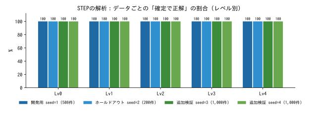

改善前のロジック（トレーの展開がフランジを矩形とみなしていた）と比べると、曲げのある部品で大きく改善した。改善前は Lv2・Lv3 で危険誤答が6割を超えていた。

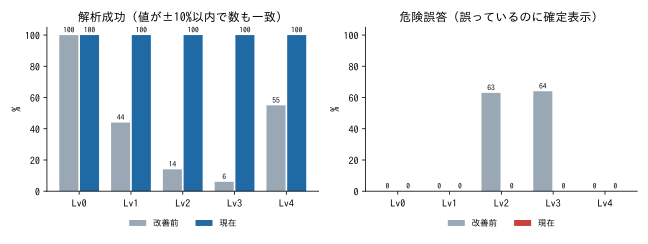

### ストレステスト

生成の手順そのものを変えた形状（任意の姿勢、多角形の底面、角度の混在、閉じた筒、短い平坦部、直交フランジ、大きなフランジ、多段、12区分×40件＝480件）でも確かめた。

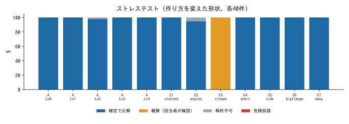

- 危険誤答は0件
- 閉じた筒（C3_closed）は40件すべてが「概算」（自己検算で見つけて確定にしない）。以前は展開値の面積がほぼ0や負のまま返っていたが、検算に失敗した展開値が体積÷板厚などから20%を超えて外れるときは体積からの概算を使うようにし、面積の誤差（中央値）は 99.9% から 0.0% になった。切断長（誤差の中央値 25.8%）と穴数は外れたままなので、不合格の区分として残っている（改善の候補）
- 解析不可は3件（A_Lv2 で1件、C2_angles で2件、いずれも `BEND_UNDETERMINED`）

### LLMだけ・LLMを足した場合との比較

ルールベースの解析に Claude API（LLM）を足す方式を試した（開発用の各レベル先頭20件、計100件）。

| 構成 | 解析成功 | 確定で正解 | 正解だが概算 | 危険誤答 | 平均処理時間 | 1件あたりトークン（入力/出力） |
|---|---:|---:|---:|---:|---:|---:|
| ルールベースのみ（採用） | 100/100 | 100 | 0 | 0 | 0.2秒 | 0 / 0 |
| ＋LLMレビュー | 100/100 | 74 | 26 | 0 | 5.9秒 | 1,520 / 355 |
| ＋LLM独立カウント（プロンプトA） | 99/100 ※ | 22 | 77 | 0 | 13.8秒 | 4,192 / 1,055 |
| ＋LLM独立カウント（プロンプトB） | 100/100 | 16 | 84 | 0 | 14.8秒 | 4,265 / 1,032 |

※ 1件は API のクレジット残高不足による解析不可で、LLM の判断ではない。

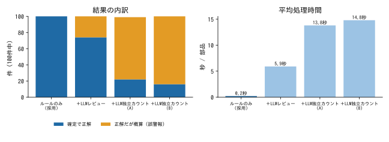

- LLM を足しても解析成功率は上がらず、正しい値を「概算」にする誤警報が増え、処理時間が大きく延びた。**採用はルールベースのみ**
- LLM が面の一覧から自分で数えた値の正答率は、曲げ数 41%、ヘム数 69%、穴数 38%（3つとも一致 22%）
- STEP を LLM だけで解析する方式（比較用の解析器）は用意したが、API のクレジットが尽きたため **評価は未実施**

## 展開図DXFの解析

### データ

STEP と同じ部品を、4通りに描き分けた（開発用 各レベル40部品 × 4変種 ＝ 800ファイル）。板厚は入力として渡す。

| 変種 | 内容 | 正しい結果 |
|---|---|---|
| D0 きれい | 切断輪郭（レイヤ CUT）と曲げ線（レイヤ BEND）だけ | 正しい値 |
| D1 注記あり | 図枠・表題欄・寸法・穴の中心線・曲げ注記・ケガキ線。レイヤ名は英語か日本語 | 切断輪郭と曲げ線だけを拾う |
| D2 乱雑 | D1 の内容を意味のないレイヤに描く。線の分割・重複・微小なすき間・円弧つきポリライン・ブロック参照・半円2つの穴・2本に分けた曲げ線、30% はインチ単位 | 見た目どおりの部品として正しい値 |
| X 確定してはいけない | 外周が 0.3〜2 mm 開いている、または1ファイルに2部品 | 確定で返さない |

**受入条件**：変種 D0・D1・D2 のそれぞれと、形状レベルごとに解析成功 90% 以上、危険誤答 変種ごとに 2% 以下（X を確定で返したら危険誤答）、ホールドアウトでも満たす、1ファイル平均2秒以内。

### 結果

| データ | ファイル数 | D0 | D1 | D2 | X（確定しない） | 危険誤答 | 平均処理時間 |
|---|---:|---:|---:|---:|---:|---:|---:|
| 開発用（seed=21） | 800 | 100% | 100% | 100% | 100% | 0件 | 0.02〜0.04秒 |
| ホールドアウト（seed=22） | 400 | 100% | 100% | 100% | 100% | 0件 | 0.02〜0.03秒 |
| 追加検証（seed=23） | 800 | 100% | 100% | 100% | 100% | 0件 | 0.02〜0.03秒 |

（D0〜D2 は解析成功＝値が正しい割合、X は「確定しない」割合。X は全件が解析不可で、理由コードは実際の問題（開いた外形／2部品）と一致した。）

2026-09-28 に、確定にしない規則を足した（単位が mm 以外 `UNIT_NOT_MM`、曲げ線がない `NO_BEND_LINES`、実線の曲げ線で区切られた部品を図枠と取り違えない、外形と別の色・レイヤの閉じた線、寸法に表示された数値との照合）。開発用で再評価した結果、値の正しさと危険誤答は変わらず、次の図面が「確定で正解」から「正解だが概算」に移った。ホールドアウトと追加検証の数字は、規則を足す前の評価である（評価を終えたデータのため、作り直していない）。

| 変種 | 確定で正解 | 正解だが概算 | 概算の理由コード |
|---|---:|---:|---|
| D0 きれい | 80% | 20% | NO_BEND_LINES 40件（平板） |
| D1 注記あり | 80% | 20% | NO_BEND_LINES 40件（平板） |
| D2 乱雑 | 58% | 42% | UNIT_NOT_MM 56件（インチ単位）、NO_BEND_LINES 40件（平板） |

平板は、画面の「曲げなし（平板）」（API の `flat_confirmed`）を指定すれば確定になる。インチ単位の図面は、mm で描いた図面の単位が誤ってインチになっている場合と見分けられないため、確定にしない。

### 素朴なベースラインとの比較

「切断用のレイヤ（CUT／外形）の線だけを拾う」素朴な方法（`golden/dxf_naive_baseline.py`）と比べた。素朴な方法は、レイヤが整理されていない D2 を1件も解析できず、問題のある X の 97% を確定で返してしまう（危険誤答）。

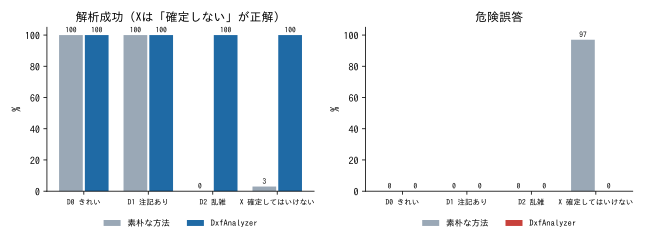

## 図面PDFからの情報抽出

### データ

図面PDFから **見積の金額に影響する条件** を読み取る力を測るデータ（開発用 300枚、各レベル60枚）。

| 観点 | 内容 |
|---|---|
| PDFの種類 | CAD出力（文字が取り出せる）50%、スキャン 20%、FAX 20%、手書き・押印 10% |
| 様式 | JIS和文（119枚）、英文ISO風（57）、和英併記（45）、部品表つき（37）、表題欄のない簡易図・A4縦（42）。A3が75枚、2ページが30枚 |
| 書く項目 | 価格項目をすべて書いた図面が99枚、残り201枚は1〜4項目を書いていない |
| 書く場所 | 表題欄・注記・部品表・メモ（自由記述）・改訂表・図中の引出線・押印・手書き |
| 表記ゆれ | 全角、規格名つき、和名（ボンデ鋼板）、英語、誤字、タップの書き方（`4-M4`、`M4タップ 4ヶ所`、`4X M4x0.7 TAP THRU`）など |
| マスターにないもの | 材質18枚、表面処理18枚、追加加工40枚 |
| 改訂 | 改訂表あり106枚、うち価格項目を変える改訂83枚。19枚は表題欄の値が古いまま（改訂表の最新値が正解） |
| 手書き | 数量の訂正7、表面処理の訂正2、加工の追記9、特急の追記5、結果に影響しないメモ24 |
| 紛らわしいもの | タップの下穴、部品表の金具の材質、「月産500個予定（参考）」、「相手部品：A5052」、「急ぎません」、旧図番、FAXの送信ヘッダー |

### 読み取る項目と正解の規則

| 区分 | 項目 | 正解 |
|---|---|---|
| 価格項目 | 材質・板厚・数量・表面処理・追加加工・特急 | 改訂後の最新の値。書いていなければ「記載なし」、マスターにないものは「未登録」（似たコードに寄せない）。追加加工は1個あたりの数。ただの穴は追加加工ではない |
| 補助 | 図番・改訂 | 図面の図番と最新の改訂記号 |
| 特記事項 | 厳しい公差・外観の指定・検査や証明書の要求 | 普通公差・定型注記・色の指定は含めない |

**受入条件**：価格項目それぞれ 95% 以上（PDFの種類ごとに 90% 以上）、危険誤答 項目ごと 1% 以下・図面の 2% 以下、自動確定 75% 以上、図番・改訂・特記事項 90% 以上、ホールドアウトでも満たす（開発用にない様式だけでも 90% 以上）、1枚あたり平均30秒以内。

### 開発用データの結果（300枚）

| 指標 | 値 |
|---|---:|
| 価格項目がすべて正しい | 99.3% |
| 自動確定（要確認なしで全項目正解） | 92.7% |
| 危険誤答を含む図面 | 0.0% |

| 項目 | 正解率 | 危険誤答 | 要確認の割合 |
|---|---:|---:|---:|
| 材質 | 100.0% | 0.0% | 0.3% |
| 板厚 | 99.7% | 0.0% | 0.7% |
| 数量 | 99.7% | 0.0% | 1.3% |
| 表面処理 | 100.0% | 0.0% | 3.3% |
| 追加加工 | 100.0% | 0.0% | 2.0% |
| 特急 | 100.0% | 0.0% | 0.0% |
| 図番 | 99.7% | 0.3% | 0.0% |
| 改訂 | 100.0% | 0.0% | 0.0% |
| 特記事項 | 98.3% | 1.7% | 0.0% |

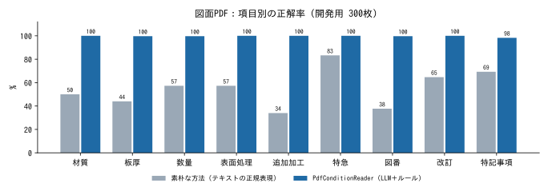

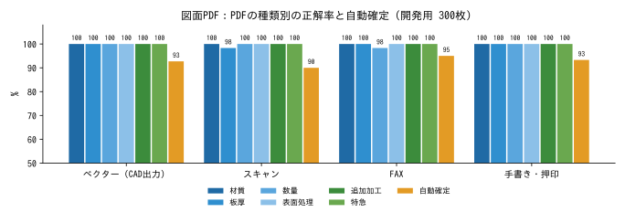

**書かれている場所別**：材質（表題欄162・注記53・メモ25・部品表21）、追加加工（引出線160・注記79・部品表13・メモ12）、数量（表題欄124・注記45・部品表21・メモ17）、表面処理（表題欄107・注記62・メモ30）、板厚（表題欄145・注記45・メモ28）、特急（注記38・押印10・表題欄8・メモ7・手書き5）のすべての場所で正解率 100.0%。

**様式別**：価格項目がすべて正しい図面は、和英併記 100.0%、英文ISO風 100.0%、部品表つき 97.3%、JIS和文 99.2%、簡易図 100.0%。自動確定は 89.2%〜100.0%。

### 方式の比較

| 方式 | 価格項目がすべて正しい | 自動確定 | 危険誤答を含む図面 | LLM呼び出し | トークン（入力／出力） | 1枚あたりの時間 |
|---|---:|---:|---:|---:|---:|---:|
| 素朴な方法（文字の正規表現のみ、LLMなし） | 5.3% | 5.3% | 94.7% | 0 | 0 / 0 | 0.0秒 |
| LLM 1回読み＋ルール（初版） | 98.0% | 76.0% | 0.3% | 約300 | 3,095,225 / 164,774 | 約6秒 |
| ＋画像の図面は2回読みで照合 | 97.7% | 92.3% | 1.0% | － | － | 約7秒 |
| **最終版**（＋CAD図面の読み落とし検査と再読み、文字からの特記事項） | **99.3%** | **92.7%** | **0.0%** | 453 | 5,685,923 / 274,143 | 約6〜7秒 |

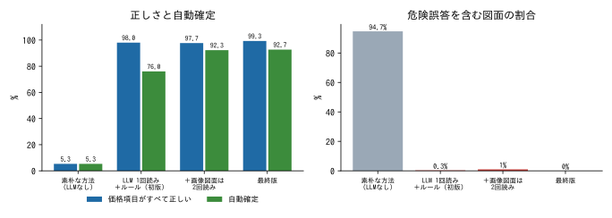

- **LLMなしでは実用にならない**：スキャン・FAX・手書きは文字データがなく、CAD図面でも書く場所・表記ゆれ・改訂・部品表が多様で、正規表現だけでは 5.3% しか全項目が正しくならない
- **LLM は書き写しだけ、判断はルール**：LLM にマスターのコードまで選ばせると対応を誤った（登録済みの M6・M8 タップを「未登録」にするなど）
- **2回読み**：LLM の「自信なし」の自己申告は正しい値にも多く付くため使わず、画像の図面は独立した2回の読み取りが一致したときだけ確定にした（自動確定 76.0%→92.3%）
- **読み落とし検査**：2回読みで危険誤答が一時 1.0% に増えた（CAD図面の追加加工の読み落とし）。文字データにある加工指示が結果にないときに読み直す仕組みで 0.0% にした
- 時間は、6並列で300枚を読んだ実時間（初版305秒、2回読み版354秒）× 並列数 ÷ 枚数による推定。最終版の開発用の結果は保存済みの応答からの再評価のため、レポート上の平均処理時間（0.7秒）は実際の API の時間ではない。1枚あたりのトークンは平均 入力約19,000／出力約900、呼び出し約1.5回

### ホールドアウトの結果（判定は途中）

ホールドアウト（200枚、うち約2割は開発用にない様式）の評価は、実行中に Claude API のクレジット残高が尽き、**52枚が読み取れていない**。レポート上の値（価格項目がすべて正しい 73.0% など）は、この52枚を不正解として数えたもので、正式な判定ではない。

読み取れた148枚だけの参考値：

| 対象 | 枚数 | 材質 | 板厚 | 数量 | 表面処理 | 追加加工 | 特急 | 自動確定 | 危険誤答の図面 |
|---|---:|---:|---:|---:|---:|---:|---:|---:|---:|
| 読み取れた全図面 | 148 | 98.0% | 99.3% | 98.6% | 95.3% | 100.0% | 98.6% | 90.5% | 0 |
| CAD出力 | 75 | 98.7% | 98.7% | 100.0% | 100.0% | 100.0% | 100.0% | 97.3% | 0 |
| スキャン | 29 | 96.6% | 100.0% | 100.0% | 100.0% | 100.0% | 96.6% | 93.1% | 0 |
| FAX | 30 | 96.7% | 100.0% | 96.7% | **76.7%** | 100.0% | 100.0% | 70.0% | 0 |
| 手書き | 14 | 100.0% | 100.0% | 92.9% | 100.0% | 100.0% | 92.9% | 92.9% | 0 |
| 開発用にない様式 | 28 | 96.4% | 100.0% | 100.0% | 92.9% | 100.0% | 96.4% | 85.7% | 0 |

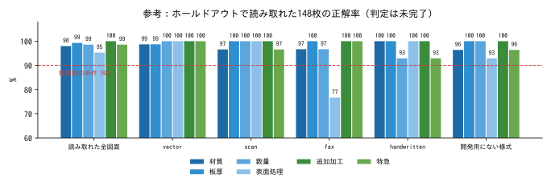

- **FAX図面の表面処理（76.7%）が、種類別の条件（90%）を下回っている。** FAX は40枚なので、残り10枚がすべて正しくても最大 82.5% で、この条件は満たせない
- 危険誤答は0件なので、正しくなかった値は要確認として担当者の確認に回っている。なお、ホールドアウトのレポートには「不足分は値が正しく要確認になったもの」という説明があるが、評価ハーネスの正解率は要確認でも値が正しければ正解に数える定義なので、この説明は数字と合わない。レポートの説明は見直す予定である（`analysis/handoff_pdf_followup.md`）
- ホールドアウトの個々の誤りは見ておらず、ホールドアウトに合わせた調整もしていない

## 類似見積（参考価格の効果）

過去見積の種データ（架空、2,084件）のうち、今のマスターで標準単価を計算できる1,045件について、**それより前の日付の見積だけを過去として** 類似見積を検索し、参考単価（過去の出し値の水準で見た今回の単価）を実際の単価と比べた。比べる相手は自動見積（標準単価）だけの場合。

| 対象 | 件数 | 方式 | 平均誤差 | 中央値 | ±10%以内 |
|---|---:|---|---:|---:|---:|
| 全体 | 1,045 | 自動見積だけ | 10.8% | 8.9% | 54.6% |
| 全体 | 1,045 | 類似見積を使う | 7.9% | 6.2% | 70.2% |
| リピート（前回の見積がある） | 270 | 自動見積だけ | 9.9% | 8.5% | 57.4% |
| リピート（前回の見積がある） | 270 | 類似見積を使う | 4.9% | 3.9% | 88.9% |

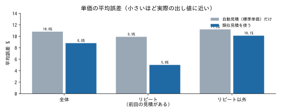{.medium}

全体とリピートのそれぞれで、類似見積を使うほうが実際の単価に近い（受入条件を満たす）。検索は1万件の履歴でも1件あたり最大35ミリ秒だった。種データは合成であり、実際の見積履歴での効果はまだ確かめていない。

## まだ確かめられていないこと

| 項目 | 状況 | 次にすること |
|---|---|---|
| 図面PDFのホールドアウトの判定 | 200枚中52枚が API のクレジット不足で未読。読めた範囲でも FAX の表面処理が条件を下回る | 懸念点への対応のあと、新しいホールドアウト（seed=33）で一度だけ最終判定する（`analysis/handoff_pdf_followup.md`） |
| 知らない言い回しへの強さ | 開発用とホールドアウトは同じ語彙で作っているため、**知らない書き方に対して安全側に倒れるか**（黙って誤らないか）は測れていない。見つかっていた「特急不要」「特急：なし」「NO URGENT」を特急と判定する経路は、否定の規則を足して直した（開発用300枚の結果は変わらない）。語彙をずらしたデータの評価は、記録済みの応答がなく API の呼び出しが要るため未実施 | 語彙をずらしたデータ（pdf_shift_dev、100枚）で安全性の判定（危険誤答 項目ごと1%以下・図面の2%以下）を行う |
| 実際の顧客の図面・データでの評価 | まだない。評価はすべて合成データ | 実データを入手し、形状の分類ごとの件数・正解値・誤差を記録する |
| STEP を LLM だけで解析する方式 | 解析器はあるが評価は未実施（API のクレジット不足） | 比較のために、クレジットの補充後に20件ずつ評価する |
| 実際の見積履歴での類似見積の効果 | 種データ（合成）でだけ確かめた | 実際の履歴を取り込んで同じ評価を行う |

## 出典（評価レポート）

| 対象 | レポート |
|---|---|
| STEP | `analysis/golden_eval_latest.md`（開発用）、`golden_eval_holdout.md`、`golden_eval_seed3.md`、`golden_eval_seed4.md`、`golden_eval_baseline_10pct.md`（改善前）、`stress_eval.md`、`llm_comparison.md` |
| DXF | `analysis/dxf_eval_latest.md`、`dxf_eval_holdout.md`、`dxf_eval_seed23.md`、`dxf_eval_baseline.md` |
| 図面PDF | `analysis/pdf_eval_latest.md`、`pdf_eval_holdout.md`、`pdf_eval_baseline.md`、`pdf_llm_comparison.md`、`pdf_golden_design.md` |
| 類似見積 | `analysis/similar_quotes_eval.md` |
