# 形状（STEP）解析ロジックの解説
<!-- meta {"version": "1.1", "date": "2026-09-29", "audience": "経営者・顧客・開発者", "id": "DOC-06"} -->

## この資料について

板金部品のSTEPファイルから、板厚・展開面積・切断長・穴の数・曲げの数を、AIを使わずに幾何の計算だけで求める。求めた値は別の道すじでも計算し直し、合わなければ「概算」として担当者に確認を促す。

この資料では、例としてL字の金具を最初から最後まで追いかける。

| 項目 | 値 |
|---|---|
| 板厚 | 2mm |
| 底 | 100 × 60mm、φ10の穴1つ |
| 立ち上がり | 高さ40mm（底の下面から）、φ8の穴1つ |
| 曲げ | 1か所、90°、内側の丸み（内R）2mm |

## 全体の流れ

解析は9つの手順を上から順に進む。

- 手順1〜5：「これは一定の板厚の板金か」を確かめる
- 手順6〜7：広げて数える
- 手順8〜9：自分の答えを検算して、結果の状態を決める

途中で板金と認められなければ、その場で「解析不可」として止まり、金額は出さない。

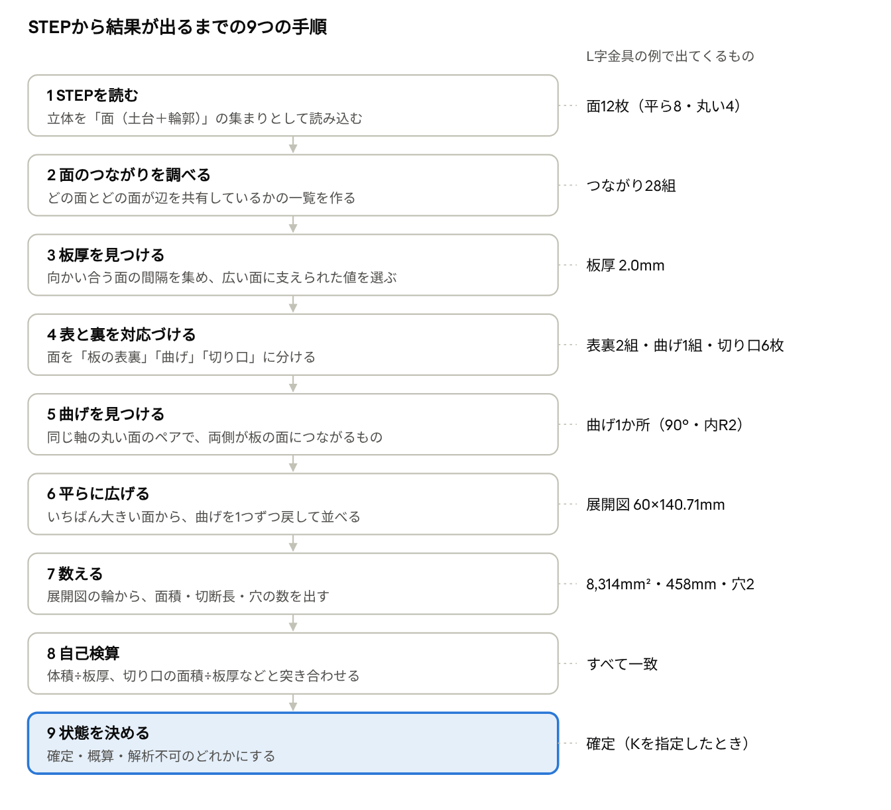

**この解析にAI（LLM）は使っていない。** すべての値は形の幾何計算で決まる。同じファイルなら、何度解析しても同じ結果になる。

## 手順1　STEPを読む：「面」とは何か

STEPファイルは、立体を「表面（面）の集まり」として記録している。面はサイコロの面と同じ考え方で、立体を包む皮を、折れ目や境目で区切った1区画を指す。例のL字金具は12枚の面でできている。

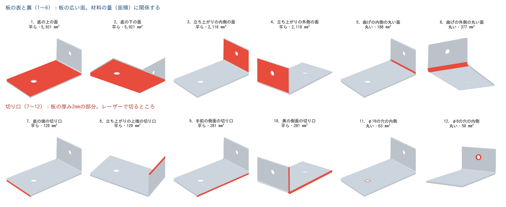

12枚は役割で2つに分かれる。

- **板の表と裏（1〜6）**：板の広い面。曲げの部分の内側と外側（5・6）も含む。材料の量（面積）に関係する
- **切り口（7〜12）**：板の厚み2mmの細い帯。レーザーで切るところ。穴の内側の壁（11・12）も含む

### 面は「土台」と「輪郭」の組

STEPの中では、1枚の面が次の2つの組で書かれている。

- **土台**：どこまでも広がる平面か円柱。平面なら「向きと位置」（例：z＝2、高さ2mmの水平な面）、円柱なら「中心の線と半径」で表す
- **輪郭**：その土台から、どの形を切り抜いたか

1枚の面は必ず1つの土台の上にある。面の分け方はSTEPを書き出したCADが決めており、解析器はそれを読むだけである。

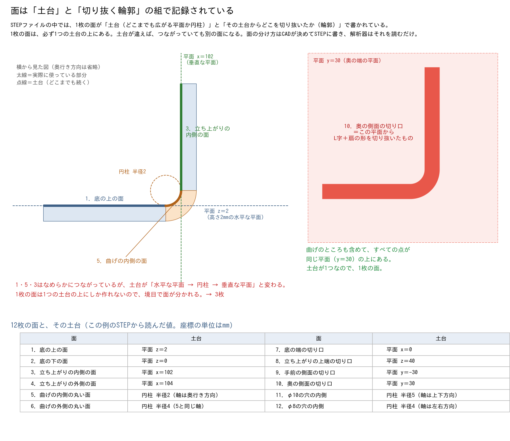

**なぜ底の上の面（1）と曲げの内側（5）は別の面か。** 横から見ると段差なくつながっているが、土台が「水平な平面 z＝2 → 半径2の円柱 → 垂直な平面 x＝102」と変わる。平面と円柱は同じ土台になれないので、境目で必ず別の面になる。

**なぜ奥の側面の切り口（10）は曲がっていても1枚か。** 横から見た断面の形（L字＋扇の形）が、奥の端の平面 y＝30 にそのまま張りついている。輪郭は曲がっていても、すべての点が同じ平面の上にあるので1枚でよい。

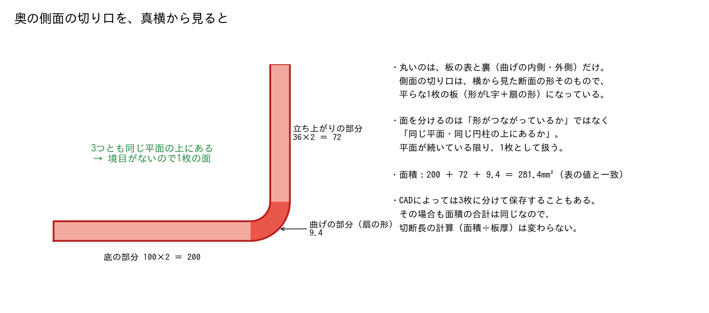{.medium}

土台が同じなら1枚に「できる」だけで、必ず1枚になるとは限らない。CADによっては同じ円柱を2枚に割って書き出す。解析器は同じ軸・同じ半径の面をまとめて1つの曲げとして扱うので、割れていても結果は変わらない（実際に、曲げを割った14枚版でも同じ値になった）。

読み込んだあと、次のことを確かめる。ひとつでも満たさなければ解析不可とする。

- 立体がちょうど1つで、体積がある（複数の部品が入ったファイルは扱わない）
- 立体のデータが壊れていない。壊れていても自動で直さない（顧客の形を勝手に変えないため）

計算の誤差を許す幅（公差）は、部品の大きさから決める。対角線の長さの1,000万分の1で、最小0.000001mm、最大0.01mm。例の金具（対角線約127mm）では約0.000013mm。

## 手順2　面のつながりを調べる

どの面とどの面が辺を共有しているかを一覧にする。例の金具では12枚の面のあいだに28組のつながりがある。この一覧（つながりの図）は、この後の手順で何度も使う。

- 手順5：丸い面の両側に板の面がつながっているか（曲げかどうか）
- 手順6：面を順にたどって平らに広げる道すじ
- 手順8：切り口の面がいくつのかたまりに分かれるか

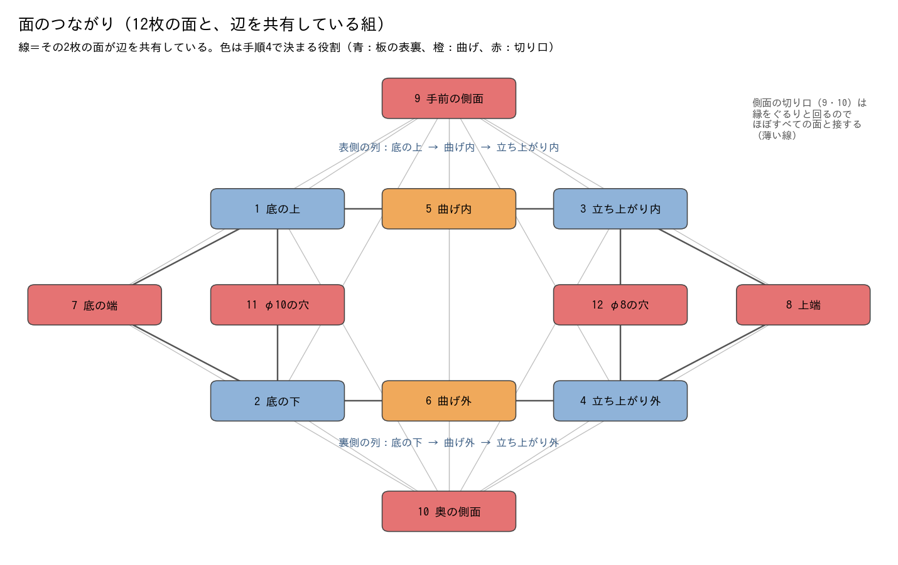

図の上の列（底の上 → 曲げ内 → 立ち上がり内）が板の表側、下の列が裏側である。表と裏は直接つながらず、必ず切り口の面（赤）をはさんでいる。穴の内側（11・12）は、穴のある板の表と裏にだけつながる。

## 手順3　板厚を見つける

板の表と裏は、板厚ぶん離れて向かい合う平らな面の組になる。そこで、向かい合う面の組をすべて集め、その間隔を板厚の候補にする。例の金具では候補が4つ見つかり、2.0mmに決まる。

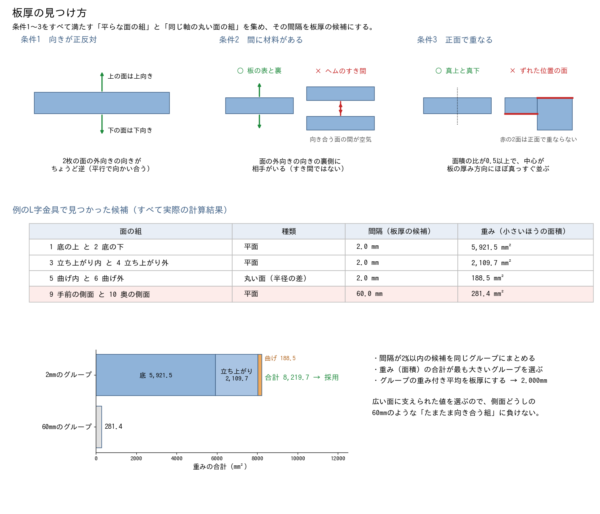

### 候補にする条件

| 条件 | 中身 | 弾くものの例 |
|---|---|---|
| 向きが正反対 | 2枚の平面の外向きの向きがちょうど逆 | 斜めや直角に交わる面 |
| 間に材料がある | 面の外向きの裏側に相手がいる | ヘム（折り返し）のすき間。板厚と同じ幅のことがある |
| 正面で重なる | 面積の比が0.5以上。中心どうしのずれが、厚み方向では間隔の2%以内、横方向では面の大きさ（面積の平方根）の1/4以内 | 段差のある形で、離れた場所にある逆向きの面 |

同じ軸の丸い面の組（曲げの内側と外側）も候補に入れる。このときの間隔は半径の差（4 − 2 ＝ 2mm）。

### 候補から板厚を選ぶ

1. 候補ごとに「重み」をつける。重みは2枚のうち小さいほうの面積
2. 間隔が2%以内の候補を同じグループにまとめる
3. 重みの合計がいちばん大きいグループを選び、その重み付き平均を板厚にする

例では、手前と奥の側面（9・10）も「向かい合う平面で間に材料がある」ので、60mmの候補になる。しかし重みは281.4で、2mmのグループ（8,219.7）に負ける。広い面に支えられた値を選ぶので、たまたま向き合う面にはまどわされない。

### 選んだ板厚を確かめる

板厚を決めたあと、次の2つを確かめる（手順4で表裏のペアを作ったあとに行う）。

- **体積と合うか**：表裏のペアの面積（2枚の平均）の合計が、体積 ÷ 板厚 と8%以内で合うか。合わなければ板厚が一定でないとみなして解析不可。例：8,313.9 と 16,627.9 ÷ 2 ＝ 8,313.9（差0%）
- **板らしい形か**：板厚 ÷ √（体積 ÷ 板厚）が0.2以下か。分厚いブロックのような形を弾く。例：2 ÷ √8,313.9 ＝ 0.02

## 手順4　板の表と裏を対応づける

決まった板厚で、面を「表と裏のペア」に組む。ペアになった面は板の表裏か曲げ、ペアにならなかった面は切り口と決まる。例では表裏2組・曲げ1組・切り口6枚に分かれる。

1. 手順3と同じ条件で、間隔が板厚の2.5%以内の組を集める
2. 面積の大きい組から順に確定する。1枚の面は1つのペアにしか入れない
3. 残った面を切り口とする。切り口が1枚もなければ展開できないので解析不可

| 役割 | 決まり方 | 例の金具 |
|---|---|---|
| 板の表裏 | 平らな面のペア | 1と2（底）、3と4（立ち上がり） |
| 曲げ | 同じ軸の丸い面のペア | 5と6 |
| 切り口 | ペアにならなかった面 | 7〜12（端・上端・側面2枚・穴の内側2枚） |

側面の切り口（9・10）は向かい合っているが、間隔が60mmで板厚と違うのでペアにならない。穴の内側は丸い面が1枚しかなく、同じ軸で半径が板厚ぶん違う相手がいないので、やはりペアにならない。つながりの図（手順2）の色は、この役割を表している。

切り口の面は、すべて幅が板厚（2mm）の帯である。この性質を、手順8の切断長の検算に使う。

## 手順5　曲げを見つける

曲げは「同じ軸の丸い面のペアで、両側に板の平らな面がつながっているもの」として見つける。角度は丸い面が中心の線のまわりに何度ぶん回っているかで読むので、90°以外の曲げも同じ方法で読める。

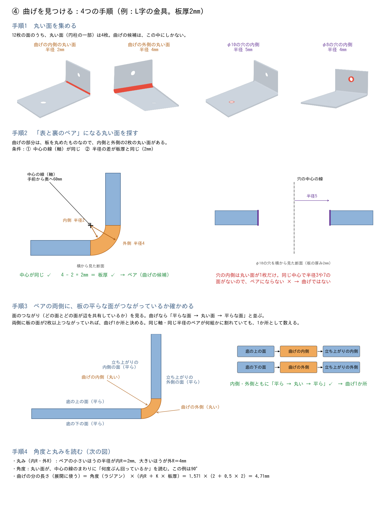

1. **丸い面を集める**：曲げの候補は丸い面の中にしかない。例では4枚（曲げの内側・外側、穴の内側2枚）
2. **表と裏のペアになる丸い面を探す**：中心の線が同じで、半径の差が板厚と同じもの（手順4で作ったペア）。穴の内側は相手がいないので曲げではない
3. **両側に板の平らな面がつながっているか確かめる**：「平ら → 丸い → 平ら」と並んでいれば曲げ1か所。同じ軸・同じ半径のペアが何組かに割れていても、1か所として数える
4. **角度と丸みを読む**：ペアの小さいほうの半径が内R、大きいほうが外R。角度は、STEPに記録された丸い面の「どこからどこまで回っているか（角度の範囲）」をそのまま読む。この角度は板の向きが何度変わったかになり、両側の平らな面の向きの差と同じである

### 90°以外の角度での確認

底100×60mm・板厚2mmに立ち上がりを1つつけ、角度と丸みを変えた13個の形を解析器にかけた（K＝0.5を指定）。すべて「確定」になり、角度・丸み・展開面積・切断長が正解と一致した。

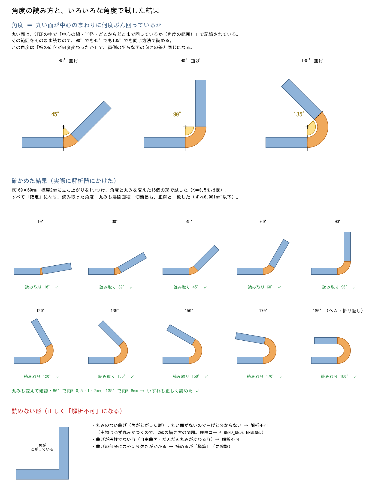

- 角度：10・30・45・60・90・120・135・150・170・180°（180°はヘム＝折り返し）
- 丸み：90°で内R 0.5・1・2mm、135°で内R 6mm
- 開発用のゴールデンデータ（508件）にも、30・45・60・120・135°の曲げとヘムが含まれ、すべて正解している

### 曲げが読めないとき

次のどちらかが見つかると、曲げを確かに読めないので解析不可（BEND_UNDETERMINED）にする。

- **角がとがった折れ**：板の表裏の面どうしが、向きの違うまま直接つながっている。丸みが0の曲げで、実物にはありえない（CADの描き方の問題）
- **相手のいない長い丸い面**：ペアにならない丸い面のうち、軸方向の長さが板厚の2.5倍を超えるもの。穴の内側は長さが板厚と同じなのでこれには当たらない

曲げが円柱でない形（自由曲面や、丸みがだんだん変わる形）は、表裏のペアが作れないので、多くは手順3〜4の段階で解析不可になる（試した自由曲面の形は「板厚が一定でない」で止まった）。

見積の金額は曲げの「数」だけで決まり、角度は金額に影響しない。180°のヘムも90°の曲げと同じ1回分の値段になる。角度は展開の長さ（手順6）に使われる。

## 手順6　平らに広げる（展開）

曲げた板を、曲げる前の1枚の平らな板に戻す。板の片側の面だけを使い、いちばん大きい平らな面を置いたまま、曲げを1つずつ逆に曲げ戻していく。例の展開図は60 × 140.71mmになる。

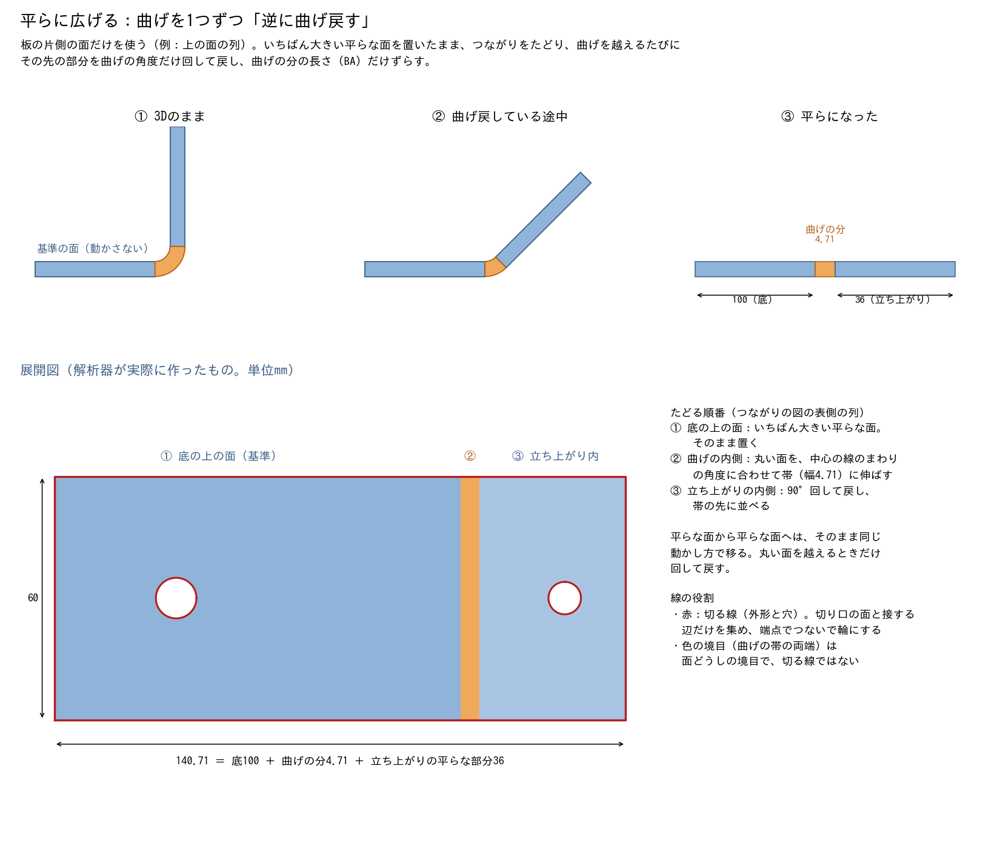

### たどり方

1. 表裏のペアのうち、いちばん面積の大きい平らな面を基準にする（例：底の上の面）。基準の面は動かさない
2. つながりの図を、基準の面から近い順にたどる。たどるのは板の表裏と曲げの面だけで、同じペアの相手（裏側）には渡らない。これで表側の列だけが集まる
3. 平らな面から平らな面へは、そのまま同じ動かし方で移る
4. 丸い面（曲げ）に来たら、丸い面を帯に伸ばす。帯の幅は曲げの分の長さ（BA、次の節）
5. 曲げの先の平らな面は、曲げの角度だけ逆に回して、帯の先に並べる

曲げが何段重なっていても、この手順を繰り返すだけでよい。形の向きや置き方（斜めに置かれた部品など）にも左右されない。

### 展開図の線を作る

広げた面の辺のうち、**切り口の面と接する辺だけ**を集める。これがレーザーで切る線である。広げた面どうしの境目（底と曲げの境など）は切る線ではないので入れない。集めた辺を端点でつないで、閉じた輪にする。

曲げの部分の辺は、丸い面の角度に合わせて伸ばしたあとの長さで測る。平らな面の辺は動かしても長さが変わらないので、元の正確な長さをそのまま使う。

### 曲げの分の長さ（BA）とKファクター

曲げると、板の内側は縮み、外側は伸びる。その間に長さが変わらない線があり、その位置を板厚の何割かで表したものがKファクター（K）である。展開したときの曲げの帯の幅は、この線の長さになる。

```
BA ＝ θ ×（内R ＋ K × 板厚）
```

θは曲げの角度（ラジアン、90° ＝ 1.571）。

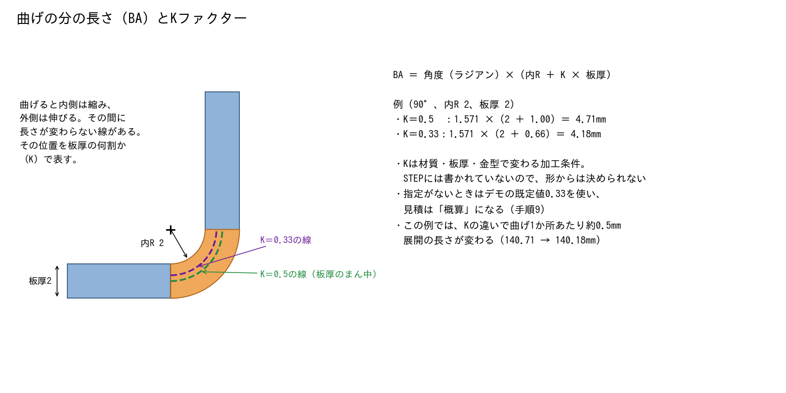

Kは材質・板厚・金型で変わる加工条件で、STEPには書かれていない。指定がなければデモの既定値0.33を使い、曲げのある部品の見積は「概算」にする（手順9）。

### 展開できなかったとき

基準にできる平らな面がない、輪が作れないなどで展開図を作れなかったときは、展開図を使わずに概算する（FLAT_PATTERN_ESTIMATED）。展開図を作れても、自己検算（手順8）が合わず、しかも展開した値が下の概算から20%を超えて外れるときは、展開した値を捨ててこの概算を使う（閉じた筒などで、面積がほぼ0や負の値のまま材料費になるのを防ぐ）。面積や切断長が0以下になるときは解析不可にする。

- 面積 ＝ 体積 ÷ 板厚（Kが0.5でなければ曲げごとに補正を足す）
- 切断長 ＝ 切り口の面の面積 ÷ 板厚
- 穴の数 ＝ 切り口の面のかたまりの数 − 1（外周のぶん）

## 手順7　数える

展開図の輪から、見積に使う4つの値を出す。例の金具は展開面積8,314mm²、切断長458mm、穴2つ、曲げ1か所である。

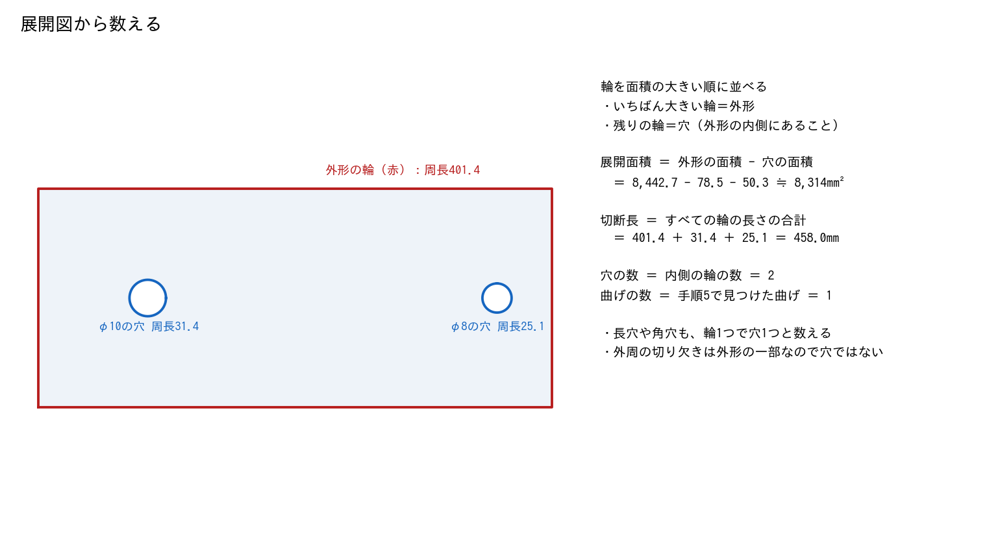

| 値 | 出し方 | 例の金具 |
|---|---|---|
| 展開面積（mm²） | 外形の輪の面積 − 穴の輪の面積 | 8,314.0 |
| 切断長（mm） | すべての輪の長さの合計（外形＋穴） | 458.0（外形401.4＋穴56.5） |
| 穴の数 | 内側の輪の数 | 2 |
| 曲げの数 | 手順5で見つけた曲げの数 | 1 |
| 展開寸法（mm） | 外形を囲む長方形の縦×横 | 60 × 140.71 |

- 輪を面積の大きい順に並べ、いちばん大きい輪を外形、残りを穴とする
- 長穴や角穴も、輪1つで穴1つと数える。長穴の両端の丸い部分を別々に数えたりはしない
- 外周の切り欠きや曲げの逃がし（リリーフ）は外形の一部なので、穴には数えない
- 解析の結果には、値ごとに「どう出したか」と「どれだけ確かか（高・中・低）」も記録する

## 手順8　自己検算

展開図から出した値を、3Dの形から直接出した値と比べる。展開のどこかが間違っていれば、どれかの検算が合わなくなる。1つでも外れたら値を確定させず「概算」にする。例の金具はすべて合った。

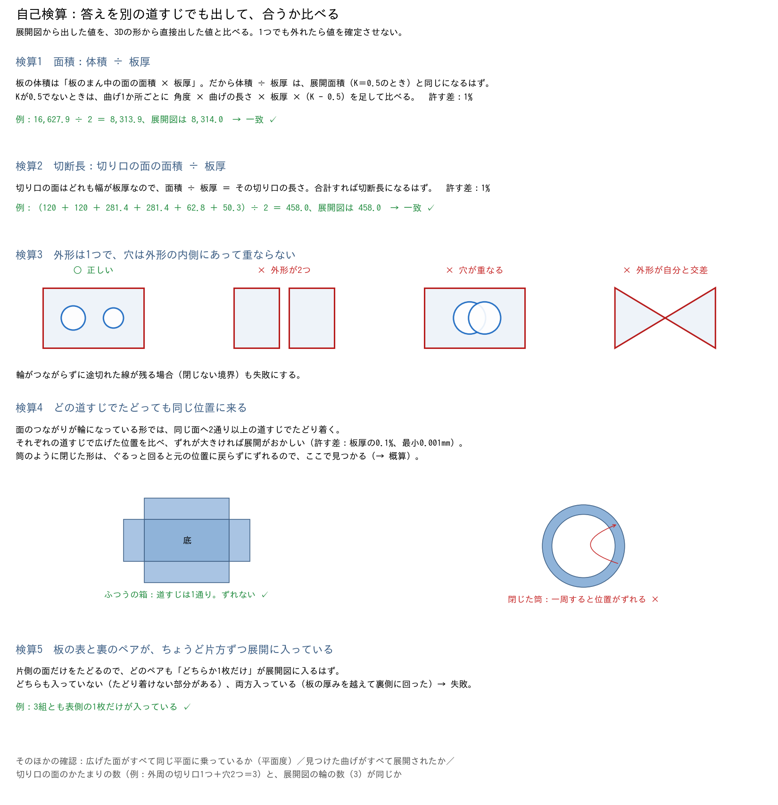

| 検算 | 比べるもの | 許す差 | 例の金具 |
|---|---|---|---|
| 1 面積 | 展開面積 と 体積 ÷ 板厚（K補正つき） | 1% | 8,314.0 と 8,313.9 |
| 2 切断長 | 展開図の輪の長さ と 切り口の面の面積 ÷ 板厚（K補正つき） | 1% | 458.0 と 458.0 |
| 3 外形 | 外形が1つで、自分と交差せず、穴が外形の内側にあって重ならない。途切れた線がない | — | 外形1・穴2 |
| 4 道すじ | 同じ面へ2通り以上でたどり着いたとき、広げた位置が一致する | 板厚の0.1%（最小0.001mm） | 道すじ1通り |
| 5 表裏ペア | どのペアも、ちょうど片方だけが展開に入っている | — | 3組とも片方 |
| 平面度 | 広げた面がすべて基準の面と同じ平面に乗っている | 板厚の0.1%（最小0.001mm） | 一致 |
| 曲げ | 手順5で見つけた曲げがすべて展開された | — | 1か所とも |
| 輪の数 | 切り口の面のかたまりの数 と 展開図の輪の数 | 一致 | 3 と 3 |

### なぜ「体積 ÷ 板厚」で面積がわかるのか

板の体積は、板のまん中の面の面積 × 板厚 である。曲げた部分も同じで、まん中の面は曲げても伸び縮みしない。だから K＝0.5（板厚のまん中）で展開した面積は、体積 ÷ 板厚 と一致するはずである。

Kが0.5でないときは、曲げ1か所ごとに面積が 角度 × 曲げの長さ × 板厚 ×（K − 0.5）だけ変わるので、そのぶんを足してから比べる。切断長も同じ考え方で、曲げの両端の辺のぶんだけ補正する。

### 検算で見つかる例

- **閉じた筒**（U字の先端どうしを突き合わせた形）：ぐるっと一周したときに位置が158〜341mmずれる。検算4で見つかり、試した40件すべてが「概算」になった。展開した面積が体積 ÷ 板厚から大きく外れるので、体積からの概算に置き換える（手順6）
- **曲げにかかる穴・切り欠き**：展開はできても、穴の形が曲げで伸びるため値を確定できない。検算とは別に見分けて「概算」にする（手順9）

## 手順9　結果の状態を決める

結果は「確定」「概算」「解析不可」の3つのどれかになる。上から順に確かめ、最初に引っかかったところで止まる。引っかかった理由は理由コードとして残す。

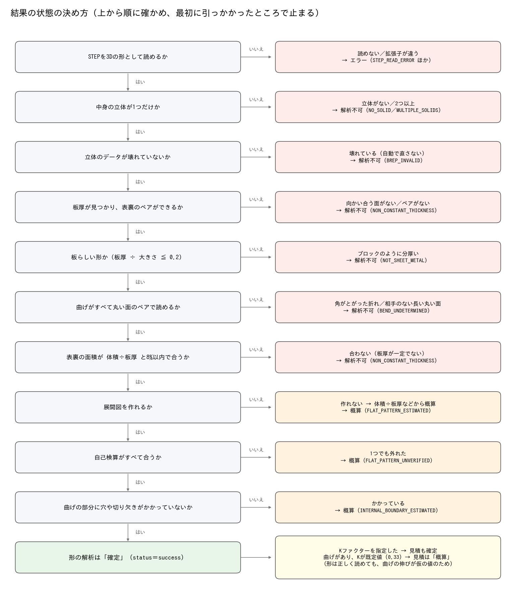

| 状態 | 意味 | 見積での扱い |
|---|---|---|
| 確定（success） | 展開図ができ、検算がすべて合い、曲げにかかる穴もない | Kを指定していればそのまま使える。曲げがあってKが既定値なら「概算」 |
| 概算（partial） | 値は出たが、確かめきれない部分がある | 「概算」と表示し、担当者に確認を促す |
| 解析不可（unsupported） | 一定の板厚の板金と認められない | 金額を出さない |
| エラー（error） | ファイルを読めない、予期しない失敗 | 金額を出さない |

### 理由コードの一覧

| コード | 状態 | どんなとき |
|---|---|---|
| INVALID_FILE_TYPE | エラー | 拡張子が .step / .stp でない |
| STEP_READ_ERROR | エラー | ファイルが空、または3Dの形として読めない |
| NO_SOLID | 解析不可 | 立体がない、または体積がない |
| MULTIPLE_SOLIDS | 解析不可 | 立体が2つ以上（複数部品） |
| BREP_INVALID | 解析不可 | 立体のデータが壊れている |
| NON_CONSTANT_THICKNESS | 解析不可 | 向かい合う面がない、表裏のペアがない、体積と合わない |
| NOT_SHEET_METAL | 解析不可 | 板厚に対して形が小さすぎる（ブロック状） |
| BEND_UNDETERMINED | 解析不可 | 角がとがった折れ、相手のいない長い丸い面 |
| FLAT_PATTERN_FAILED | 解析不可 | 切り口の面が1枚もない、面積・切断長が正にならない |
| FLAT_PATTERN_ESTIMATED | 概算 | 展開図を作れない、または検算が合わない展開値が概算から20%を超えて外れたので、体積などから概算した |
| FLAT_PATTERN_UNVERIFIED | 概算 | 自己検算のどれかが合わない |
| INTERNAL_BOUNDARY_ESTIMATED | 概算 | 曲げの部分に穴や切り欠きがかかっている |

### 見積が「概算」になる条件

見積の計算は、次のどれかに当てはまると「概算」と判定し、画面の「確認してください」に理由を出す（見積書は、担当者が作成した時点で確定として扱うので、見積書には概算の区別はない）。

- 形の解析が「概算」
- 解析に仮の値を使った（曲げがあってKが既定値のとき）
- 値のどれかの確かさが「中」か「低」

## 汎用性の確かめ方（テストの設計）

解析ロジックが「テストに使った形だけ」ではなく、いろいろな形で正しく動くことを確かめるために、テストを4つの考え方で設計した。STEPの解析と展開図DXFの解析は同じ設計で、どちらも作り方や乱数を変えたすべてのデータで危険誤答0件だった。

### 1. 正解を解析器と無関係に作る

実際の部品はまだ手に入らないので、正解つきの部品をプログラムで作った（ゴールデンデータ）。

- 部品は「展開図の底面の形＋フランジの木構造＋穴・切欠き」で定義し、同じ定義から曲げた形（STEP）と展開した形を作る
- 正解の値は展開した形から出す（面積＝体積÷板厚、切断長＝側面積÷板厚、穴の数＝展開図の内側の輪の数）。**テストされる解析器は一切使わない**
- 生成器の側でも検算する。曲げた形と展開した形の体積が一致しない、フランジがぶつかる、展開図が重なる部品は捨てて作り直す
- L字＋穴の手計算の値と一致すること、同じ乱数から同じ部品ができることもテストしている
- 正解は凍結し、解析器に合わせて変えない。生成器の不具合（曲げリリーフが穴に数えられる件）を見つけたときは、古い正解を残したまま新しい版（golden_v2）を作った

### 2. 変化の軸を洗い出して網羅する

解析の難しさを決める要素を洗い出し、それぞれを広い範囲で変えた。

| 軸 | 範囲 |
|---|---|
| 形の複雑さ | Lv0 平板 → Lv1 平行曲げ（L・U・Z・ハット・多段）→ Lv2 底面＋フランジ → Lv3 フランジの上のフランジ（深さ3まで）→ Lv4 ヘム |
| 板厚 | 0.8〜4.5mm（8種類） |
| 曲げ | 角度90°主体に30・45・60・120・135・180°、内R 0.5〜2倍の板厚、上下の向きの混在 |
| 穴・切欠き | 丸穴・長穴・角穴（傾き含む）、外周の切欠き、角落とし、曲げリリーフ、1〜10個 |
| 大きさ | 40〜300 × 30〜200mm |
| 手作りの形 | 乱数では出にくい8件（G01〜G08）を各レベルに加える |

展開図DXFでは、同じ部品を4通りに描き分けた。きれいな図（D0）、図枠・寸法・注記つき（D1）、レイヤがばらばらで線が分割・重複・微小なすき間・インチ単位のもの（D2）、**確定してはいけない図**（外周が開いている、1ファイルに2部品：X）である。


### 3. 開発から遠いデータで確かめる

開発中に何度も見たデータでは、たまたまそのデータに合うように作り込んでしまう（過剰適合）。そこで、開発からの遠さが違うデータを段階的に用意した。

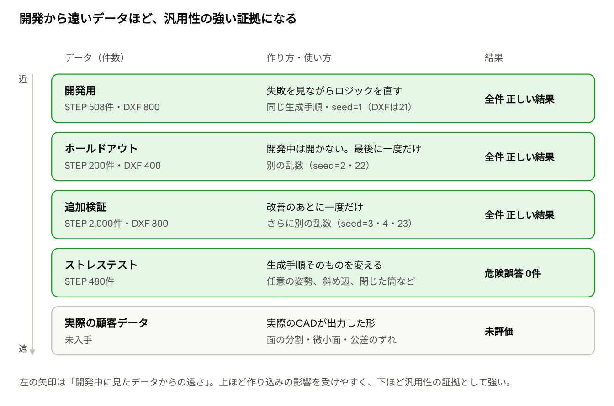

- **ホールドアウト**：別の乱数で作り、開発中は開かない。最後に一度だけ評価する。一度使ったら最終判定には使い回さない
- **追加検証**：さらに別の乱数で、STEPは合計2,000件、DXFは800ファイル
- **ストレステスト**：乱数だけでなく**作り方そのもの**を変えた。部品を任意の向きと位置に置く、5〜7角形の底面に斜めのフランジ、30〜150°の角度の混在、閉じた筒、曲げの間が短い段曲げ、曲げ軸が直交するフランジ、底面より大きいフランジ、最大3段の多段トレー。「底面は座標軸に沿っている」「いちばん大きい面が底面」といった生成手順の癖に頼っていないかを確かめる

### 4. 「確定してはいけない」データを入れる

正しく読めることと同じくらい、読めないものを確定させないことが大事である。そこで、正しい答えが「確定させない」であるデータを入れた。

- DXFの X（外周が開いている、2部品）：全件「確定しない」が正解。素朴な実装では97%を確定で返してしまった
- ストレステストの閉じた筒：3Dの形からは正解の切断長を再現できない。全40件が「概算」になり、確定で返したものはなかった

### テストが簡単すぎないことの確認

同じデータで、素朴な方法も評価した。テストが簡単なら素朴な方法でも通るはずだが、実際には大きく差が出た。

| 方法 | 結果 |
|---|---|
| 最初の解析ロジック（STEP） | Lv2・Lv3で危険誤答が6割超（2段目のフランジを無視して面積が最大40%小さいまま確定） |
| 素朴なDXFの読み取り（レイヤ名で判断） | 乱雑なDXF（D2）は0%、問題のあるDXF（X）の97%を確定 |
| LLMに解析を手伝わせる方式 | 正しい値を「概算」にする誤警報が26〜84%増え、処理時間は30〜70倍。採用しなかった |

### この設計で言えること・言えないこと

- **言えること**：設計した変化（形の複雑さ・板厚・曲げ・穴・向き・作り方）の範囲では、乱数や作り方を変えても正しく動く。危険誤答は、STEP 3,188件・DXF 2,000ファイルのすべてで0件
- **まだ言えないこと**：実際のCADが出力したSTEP・DXFの癖（面の細かい分割、ごく小さな面、公差のずれ、スプラインや楕円）への強さ。実際の部品の形の分布も反映していない。実データを集めて、同じハーネスで評価する必要がある

## 評価の成績と、まだできないこと

合成したテスト用の部品では、どのデータでも危険誤答（間違った値を「確定」で出すこと）は0件だった。ただし実際の顧客の図面（実際のCADが出したSTEP）ではまだ確かめていない。

| データ | 件数 | 確定で正解 | 危険誤答 | その他 |
|---|---:|---:|---:|---|
| 開発用（seed=1） | 508 | 100% | 0件 | — |
| ホールドアウト（seed=2、開発中は見ないデータ） | 200 | 100% | 0件 | — |
| 追加検証（seed=3） | 1,000 | 100% | 0件 | — |
| 追加検証（seed=4） | 1,000 | 100% | 0件 | — |
| ストレステスト（作り方を変えた形） | 480 | 12区分中11区分で 95〜100% | 0件 | 解析不可3件、閉じた筒40件は全件「概算」 |

判定の基準は、板厚・展開面積・切断長が正解の±10%以内、穴の数・曲げの数・ヘムの数が完全一致。評価ではK＝0.5を指定している。実際の誤差は、確定で正解したものはほぼ0.0%だった。詳しい数字は評価レポート（analysis/golden_eval_latest.md ほか）にある。

### まだできないこと・注意すること

- **実際のCADのデータで未検証**：テストはすべて理想的な形。実際のCADが出すSTEPの癖（面の細かい分割、ごく小さな面、寸法のわずかなずれ）は含まない
- **Kファクターは形から決まらない**：加工条件として指定が必要。指定がなければ曲げのある部品は必ず「概算」
- **閉じた筒**：「概算」になる。面積は体積からの概算に置き換えるので正しく出る（誤差の中央値 0.0%）が、切断長（誤差の中央値 25.8%）と穴の数は外れたまま。改善案は、突き合わせ部を切る線として扱って展開すること
- **曲げの逃がしの壁を表裏と誤認することがある**：板厚4.5mmで、幅が板厚と同じ逃がしの両側の壁が向かい合っていた例。解析不可になるので安全側だが、表裏の判定に「板厚方向に投影して形が重なること」を足せば防げる
- **対応していない形**：角がとがった折れ、円柱でない曲げ、複数部品が入ったファイル。成形加工（ルーバー、エンボス、バーリング、タップ）と曲げを横切る穴は、テストデータに含まれておらず未検証
- **金額は曲げの数だけで決まる**：角度やヘムかどうかは金額に入らない。ヘムを割増にするなら見積の決まりを追加する必要がある

### 用語

| 言葉 | 意味 |
|---|---|
| 面 | 立体を包む皮を区切った1区画。土台（平面か円柱）と輪郭でできている |
| 切り口 | 板の厚みの部分の面。レーザーで切るところ |
| 内R・外R | 曲げの内側・外側の丸みの半径。差は板厚 |
| 展開 | 曲げた板を曲げる前の平らな板に戻すこと |
| BA（曲げの分の長さ） | 展開図で曲げの部分が占める幅 |
| Kファクター | 曲げても長さが変わらない線の位置。板厚の何割か（0〜1） |
| ヘム | 180°折り返した曲げ |
| 危険誤答 | 値が間違っているのに「確定」で出てしまうこと。一番避けたい結果 |
