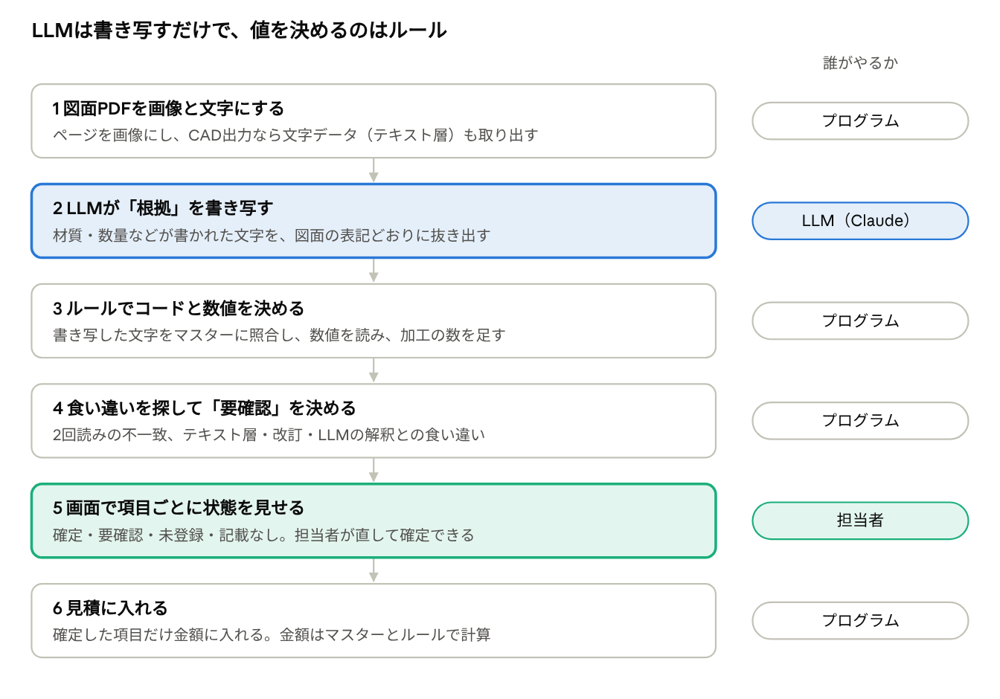
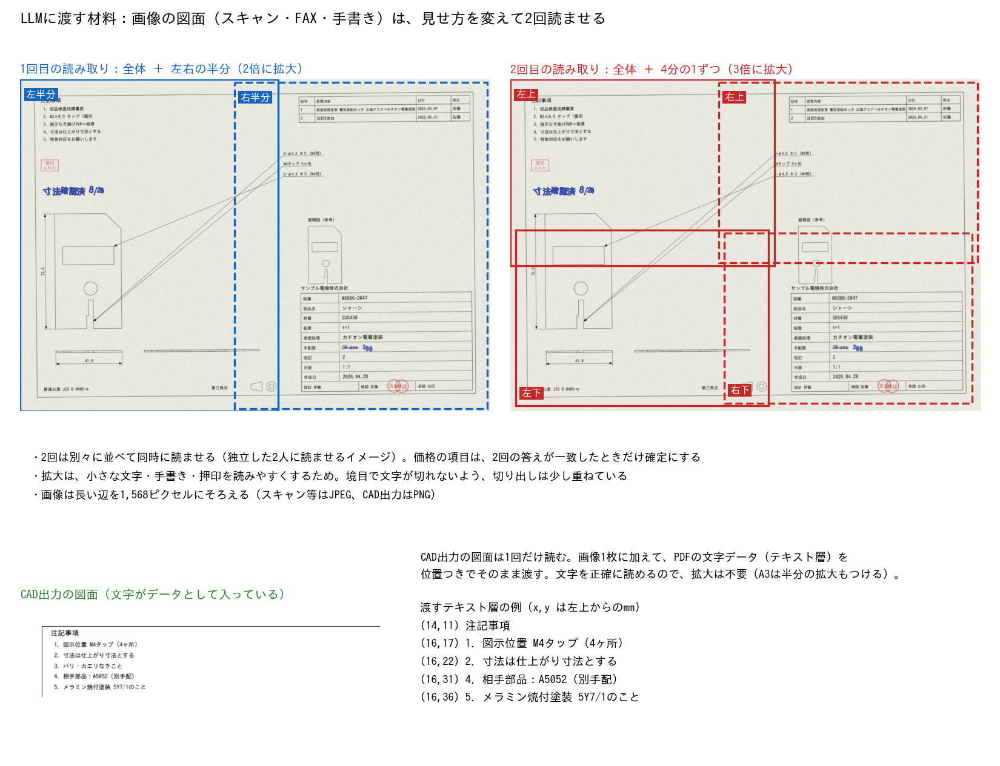
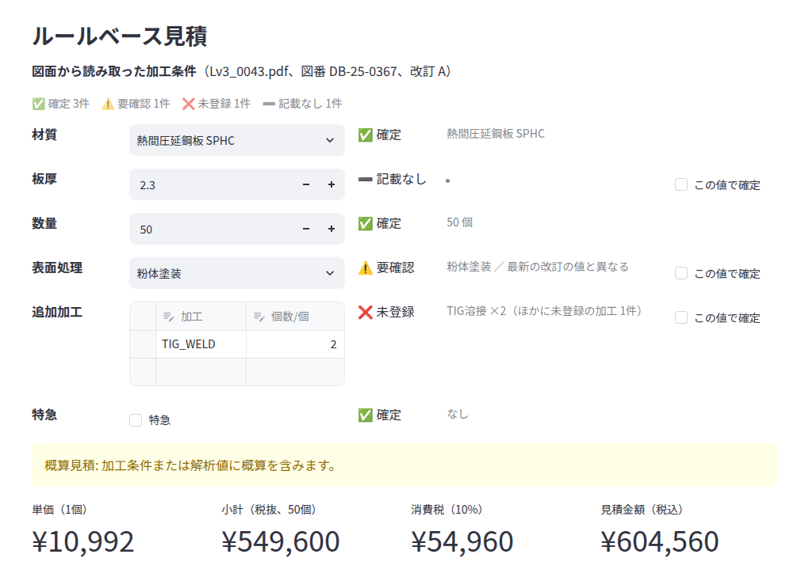
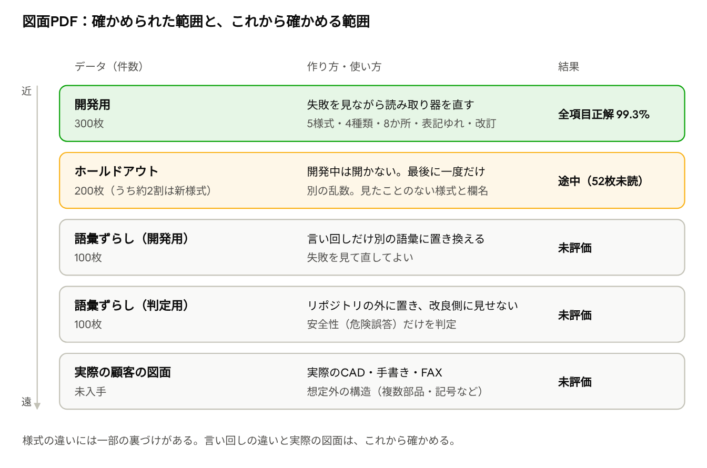
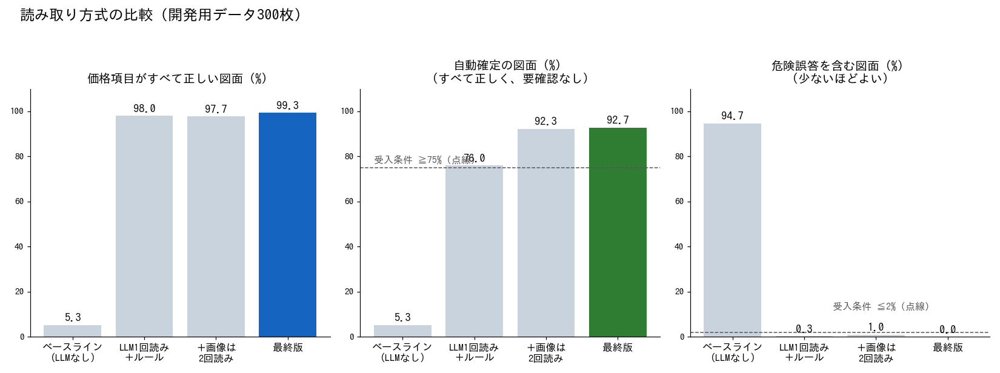

# 図面PDF読み取り（LLM）の解説
<!-- meta {"version": "1.0", "date": "2026-09-29", "audience": "経営者・顧客・開発者", "id": "DOC-07"} -->

## この資料について

図面PDFから、見積の金額に影響する加工条件（材質・板厚・数量・表面処理・追加加工・特急）を読み取る仕組みを説明する。

**LLM（Claude）には「図面に何が書いてあるか」を書き写させるだけで、コードや数値を決めるのはルール（プログラム）である。** 自信のない項目、マスターにない項目、書かれていない項目は確定させず、担当者の確認に回す。開発用の300枚では、価格項目がすべて正しい図面が99.3%、危険誤答（間違った値を確定で出すこと）は0件だった。

## 全体の流れ



形の値（展開面積・切断長など）はこれまでどおりSTEPかDXFの解析から取る。図面PDFからは条件だけを読み、両方を組み合わせて見積を出す。図面の寸法から形を読み取ることはしていない。

| 使うもの | 中身 |
|---|---|
| LLM | Claude（既定は claude-sonnet-5、環境変数で変更可）。図面の画像と文字を読むのに使う |
| ルール | src/pdf_terms.py（表記の解釈）、src/pdf_reader.py（全体の流れと照合） |
| マスター | data/ の材料・表面処理・追加加工のCSVと、その別名 |
| 金額 | src/quote_engine.py。LLMは金額に一切関わらない |

## 読み取る項目

金額に影響する「価格項目」6つと、補助の項目を読む。書かれていない項目は「記載なし」とし、推測で埋めない。

| 区分 | 項目 | 読み取った結果の形 | 見積での使い道 |
|---|---|---|---|
| 価格項目 | 材質 | マスターのコード（SPCCなど）、または未登録 | 材料の単価 |
| | 板厚 | mmの数値 | 形の解析の板厚と食い違えば注意を出す |
| | 数量 | 今回の製作数量 | 段取りの割り振り、合計金額 |
| | 表面処理 | マスターのコード。「なし」と明記ならNONE、または未登録 | 表面処理の単価 |
| | 追加加工 | タップ（M3〜M8）・皿もみ・圧入ナット／スタッド・スポット溶接・TIG溶接の、1個あたりの数 | 加工の単価 × 数 |
| | 特急 | あり／なし | 特急割増 |
| 補助 | 図番・改訂 | 図面に書かれた図番と、最新の改訂記号 | 見積書の記載、類似見積（リピート）の検索 |
| 特記事項 | 公差・外観・検査 | 厳しい公差、外観面の指定、検査成績書などの要求があるか | 金額には入れず、注意として表示 |

図面は会社や担当者によって書き方が大きく違う。次の例のように、同じ項目でも書く場所や表記がばらばらである。


読み取りを難しくしているもの：

- **書く場所**：表題欄、注記、部品表、表題欄のないメモ、改訂表、図中の引出線、押印、手書き
- **表記ゆれ**：全角・半角、和名と英語（冷延鋼板・COLD ROLLED STEEL）、タップの書き方（4-M4、M4タップ 4ヶ所、4X M4x0.7 TAP THRU）
- **改訂と手書き**：改訂表だけが更新されて表題欄は古いまま、二重線で消して手書きで書き直した数量、手書きの「M4タップ 2ヶ所追加」
- **紛らわしい記載**：タップの下穴（φ4.5キリ（M4用））、部品表の金具の材質、参考の月産数、相手部品の材質、「急ぎません」、FAXの送信ヘッダー
- **マスターにないもの**：SUS430、クロムめっき、バーリングタップなど。似た登録済みのものに寄せてはいけない（SUS430をSUS304にしない）

## 手順1　PDFを画像と文字にする

最初に、PDFの各ページを「文字がデータとして入っているか」で分ける。分け方で、LLMに渡す材料と読ませる回数が変わる。

| 種類 | 見分け方 | 渡すもの | 読ませる回数 |
|---|---|---|---|
| CAD出力（ベクター） | ページから文字を20字以上取り出せる | ページ全体の画像＋文字データ（テキスト層）を位置つきで。A3以上なら半分ずつの拡大画像も | 1回（読み落としが疑われるときだけ2回） |
| スキャン・FAX・手書き（画像） | 文字を取り出せない | 1回目：全体＋左右（または上下）の半分を2倍拡大。2回目：全体＋4分の1ずつを3倍拡大 | 必ず2回（同時に） |



- **なぜ文字データも渡すか**：CAD出力の図面は、文字を画像から読まなくても正確に取り出せる。LLMには「どこに何が書いてあるか」の判断に集中させ、読み間違いはあとで文字データと突き合わせて見つける（手順4）
- **なぜ画像の図面は2回読むか**：画像には突き合わせる文字データがない。そこで、切り出し方と拡大率を変えた2回の読み取りを独立に行い、答えが一致したときだけ確定にする。別々の2人に読ませて答え合わせするのと同じ考え方
- **画像の大きさ**：長い辺を1,568ピクセルにそろえる。切り出しは境目の文字が切れないように少し重ねる

画像には「ページ1 左半分（2倍拡大）」のような見出しを付けて渡す。LLMには、どの画像が図面のどの部分かが分かる。

## 手順2　LLMに「根拠」を書き写させる

LLMには、条件の値そのものではなく、**値が書かれた文字を図面の表記どおりに書き写させる**。「材質は何か」ではなく「材質の欄には何と書いてあるか」を聞く。書き写した文字をどう解釈するかは、次の手順3でルールが決める。

### なぜ書き写しだけにするか

試作では、LLMにマスターのコードまで選ばせていた。すると、登録済みのM6・M8タップを「未登録」にしたり、マスターにない加工を似た加工に寄せたりする誤りが出た。文字の書き写しはLLMが得意で、コードへの対応づけはルールのほうが確実なので、役割を分けた。さらに、書き写した文字が残るので、あとから「何を根拠にこの値にしたか」を確かめられる。

### システムプロンプトの要点

役割は「板金加工の見積担当者」。全文は約2,300字で、最後にマスターの一覧（材質6つ・表面処理9つ・追加加工10つのコードと名前）を付ける。主な決まりは次のとおり。

| 決まり | 中身 |
|---|---|
| 表記どおりに書き写す | 全角・半角・記号・単位もそのまま。欄名（「材質：」など）は含めない |
| いま有効な値だけ | 改訂表の最新の値。二重線で消した値は書き直した値。表題欄が古いままのことがある |
| 推測しない | 書かれていなければ空（null）。図の寸法から板厚を推測しない |
| 手書き・押印はすべて書き写す | 内容にかかわらず一覧にする。手書きや押印の「至急」は印刷の「急ぎません」より優先 |
| 数量ではないもの | 参考の月産数、部品表の員数、FAXの送信ヘッダーの数字 |
| 材質ではないもの | 部品表の金具の行や相手部品の材質 |
| 追加加工ではないもの | 単なる穴・キリ穴・抜き。タップの下穴を数えない |
| 加工は1件ずつ | 2か所に分けて書かれていれば別々に（合計はルールが計算）。全体図と拡大図に同じ引出線が写っているだけなら1件 |
| マスターにないもの | 「未登録」と答える。似たコードに寄せない |

### 入力と出力

- **入力**：見出しつきの画像（手順1）、CAD出力なら位置つきの文字データ、最後に「この図面の加工条件の根拠を、規則に従って report で返してください」
- **出力**：決まった形のJSON。LLMには report という道具（ツール）を必ず使わせ、その入力の形（スキーマ）で項目と選択肢を縛る。形が崩れていれば、注意書きを足してもう1回だけ聞き直す

| 出力の項目 | 中身 |
|---|---|
| material・surface_treatment | 書き写した文字（text）、書いてあった場所（where）、参考のマスターコード（code） |
| thickness・quantity | 書き写した文字、場所、参考の数値（value） |
| processes | 加工の指示1件ごとに：文字、場所、部品表の数、手書きの追記か、参考のコードと数 |
| revision_changes | 改訂表の変更（改訂記号、どの項目か、変更前、変更後） |
| rush | 特急かどうかと、その根拠の文字 |
| annotations | 手書きと押印のすべて |
| parts_list_quantity_header | 部品表の数量欄の見出し（「数量（100台分）」「員数」など） |
| drawing_no・revision・flags | 図番、最新の改訂記号、特記事項（公差・外観・検査） |
| uncertain | LLMが自信がないと申告した項目。**現在は使っていない**（正しい値にも多く付き、要確認が増えるだけだった） |

### 出力の例

手書きの図面（前の図の右下、Lv0_0018）に対する出力の形を示す。形を説明するための作例で、実際のAPIの応答ではない（一部の項目を省いている）。

```json
{
  "drawing_no": "MX886-2047",
  "revision": "2",
  "revision_changes": [{"rev": "1", "field": "surface_treatment",
                        "from": "電気亜鉛めっき 三価クリア", "to": "カチオン電着塗装"}],
  "material":  {"text": "SUS430", "where": "title_block", "code": "UNREGISTERED"},
  "thickness": {"text": "t=1", "where": "title_block", "value": 1.0},
  "quantity":  {"text": "300", "where": "handwriting", "value": 300},
  "surface_treatment": {"text": "カチオン電着塗装", "where": "title_block", "code": "UNREGISTERED"},
  "processes": [
    {"text": "M3×0.5 タップ 1箇所", "where": "notes",   "code": "TAP_M3", "count": 1},
    {"text": "M4タップ 5ヶ所",       "where": "callout", "code": "TAP_M4", "count": 5}
  ],
  "rush": {"value": true, "text": "特急対応をお願いします"},
  "flags": [{"category": "inspection", "text": "初品検査成績書"}],
  "annotations": [{"text": "寸法確認済 8/20", "kind": "handwriting"},
                  {"text": "300", "kind": "handwriting"}, {"text": "受付", "kind": "stamp"}]
}
```

注記の「5-φ4.5 キリ（M4用）」は単なる穴なので書き写さない。手書きで「30pcs」を消して「300」と書き直しているので、数量は300。

### その他の仕組み

- **応答の記録**：同じ入力の応答は保存して使い回す。評価をやり直しても費用がかからず、テストは記録済みの応答か偽の応答だけを使う（テストからAPIは呼ばない）
- **費用の目安**：1枚あたり平均で入力約19,000トークン、出力約900トークン、呼び出し約1.5回。時間は1枚約6〜7秒
- **APIキーがないとき**：図面PDFの読み取りは使えない。形の解析と見積はそのまま使える

## 手順3　ルールでコードと数値を決める

LLMが書き写した文字を、ルールでマスターのコードと数値にする。ルールは「確かに決められるときだけ決める」。候補が2つ以上ある、数字が複数あるなど、迷うときは決めずに「要確認」に回す。似ているものに寄せるあいまいな照合はしない。

### 共通の下ごしらえ

- 全角・半角をそろえ、大文字にする（ＳＰＣＣ → SPCC、× → X）
- 欄名を取り除く（「表面処理：無処理」→「無処理」、「MATERIAL: SPCC」→「SPCC」）
- マスターの各行には表記ゆれ（別名）が登録されている。別名の間の空白や記号の違いは無視して照合する

### 項目ごとの決め方

| 項目 | 決め方 | 決められないとき |
|---|---|---|
| 材質 | マスターの別名に当てはまるものが1つだけならそのコード。材質らしい規格名（SUS430、SGCC、C1100Pなど）しかなければ未登録 | 登録済みが2つ以上、または登録済みと未登録が混ざる → 要確認 |
| 表面処理 | 系統（亜鉛・アルマイト・無電解ニッケル・粉体・焼付）と色（黒・有色）でコードを決める。「なし」「生地」などは NONE。クロムめっき・パーカー・カチオン電着などマスターにない処理は未登録 | 系統が2つ以上、黒と有色が両方 → 要確認。処理らしい語（めっき・塗装・処理）はあるが系統が分からない → 未登録 |
| 板厚 | 文字の中の0.1〜25の数がちょうど1つ（t1.6、T=1.6、1.6mm） | 0個または2個以上 → 要確認 |
| 数量 | 整数がちょうど1つ。部品表の数は、見出しが「台分」「合計」などでなければ1台あたりの員数なので数量にしない | 0個または2個以上 → 要確認 |
| 追加加工 | 指示1件ごとに加工の種類と数を読み、同じ加工を足し合わせる（次の表） | 読めない指示、数が読めない → 要確認 |
| 特急 | 「急ぎません」「通常」「別途」「NOT URGENT」などは特急でない。「特急」「至急」「急ぎ」「URGENT」「RUSH」などは特急。手書き・押印に特急の語があれば、印刷の記載より優先 | 根拠の文字と判定が食い違う、根拠の語がない → 要確認 |
| 特記事項 | LLMが挙げたものから、普通公差（JIS B 0405など）や塗装の色の指定を除く。CAD出力なら文字データからも語を探して足す | — |

### 追加加工の読み方

| 文字の例 | 判定 |
|---|---|
| 4-M4、M4タップ 4ヶ所、4X M4x0.7 TAP THRU | M4タップ ×4（M3・M4・M5・M6・M8以外のサイズは未登録） |
| φ4.5キリ（M4用）、2-φ10、□40×20抜き、THRU | 単なる穴。追加加工に数えない |
| 圧入ナット、PEMナット、クリンチナット | 圧入ナット（「圧入」などがないただのナットは未登録） |
| 圧入スタッド、FH-M4 | 圧入スタッド |
| 皿もみ、皿穴、CSK | 皿穴加工 |
| スポット溶接、TIG溶接 | それぞれの溶接。その他の溶接は未登録 |
| バーリング、スペーサ、リベット、インサート | 未登録（タップや圧入スタッドに寄せない） |

数は「4-」「4ヶ所」「×4」「（4個）」などから読む。ねじのピッチ（M4×0.7）、直径、角度、日付、金具の品番の数字は先に取り除く。残った候補が1つでなければ要確認。部品表の数が「○台分」の合計なら、製作数量で割って1個あたりにする（割り切れなければ要確認）。

### 改訂の扱い

改訂表の変更のうち、項目ごとに最も新しい改訂の「変更後」の値を正とする。記号は A→B→C、1→2→3、△1→△2 の順。読み取った値が最新の改訂と違えば、改訂の値に置き換えたうえで要確認にする。表題欄だけが古いままの図面への備えである。

### 例：上の出力をルールに通した結果

手順2の出力の例を、実際のルールのプログラムに通した結果。

| 項目 | LLMが書き写した文字 | ルールの結果 |
|---|---|---|
| 材質 | SUS430 | 未登録（マスターにSUS430はない。SUS304には寄せない） |
| 板厚 | t=1 | 1.0mm |
| 数量 | 300 | 300 |
| 表面処理 | カチオン電着塗装 | 未登録 |
| 追加加工 | M3×0.5 タップ 1箇所／M4タップ 5ヶ所 | M3タップ ×1、M4タップ ×5（ピッチ0.5は数に数えない） |
| 特急 | 特急対応をお願いします | あり |
| 特記事項 | 初品検査成績書 | 検査（inspection） |

## 手順4　食い違いを探して「要確認」を決める

項目を「要確認」にするのは、**何かと何かが食い違ったときだけ**である。LLMの「自信がない」という申告は使わない。付けすぎると担当者の手間が増え、付けなさすぎると間違いを見逃す。その間を狙っている。

### 要確認になる理由

| 比べるもの | 理由として画面に出る言葉 | 対象 |
|---|---|---|
| ルールが解釈できない | 規則で解釈できない表記／規則で数値を読み取れない／規則で解釈できない加工指示 | すべて |
| ルールの結果 と LLMの参考の答え | 規則とLLMの解釈が異なる／規則とLLMの読み取りが異なる | すべて |
| 読んだ値 と 改訂表の最新の値 | 最新の改訂の値と異なる | 材質・板厚・数量・表面処理 |
| 書き写した文字 と PDFの文字データ | テキスト層に見つからない | CAD出力のみ |
| 1回目 と 2回目の読み取り | 2回の読み取りが一致しない | 画像の図面の価格項目 |
| 読み取り結果 と PDFの文字データ | テキスト層にある加工指示が読み取り結果にない | CAD出力の追加加工 |
| 特急の根拠 | 特急の記載と判定が矛盾／特急の根拠となる語がない | 特急 |
| 部品表の合計 | 部品表の合計が部品数量で割り切れない／部品数量が不明 | 追加加工 |

### 画像の図面：2回の答え合わせ

2回の読み取りをそれぞれ手順3のルールに通し、価格項目ごとに結果を比べる。一致すれば確定、一致しなければ要確認にする。要確認のときに画面へ出す値は、見落としを防ぐ側を選ぶ。

- **特急**：どちらかが「あり」なら「あり」を出す
- **追加加工**：見つけた加工の種類が多いほうを出す（引出線の読み落としのほうが起きやすい）
- **片方だけが値を見つけた**：見つけたほうの値を出す
- **特記事項**：2回分を合わせる（見落とすほうが、余分に出すより損が大きい）
- **図番・改訂**：1回目が空なら2回目の値を使う

例：手書きの図面で、1回目は手書きの「300」を、他方が消された「30」を読んだとする。実際のルールに通すと、数量だけが「要確認（2回の読み取りが一致しない）」になり、材質・加工など一致した項目はそのまま残る。

### CAD出力の図面：読み落としの検査

CAD出力は1回しか読まない代わりに、文字データで読み落としを探す。

1. 文字データの各行をルールに通し、追加加工と読める行のうち、読み取り結果にない加工があるか見る。数量が読めていないのに「数量」「QTY」などと数字のある行があるかも見る
2. あれば、その行を「読み落としていないか改めて確認してください（関係なければ無視してよい）」と添えて、もう一度読ませる
3. 2回の結果を画像の図面と同じように答え合わせする。それでも読み落としが残れば、追加加工を要確認にする

この検査を入れる前は、追加加工の読み落としが危険誤答（間違った値のまま確定）の主な原因だった。

## 手順5　見積への反映

読み取った条件は、項目ごとに4つの状態のどれかで画面に出る。金額に入るのは「確定」の項目だけで、それ以外が1つでもあれば見積は「概算」になり、理由が画面に出る。担当者が値を直して「この値で確定」を押せば、その項目は確定になる。



| 状態 | 意味 | 金額での扱い |
|---|---|---|
| 確定 | 食い違いなく読めた | そのまま金額に入る |
| 要確認 | 読めたが、手順4の食い違いがあった | 金額に入れない（材質・数量は仮の値で計算） |
| 未登録 | 図面に書いてあるが、マスターにない | 金額に入れない。単価の登録か手入力が必要 |
| 記載なし | 図面に書いていない | 担当者が入力する |

### 項目ごとの金額への入り方

| 項目 | 確定のとき | 確定でないとき |
|---|---|---|
| 材質 | その材質の単価で計算 | 画面で選ばれている材質で仮に計算 |
| 板厚 | 形の解析の板厚と比べ、違えば注意を出す（金額は形の板厚で計算） | 注意を出す |
| 数量 | その数量で計算 | 読んだ値（なければ1個）で仮に計算 |
| 表面処理 | 表面処理の単価を足す | 金額に含めない |
| 追加加工 | 加工ごとに単価 × 1個あたりの数 × 数量。未登録の加工だけを除く | 要確認のときは加工を金額に含めない |
| 特急 | 小計に特急割増を掛ける | 割増を含めない |

金額の計算は、形の解析と同じ見積の計算（マスターCSVとルール）で行う。LLMが金額や単価を決めることはない。読み取った図番・改訂は見積書に載り、過去の同じ図番の見積（リピート）を探すのにも使われる。

## 汎用性の確かめ方（テストの設計）

図面は会社ごとに書き方が大きく違うので、「テストに使った図面だけ」に合わせた読み取りにならないよう、形の解析と同じ考え方でテストを設計した。正解を先に決めてから描き、変化の軸を洗い出して網羅し、開発から遠いデータで段階的に確かめる。

### 1. 正解を先に決め、描き方だけを変える

- 図面ごとに、材質・板厚・数量・表面処理・追加加工・特急・図番・改訂の正解を先に決める。その正解を、様式・書く場所・表記を変えて図面に描く
- 正解の決め方は規則として文書にした（改訂後の最新の値が正解、書いていない項目は「記載なし」、マスターにないものは「未登録」、追加加工は1個あたりの数、単なる穴は加工ではない）
- 正解は凍結し、読み取り器に合わせて変えない。同じコマンドで作り直すと、PDFも正解も同じものができる
- 図面の部品は、形の解析と同じ部品生成器で作る。そのため同じ部品のSTEPもそろっている

### 2. 変化の軸を洗い出して網羅する

実際の図面で違いが出るところを洗い出し、1つずつ変化させた。数字は開発用300枚での件数。

| 軸 | 変化させた内容 |
|---|---|
| PDFの種類 | CAD出力150・スキャン60（傾き・ノイズ・ぼけ）・FAX60（白黒2値・縦の解像度が半分・送信ヘッダー）・手書きと押印30。割合は10枚ごとに正確に 5:2:2:1 |
| 様式 | JIS和文・英文（ISO風、第一角法）・和英併記・部品表つき・表題欄のないメモ。A3が75枚、2ページの図面が30枚 |
| 書く場所 | 表題欄・注記・部品表・メモ・改訂表・引出線・押印・手書き。例：材質は表題欄162・注記53・メモ25・部品表21 |
| 書くか書かないか | 価格項目をすべて書いた図面は99枚。残り201枚は1〜4項目を書いていない |
| 表記ゆれ | 全角、規格名つき、和名、英語、誤字、タップの書き方（4-M4、M4タップ 4ヶ所、4X M4x0.7 TAP THRU）。マスターの別名にない表記も入れる |
| マスターにないもの | 材質18枚、表面処理18枚、追加加工40枚 |
| 改訂 | 改訂表あり106枚（うち価格項目を変える改訂83枚）。並び順と記号の種類を変え、19枚は表題欄が古いまま |
| 手書き | 数量の訂正、表面処理の訂正、加工の追記、特急の追記。結果に関係しないメモも入れる |
| 紛らわしいもの | タップの下穴、部品表の金具の材質、参考の月産数、相手部品の材質、急ぎませんの注記、日付だけの納期欄、旧図番、FAXヘッダー |

### 3. 開発から遠いデータで段階的に確かめる



- **ホールドアウト（200枚）**：別の乱数で作り、開発中は開かない。約2割は、開発用に一度も出てこない様式と欄の名前で描く。この様式を描くプログラムも、開発中は開かない決まりにしている
- **語彙ずらし（開発用100枚）**：同じ部品・同じ正解の規則で、言い回しだけを別の語彙に置き換える。開発用とホールドアウトは同じ語彙で作ったので、知らない書き方への強さはこのデータでしか測れない
- **語彙ずらし（判定用100枚）**：語彙も正解もリポジトリの外に置き、改良する側には見せない。改良が終わったあとに、安全性（危険誤答）だけを判定する
- 一度正解がレポートに出てしまったホールドアウトは、最終判定に使い回さない。次の最終判定には新しいホールドアウト（seed=33）を使う

### 4. 正しさと安全性を分けて測る

- 正解率だけでなく、**危険誤答**（間違った値を確定で出す）を別に数える。知らない書き方が「要確認」や「未登録」に倒れるのはよく、黙って間違えるのがいけない
- **自動確定**（確認なしで全項目が正しい図面）も測る。要確認を付けすぎても条件を満たさないので、何でも要確認にして安全を装うことはできない
- 項目ごと、PDFの種類ごと、様式ごと、書かれている場所ごとに集計する。平均が高くても、特定の種類や場所だけ弱い、ということを見逃さないため

### テストが簡単すぎないことの確認

同じ300枚で、PDFの文字データを正規表現で読むだけの素朴な方法は、全項目正解が5.3%、危険誤答を含む図面が94.7%だった。LLMを1回呼ぶだけの試作も、全項目正解89.3%、自動確定47.0%、危険誤答を含む図面4.7%で、受入条件を満たさなかった。テストが素朴な方法では通らない難しさを持っていることの確認になる。

### この設計で言えること・言えないこと

- **言えること**：設計した変化（4種類・5様式・8か所・表記ゆれ・未登録・改訂・手書き・紛らわしい記載）の範囲では、どの組み合わせでも高い正解率で、危険誤答は0件。初めて見る様式でも同じ傾向だった（ホールドアウトで読めた28枚）
- **確認中のこと**：知らない言い回しへの強さ（語彙ずらしのデータで確かめる）
- **言えないこと**：実際のCADの線や記号（溶接記号、幾何公差の枠）、本物の手書き文字、1枚に複数部品がある図面、組立図。これらは合成データに入っていないので、実際の顧客の図面を集めて確かめる必要がある

## 評価の方法と成績

開発用の300枚では、価格項目がすべて正しい図面が99.3%、人の確認なしで確定できた図面が92.7%、危険誤答は0件で、受入条件をすべて満たした。ただしホールドアウト（最終判定用のデータ）の判定は途中で止まっている。

### 成績の数え方

| 指標 | 意味 | 受入条件 |
|---|---|---|
| 正解率 | 値が正解と一致した割合。要確認でも値が正しければ正解 | 価格項目それぞれ95%以上。PDFの種類ごとにも各項目90%以上 |
| 危険誤答 | 間違った値を、要確認にせず確定で返したもの。最も避けたい | 項目ごとに1%以下、含む図面は2%以下 |
| 自動確定 | 価格項目がすべて正しく、要確認が1つもない図面。担当者の手間がかからない | 75%以上 |
| 補助・特記事項 | 図番・改訂・特記事項の正解率 | それぞれ90%以上 |

### 開発用300枚の結果

| 項目 | 正解率 | 危険誤答 | 要確認の割合 |
|---|---:|---:|---:|
| 材質 | 100.0% | 0.0% | 0.3% |
| 板厚 | 99.7% | 0.0% | 0.7% |
| 数量 | 99.7% | 0.0% | 1.3% |
| 表面処理 | 100.0% | 0.0% | 3.3% |
| 追加加工 | 100.0% | 0.0% | 2.0% |
| 特急 | 100.0% | 0.0% | 0.0% |
| 図番 | 99.7% | 0.3% | 0.0% |
| 改訂 | 100.0% | 0.0% | 0.0% |
| 特記事項 | 98.3% | 1.7% | 0.0% |

PDFの種類別の自動確定は、CAD出力92.7%・スキャン90.0%・FAX95.0%・手書き93.3%。書かれた場所別（表題欄・注記・部品表・引出線・手書き・押印など）の正解率は、すべて100%だった。

### 読み取り方式の比較



- **LLMなしでは実用にならない**：PDFの文字データを正規表現で読むだけの方式は、全項目正解が5.3%。画像の図面には文字データがなく、CAD出力でも書く場所や表記が多様すぎる
- **2回読みで自動確定が上がった**：76.0% → 92.3%。LLMの「自信なし」の代わりに2回の一致で確定を決めたため
- **読み落とし検査で危険誤答が0になった**：2回読みで一時的に1.0%に増えたのは、CAD出力の追加加工の読み落とし。手順4の検査で解消した

### ホールドアウト（200枚）の状況

判定の途中でAPIのクレジットが尽き、52枚が未読のまま止まっている。読めた148枚の参考の集計は次のとおり（正式な判定ではない）。

| 対象 | 枚数 | 材質 | 板厚 | 数量 | 表面処理 | 追加加工 | 特急 | 自動確定 | 危険誤答の図面 |
|---|---:|---:|---:|---:|---:|---:|---:|---:|---:|
| 読めた全図面 | 148 | 98.0% | 99.3% | 98.6% | 95.3% | 100.0% | 98.6% | 90.5% | 0 |
| うちFAX | 30 | 96.7% | 100.0% | 96.7% | 76.7% | 100.0% | 100.0% | 70.0% | 0 |
| うち開発用にない様式 | 28 | 96.4% | 100.0% | 100.0% | 92.9% | 100.0% | 96.4% | 85.7% | 0 |

危険誤答は読めた範囲でも0件だが、FAXの表面処理が76.7%で、種類別の条件（90%以上）を下回っている。残り10枚がすべて正しくても最大82.5%で、この条件は満たせない。

## まだ確かめられていないこと・懸念点

開発用データでの成績は高いが、実際の図面での強さはまだ分かっていない。対応の指示は用意済みで、APIのクレジットが使えるようになってから進める。

| 懸念 | 内容 | 対応の予定 |
|---|---|---|
| ホールドアウトの判定が未完了 | 200枚中52枚が未読。読めた範囲でもFAXの表面処理が条件を下回る。また、このデータはレポートに正解が出てしまったので、今後の最終判定には使えない | 変更前の記録として最後まで回す。最終判定は新しいホールドアウト（seed=33）で一度だけ行う |
| プロンプトとルールが合成データの言い回しに寄っている | プロンプトに、テスト用図面の生成器が使う語句（「月産500個予定（参考）」「相手部品：A5052」「急ぎません」など）が例としてそのまま入っている。ルールにも、わざと入れた誤字「紛体」のような合成データ専用の語がある。開発用とホールドアウトは同じ語彙で作られているので、成績が良く見えている可能性がある | プロンプトとルールを一般的な記述に直し、生成器の語句が入っていないことをテストで確かめる |
| 知らない言い回しへの強さが未検証 | 例えばルールだけでは「特急不要」「急ぎではありません」を「特急あり」と判定する。LLMも「あり」と答えれば、食い違いが起きずに誤ったまま確定する経路がある | 否定の表現（〜不要、〜ではない、NO 〜）を扱う。語彙をずらしたデータで、危険誤答が項目ごとに1%以下になることを確かめる。判定用の語彙はリポジトリの外に置き、改良する側には渡さない |
| 実際の顧客の図面で未評価 | テストはすべてプログラムで作った図面。実際の図面の書き方、汚れ、複雑な部品表は含まない | 実際の図面を集め、正解を付けて評価する |
| 読めない変化は見つけられない | 答え合わせは「食い違い」で見つける仕組み。CAD出力でLLMとルールが同じように誤解した場合は、確定になってしまう | 語彙をずらしたデータと実際の図面で、起きる頻度を測る |
| 費用とデータの扱い | 図面の画像と文字を外部のAPI（Anthropic）に送る。1枚あたり入力約19,000トークン | 顧客図面を外部に送ることの承認を、導入先ごとに確かめる |

### 用語

| 言葉 | 意味 |
|---|---|
| テキスト層 | CADから出力したPDFに入っている、文字のデータ。コピーできる文字 |
| 表題欄 | 図面の右下の表。図番・品名・材質などを書く |
| 改訂表 | 図面を変更した履歴の表。記号（A、2、△1など）と変更内容 |
| 引出線 | 図の一部から線を引いて書いた指示（「4-M4」など） |
| マスター | 材質・表面処理・加工の一覧と単価のCSV。表記ゆれの別名も持つ |
| 危険誤答 | 間違った値を、要確認にせず確定で出してしまうこと |
| 自動確定 | 担当者の確認なしで、価格項目がすべて正しく確定した状態 |
| ホールドアウト | 開発中は見ず、最後に一度だけ使う評価用データ |
