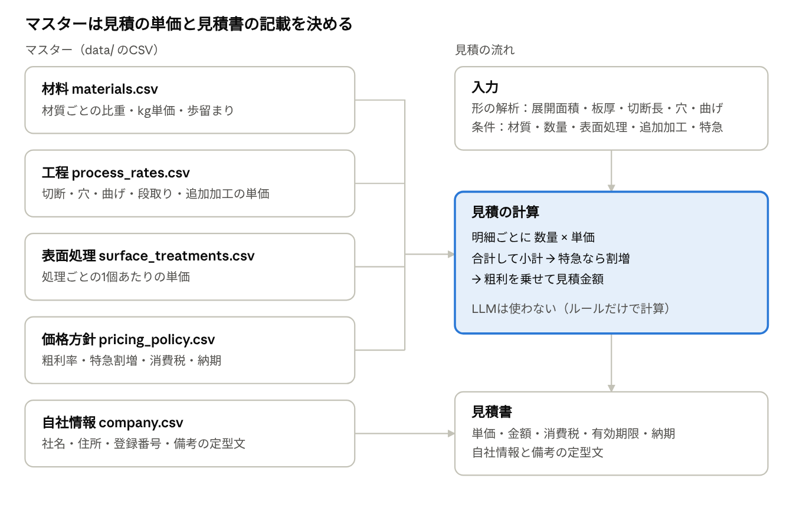
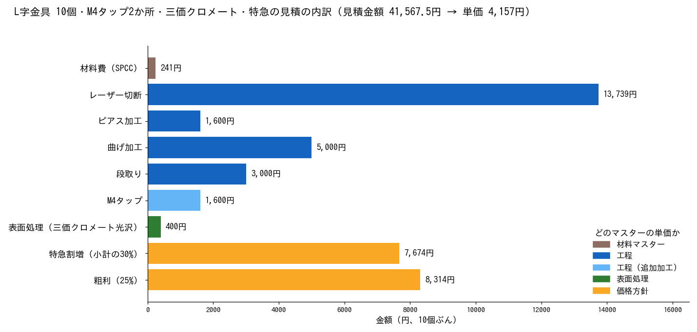

# マスターデータの解説
<!-- meta {"version": "1.0", "date": "2026-09-29", "audience": "見積担当者・開発者", "id": "DOC-08"} -->

## この資料について

マスターデータは、見積の単価と、見積書に載せる情報を決める5つのCSVファイルである。見積の金額は、形の解析値と条件にこの単価を掛けて、ルールだけで計算する（LLMは使わない）。単価を変えるときは、プログラムではなくこのCSVを直す。

この資料の値はデモ用の仮の単価で、実際の工場の値ではない。

## 全体像

| ファイル | 中身 | 行数 | 使われるところ |
|---|---|---:|---|
| data/materials.csv | 材質ごとの比重・kg単価・歩留まり | 6 | 材料費。図面の材質の読み取り |
| data/process_rates.csv | 基本工程（切断・穴・曲げ・段取り）と追加加工の単価 | 19 | 加工費。図面の追加加工の読み取り |
| data/surface_treatments.csv | 表面処理の単価 | 9 | 表面処理費。図面の表面処理の読み取り |
| data/pricing_policy.csv | 粗利率、特急の割増率、消費税率、有効期限、納期 | 6 | 見積金額と見積書 |
| data/company.csv | 自社名、住所、登録番号、支払条件、備考の定型文 | 11 | 見積書 |

- CSVは文字コードUTF-8で、Excelでも開ける
- 1行目は列名。1行が1つの材質・工程・処理になる
- 実際の自社情報は data/company.local.csv に置く（Gitには入れない）。あれば company.csv より優先される
- 過去の見積の履歴（data/past_quotes/）はマスターではなく、類似見積の検索に使う記録

## 材料マスター（materials.csv）

材質ごとに、重さを出すための比重と、kgあたりの単価を持つ。材料費は「展開した板の重さ × kg単価 × 歩留まりの係数」で計算する。

| 列 | 意味 | 例（SPCC） |
|---|---|---|
| material | 材質のコード。プログラムの中で使う名前 | SPCC |
| display_name | 画面と見積書に出す名前 | 冷間圧延鋼板 SPCC |
| density_kg_m3 | 比重（1立方メートルあたりのkg） | 7870 |
| price_per_kg | 1kgあたりの材料の単価（円） | 160 |
| waste_factor | 歩留まりの係数。板取りで出る端材のぶんを上乗せする倍率 | 1.15（15%増し） |
| charge_scope | 課金の範囲。per_part＝1個ごと（数量を掛ける）、per_order＝1注文に1回 | per_part |
| aliases | 表記ゆれ（別名）。半角の縦棒で区切って並べる | SPCC-SD、冷延鋼板、COLD ROLLED STEEL など |

### 登録されている材質

| コード | 名前 | 比重（kg/m³） | kg単価（円） | 歩留まり | 主な別名 |
|---|---|---:|---:|---:|---|
| SPCC | 冷間圧延鋼板 | 7,870 | 160 | 1.15 | SPCC-SD、冷延鋼板、COLD ROLLED STEEL、CRS |
| SPHC | 熱間圧延鋼板 | 7,870 | 140 | 1.15 | SPHC-P、酸洗鋼板、HOT ROLLED STEEL |
| SECC | 電気亜鉛めっき鋼板 | 7,870 | 190 | 1.15 | ボンデ鋼板、ELECTROGALVANIZED STEEL |
| SS400 | 一般構造用圧延鋼材 | 7,850 | 180 | 1.15 | 一般構造用圧延鋼材 |
| SUS304 | ステンレス | 7,930 | 700 | 1.20 | SUS304-2B、ステンレス304、AISI 304 |
| AL5052 | アルミ A5052P | 2,680 | 900 | 1.15 | A5052P、A5052-H32、アルミ5052 |

### 材料費の計算例

形の解析で使ったL字の金具（展開面積 8,314mm²、板厚 2mm）をSPCCで10個作る場合。

1. 1個の体積：8,314mm² × 2mm ＝ 16,628mm³（0.0000166m³）
2. 1個の重さ：0.0000166m³ × 7,870kg/m³ ＝ 0.131kg
3. 1個の材料費：0.131kg × 160円 × 1.15 ＝ 24.1円
4. 10個ぶん：24.1円 × 10 ＝ 241円

重さは展開した板の形（穴を除いた面積）から出している。実際には定尺の板から長方形に取るので端材が出る。そのぶんを歩留まりの係数で大まかに上乗せしている。

板厚ごとの単価の違いは持っていない。同じ材質なら、1mmでも3mmでもkg単価は同じである。

## 工程マスター（process_rates.csv）

加工ごとの単価を持つ。形から必ず発生する「基本工程」4つと、図面や担当者の入力で足す「追加加工」15個がある。加工費は「数 × 単価」で、数に製作数量を掛けるかどうかを charge_scope で決める。

| 列 | 意味 |
|---|---|
| process_code | 工程のコード |
| display_name | 画面と見積書に出す名前 |
| calculation_type | 何に対して料金がかかるかの説明（mmごと、穴ごと、曲げごと、一式など）。計算には使われていない |
| unit_price | 単価（円） |
| unit | 数える単位（mm、hole＝穴、bend＝曲げ、piece＝個、point＝点、location＝箇所、job、part） |
| charge_scope | per_part＝1個ごとにかかる（数量を掛ける）、per_order＝1注文に1回だけかかる |
| aliases | 表記ゆれ（基本工程は空） |

### 基本工程（形の解析から自動で計算）

| コード | 名前 | 単価 | 数えるもの | 課金の範囲 |
|---|---|---:|---|---|
| LASER_CUT | レーザー切断 | 3円/mm | 切断長（外形＋穴のまわり） | 1個ごと |
| PIERCE | ピアス加工 | 80円/穴 | 穴の数（切り始めに穴をあける回数） | 1個ごと |
| BEND | 曲げ加工 | 500円/曲げ | 曲げの数 | 1個ごと |
| SETUP | 段取り | 3,000円 | — | 1注文に1回 |

段取りだけが1注文に1回である。そのため数量が少ないほど1個あたりの単価が高くなる。

### 追加加工（図面の読み取りまたは担当者の入力で足す）

| コード | 名前 | 単価 | 主な別名 | 図面からの読み取り |
|---|---|---:|---|---|
| TAP_M3 | M3タップ | 60円/穴 | M3 TAP、M3x0.5 TAP | 対象 |
| TAP_M4 | M4タップ | 80円/穴 | M4 TAP、M4x0.7 TAP | 対象 |
| TAP_M5 | M5タップ | 90円/穴 | M5 TAP | 対象 |
| TAP_M6 | M6タップ | 110円/穴 | M6 TAP | 対象 |
| TAP_M8 | M8タップ | 150円/穴 | M8 TAP | 対象 |
| COUNTERSINK | 皿穴加工 | 600円/穴 | 皿もみ、皿穴、CSK | 対象 |
| PRESS_NUT | 圧入ナット | 120円/個 | PEMナット、クリンチナット | 対象 |
| PRESS_STUD | 圧入スタッド | 150円/個 | PEMスタッド、クリンチスタッド | 対象 |
| SPOT_WELD | スポット溶接 | 50円/点 | SPOT WELD | 対象 |
| TIG_WELD | TIG溶接 | 800円/箇所 | TIG WELD | 対象 |
| POLISH | 研磨 | 2,500円/個 | 磨き | 対象外（手入力のみ） |
| BUFF_400 | #400バフ仕上げ | 3,500円/個 | 400番バフ | 対象外（手入力のみ） |
| BUFF_MIRROR | 鏡面バフ仕上げ | 6,000円/個 | 鏡面、ミラーバフ | 対象外（手入力のみ） |
| SURFACE_TREATMENT | 表面処理（一式） | 5,000円/個 | 表面処理 | 対象外。表面処理マスターとは別の行（手入力のみ） |

追加加工の数は「1個あたり」で持ち、計算のときに製作数量を掛ける。例えばM4タップ2か所の部品を10個作れば、20穴 × 80円 ＝ 1,600円。

## 表面処理マスター（surface_treatments.csv）

表面処理ごとの1個あたりの単価を持つ。表面処理費は「単価 × 製作数量」。部品の大きさや面積にはよらない。

| 列 | 意味 |
|---|---|
| treatment_code | 表面処理のコード |
| display_name | 画面と見積書に出す名前 |
| unit_price | 1個あたりの単価（円） |
| charge_scope | per_part＝1個ごと |
| aliases | 表記ゆれ |

| コード | 名前 | 単価（円/個） | 主な別名 |
|---|---|---:|---|
| NONE | なし（生地） | 0 | なし、生地、無処理、NO FINISH |
| ZINC_CLEAR | 三価クロメート（光沢） | 40 | 三価クリア、ユニクロ、CLEAR ZINC |
| ZINC_YELLOW | 三価クロメート（有色） | 45 | 三価有色、有色クロメート、YELLOW ZINC |
| ZINC_BLACK | 三価クロメート（黒） | 55 | 三価黒、黒クロメート、BLACK ZINC |
| POWDER_COAT | 粉体塗装 | 180 | 静電粉体塗装、POWDER COAT |
| BAKING_PAINT | 焼付塗装 | 150 | メラミン焼付塗装、BAKED ENAMEL |
| ELECTROLESS_NI | 無電解ニッケルめっき | 120 | 無電解Niめっき、カニゼン |
| ANODIZE_CLEAR | 白アルマイト | 90 | アルマイト、クリアアルマイト |
| ANODIZE_BLACK | 黒アルマイト | 110 | BLACK ANODIZE |

「なし（NONE）」と「記載なし」は別のものとして扱う。図面に「生地」と明記されていればNONE（0円で確定）、何も書いていなければ「記載なし」として知らせる（画面の入力欄には「なし（生地）」が入るので、処理が必要なら担当者が選ぶ）。

実際の表面処理の費用は、処理業者への外注費（重さや面積、ロットの最低料金で決まることが多い）である。今のマスターは1個あたりの定額しか表せない。

## 価格方針（pricing_policy.csv）と自社情報（company.csv）

価格方針は、明細の合計（小計）から見積金額を出すときの割合と、見積書の決まりを持つ。列は key（名前）・value（値）・description（説明）の3つ。

| key | 値 | 意味 |
|---|---:|---|
| margin_rate | 0.25 | 粗利。小計に25%を上乗せして見積金額にする |
| rush_surcharge_rate | 0.30 | 特急の割増。小計に30%を足す（粗利を乗せる前） |
| tax_rate | 0.10 | 消費税率（見積書の消費税） |
| quote_validity_days | 30 | 見積の有効期限（発行日からの日数） |
| lead_time_days_normal | 10 | 通常の納期（受注後の営業日） |
| lead_time_days_rush | 5 | 特急の納期（受注後の営業日） |

**粗利率の意味に注意。** margin_rateは「原価に対する上乗せ率」である。原価100円なら見積は125円で、売上に対する利益の割合は20%（25÷125）になる。会計でいう「粗利率25%」とは違うので、実際の値を決めるときはどちらの意味かを確かめる。

### 端数の扱い

| 値 | 出し方 |
|---|---|
| 単価 | 見積金額 ÷ 数量。1円未満は切り上げ |
| 金額 | 単価 × 数量 |
| 消費税 | 金額 × 消費税率。1円未満は切り捨て |
| 合計 | 金額 ＋ 消費税 |

画面と見積書は同じ計算でこの値を出すので、金額が食い違うことはない。

### 自社情報

見積書に載せる自社の情報。列は key・value・description。

| key | 内容 |
|---|---|
| name、postal_code、address、tel、fax | 社名、郵便番号、住所、電話、FAX |
| registration_no | 適格請求書発行事業者の登録番号 |
| contact | 担当者 |
| payment_terms | 支払条件（月末締め 翌月末 銀行振込 など） |
| delivery_place | 受渡場所の既定値 |
| remark_1、remark_2 … | 備考の定型文。番号の順に見積書に出る |

リポジトリの company.csv は仮の値である。実際の自社情報は同じ形の data/company.local.csv に書く。このファイルはGitに入れず、あれば優先して使われる。

図面に厳しい公差・外観・検査の指定があるときに見積書へ出す備考（「検査成績書の提出は別途お見積り」など）は、マスターではなくプログラムの中に書いてある。

## 見積の計算の流れ（例）

形の解析の解説で使ったL字の金具を、実際の見積のプログラムで計算した。解析値は展開面積8,314mm²、板厚2mm、切断長458mm、穴2つ、曲げ1か所（Kファクター0.5を指定）。

### 計算の順番

1. 明細ごとに「数量 × 単価」を出す。数量は、課金の範囲が1個ごとなら1個あたりの数 × 製作数量、1注文に1回なら1
2. 明細を合計して小計にする
3. 特急なら、小計に特急割増（30%）を足す
4. 粗利（25%）を上乗せして見積金額にする
5. 見積金額 ÷ 数量 を切り上げて単価にし、消費税を計算する

### 例1：SPCC、10個、追加加工なし

| 明細 | 数量 | 単価 | 金額（円） | 使ったマスター |
|---|---:|---:|---:|---|
| 材料費（SPCC） | 1.309kg | 160円/kg（×歩留まり1.15） | 241 | 材料 |
| レーザー切断 | 4,580mm | 3円 | 13,739 | 工程 |
| ピアス加工 | 20穴 | 80円 | 1,600 | 工程 |
| 曲げ加工 | 10曲げ | 500円 | 5,000 | 工程 |
| 段取り | 1式 | 3,000円 | 3,000 | 工程 |
| **小計** | | | **23,580** | |
| 粗利（25%） | | | 5,895 | 価格方針 |
| **見積金額** | | | **29,475** | |

単価は 29,475 ÷ 10 ＝ 2,947.5 → **2,948円**。金額29,480円、消費税2,948円、合計32,428円。

### 例2：同じ部品にM4タップ2か所・三価クロメート（光沢）・特急を足す

例1の明細に、M4タップ（20穴 × 80円 ＝ 1,600円）と表面処理（10個 × 40円 ＝ 400円）が加わり、小計は25,580円。特急割増は 25,580 × 30% ＝ 7,674円で、割増後の小計は33,254円。粗利を乗せて見積金額は41,567.5円、単価は **4,157円** になる。

例1では、見積金額の約47%（13,739 ÷ 29,475）がレーザー切断で、材料費は1%にも満たない。切断の単価（3円/mm）が、この見積の水準をほぼ決めている。単価を決めるときは、このようにどの明細が効いているかを確かめるとよい。

## 別名（表記ゆれ）と図面の表現の結び付け

図面や担当者の入力では、同じ材質が「冷延鋼板」「SPCC-SD」「ＳＰＣＣ」など、いろいろな書き方で出てくる。これをマスターのコード（SPCC）に結び付けるのが、各行の別名（aliases列）と読み取りのルールである。似ているものに寄せるあいまいな照合はしない（SUS430をSUS304にしない）。

### すべてに共通：表記をそろえてから比べる

図面の文字と別名の両方について、全角を半角に、小文字を大文字にし、空白と記号（－・／（）など）を消してから比べる。

| 書かれた文字 | そろえた形 | 一致する別名 | コード |
|---|---|---|---|
| ＳＵＳ３０４－２Ｂ | SUS3042B | SUS304-2B | SUS304 |
| sus304 2b | SUS3042B | SUS304-2B | SUS304 |
| 冷延鋼板 | 冷延鋼板 | 冷延鋼板 | SPCC |
| PEM NUT | PEMNUT | PEM NUT | PRESS_NUT |

### 項目ごとの違い

| 項目 | 結び付け方 | マスターに行や別名を足したとき |
|---|---|---|
| 材質 | 別名と完全一致、または文字の中に別名が含まれているかで探す。SUS430のような規格名らしい語しかなければ未登録。候補が2つ以上なら要確認 | そのまま読めるようになる |
| 表面処理 | 別名に加えて、プログラムの中のキーワード（亜鉛・アルマイト・粉体などの系統と、黒・有色などの色）で決める | 新しい処理は読めないことがある（次の節） |
| 追加加工 | 別名は使わず、プログラムの中の形の決まりで読む（「M＋数字」と「タップ」でタップ、「圧入」と「ナット」で圧入ナットなど） | 新しい加工は読めない |

図面PDFの読み取りでは、マスターのコードと名前の一覧をLLMにも渡し、参考のコードを答えさせている。ただし、使うのはルールの結果との答え合わせ（食い違えば要確認）と、ルールが決められないときの表示だけである。詳しくは「図面PDF読み取り（LLM）の解説」の手順3。

## マスターの変え方と注意点

今は画面からマスターを編集する機能はない。data/ のCSVをExcelやテキストエディタで直し、デモ画面やAPIを起動し直すと反映される。

### 変えるときの注意

- **コードは変えない**：コード（SPCC、TAP_M4など）はプログラムや過去の見積の履歴から参照されている。名前を変えたいときは display_name を直す
- **課金の範囲は2つだけ**：charge_scope は per_part か per_order。それ以外の値があると起動時にエラーになる
- **別名は半角の縦棒で区切る**：全角・半角、空白、記号の違いは自動でそろえるので、書き分けなくてよい
- **同じ別名を複数の行に書かない**：先に書いた行が優先され、もう片方は使われない
- **過去の見積との比較が変わる**：類似見積では、過去の条件を「今のマスター」で計算し直して出し値と比べている。単価を変えると、この比較の数字も変わる
- **変更の履歴はGitで残る**：CSVなので、いつ誰がどの単価を変えたかは差分で追える
- **開発上の決まり**：評価に合格させるためにマスターの行を増やすことは禁止（別名の追加はよい）

### 今のマスターでは表せないこと

デモ用の単純な作りなので、実際の板金工場の値段の決め方とは差がある。導入前に、実際の見積担当者と確かめる必要がある。

| 項目 | 今の扱い | 実際によくある決め方 |
|---|---|---|
| レーザー切断 | 材質・板厚に関係なく3円/mm | 板厚や材質（ステンレス・アルミ）で切断速度が変わり、単価も変わる |
| 材料費 | 展開した板の重さ × kg単価 × 歩留まり | 定尺板からの板取り（何個取れるか）、板厚ごとの単価 |
| 曲げ | 1回500円（角度・長さ・ヘムに関係なく） | 曲げの長さ、板厚、ヘムや段曲げなどの種類で変わる |
| 表面処理 | 1個あたり定額 | 面積や重さでの料金、ロットの最低料金 |
| 段取り | 1注文3,000円 | 曲げの数や金型の数で変わる |
| Kファクター | マスターにない（見積ごとに指定、既定値0.33） | 材質・板厚・金型ごとに社内の決まった値がある |
| 顧客ごとの価格 | ない（全顧客で同じ粗利率） | 顧客や数量帯ごとの掛け率 |
| 単価の有効期間 | ない（常に今の値） | 材料の値上げなどで、いつからの単価かを持つ |

### 今後の課題

1. **表面処理と追加加工の読み取りをマスターだけで広げられるようにする**：今は図面の読み取りのキーワードがプログラムに書かれている。例えばマスターに「クロムめっき」の行を足しても、プログラム側の「マスターにない処理」の一覧に残っているので未登録のままになる。「バーリング」の加工を足しても読めない。会社ごとにマスターが変わるので、キーワードもマスター側に持たせるのがよい
2. **実際の工場の単価の決め方に合わせる**：上の表のうち、導入先で金額への影響が大きいもの（切断単価の板厚依存、曲げの種類）から導入する
3. **画面からマスターを編集できるようにする**：本番の画面（React）とデータベースに移るときに、変更の履歴と権限も含めて作る
